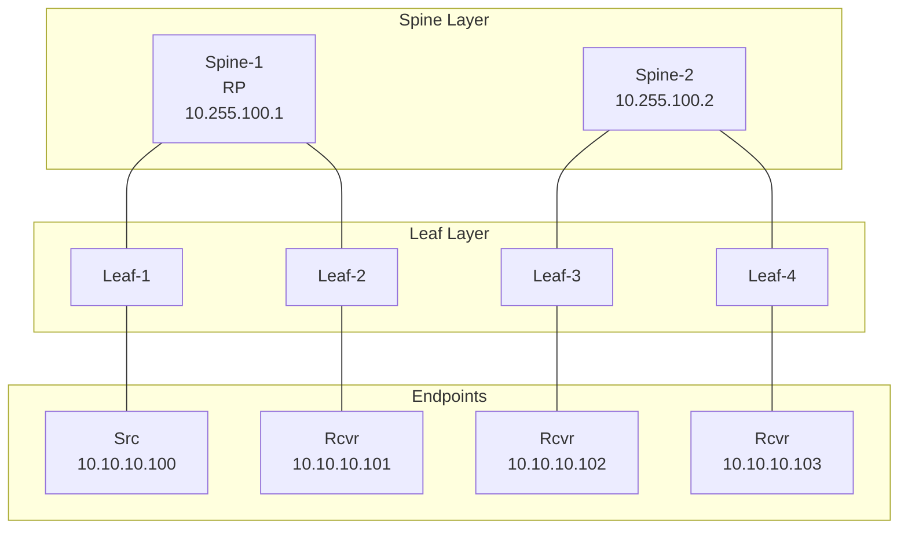
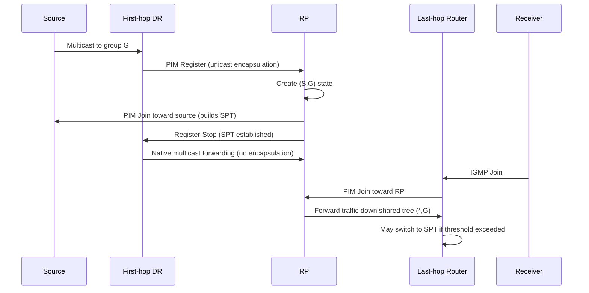
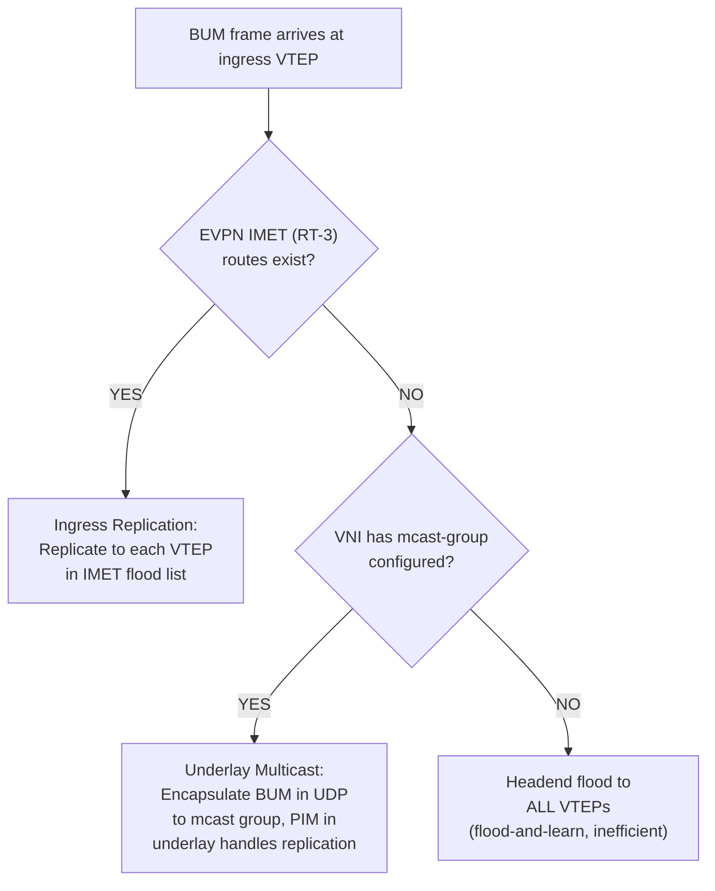

# Multicast for CCIE Data Center

## Prerequisite Knowledge

- IP multicast fundamentals (Class D, 224.0.0.0/4)
- Basic understanding of PIM and IGMP
- VXLAN/EVPN concepts (VNI, VTEP, BUM traffic)
- Reference repo: [vikiev/Multicast](https://github.com/vikiev/Multicast) (9 chapters, 20+ labs)

---

## Overview

> **This file is a summary and quick reference. For the FULL multicast deep dive
> with 20+ labs, go to: [github.com/vikiev/Multicast](https://github.com/vikiev/Multicast)**

The Multicast repository contains 9 comprehensive chapters:

| Chapter | Topic | Key Content |
|---------|-------|-------------|
| 1 | Multicast Fundamentals | Class D, group addresses, multicast MAC mapping |
| 2 | IGMP | IGMPv1/v2/v3, joins, leaves, querier election |
| 3 | PIM Modes | PIM Dense, Sparse, Sparse-Dense, SSM |
| 4 | RP Mechanisms | Auto-RP, BSR, Static RP, Anycast RP |
| 5 | PIM in VXLAN Underlay | PIM on underlay for BUM replication |
| 6 | EVPN BUM | Ingress replication vs underlay multicast |
| 7 | Advanced Troubleshooting | PIM neighbor issues, RPF failures, mroute analysis |
| 8 | Exam Prep | CCIE-specific scenarios, timing, common breaks |
| 9 | Packet Flows | End-to-end multicast packet flow analysis |

**Go to the Multicast repo for full deep dive with 20+ labs.**

---

## Quick Reference Tables

### PIM Modes

| Mode | Behavior | RP Required | Use Case |
|------|----------|-------------|----------|
| PIM Dense (DM) | Flood-and-prune. Floods everywhere, prunes unwanted. | No | Small networks, few receivers |
| PIM Sparse (SM) | Explicit join. Traffic only flows to joined receivers. | Yes | Large networks, many sources |
| PIM Sparse-Dense | Per-group: SM if RP known, DM otherwise. | Yes (for SM groups) | Mixed environments |
| PIM SSM (232.0.0.0/8) | Source-specific. Receiver joins (S,G) directly. | No | IPTV, known sources |

### IGMP Versions

| Version | Features | Report Type |
|---------|----------|-------------|
| IGMPv1 | Join only. No explicit leave. Querier election by PIM. | (*,G) |
| IGMPv2 | Explicit leave (Leave Group). Querier election by IGMP. | (*,G) |
| IGMPv3 | Source filtering (SSM). Include/Exclude mode. | (S,G) |

### VXLAN BUM Replication Modes

| Mode | Mechanism | Pros | Cons |
|------|-----------|------|------|
| Ingress Replication (IR) | Headend replicates to each VTEP using IMET (RT-3) | No underlay multicast needed | CPU-intensive on ingress VTEP |
| Underlay Multicast | VNI mapped to PIM multicast group | Efficient replication (network handles it) | Requires PIM in underlay |
| EVPN BUM (IR) | BGP EVPN IMET routes build flood list | Standard, scalable | Same as IR |

> **CCIE Exam Tip:** The exam may use EITHER ingress replication OR underlay multicast
> for BUM. Read the task carefully. If it says "ingress-replication protocol bgp,"
> use IR. If it says "mcast-group 239.x.x.x," use underlay multicast.

---

## DC-Specific Multicast Topics

### Multicast with vPC

When PIM runs on a vPC pair, special considerations apply:

1. **PIM DR (Designated Router) on vPC**: Both vPC peers may see the same PIM
   hello from a downstream router. The DR election uses the highest IP address.
   With vPC, both peers should have consistent DR behavior.

2. **PIM Assert Avoidance**: When both vPC peers forward multicast to the same
   LAN segment, a PIM assert occurs. To avoid this:
   - Use `ip pim assert-disable` on vPC VLANs (if supported)
   - Or ensure only the DR forwards multicast

3. **Anycast RP with vPC**: Both vPC peers can be configured as Anycast RP
   (same RP address). PIM register messages go to the nearest vPC peer.

```nxos
interface vlan 10
  ip address 10.10.10.1/24
  ip pim sparse-mode
  ip pim dr-priority 100

ip pim rp-address 10.255.255.1 group-list 224.0.0.0/4
```

### Multicast in ACI

ACI handles multicast differently from traditional NX-OS:

1. **BD-level multicast**: Multicast is configured at the Bridge Domain level.
   - PIM can be enabled per BD
   - IGMP snooping is enabled by default
   - Multicast group policies control which groups are allowed

2. **PIM in VRF**: PIM runs within the ACI VRF context.
   - RP can be static or learned via Auto-RP/BSR
   - External RP via L3Out

3. **ACI multicast configuration** (via APIC GUI or REST API):
   - Tenant -> VRF -> Enable PIM
   - Tenant -> BD -> Enable IGMP snooping
   - Tenant -> BD -> PIM multicast policy

> **CCIE Exam Tip:** ACI multicast is configured through the APIC GUI, not CLI.
> Know where to find: VRF PIM settings, BD IGMP settings, multicast policies.
> You may need to verify multicast in ACI using `show ip mroute vrf TENANT_VRF`
> on the leaf switch.

### Multicast QoS

Multicast traffic should be assigned to appropriate QoS queues:

```nxos
class-map type qos match-all MCAST
  match ip dscp 34

policy-map type qos MCAST_POLICY
  class MCAST
    set cos 4

policy-map type network-qos MCAST_NQ
  class type network-qos MCAST
    mtu 9216
    pause pfc-cos 4
```

Key considerations:
- Multicast for storage (FCoE) needs lossless queue (PFC)
- Video multicast needs guaranteed bandwidth
- Control plane multicast (PIM, OSPF) should be in a high-priority queue

### Underlay Multicast Group Planning

When using underlay multicast for VXLAN BUM, plan multicast groups carefully:

**Per-VNI multicast groups** (recommended):
```
VNI 10010 -> 239.1.1.10
VNI 10020 -> 239.1.1.20
VNI 10030 -> 239.1.1.30
```

**Shared multicast group** (less granular):
```
All VNIs in VRF PROD -> 239.1.1.100
All VNIs in VRF DEV  -> 239.1.1.200
```

Per-VNI is preferred because:
- Limits BUM replication to only VTEPs in that VNI
- Reduces unnecessary traffic
- Better scalability

```nxos
interface nve 1
  member vni 10010
    mcast-group 239.1.1.10
  member vni 10020
    mcast-group 239.1.1.20
```

Underlay PIM configuration (on all spine/leaf underlay interfaces):
```nxos
feature pim

interface Ethernet1/49
  ip pim sparse-mode

ip pim rp-address 10.255.255.1 group-list 239.0.0.0/8
```

---

## Lab 1: PIM Sparse Mode on VXLAN Underlay

### Topology


Multicast source: 10.10.10.100 sending to 239.1.1.1
Receivers: 10.10.10.101-103 joined 239.1.1.1
Underlay PIM: Spine-1 is RP (10.255.100.1)

### Spine-1 Configuration (RP)

```nxos
hostname Spine-1

feature pim
feature ospf
feature interface-vlan

interface loopback0
  ip address 10.255.100.1/32
  ip router ospf UNDERLAY area 0.0.0.0
  ip pim sparse-mode

interface Ethernet1/1
  no switchport
  ip address 10.0.1.0/31
  ip router ospf UNDERLAY area 0.0.0.0
  ip ospf network point-to-point
  ip pim sparse-mode
  no shutdown

interface Ethernet1/2
  no switchport
  ip address 10.0.2.0/31
  ip router ospf UNDERLAY area 0.0.0.0
  ip ospf network point-to-point
  ip pim sparse-mode
  no shutdown

router ospf UNDERLAY
  router-id 10.255.100.1

ip pim rp-address 10.255.100.1 group-list 239.0.0.0/8
ip pim ssm range 232.0.0.0/8
```

### Leaf-1 Configuration (Source Side)

```nxos
hostname Leaf-1

feature pim
feature ospf
feature interface-vlan
feature nv overlay
feature vn-segment-vlan-based

interface loopback0
  ip address 10.255.1.1/32
  ip router ospf UNDERLAY area 0.0.0.0
  ip pim sparse-mode

interface Ethernet1/1
  switchport mode access
  switchport access vlan 10
  spanning-tree port type edge

interface Ethernet1/49
  no switchport
  ip address 10.0.1.1/31
  ip router ospf UNDERLAY area 0.0.0.0
  ip ospf network point-to-point
  ip pim sparse-mode
  no shutdown

vlan 10
  name MCAST_VLAN
  vn-segment 10010

interface vlan 10
  no shutdown
  ip address 10.10.10.1/24
  ip pim sparse-mode
  fabric forwarding mode anycast-gw

router ospf UNDERLAY
  router-id 10.255.1.1

ip pim rp-address 10.255.100.1 group-list 239.0.0.0/8
```

### Verification

```text
Spine-1# show ip pim rp
Group-RP Mappings:
Group            RP             Info
239.0.0.0/8      10.255.100.1   Static

Leaf-1# show ip pim neighbor
PIM Neighbor Status for VRF "default"
Neighbor        Interface        Uptime    Expires   DR pri
10.255.100.1    Eth1/49          01:00:05  00:01:45  1

Leaf-1# show ip mroute
IP Multicast Routing Table for VRF "default"
(*, 239.1.1.1), uptime 00:30:12, pim rp
  Incoming interface: Null, RPF nbr: 0.0.0.0
  Outgoing interface list:
    Eth1/49, 00:30:12

(10.10.10.100, 239.1.1.1), uptime 00:25:00, pim
  Incoming interface: Vlan10, RPF nbr: 0.0.0.0
  Outgoing interface list:
    Eth1/49, 00:25:00
```

---

## Lab 2: VXLAN BUM with Underlay Multicast

### Configuration (on all leaves)

```nxos
feature pim

interface nve 1
  no shutdown
  source-interface loopback0
  member vni 10010
    mcast-group 239.1.1.10
  member vni 10020
    mcast-group 239.1.1.20

interface Ethernet1/49
  ip pim sparse-mode

interface Ethernet1/50
  ip pim sparse-mode

ip pim rp-address 10.255.100.1 group-list 239.0.0.0/8
```

### Verification

```text
Leaf-1# show nve vni
Interface VNI      Multicast-group     State Mode Type [BD/VRF]      Flags
--------- -------- ------------------- ----- ---- ------------------ -----
nve1      10010    239.1.1.10          Up    CP   L2 [10]
nve1      10020    239.1.1.20          Up    CP   L2 [20]

Leaf-1# show ip mroute 239.1.1.10
(*, 239.1.1.10), uptime 00:15:00, pim rp
  Incoming interface: Eth1/49, RPF nbr: 10.255.100.1
  Outgoing interface list:
    nve1, 00:15:00
```

---

## Verification Commands Reference

```text
show ip pim neighbor
show ip pim rp
show ip pim interface
show ip mroute
show ip mroute vrf PROD
show ip mroute 239.1.1.1
show ip igmp snooping
show ip igmp snooping vlan 10
show ip igmp groups
show nve vni
show nve peers
show ip pim df
show ip pim assert
```

---

## Multicast in VRF

In VXLAN fabrics, multicast can run per-VRF for overlay multicast traffic:

```nxos
vrf context PROD
  vni 500001
  address-family ipv4 multicast

router ospf PROD_OSPF
  vrf PROD
  router-id 10.100.1.1
  address-family ipv4 unicast
  address-family ipv4 multicast

interface vlan 10
  vrf member PROD
  ip address 10.10.10.1/24
  ip pim sparse-mode

ip pim rp-address 10.255.255.1 group-list 239.0.0.0/8 vrf PROD
```

Verification:
```text
Leaf-1# show ip mroute vrf PROD
IP Multicast Routing Table for VRF "PROD"
(*, 239.1.1.1), uptime 00:10:00, pim rp
  Incoming interface: Null, RPF nbr: 0.0.0.0
  Outgoing interface list:
    Vlan10, 00:10:00

(10.10.10.100, 239.1.1.1), uptime 00:08:00, pim
  Incoming interface: Vlan10, RPF nbr: 0.0.0.0
  Outgoing interface list:
    nve1, 00:08:00
```

> **CCIE Exam Tip:** If the exam asks for multicast within a tenant/VRF, you need
> `address-family ipv4 multicast` under the VRF and PIM enabled on the VRF SVIs.
> The RP must be configured with `vrf PROD` qualifier.

---

## PIM Register Process (Summary)

When a multicast source starts sending in PIM Sparse Mode:



Key commands to verify each stage:
```text
show ip pim register          (DR: register state)
show ip mroute 239.1.1.1      (all routers: mroute state)
show ip pim rp                (RP mapping)
show ip pim df                (PIM DF for multi-access)
```

> **Lab Exam Warning:** If multicast traffic is not reaching receivers, check the
> register process: `show ip pim register` on the DR. If the RP is not receiving
> registers, check unicast reachability from DR to RP (`ping RP_IP source loopback0`).

---

## VXLAN BUM Decision Tree



Decision criteria:
- **Ingress Replication (IR)**: Use when underlay has NO multicast. Simpler. Scales to ~50 VTEPs per VNI.
- **Underlay Multicast**: Use when fabric has 50+ VTEPs per VNI. More efficient replication. Requires PIM in underlay.
- **Hybrid**: IR for small VNIs, multicast for large VNIs (per-VNI decision).

```nxos
interface nve 1
  member vni 10010
    ingress-replication protocol bgp
  member vni 10020
    mcast-group 239.1.1.20
```

---

## Common Exam Scenarios

### Scenario 1: PIM Neighbor Not Forming on Underlay

**Task**: "Multicast BUM traffic is not replicating. PIM neighbors are not forming between Leaf-1 and Spine-1."

**Diagnosis**:
```text
Leaf-1# show ip pim neighbor
(no output - no neighbors)

Leaf-1# show ip pim interface
Interface        Status    Address         PIM    Nbr   Hello  DR
Eth1/49          up        10.0.1.1        none   0     30     10.0.1.1
```

**Root Cause**: PIM not enabled on the interface, or `feature pim` not enabled.

**Fix**:
```nxos
feature pim

interface Ethernet1/49
  ip pim sparse-mode
```

### Scenario 2: VXLAN BUM Using Wrong Replication Mode

**Task**: "Configure VXLAN BUM using underlay multicast with per-VNI groups."

**Common Mistake**: Configuring `ingress-replication protocol bgp` AND `mcast-group` on the same VNI. These are mutually exclusive.

**Correct Config**:
```nxos
interface nve 1
  member vni 10010
    mcast-group 239.1.1.10
```

**Verification**: `show nve vni` must show the multicast group, NOT "n/a".

### Scenario 3: RPF Failure for Multicast Source

**Task**: "Multicast source 10.10.10.100 is sending to 239.1.1.1 but receivers see no traffic."

**Diagnosis**:
```text
Leaf-1# show ip mroute 239.1.1.1
(10.10.10.100, 239.1.1.1), uptime 00:05:00, pim
  Incoming interface: Null, RPF nbr: 0.0.0.0   <-- RPF FAILURE
  Outgoing interface list: (empty)
```

**Root Cause**: RPF check fails - the incoming interface for the source does not match the unicast route to the source.

**Fix**: Ensure unicast route to 10.10.10.100 points to the correct interface (Vlan10 where the source is attached).

---

## Key Takeaways

1. **PIM Sparse Mode** is the standard for DC multicast. Requires an RP.
2. **IGMPv3** enables SSM (source-specific multicast). SSM range is 232.0.0.0/8.
3. **VXLAN BUM** can use ingress replication (BGP EVPN IMET) or underlay multicast (PIM).
4. **vPC + multicast**: watch for DR conflicts and PIM asserts.
5. **ACI multicast**: configured via APIC GUI at BD/VRF level.
6. **Per-VNI multicast groups** are preferred over shared groups.
7. **Multicast in VRF**: requires `address-family ipv4 multicast` and per-VRF RP.
8. **RPF check**: multicast forwarding depends on unicast routing. Fix unicast first.

> **CCIE Exam Tip:** Multicast is ~10% of the Network domain. You will likely configure
> PIM on the underlay and verify multicast routes. Know `show ip mroute` output cold.
> For full mastery, work through all 9 chapters in the Multicast repo.

> **Lab Exam Warning:** The #1 multicast exam mistake is forgetting `feature pim`.
> The #2 is forgetting to enable PIM on the loopback (RP must be PIM-enabled).
> The #3 is RPF failures due to asymmetric underlay routing. Always verify:
> `show ip pim neighbor`, `show ip pim rp`, `show ip mroute`.

---

*Multicast | CCIE DC v3.1 | Network Domain (30%)*
*Full deep dive: [github.com/vikiev/Multicast](https://github.com/vikiev/Multicast)*
