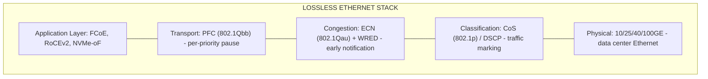
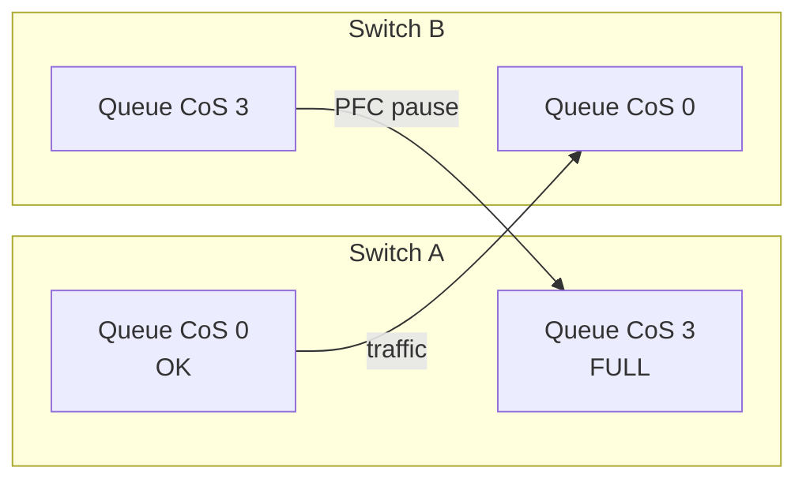
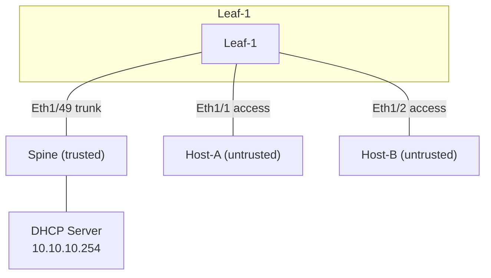

# QoS and Security for CCIE Data Center

## Prerequisite Knowledge

- Basic understanding of QoS concepts (classification, marking, queuing)
- Familiarity with CoS (802.1p) and DSCP
- NX-OS CLI fundamentals
- Basic security concepts (ACLs, AAA)
- Understanding of lossless Ethernet requirements for storage

---

# PART 1: QoS FOR DATA CENTER

## DC QoS Model

### Why DC QoS is Different

Traditional QoS focuses on bandwidth management and prioritization. DC QoS adds a
critical requirement: **lossless Ethernet** for storage and RDMA traffic.

In a traditional network, TCP handles packet loss via retransmission. In a DC:
- **FCoE** (Fibre Channel over Ethernet) cannot tolerate ANY frame loss
- **RoCEv2** (RDMA over Converged Ethernet) requires lossless transport
- **NVMe-oF over RoCE** needs zero-loss for storage I/O
- **VXLAN** needs DSCP preservation for end-to-end QoS

This requires PFC (Priority-based Flow Control) to create "no-drop" classes.

### Lossless Ethernet Components



### PFC (Priority-based Flow Control, 802.1Qbb)

PFC extends the traditional 802.3x pause frame to operate per-priority (per CoS value).
Instead of pausing ALL traffic on a link, PFC pauses only the specified priority.

- 8 priorities (CoS 0-7)
- Each priority can be independently paused
- PFC frame: sent when queue threshold is reached
- Receiver sends PFC pause to stop sender from overflowing the buffer



> **CCIE Exam Tip:** PFC is the cornerstone of DC QoS. You MUST know how to configure
> it. FCoE uses CoS 3 (PFC priority 3). RoCEv2 typically uses CoS 3 or 5. The exam
> will ask you to configure PFC for FCoE or RoCEv2 - know the commands cold.

### ECN (Explicit Congestion Notification, 802.1Qau)

ECN marks packets BEFORE they are dropped, allowing endpoints to slow down proactively.

- Uses 2 bits in the IP header (DSCP field bits 6-7, formerly ToS)
- CE (Congestion Experienced) marking: 0b11
- WRED (Weighted Random Early Detection) applies ECN marking based on queue depth
- Endpoints (RoCEv2 NICs) react to ECN by reducing send rate

ECN + WRED together provide proactive congestion management:
1. Queue starts filling
2. WRED begins marking packets with ECN (probability increases with depth)
3. Endpoints see ECN marks and reduce rate
4. Queue depth stabilizes below drop threshold
5. If queue still overflows, PFC kicks in as last resort

### CoS and DSCP

**CoS (Class of Service)**:
- 3-bit field in 802.1Q header (PCP - Priority Code Point)
- Values 0-7
- Used at L2 (switch-to-switch, switch-to-NIC)
- Mapped to internal queues on Nexus

**DSCP (Differentiated Services Code Point)**:
- 6-bit field in IP header
- Values 0-63
- Used at L3 (end-to-end across routed networks)
- Common values: EF (46), AF41 (34), AF31 (26), CS6 (48), CS7 (56)

**Trust Boundaries**:
- In DC, trust the endpoint (server NIC) marking
- Or trust the switch (rewrite at ingress)
- Nexus 9000: configurable trust model per interface

| CoS | DSCP Equivalent | Typical Use |
|-----|----------------|-------------|
| 0 | 0 (BE) | Best effort, default |
| 1 | 8 (CS1) | Scavenger, bulk backup |
| 2 | 16 (CS2) | Transactional data |
| 3 | 24 (CS3) / 26 (AF31) | FCoE, critical storage |
| 4 | 32 (CS4) / 34 (AF41) | Video, multimedia |
| 5 | 40 (CS5) / 46 (EF) | VoIP, RoCEv2 |
| 6 | 48 (CS6) | Network control (OSPF, BGP) |
| 7 | 56 (CS7) | Network management (reserved) |

---

## QoS on Nexus 9000

### System QoS (Global QoS Configuration)

System QoS defines the global mapping of CoS/DSCP to internal queues (qos-groups).

```nxos
system qos
  qos-group 0
    mtu 1500
  qos-group 1
    mtu 9216
  qos-group 2
    mtu 9216
  qos-group 3
    mtu 9216
    pause pfc-cos 3
  qos-group 4
    mtu 9216
  qos-group 5
    mtu 9216
  qos-group 6
    mtu 9216
  qos-group 7
    mtu 9216
```

### Class-Map, Policy-Map, Service-Policy

QoS on Nexus 9000 uses a hierarchical policy model:

1. **Class-map**: defines traffic classes (match criteria)
2. **Policy-map**: defines actions for each class (set, queue, drop)
3. **Service-policy**: applies policy-map to an interface or globally

#### QoS Classification and Marking

```nxos
class-map type qos match-all FCOE
  match cos 3

class-map type qos match-all ROCE
  match cos 5

class-map type qos match-all NETWORK_CTRL
  match cos 6

class-map type qos match-all DEFAULT
  match cos 0

policy-map type qos DC_QOS
  class FCOE
    set qos-group 3
  class ROCE
    set qos-group 5
  class NETWORK_CTRL
    set qos-group 6
  class DEFAULT
    set qos-group 0
```

#### Network QoS (Queuing and Scheduling)

```nxos
class-map type network-qos FCOE_NQ
  match qos-group 3

class-map type network-qos ROCE_NQ
  match qos-group 5

class-map type network-qos DEFAULT_NQ
  match qos-group 0

policy-map type network-qos DC_NETWORK_QOS
  class type network-qos FCOE_NQ
    mtu 9216
    pause pfc-cos 3
    pause no-drop
  class type network-qos ROCE_NQ
    mtu 9216
    pause pfc-cos 5
    pause no-drop
  class type network-qos DEFAULT_NQ
    mtu 9216
```

#### Applying QoS Policies

```nxos
system qos
  service-policy type qos DC_QOS
  service-policy type network-qos DC_NETWORK_QOS
```

### PFC Configuration

PFC is configured per-interface and per-priority:

```nxos
interface Ethernet1/1
  priority-flow-control mode on
  priority-flow-control on 3
  priority-flow-control on 5
```

Or globally:
```nxos
priority-flow-control mode on

interface Ethernet1/1
  priority-flow-control on 3
```

Verification:
```text
Leaf-1# show priority-flow-control interface Ethernet1/1
Priority Flow Control(PFC) information for interface Ethernet1/1
PFC mode: on
PFC operational mode: on

Priority    Oper Mode    Admin Mode
--------    ---------    ----------
0           off          off
1           off          off
2           off          off
3           on           on
4           off          off
5           on           on
6           off          off
7           off          off
```

### PFC Watchdog

PFC watchdog detects and mitigates PFC storms (a stuck PFC pause that deadlocks a queue).
If a PFC-enabled queue stops draining for longer than the watchdog timer, the switch
takes action (drop or shut) to prevent the storm from propagating.

```nxos
policy-map type queuing PFC_WD_POLICY
  class type queuing CLASS_FCOE_QUEUE
    priority-flow-control watchdog interval 100
    priority-flow-control watchdog action drop

interface Ethernet1/1
  priority-flow-control watchdog interval 100
  priority-flow-control watchdog action drop
```

PFC watchdog parameters:
- **Interval**: time (ms) a queue can be paused before action (default: 100ms)
- **Action**: `drop` (drop frames in stuck queue) or `shutdown` (err-disable port)
- **Recovery**: automatic after the storm clears (with `shutdown`, manual `no shut` needed)

```text
Leaf-1# show priority-flow-control watchdog interface Ethernet1/1
PFC Watchdog information for interface Ethernet1/1
  Watchdog interval: 100 ms
  Watchdog action: drop
  Last storm detected: never
  Storm count: 0
```

> **CCIE Exam Tip:** PFC watchdog is a common troubleshooting scenario. If FCoE or
> RoCEv2 traffic suddenly stops and `show priority-flow-control statistics` shows
> excessive pause frames, PFC watchdog should have triggered. Check:
> `show priority-flow-control watchdog interface Ethernet1/1`. If the exam asks
> you to "prevent PFC storms from propagating," configure PFC watchdog.

> **Lab Exam Warning:** PFC storms are DEADLY in the exam. One misbehaving NIC can
> send continuous PFC pause frames that deadlock the entire fabric. PFC watchdog
> is your safety net. Configure it on ALL PFC-enabled interfaces.

---

### ECN/WRED Configuration

WRED with ECN marking:

```nxos
policy-map type queuing DC_QUEUING
  class type queuing FCOE_QUEUE
    bandwidth percent 30
    random-detect minimum-threshold 100 maximum-threshold 200
    random-detect ecn
  class type queuing DEFAULT_QUEUE
    bandwidth percent 70
    random-detect minimum-threshold 80 maximum-threshold 150
    random-detect ecn
```

> **CCIE Exam Tip:** ECN/WRED configuration is less common in the exam than PFC.
> But know the concepts: WRED drops/marks based on queue depth, ECN marks instead
> of drops, endpoints react to ECN. PFC is the last resort when WRED can't prevent
> overflow.

---

## QoS for FCoE

### FCoE No-Drop Class

FCoE requires a completely lossless path. This means:
1. PFC enabled on FCoE CoS (typically CoS 3)
2. Dedicated queue for FCoE traffic
3. No WRED/drops on FCoE queue
4. Jumbo MTU (FCoE frames are 2158 bytes)

```nxos
system qos
  qos-group 3
    mtu 9216
    pause pfc-cos 3

class-map type qos match-all FCOE
  match cos 3

policy-map type qos FCOE_QOS
  class FCOE
    set qos-group 3

class-map type network-qos FCOE_NQ
  match qos-group 3

policy-map type network-qos FCOE_NETWORK_QOS
  class type network-qos FCOE_NQ
    mtu 9216
    pause pfc-cos 3
    pause no-drop

system qos
  service-policy type qos FCOE_QOS
  service-policy type network-qos FCOE_NETWORK_QOS

interface Ethernet1/1
  priority-flow-control mode on
  priority-flow-control on 3
```

### FCoE VLAN and QoS

FCoE traffic runs on a dedicated VLAN. The FCoE VLAN must have PFC enabled:

```nxos
vlan 1002
  name FCOE_VLAN
  fcoe vsan 10

interface vlan 1002
  no shutdown

vsan database
  vsan 10 interface vfc1

interface vfc1
  bind interface Ethernet1/1 channel-group 1
  no shutdown
```

> **Lab Exam Warning:** If FCoE traffic is dropping, check PFC FIRST.
> `show priority-flow-control interface Ethernet1/1` must show PFC on for CoS 3.
> Also verify: `show queuing interface Ethernet1/1` for queue drops.

---

## QoS for RoCEv2

### RoCEv2 QoS Requirements

RoCEv2 (RDMA over Converged Ethernet v2) requires:
1. PFC on the RoCEv2 CoS (typically CoS 3 or 5)
2. ECN for congestion notification
3. Dedicated queue with guaranteed bandwidth
4. No drops (PFC as backstop)

```nxos
class-map type qos match-all ROCE
  match cos 3

policy-map type qos ROCE_QOS
  class ROCE
    set qos-group 3

class-map type network-qos ROCE_NQ
  match qos-group 3

policy-map type network-qos ROCE_NETWORK_QOS
  class type network-qos ROCE_NQ
    mtu 9216
    pause pfc-cos 3
    pause no-drop

interface Ethernet1/1
  priority-flow-control mode on
  priority-flow-control on 3
```

---

## QoS for VXLAN

### DSCP Preservation in VXLAN

When VXLAN encapsulates a frame, the outer IP header needs a DSCP value.
Options:
1. **Copy inner DSCP to outer**: preserves end-to-end QoS
2. **Set fixed outer DSCP**: all VXLAN traffic gets same priority
3. **Derive from CoS**: map inner CoS to outer DSCP

On Nexus 9000, VXLAN preserves the inner DSCP by default. The outer DSCP
is derived from the inner frame's CoS/DSCP.

```nxos
policy-map type qos VXLAN_QOS
  class DEFAULT
    set dscp 0
  class FCOE
    set dscp 24
  class ROCE
    set dscp 26
```

> **CCIE Exam Tip:** In VXLAN, QoS marking happens at the edge (ingress VTEP).
> The underlay (spine) should trust DSCP and not rewrite it. If the exam asks
> about QoS in VXLAN, focus on: DSCP preservation, PFC on underlay interfaces,
> and MTU (jumbo frames for VXLAN overhead).

---

## QoS Policy Template: 8-Class DC Model

### The 8-Class Model

| Class | CoS | DSCP | Queue | PFC | Use Case |
|-------|-----|------|-------|-----|----------|
| Network Control | 6 | CS6 (48) | 6 | No | OSPF, BGP, PIM, STP |
| FCoE / Storage | 3 | CS3 (24) | 3 | Yes (3) | FCoE, NVMe/FC |
| RoCEv2 / RDMA | 5 | EF (46) | 5 | Yes (5) | RoCEv2, NVMe/RoCE |
| Real-Time | 4 | AF41 (34) | 4 | No | Video, multimedia |
| Transactional | 2 | AF21 (18) | 2 | No | Database, app traffic |
| Bulk Data | 1 | CS1 (8) | 1 | No | Backup, replication |
| Best Effort | 0 | BE (0) | 0 | No | Default, web, email |
| Scavenger | 0 | 0 | 0 | No | Lowest priority |

### Full 8-Class Configuration

```nxos
class-map type qos match-all CLASS_NC
  match cos 6

class-map type qos match-all CLASS_FCOE
  match cos 3

class-map type qos match-all CLASS_ROCE
  match cos 5

class-map type qos match-all CLASS_RT
  match cos 4

class-map type qos match-all CLASS_TRANS
  match cos 2

class-map type qos match-all CLASS_BULK
  match cos 1

class-map type qos match-all CLASS_BE
  match cos 0

policy-map type qos DC_8CLASS
  class CLASS_NC
    set qos-group 6
  class CLASS_FCOE
    set qos-group 3
  class CLASS_ROCE
    set qos-group 5
  class CLASS_RT
    set qos-group 4
  class CLASS_TRANS
    set qos-group 2
  class CLASS_BULK
    set qos-group 1
  class CLASS_BE
    set qos-group 0

class-map type network-qos NQ_FCOE
  match qos-group 3

class-map type network-qos NQ_ROCE
  match qos-group 5

class-map type network-qos NQ_DEFAULT
  match qos-group 0,1,2,4,6

policy-map type network-qos DC_8CLASS_NQ
  class type network-qos NQ_FCOE
    mtu 9216
    pause pfc-cos 3
    pause no-drop
  class type network-qos NQ_ROCE
    mtu 9216
    pause pfc-cos 5
    pause no-drop
  class type network-qos NQ_DEFAULT
    mtu 9216

system qos
  service-policy type qos DC_8CLASS
  service-policy type network-qos DC_8CLASS_NQ
```

### Verification Commands - QoS

```text
show policy-map
show policy-map interface Ethernet1/1
show class-map
show class-map type qos
show class-map type network-qos
show system qos
show priority-flow-control interface Ethernet1/1
show priority-flow-control statistics interface Ethernet1/1
show queuing interface Ethernet1/1
show queuing interface Ethernet1/1 | include drop
show interface Ethernet1/1 counters | include pause
show qos statistics
```

---

# PART 2: SECURITY FOR DATA CENTER

## CoPP (Control Plane Policing)

### What is CoPP?

CoPP protects the switch CPU (supervisor) from being overwhelmed by excessive
control plane traffic. It rate-limits traffic sent to the CPU.

Without CoPP:
- A misconfigured host could flood the CPU with ARP, ICMP, or BGP packets
- CPU overload causes routing protocol flaps, management timeouts, switch crash

With CoPP:
- Control plane traffic is classified and rate-limited
- Excess traffic is dropped (or remarked) before reaching the CPU
- Routing protocols, management, and critical traffic are protected

### Default CoPP Policy on Nexus 9000

Nexus 9000 ships with a default CoPP policy. Key classes:

| Class | Traffic | Rate (pps) | Action |
|-------|---------|-----------|--------|
| copp-system-p-class-critical | OSPF, BGP, HSRP, VRRP | 4000 | police |
| copp-system-p-class-important | ICMP, SSH, Telnet | 2000 | police |
| copp-system-p-class-normal | SNMP, NTP, DHCP | 1000 | police |
| copp-system-p-class-monitor | Syslog, NetFlow | 500 | police |
| copp-system-p-class-l3uc | Unknown L3 unicast | 200 | police |
| copp-system-p-class-l3mc | Multicast | 200 | police |
| copp-system-p-class-normal-dhcp | DHCP relay | 1000 | police |
| copp-system-p-class-ndp | IPv6 NDP | 1000 | police |

### Custom CoPP Configuration

```nxos
class-map type control-plane match-all COPP_BGP
  match access-group name ACL_BGP

class-map type control-plane match-all COPP_OSPF
  match access-group name ACL_OSPF

class-map type control-plane match-all COPP_ICMP
  match access-group name ACL_ICMP

class-map type control-plane match-all COPP_SSH
  match access-group name ACL_SSH

ip access-list ACL_BGP
  permit tcp any any eq bgp
  permit tcp any eq bgp any

ip access-list ACL_OSPF
  permit ospf any any

ip access-list ACL_ICMP
  permit icmp any any echo
  permit icmp any any echo-reply
  permit icmp any any time-exceeded
  permit icmp any any unreachable

ip access-list ACL_SSH
  permit tcp any any eq 22

policy-map type control-plane COPP_POLICY
  class COPP_BGP
    set cos 6
    police rate 8000 pps burst 200 packets conform transmit violate drop
  class COPP_OSPF
    set cos 6
    police rate 4000 pps burst 100 packets conform transmit violate drop
  class COPP_ICMP
    set cos 4
    police rate 2000 pps burst 50 packets conform transmit violate drop
  class COPP_SSH
    set cos 4
    police rate 1000 pps burst 25 packets conform transmit violate drop

control-plane
  service-policy input COPP_POLICY
```

### CoPP Verification

```text
Leaf-1# show policy-map type control-plane
  Type control-plane policy-maps
  COPP_POLICY
    Class COPP_BGP
      police rate 8000 pps burst 200 packets
        conformed 15234 packets, 1234567 bytes
        violated 0 packets, 0 bytes
    Class COPP_OSPF
      police rate 4000 pps burst 100 packets
        conformed 8921 packets, 712345 bytes
        violated 0 packets, 0 bytes

Leaf-1# show copp status
CoPP status: Enabled
```

> **CCIE Exam Tip:** CoPP is a common exam task. You may need to:
> 1. Verify the default CoPP policy
> 2. Add a custom class for specific traffic
> 3. Adjust rate limits
> 4. Troubleshoot why control plane traffic is being dropped
> Know `show policy-map type control-plane` and how to read conform/violate counters.

> **Lab Exam Warning:** If BGP or OSPF neighbors are flapping and you can't find a
> routing issue, CHECK CoPP. `show policy-map type control-plane` - if the violate
> counter is incrementing, CoPP is dropping your routing protocol packets. Increase
> the rate limit or fix the traffic source.

---

## Port Security, DHCP Snooping, DAI, IP Source Guard

### DHCP Snooping

DHCP snooping prevents rogue DHCP servers from distributing IP addresses.
It builds a binding table of MAC-IP-VLAN-port from legitimate DHCP transactions.

```nxos
feature dhcp

ip dhcp snooping
ip dhcp snooping vlan 10,20,30

interface Ethernet1/1
  ip dhcp snooping limit rate 15

interface Ethernet1/49
  ip dhcp snooping trust
```

- **Trusted ports**: uplinks to legitimate DHCP servers (allow DHCP offers)
- **Untrusted ports**: access ports (only allow DHCP requests from clients)
- **Rate limiting**: prevent DHCP starvation attacks

### DAI (Dynamic ARP Inspection)

DAI validates ARP packets against the DHCP snooping binding table.
Prevents ARP spoofing/poisoning attacks.

```nxos
feature dhcp

ip arp inspection vlan 10,20,30
ip arp inspection validate src-mac dst-mac ip

interface Ethernet1/1
  ip arp inspection limit rate 15

interface Ethernet1/49
  ip arp inspection trust
```

- DAI intercepts ARP requests and replies on untrusted ports
- Validates: source MAC matches ARP sender MAC, IP matches binding table
- Invalid ARP packets are dropped and logged

### IP Source Guard

IP Source Guard filters traffic based on the DHCP snooping binding table.
Only allows traffic from IP addresses that were legitimately assigned.

```nxos
interface Ethernet1/1
  ip verify source dhcp-snooping-vlan
```

### Combined Configuration

```nxos
feature dhcp

ip dhcp snooping
ip dhcp snooping vlan 10,20,30

ip arp inspection vlan 10,20,30
ip arp inspection validate src-mac dst-mac ip

interface Ethernet1/1
  switchport mode access
  switchport access vlan 10
  ip dhcp snooping limit rate 15
  ip arp inspection limit rate 15
  ip verify source dhcp-snooping-vlan

interface Ethernet1/49
  switchport mode trunk
  ip dhcp snooping trust
  ip arp inspection trust
```

### Verification

```text
show ip dhcp snooping binding
show ip dhcp snooping vlan 10
show ip arp inspection vlan 10
show ip arp inspection statistics vlan 10
show ip verify source interface Ethernet1/1
```

> **CCIE Exam Tip:** DHCP snooping + DAI + IP Source Guard are often configured
> together as a security bundle. The exam may ask you to configure all three on
> access VLANs. Remember: DHCP snooping must be enabled FIRST (DAI and IP Source
> Guard depend on the binding table).

---

## ACLs: PACL, VACL, RACL

### PACL (Port ACL)

Applied to L2 interfaces. Filters traffic at the port level.

```nxos
ip access-list PACL_WEB
  permit tcp any any eq 80
  permit tcp any any eq 443
  deny ip any any

interface Ethernet1/1
  ip access-group PACL_WEB in
```

### VACL (VLAN ACL / VLAN Access Map)

Applied to all traffic within a VLAN. Cannot be applied per-port.
Uses a VLAN access-map (similar to route-map).

```nxos
ip access-list VACL_MATCH
  permit tcp any any eq 23
  permit udp any any eq 161

vlan access-map VACL_MAP 10
  match ip address VACL_MATCH
  action drop

vlan access-map VACL_MAP 20
  action forward

vlan filter VACL_MAP vlan-list 10,20,30
```

### RACL (Router ACL)

Applied to L3 interfaces (SVIs, routed ports). Standard IP ACL behavior.

```nxos
ip access-list RACL_PROD
  permit tcp 10.10.10.0/24 10.10.20.0/24 eq 443
  permit icmp any any
  deny ip any any

interface vlan 10
  ip access-group RACL_PROD in
```

### ACL Processing Order

On a Nexus 9000, ACLs are processed in this order:
1. PACL (port ACL) - on ingress L2 port
2. VACL (VLAN ACL) - within the VLAN
3. RACL (Router ACL) - on the L3 interface (SVI)

> **CCIE Exam Tip:** Know the difference between PACL, VACL, and RACL. The exam
> may ask you to filter traffic at a specific layer. PACL = port, VACL = VLAN,
> RACL = router/SVI. VACL uses `vlan access-map`, not `ip access-group`.

---

## 802.1X Authentication

### 802.1X Fundamentals

802.1X provides port-based network access control. Devices must authenticate
before gaining network access.

Components:
- **Supplicant**: the client device requesting access
- **Authenticator**: the switch port (Nexus)
- **Authentication Server**: RADIUS server (ISE)

EAP types:
- **EAP-TLS**: certificate-based (most secure)
- **EAP-PEAP**: tunneled EAP with MS-CHAPv2
- **EAP-FAST**: flexible authentication via secure tunneling

### MAB Fallback (MAC Authentication Bypass)

For devices that don't support 802.1X (printers, IoT), MAB authenticates
based on MAC address.

```nxos
feature dot1x

aaa group server radius ISE_SERVERS
  server 10.1.1.100
  key 7 SECRET_KEY

aaa authentication dot1x default group ISE_SERVERS

interface Ethernet1/1
  switchport mode access
  switchport access vlan 10
  dot1x pae authenticator
  dot1x port-control auto
  dot1x timeout tx-period 10
  mab
  authentication order dot1x mab
  authentication priority dot1x mab
```

### Verification

```text
show dot1x interface Ethernet1/1
show dot1x sessions
show mab sessions
show authentication sessions interface Ethernet1/1
```

---

## NX-OS RBAC (Role-Based Access Control)

### RBAC Fundamentals

RBAC controls which CLI commands users can execute. Nexus 9000 has built-in roles:

| Role | Access Level |
|------|-------------|
| network-admin | Full read-write access to all features |
| network-operator | Read-only access to all features |
| vdc-admin | Full access within a VDC |
| vdc-operator | Read-only within a VDC |

### Custom Role Creation

```nxos
role name JUNIOR_ADMIN
  description "Junior admin - limited access"
  rule 1 permit read
  rule 5 permit command show .*
  rule 10 permit command configure terminal
  rule 15 permit command interface .*
  rule 20 permit command switchport .*
  rule 25 deny command router bgp .*
  rule 30 deny command router ospf .*
  rule 100 deny command .*

username junior password 5 $encrypted$ role JUNIOR_ADMIN
```

### Rule Processing

- Rules are processed in order (lowest number first)
- First match wins
- `permit read` allows all show commands
- `permit command X` allows specific command pattern
- `deny command X` blocks specific command pattern
- Implicit deny at the end

### Verification

```text
show role
show role name JUNIOR_ADMIN
show user-account
show aaa groups
```

> **CCIE Exam Tip:** RBAC is a common exam task. You may need to create a custom
> role that allows specific commands and denies others. Know the rule syntax:
> `rule N permit/deny command REGEX`. Rules are processed in order, first match wins.

---

## AAA: TACACS+ and RADIUS

### TACACS+ Configuration

```nxos
feature tacacs+

tacacs-server host 10.1.1.50 key 7 ENCRYPTED_KEY
tacacs-server host 10.1.1.51 key 7 ENCRYPTED_KEY

aaa group server tacacs+ TACACS_SERVERS
  server 10.1.1.50
  server 10.1.1.51

aaa authentication login default group TACACS_SERVERS local
aaa accounting default group TACACS_SERVERS
```

### RADIUS Configuration

```nxos
feature radius

radius-server host 10.1.1.100 key 7 ENCRYPTED_KEY
radius-server host 10.1.1.101 key 7 ENCRYPTED_KEY

aaa group server radius RADIUS_SERVERS
  server 10.1.1.100
  server 10.1.1.101

aaa authentication login default group RADIUS_SERVERS local
```

### TACACS+ vs RADIUS

| Feature | TACACS+ | RADIUS |
|---------|---------|--------|
| Transport | TCP (49) | UDP (1812/1813) |
| Encryption | Entire packet | Password only |
| AAA separation | Auth, Auth, Acct separate | Auth + Acct combined |
| Command authorization | Per-command | Limited |
| Best for | Device administration | Network access (802.1X) |

> **CCIE Exam Tip:** Use TACACS+ for device administration (command-level authorization).
> Use RADIUS for network access (802.1X, MAB). The exam may ask you to configure
> both. Always include `local` as a fallback: `aaa authentication login default group
> TACACS_SERVERS local`.

---

## Management Security

### SSH Hardening

```nxos
ssh key rsa 2048
ip ssh timeout 60
ip ssh maxstartups 5
ip ssh source-interface mgmt0

no feature telnet

username admin password 5 $encrypted$ role network-admin
aaa authentication login console local
```

### SNMPv3

```nxos
no snmp-server community public group network-operator
no snmp-server community private group network-admin

snmp-server user admin network-admin auth md5 AUTH_PASS priv aes-128 PRIV_PASS
snmp-server host 10.1.1.200 traps version 3 priv user admin
```

### Management VRF

```nxos
vrf context management
  ip route 0.0.0.0/0 192.168.1.254

interface mgmt0
  vrf member management
  ip address 192.168.1.10/24
```

All management traffic (SSH, SNMP, NTP, syslog) should use the management VRF:
```nxos
ip ssh source-interface mgmt0
ntp source-interface mgmt0
logging source-interface mgmt0
snmp-server source-interface mgmt0
```

---

## MACsec (Media Access Control Security)

### MACsec Concepts

MACsec (IEEE 802.1AE) provides L2 encryption and integrity on point-to-point Ethernet
links. It encrypts every frame at L2, protecting against eavesdropping and tampering.

Key concepts:
- **MKA (MACsec Key Agreement)**: protocol that negotiates MACsec keys (802.1X-2010)
- **CAK (Connectivity Association Key)**: pre-shared key for MKA
- **CKN (Connectivity Association Key Name)**: identifier for the CAK
- **SAK (Secure Association Key)**: derived session key used for encryption
- **Cipher suite**: GCM-AES-128 (default) or GCM-AES-256
- **Scope**: point-to-point only (not multi-access)

### MACsec on Nexus 9000

```nxos
feature macsec

macsec key-chain KC1
  key 01 key-string 7 ENCRYPTED_KEY ckn 7 CKN_STRING

interface Ethernet1/49
  macsec mka key-chain KC1
  macsec cipher-suite gcm-aes-128
  macsec replay-protection window-size 64
```

Verification:
```text
Leaf-1# show macsec interface Ethernet1/49
Interface Ethernet1/49
  MACsec: Enabled
  MKA: Active
  Cipher Suite: GCM-AES-128
  Secure Channel: UP
  SAK: Active (rekey in 2800 sec)
  Ingress: 1523456 frames encrypted
  Egress: 1498723 frames encrypted
```

> **CCIE Exam Tip:** MACsec is primarily CONCEPTUAL for the CCIE DC exam. Know:
> what it is (L2 encryption), MKA (key negotiation), CAK/CKN/SAK terminology,
> and that it's point-to-point only. You may see a basic config task or a
> conceptual question. Do NOT spend excessive time on MACsec at the expense
> of PFC, CoPP, and DAI which are tested more frequently.

---

## VXLAN Security

### VNI Isolation

VNIs provide L2 isolation (like VLANs). Security considerations:
- Each VNI is a separate broadcast domain
- Inter-VNI routing requires explicit L3 configuration (VRF, L3VNI)
- Without L3VNI/VRF, VNIs are completely isolated

### Contract Enforcement (ACI)

In ACI, contracts between EPGs enforce security policy:
- No contract = no traffic (implicit deny)
- Contracts define allowed protocols/ports
- Taboo contracts explicitly deny traffic

### VXLAN Security Best Practices

1. Use unique VNIs per tenant/application
2. Implement inter-VNIfirewall policies (service graph in ACI)
3. Enable DAI/DHCP snooping on access VLANs
4. Use CoPP to protect VTEP control plane
5. Isolate management traffic in a separate VRF

---

## Lab 1: CoPP Configuration and Verification

### Objective
Configure custom CoPP policy to protect BGP and OSPF, rate-limit ICMP.

### Configuration

```nxos
hostname Leaf-1

feature copp

ip access-list ACL_COPP_BGP
  permit tcp any any eq bgp
  permit tcp any eq bgp any

ip access-list ACL_COPP_OSPF
  permit ospf any any

ip access-list ACL_COPP_ICMP
  permit icmp any any echo
  permit icmp any any echo-reply
  permit icmp any any time-exceeded
  permit icmp any any unreachable

class-map type control-plane match-all COPP_BGP
  match access-group name ACL_COPP_BGP

class-map type control-plane match-all COPP_OSPF
  match access-group name ACL_COPP_OSPF

class-map type control-plane match-all COPP_ICMP
  match access-group name ACL_COPP_ICMP

policy-map type control-plane CUSTOM_COPP
  class COPP_BGP
    police rate 8000 pps burst 200 packets conform transmit violate drop
  class COPP_OSPF
    police rate 4000 pps burst 100 packets conform transmit violate drop
  class COPP_ICMP
    police rate 1000 pps burst 25 packets conform transmit violate drop

control-plane
  service-policy input CUSTOM_COPP
```

### Verification

```text
Leaf-1# show policy-map type control-plane
  Type control-plane policy-maps
  CUSTOM_COPP
    Class COPP_BGP
      police rate 8000 pps burst 200 packets
        conformed 25431 packets, 2034567 bytes
        violated 0 packets, 0 bytes
    Class COPP_OSPF
      police rate 4000 pps burst 100 packets
        conformed 12890 packets, 1031200 bytes
        violated 0 packets, 0 bytes
    Class COPP_ICMP
      police rate 1000 pps burst 25 packets
        conformed 5678 packets, 454240 bytes
        violated 234 packets, 18720 bytes

Leaf-1# show copp status
CoPP status: Enabled
```

---

## Lab 2: DAI + DHCP Snooping + IP Source Guard

### Topology


VLAN 10: 10.10.10.0/24

### Configuration

```nxos
hostname Leaf-1

feature dhcp

ip dhcp snooping
ip dhcp snooping vlan 10

ip arp inspection vlan 10
ip arp inspection validate src-mac dst-mac ip

interface Ethernet1/49
  switchport mode trunk
  switchport trunk allowed vlan 10
  ip dhcp snooping trust
  ip arp inspection trust

interface Ethernet1/1
  switchport mode access
  switchport access vlan 10
  spanning-tree port type edge
  ip dhcp snooping limit rate 15
  ip arp inspection limit rate 15
  ip verify source dhcp-snooping-vlan

interface Ethernet1/2
  switchport mode access
  switchport access vlan 10
  spanning-tree port type edge
  ip dhcp snooping limit rate 15
  ip arp inspection limit rate 15
  ip verify source dhcp-snooping-vlan
```

### Verification

```text
Leaf-1# show ip dhcp snooping binding
MAC Address     IP Address      VLAN    Interface       Expiry
0050.5601.0001  10.10.10.101    10      Eth1/1          03:45:12
0050.5601.0002  10.10.10.102    10      Eth1/2          03:44:58

Leaf-1# show ip arp inspection vlan 10
VLAN    ACL Match    Static    DHCP    Drops
10      0            0         2       0

Leaf-1# show ip verify source interface Ethernet1/1
Interface   VLAN    MAC Address     IP Address      Status
Eth1/1      10      0050.5601.0001  10.10.10.101    active
```

---

## Lab 3: RBAC Role Creation

### Objective
Create a role that allows show commands and interface config, but denies routing protocols.

### Configuration

```nxos
role name NET_ENGINEER
  description "Network engineer - no routing protocol access"
  rule 1 permit read
  rule 10 permit command configure terminal
  rule 20 permit command interface .*
  rule 30 permit command switchport .*
  rule 40 permit command ip address .*
  rule 50 permit command no shutdown
  rule 60 permit command channel-group .*
  rule 100 deny command router .*
  rule 110 deny command feature bgp
  rule 120 deny command feature ospf
  rule 200 deny command .*

username engineer1 password 5 $encrypted$ role NET_ENGINEER
```

### Verification

```text
Leaf-1# show role name NET_ENGINEER
Role: NET_ENGINEER
  Description: Network engineer - no routing protocol access
  Rule    Perm    Type    Match
  ----    ----    ----    -----
  1       permit  read
  10      permit  command configure terminal
  20      permit  command interface .*
  30      permit  command switchport .*
  40      permit  command ip address .*
  50      permit  command no shutdown
  60      permit  command channel-group .*
  100     deny    command router .*
  110     deny    command feature bgp
  120     deny    command feature ospf
  200     deny    command .*
```

---

## Lab 4: VACL Configuration

### Objective
Block Telnet and SNMP within VLANs 10 and 20, allow everything else.

### Configuration

```nxos
ip access-list VACL_BLOCK
  permit tcp any any eq 23
  permit udp any any eq 161
  permit udp any any eq 162

vlan access-map BLOCK_TELNET_SNMP 10
  match ip address VACL_BLOCK
  action drop

vlan access-map BLOCK_TELNET_SNMP 20
  action forward

vlan filter BLOCK_TELNET_SNMP vlan-list 10,20
```

### Verification

```text
Leaf-1# show vlan access-map
vlan access-map BLOCK_TELNET_SNMP  10
  match ip address VACL_BLOCK
  action drop
  1234 packets matched

vlan access-map BLOCK_TELNET_SNMP  20
  action forward
  56789 packets matched

Leaf-1# show vlan filter
VLAN MAP BLOCK_TELNET_SNMP is applied to:
  VLAN 10
  VLAN 20
```

---

## Common Exam Scenarios

### Scenario 1: FCoE Traffic Dropping (Troubleshoot Module)

**Task**: "FCoE storage traffic is experiencing frame drops on interface Ethernet1/1."

**Diagnosis**:
```text
Leaf-1# show priority-flow-control interface Ethernet1/1
PFC mode: off    <-- PFC NOT ENABLED

Leaf-1# show queuing interface Ethernet1/1 | include drop
  Drop: 15234 packets    <-- DROPS OCCURRING
```

**Root Cause**: PFC not enabled on the FCoE interface. FCoE requires lossless transport.

**Fix**:
```nxos
interface Ethernet1/1
  priority-flow-control mode on
  priority-flow-control on 3
```

Also verify network-qos policy has `pause no-drop` for the FCoE class.

### Scenario 2: CoPP Dropping BGP Packets (Troubleshoot Module)

**Task**: "BGP neighbor is flapping every 30 seconds. No routing issue found."

**Diagnosis**:
```text
Leaf-1# show policy-map type control-plane
  Class COPP_BGP
    police rate 4000 pps burst 100 packets
      conformed 50000 packets
      violated 12000 packets    <-- VIOLATIONS INCREMENTING
```

**Root Cause**: CoPP rate limit too low for BGP traffic volume (e.g., large table exchange).

**Fix**: Increase rate limit:
```nxos
policy-map type control-plane CUSTOM_COPP
  class COPP_BGP
    police rate 16000 pps burst 400 packets conform transmit violate drop
```

### Scenario 3: 8-Class QoS Model Configuration (Configure Module)

**Task**: "Configure the 8-class DC QoS model with PFC on CoS 3 (FCoE) and CoS 5 (RoCEv2)."

**Time budget**: 15-20 minutes.

**Execution order**:
1. Class-maps (type qos) for each CoS value
2. Policy-map (type qos) mapping classes to qos-groups
3. Class-maps (type network-qos) matching qos-groups
4. Policy-map (type network-qos) with mtu + pause for FCoE/RoCE
5. `system qos` + `service-policy type qos` + `service-policy type network-qos`
6. Interface-level: `priority-flow-control mode on` + `priority-flow-control on 3` + `on 5`
7. Verify: `show priority-flow-control interface Ethernet1/1`

**Zero-credit mistakes**:
- Forgetting `pause no-drop` in network-qos (PFC won't work without it)
- Applying PFC on interface but not in network-qos policy (or vice versa)
- Wrong CoS-to-qos-group mapping

> **Lab Exam Warning:** QoS tasks are TIME TRAPS. The 8-class model has many commands.
> Practice typing the full config from memory until it takes <15 minutes. If you
> spend 30+ minutes on QoS, you'll run out of time for other tasks. Know the
> template cold.

---

## Complete Verification Commands Reference
```text
show policy-map
show policy-map interface Ethernet1/1
show class-map type qos
show class-map type network-qos
show system qos
show priority-flow-control interface Ethernet1/1
show priority-flow-control statistics interface Ethernet1/1
show queuing interface Ethernet1/1
show qos statistics
```

### Security
```text
show policy-map type control-plane
show copp status
show ip dhcp snooping binding
show ip dhcp snooping vlan 10
show ip arp inspection vlan 10
show ip arp inspection statistics
show ip verify source interface Ethernet1/1
show access-lists
show vlan access-map
show vlan filter
show dot1x interface Ethernet1/1
show role
show role name NET_ENGINEER
show user-account
show aaa groups
show ssh key
show snmp user
show running-config | include tacacs
show running-config | include radius
```

---

## Key Takeaways

### QoS
1. **PFC (802.1Qbb)**: Per-priority pause. Essential for FCoE and RoCEv2. Configure
   on interfaces AND in network-qos policy.
2. **ECN/WRED**: Proactive congestion management. Marks packets before drop.
3. **8-class model**: NC(6), FCoE(3), RoCE(5), RT(4), Trans(2), Bulk(1), BE(0), Scav(0).
4. **FCoE**: CoS 3, PFC on, no-drop queue, jumbo MTU.
5. **VXLAN**: DSCP preservation, jumbo MTU on underlay.

### Security
1. **CoPP**: Protects CPU. Rate-limits control plane traffic. Check when protocols flap.
2. **DHCP snooping + DAI + IP Source Guard**: Security bundle for access ports.
3. **PACL/VACL/RACL**: Port/VLAN/Router ACLs. Know the differences.
4. **802.1X + MAB**: Port authentication with MAC fallback.
5. **RBAC**: Custom roles with rule-based command authorization.
6. **AAA**: TACACS+ for device admin, RADIUS for network access.

> **Lab Exam Warning:** QoS and Security together are ~20% of the Network domain.
> You WILL configure PFC and likely CoPP. DAI/DHCP snooping is a common task.
> Know the verification commands - if PFC is misconfigured, FCoE and RoCEv2 fail
> silently. Always verify: `show priority-flow-control interface` and
> `show policy-map type control-plane`.

---

*QoS and Security | CCIE DC v3.1 | Network Domain (30%)*
