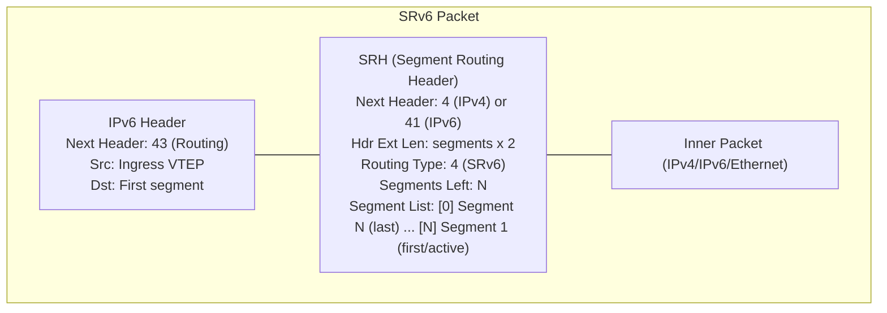
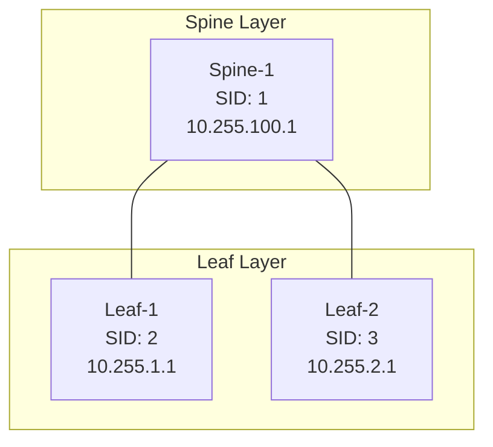

# Segment Routing for CCIE Data Center

## Prerequisite Knowledge

- IGP fundamentals (OSPF or IS-IS)
- MPLS basics (labels, LSP, forwarding)
- Understanding of traffic engineering concepts
- NX-OS CLI fundamentals
- VXLAN/EVPN concepts (for SR in DC context)

---

## Segment Routing Concepts

### What is Segment Routing?

Segment Routing (SR, RFC 8402) is a source-routing architecture where the ingress
node encodes the path as a list of segments (instructions) in the packet header.
Intermediate nodes simply execute the instructions - no per-flow state required.

Traditional routing: each router makes an independent forwarding decision.
Segment Routing: the ingress router specifies the exact path.

### Key Terminology

| Term | Definition |
|------|-----------|
| **Segment** | An instruction (forward to node X, take link Y, follow path Z) |
| **SID (Segment Identifier)** | A label/number that identifies a segment |
| **Segment List** | An ordered list of SIDs defining a path |
| **Node** | A router participating in SR |
| **IGP** | The protocol that distributes SR information (OSPF-SR or IS-IS SR) |

### Types of Segments

| Segment Type | SID Type | Scope | Purpose |
|-------------|----------|-------|---------|
| **Prefix Segment** | Prefix-SID | Global | Forward to a specific prefix (usually a loopback) |
| **Adjacency Segment** | Adj-SID | Local | Forward over a specific link/adjacency |
| **Node Segment** | Node-SID | Global | Forward to a specific node (special case of Prefix-SID) |
| **Anycast Segment** | Anycast-SID | Global | Forward to nearest member of an anycast group |
| **Binding Segment** | Binding-SID | Local | Represents a segment list (for SR-TE) |

### How SR Works (Simplified)

```
Ingress (Node A) wants to send traffic: A -> B -> C -> D

Traditional: A looks up D in routing table, forwards to next-hop.
             Each node independently forwards toward D.

Segment Routing: A creates segment list: [Node-SID-B, Node-SID-C, Node-SID-D]
                 A pushes labels for B, C, D onto the packet.
                 B pops its label, forwards to C.
                 C pops its label, forwards to D.
                 D receives the packet.
```

The path is encoded at the source. No RSVP, no LDP, no per-flow state in the core.

---

## SR-MPLS

### SR-MPLS Data Plane

SR-MPLS uses the MPLS data plane. SIDs are MPLS labels.

- **Prefix-SID**: a globally significant MPLS label (e.g., 16001 for Node A)
- **Adj-SID**: a locally significant MPLS label (e.g., 24001 for link A->B)
- Labels are distributed via IGP extensions (OSPF-SR or IS-IS SR), NOT LDP

### Prefix-SID

- Globally unique within the SR domain
- Mapped to a prefix (usually a /32 loopback)
- SRGB (Segment Routing Global Block): range of labels for global SIDs
  - Default SRGB: 16000-23999
  - Node A loopback -> Prefix-SID 16001 (index 1 + SRGB base 16000)

```
Node A: loopback 10.255.1.1/32 -> Prefix-SID index 1 -> Label 16001
Node B: loopback 10.255.2.1/32 -> Prefix-SID index 2 -> Label 16002
Node C: loopback 10.255.3.1/32 -> Prefix-SID index 3 -> Label 16003
```

### Adjacency-SID

- Locally significant (unique per router)
- Mapped to a specific adjacency (interface/neighbor)
- SRLB (Segment Routing Local Block): range for local SIDs
  - Default SRLB: 15000-15999
- Used for strict path enforcement (force traffic over a specific link)

### Node-SID

- A Prefix-SID assigned to a node's loopback
- Global significance: all routers in the SR domain know how to reach Node-SID X
- Used for basic SR forwarding (shortest path to a node)

---

## SR on Nexus 9000

### IGP Extensions for SR

SR information is distributed via IGP extensions:
- **OSPF-SR**: RFC 8665 (OSPFv2 Extensions for SR)
- **IS-IS SR**: RFC 8667 (IS-IS Extensions for SR)

These extensions advertise:
- SRGB (global label range)
- Prefix-SIDs (for loopbacks)
- Adj-SIDs (for links)
- Node capabilities (SR algorithm support)

### OSPF SR Configuration on Nexus 9000

```nxos
feature ospf

router ospf UNDERLAY
  router-id 10.255.1.1
  segment-routing mpls
  segment-routing global-block 16000 23999
  segment-routing local-block 15000 15999

interface loopback0
  ip address 10.255.1.1/32
  ip router ospf UNDERLAY area 0.0.0.0
  ip ospf prefix-sid index 1 absolute

interface Ethernet1/49
  ip address 10.0.1.1/31
  ip router ospf UNDERLAY area 0.0.0.0
  ip ospf network point-to-point
  ip ospf prefix-sid index 1 absolute
```

### IS-IS SR Configuration on Nexus 9000

```nxos
feature isis

router isis UNDERLAY
  net 49.0001.0000.0000.0001.00
  is-type level-2
  metric-style wide
  segment-routing mpls
  segment-routing global-block 16000 23999
  address-family ipv4 unicast

interface loopback0
  ip address 10.255.1.1/32
  ip router isis UNDERLAY
  isis prefix-sid index 1 absolute

interface Ethernet1/49
  ip address 10.0.1.0/31
  ip router isis UNDERLAY
  isis network point-to-point
```

### Verification

```text
Leaf-1# show ospf segment-routing
Segment Routing is enabled
  Global Block: 16000 - 23999
  Local Block: 15000 - 15999

Leaf-1# show ospf segment-routing sid-database
Prefix-SID Database:
  Prefix          SID Index    SID Label    Type
  10.255.1.1/32   1            16001        Node
  10.255.2.1/32   2            16002        Node
  10.255.3.1/32   3            16003        Node

Leaf-1# show mpls forwarding
Label      Outgoing    Next Hop      Interface
16001      Pop         -             -
16002      Swap 16002  10.0.1.0      Eth1/49
16003      Swap 16003  10.0.1.0      Eth1/49
```

---

## SR-TE (Segment Routing Traffic Engineering)

### What is SR-TE?

SR-TE uses segment lists to create explicit paths through the network, similar to
RSVP-TE but without per-flow state in the core.

SR-TE capabilities:
- **Explicit paths**: define the exact route (not just shortest path)
- **Bandwidth constraints**: reserve bandwidth on links
- **Affinity**: include/exclude specific links (color-based)
- **Fast reroute**: pre-computed backup paths (TI-LFA)

### SR-TE Policy

An SR-TE policy defines:
- **Headend**: the ingress router
- **Endpoint**: the destination
- **Color**: identifies the policy (for steering traffic)
- **Segment list**: the ordered list of SIDs

```nxos
segment-routing
  traffic-eng
    policy POLICY_1
      endpoint 10.255.3.1
      color 100
      candidate-paths
        preference 100
          explicit segment-list SL_1
            index 10 mpls label 16002
            index 20 mpls label 16003
```

### SR-TE with Bandwidth

```nxos
segment-routing
  traffic-eng
    policy POLICY_BW
      endpoint 10.255.3.1
      color 200
      candidate-paths
        preference 100
          constraints
            bandwidth 1000000
          dynamic
            metric type igp
```

### SR-TE with Affinity

```nxos
segment-routing
  traffic-eng
    policy POLICY_AFF
      endpoint 10.255.3.1
      color 300
      candidate-paths
        preference 100
          constraints
            affinity
              include-all 0x01
              exclude-any 0x02
          dynamic
```

### Verification

```text
Leaf-1# show segment-routing traffic-eng policy
Policy Name: POLICY_1
  Endpoint: 10.255.3.1
  Color: 100
  Status: Active
  Candidate Path:
    Preference: 100
    Segment List: SL_1
      SID 1: 16002 (Node-SID, Node B)
      SID 2: 16003 (Node-SID, Node C)

Leaf-1# show segment-routing traffic-eng policy POLICY_1 counters
```

---

## SRv6

### SRv6 Concepts

SRv6 (Segment Routing over IPv6) encodes segments as IPv6 addresses in a new
extension header called SRH (Segment Routing Header).

Key differences from SR-MPLS:
- No MPLS labels - segments are 128-bit IPv6 addresses
- Uses IPv6 routing (native IP forwarding)
- SRH is an IPv6 extension header (Next Header = 43)
- No LDP or RSVP needed - pure IGP

### SRH (Segment Routing Header)



### uSID (Micro-SID)

uSID is a compressed SRv6 format that reduces the SRH size:
- Standard SID: 128 bits per segment
- uSID: 16 bits per segment (within a /32 uSID block)
- Allows more segments in the same header space
- Supported on newer Nexus 9000 platforms

### SRv6 on Nexus 9000

SRv6 support on Nexus 9000 is platform and version dependent:
- N9K-C9300v (CML): limited SRv6 support
- N9K-C9364C / N9K-C93180YC-FX: SRv6 with recent NX-OS (10.3+)

```nxos
feature sr-te
segment-routing
  srv6
    locator LOC1
      prefix 2001:db8:1::/48
      behavior usid
```

> **CCIE Exam Tip:** SRv6 is primarily a CONCEPTUAL topic for the CCIE DC v3.1 exam.
> You need to understand: what SRv6 is, how SRH works, uSID concept, and how it
> differs from SR-MPLS. You are unlikely to configure full SRv6 in the 8-hour lab,
> but you may see a conceptual question or a basic configuration task.

---

## SR in the Data Center

### Underlay Traffic Engineering

SR can be used in the DC underlay for:
- **Traffic steering**: force traffic over specific spine paths
- **Load balancing**: distribute traffic across ECMP paths
- **Fast reroute**: TI-LFA provides <50ms failover

### SR Between VTEPs

In a VXLAN fabric, SR can steer traffic between VTEPs:
- Leaf-1 wants to send VXLAN traffic to Leaf-4 via Spine-2 (not Spine-1)
- SR-TE policy: [Adj-SID-Spine2, Node-SID-Leaf4]
- Traffic follows the explicit path regardless of IGP shortest path

### SR for DCI (Data Center Interconnect)

SR-TE is commonly used for DCI:
- Explicit paths between DC border leaves
- Bandwidth-guaranteed paths for storage replication
- Diverse paths for redundancy (primary via DCI-A, backup via DCI-B)

---

## SR vs LDP vs RSVP-TE Comparison

| Feature | SR-MPLS | LDP | RSVP-TE |
|---------|---------|-----|---------|
| Signaling | IGP extensions | LDP (TCP 646) | RSVP-TE (IP 46) |
| State in core | None | Per-FEC | Per-LSP |
| Path control | Source-routed | Shortest path | Explicit (ERO) |
| Traffic engineering | SR-TE policies | None | Bandwidth, affinity |
| Fast reroute | TI-LFA (built-in) | None (needs FRR) | FRR (complex) |
| Scalability | Excellent | Good | Limited (state) |
| Complexity | Low | Low | High |
| DC adoption | Growing | Legacy | Legacy |
| Nexus 9000 support | Yes | Limited | No |

> **CCIE Exam Tip:** SR is replacing LDP and RSVP-TE in modern networks. For the
> CCIE DC exam, know: SR concepts (SIDs, segment lists), SR-MPLS config (OSPF-SR),
> SR-TE policy basics, and SRv6 concepts. You will NOT configure RSVP-TE or LDP.

---

## Lab 1: Basic SR-MPLS with OSPF

### Topology


SRGB: 16000-23999
Leaf-1: Prefix-SID index 2 -> Label 16002
Leaf-2: Prefix-SID index 3 -> Label 16003
Spine-1: Prefix-SID index 1 -> Label 16001

### Spine-1 Configuration

```nxos
hostname Spine-1

feature ospf
feature interface-vlan

interface loopback0
  ip address 10.255.100.1/32
  ip router ospf UNDERLAY area 0.0.0.0
  ip ospf prefix-sid index 1 absolute

interface Ethernet1/1
  no switchport
  ip address 10.0.1.0/31
  ip router ospf UNDERLAY area 0.0.0.0
  ip ospf network point-to-point
  no shutdown

interface Ethernet1/2
  no switchport
  ip address 10.0.1.2/31
  ip router ospf UNDERLAY area 0.0.0.0
  ip ospf network point-to-point
  no shutdown

router ospf UNDERLAY
  router-id 10.255.100.1
  segment-routing mpls
  segment-routing global-block 16000 23999
```

### Leaf-1 Configuration

```nxos
hostname Leaf-1

feature ospf
feature interface-vlan

interface loopback0
  ip address 10.255.1.1/32
  ip router ospf UNDERLAY area 0.0.0.0
  ip ospf prefix-sid index 2 absolute

interface Ethernet1/49
  no switchport
  ip address 10.0.1.1/31
  ip router ospf UNDERLAY area 0.0.0.0
  ip ospf network point-to-point
  no shutdown

router ospf UNDERLAY
  router-id 10.255.1.1
  segment-routing mpls
  segment-routing global-block 16000 23999
```

### Leaf-2 Configuration

```nxos
hostname Leaf-2

feature ospf
feature interface-vlan

interface loopback0
  ip address 10.255.2.1/32
  ip router ospf UNDERLAY area 0.0.0.0
  ip ospf prefix-sid index 3 absolute

interface Ethernet1/49
  no switchport
  ip address 10.0.1.3/31
  ip router ospf UNDERLAY area 0.0.0.0
  ip ospf network point-to-point
  no shutdown

router ospf UNDERLAY
  router-id 10.255.2.1
  segment-routing mpls
  segment-routing global-block 16000 23999
```

### Verification

```text
Leaf-1# show ospf segment-routing sid-database
Prefix-SID Database:
  Prefix          SID Index    SID Label    Type      Algorithm
  10.255.100.1/32 1            16001        Node      SPF
  10.255.1.1/32   2            16002        Node      SPF
  10.255.2.1/32   3            16003        Node      SPF

Leaf-1# show mpls forwarding
Label      Outgoing    Next Hop      Interface      Label Op
16001      Swap 16001  10.0.1.0      Eth1/49        Push
16002      Pop         -             -              Pop (self)
16003      Swap 16003  10.0.1.0      Eth1/49        Push

Leaf-1# ping 10.255.2.1 source loopback0
PING 10.255.2.1 (10.255.2.1) from 10.255.1.1: 56 data bytes
64 bytes from 10.255.2.1: icmp_seq=0 ttl=254 time=1.234 ms
```

---

## Lab 2: SR-TE Policy

### Objective
Create an SR-TE policy from Leaf-1 to Leaf-2 via Spine-1 with explicit path.

### Leaf-1 Configuration

```nxos
hostname Leaf-1

feature sr-te

segment-routing
  traffic-eng
    segment-list SL_VIA_SPINE1
      index 10 mpls label 16001
      index 20 mpls label 16003

    policy SRTE_TO_LEAF2
      endpoint 10.255.2.1
      color 100
      candidate-paths
        preference 100
          explicit segment-list SL_VIA_SPINE1
```

### Verification

```text
Leaf-1# show segment-routing traffic-eng policy
Policy: SRTE_TO_LEAF2
  Endpoint: 10.255.2.1
  Color: 100
  Status: Active
  Candidate Path:
    Preference: 100
    Type: Explicit
    Segment List: SL_VIA_SPINE1
      Index 10: MPLS Label 16001 (Spine-1)
      Index 20: MPLS Label 16003 (Leaf-2)

Leaf-1# show segment-routing traffic-eng policy SRTE_TO_LEAF2 counters
  Packets forwarded: 15234
  Bytes forwarded: 12345678
```

---

## SR P2MP (Point-to-Multipoint)

### SR P2MP Concepts

SR P2MP extends SR-TE to deliver traffic from one source to multiple destinations
using a single segment list with replication points. Used for multicast-like services
over an SR-MPLS or SRv6 network.

Key concepts:
- **Root**: the source/headend of the P2MP tree
- **Leaves**: the receivers/destinations
- **Replication point**: an intermediate node that duplicates traffic
- **P2MP segment list**: encodes the tree (root -> replication points -> leaves)

SR P2MP vs traditional multicast:
| Feature | SR P2MP | PIM Multicast |
|---------|---------|---------------|
| State | Source-routed (ingress) | Per-(S,G) in network |
| Signaling | IGP + SR-TE | PIM Join/Prune |
| Path control | Explicit (ingress decides) | Shortest path (RP/SPT) |
| Scalability | Limited by segment list size | Scales with group count |
| Use case | DCI, controlled replication | General multicast |

### SR P2MP Configuration (Conceptual)

```nxos
segment-routing
  traffic-eng
    p2mp-policy P2MP_MCAST
      root 10.255.1.1
      candidate-paths
        preference 100
          explicit
            index 10 mpls label 16001
            index 20 mpls label 16002
            index 30 mpls label 16003
```

> **CCIE Exam Tip:** SR P2MP is CONCEPTUAL for the CCIE DC exam. Know what it is
> (source-routed multicast), how it differs from PIM, and that it uses SR-TE
> policies. You will NOT configure SR P2MP in the 8-hour lab.

---

## SR-TE Color and Endpoint (Deep Dive)

### How SR-TE Steering Works

When you configure an SR-TE policy with a color and endpoint, traffic is steered
into the policy based on BGP color extended community:

1. BGP advertises a prefix with color extended community (e.g., color:100)
2. The headend matches the color to an SR-TE policy with the same color
3. Traffic for that prefix is forwarded into the SR-TE policy's segment list
4. The endpoint ensures the policy destination matches the BGP next-hop

```nxos
segment-routing
  traffic-eng
    policy STEER_PROD
      endpoint 10.255.3.1
      color 100
      candidate-paths
        preference 200
          dynamic
            metric type igp
        preference 100
          explicit segment-list SL_BACKUP
            index 10 mpls label 16001
            index 20 mpls label 16003
```

Candidate path selection:
- Highest preference wins (200 > 100)
- If dynamic path fails (no valid path), falls back to explicit (preference 100)
- `dynamic` uses PCE or local computation; `explicit` uses a static segment list

### SR-TE with BGP Steering

```nxos
route-map SET_COLOR permit 10
  match ip address prefix-list PROD_PREFIXES
  set extcommunity color 100

router bgp 65000
  address-family ipv4 unicast
    export map SET_COLOR
```

---

## Common Exam Scenarios

### Scenario 1: OSPF SR Not Distributing SIDs

**Task**: "Configure OSPF Segment Routing with SRGB 16000-23999. Assign Prefix-SID index 1 to Spine-1 loopback."

**Common Mistake**: Forgetting `segment-routing mpls` under the OSPF process, or forgetting `absolute` keyword on the prefix-sid.

**Correct Config**:
```nxos
router ospf UNDERLAY
  segment-routing mpls
  segment-routing global-block 16000 23999

interface loopback0
  ip ospf prefix-sid index 1 absolute
```

**Verification**: `show ospf segment-routing sid-database` must show the SID.

### Scenario 2: SR-TE Policy Not Active

**Task**: "Create SR-TE policy from Leaf-1 to Leaf-2 via Spine-1."

**Diagnosis**:
```text
Leaf-1# show segment-routing traffic-eng policy
Policy: SRTE_TO_LEAF2
  Status: Inactive   <-- NOT ACTIVE
  Reason: Segment list not resolvable
```

**Root Cause**: The MPLS labels in the segment list don't exist in the MPLS forwarding table (IGP-SR not configured on all nodes, or SRGB mismatch).

**Fix**: Ensure ALL nodes have `segment-routing mpls` and matching `segment-routing global-block`. Verify with `show mpls forwarding`.

### Scenario 3: SRGB Mismatch Between Nodes

**Task**: "SR labels are not being swapped correctly between Leaf-1 and Spine-1."

**Diagnosis**: Leaf-1 uses SRGB 16000-23999, Spine-1 uses default SRGB (different range). Label 16002 means different things on each router.

**Fix**: ALL nodes in the SR domain MUST have the same SRGB.
```nxos
router ospf UNDERLAY
  segment-routing global-block 16000 23999
```

> **Lab Exam Warning:** SRGB mismatch is a silent SR failure. Traffic gets mislabeled
> and dropped. Always verify: `show ospf segment-routing` on EVERY node and confirm
> the global-block matches.

---

## Verification Commands Reference

```text
show ospf segment-routing
show ospf segment-routing sid-database
show isis segment-routing
show isis segment-routing sid-database
show mpls forwarding
show mpls interface
show segment-routing traffic-eng policy
show segment-routing traffic-eng policy POLICY_1
show segment-routing traffic-eng policy POLICY_1 counters
show segment-routing traffic-eng segment-list
show running-config | section segment-routing
```

---

## Key Takeaways

1. **Segment Routing**: Source-routing architecture. Ingress encodes path as segment
   list. No per-flow state in core. Replaces LDP and RSVP-TE.

2. **SR-MPLS**: Uses MPLS labels as SIDs. Prefix-SID (global, for nodes), Adj-SID
   (local, for links). Distributed via IGP extensions (OSPF-SR, IS-IS SR).

3. **SR-TE**: Explicit paths via segment lists. Supports bandwidth, affinity, FRR.
   Configured as policies with candidate paths.

4. **SRv6**: Segments as IPv6 addresses in SRH. No MPLS needed. uSID compresses
   segments to 16 bits. Conceptual for CCIE DC exam.

5. **DC relevance**: SR for underlay TE, traffic steering between VTEPs, DCI paths.
   Growing adoption but VXLAN/EVPN is still the primary DC overlay.

> **CCIE Exam Tip:** Segment Routing is ~5% of the Network domain. You need to:
> - Explain SR concepts (SIDs, segment lists, SR-MPLS vs SRv6)
> - Configure basic OSPF-SR (prefix-sid index, SRGB)
> - Understand SR-TE policy structure
> - Compare SR vs LDP vs RSVP-TE
> You will NOT configure complex SR-TE or SRv6 in the 8-hour lab. Focus on concepts
> and basic OSPF-SR configuration.

> **Lab Exam Warning:** If SR appears in the exam, it will likely be a small task:
> "Configure OSPF SR with SRGB 16000-23999 and assign Prefix-SID index X to loopback0."
> Know the commands: `segment-routing mpls`, `segment-routing global-block`,
> `ip ospf prefix-sid index X absolute`. Don't over-study SR at the expense of VXLAN.

---

*Segment Routing | CCIE DC v3.1 | Network Domain (30%) - ~5% of network weight*
