# VXLAN and EVPN for CCIE Data Center

## Prerequisite Knowledge

- Solid understanding of L2 switching (VLANs, MAC address tables, ARP)
- L3 routing fundamentals (OSPF or BGP underlay)
- vPC concepts (anycast gateway)
- BGP basics (neighbors, address families, route reflectors)
- Reference repo: [vikiev/Vxlan](https://github.com/vikiev/Vxlan)

---

## VXLAN Fundamentals

### What is VXLAN?

VXLAN (Virtual Extensible LAN, RFC 7348) is a network overlay technology that
encapsulates Layer 2 Ethernet frames inside Layer 3 UDP packets. It extends L2
segments across an L3 underlay network.

Why VXLAN exists:
- Traditional VLANs are limited to 4094 segments (12-bit VLAN ID)
- STP blocks redundant links in L2 networks
- MAC address tables overflow in large L2 domains
- Multi-tenant DCs need millions of isolated segments
- VM migration requires L2 adjacency across L3 boundaries

VXLAN solves all of these by creating virtual L2 segments (VNIs) over an L3 underlay.

### VNI (VXLAN Network Identifier)

- 24-bit field = 16,777,216 possible segments (vs 4094 VLANs)
- Each VNI is analogous to a VLAN but exists in the overlay
- VNI is mapped to a VLAN on each VTEP for local switching
- VNI scope is global across the entire VXLAN fabric

### VTEP (VXLAN Tunnel Endpoint)

A VTEP is the device that performs VXLAN encapsulation and decapsulation.
In a DC, every leaf switch is a VTEP.

VTEP functions:
- **Encapsulation**: takes an inner L2 frame, adds VXLAN + UDP + outer IP headers
- **Decapsulation**: strips outer headers, delivers inner frame to local VLAN
- **VTEP IP**: the source/destination IP in the outer header (usually loopback0)
- **NVE (Network Virtualization Edge)**: the NX-OS interface representing the VTEP

### UDP Port 4789

VXLAN uses UDP destination port 4789 (IANA-assigned). Some older implementations
use port 8472 (Linux default), but Cisco NX-OS uses 4789.

### VXLAN Encapsulation Format

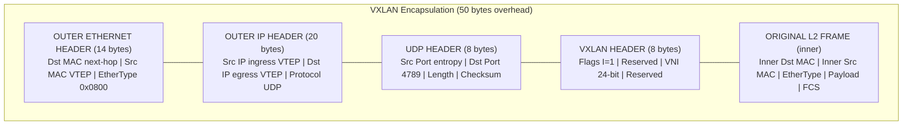

VXLAN header detail (8 bytes):
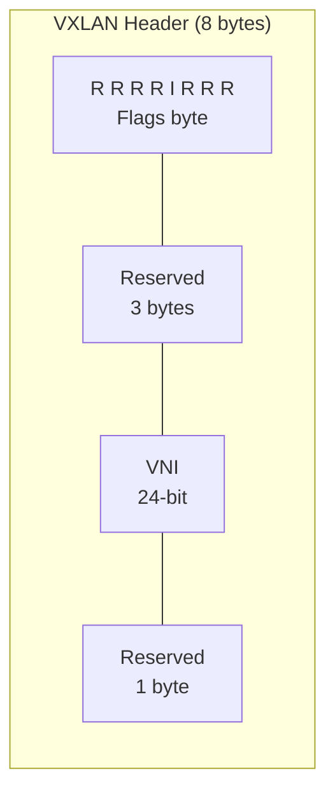

- I flag (bit 4): set to 1, indicates VNI field is valid
- VNI: 24-bit VXLAN Network Identifier
- UDP source port: hash of inner frame headers (for ECMP)

### MTU Requirements

The underlay MUST support the overlay frame size + 50 bytes of overhead.

```
Inner frame:  1514 bytes (standard Ethernet)
VXLAN overhead: 50 bytes (14 outer eth + 20 outer IP + 8 UDP + 8 VXLAN)
Required underlay MTU: 1514 + 50 = 1564 bytes minimum

Recommended: set underlay MTU to 9216 (jumbo frames)
```

```nxos
system jumbo mtu 9216

interface Ethernet1/49
  mtu 9216
```

> **CCIE Exam Tip:** MTU mismatch is the #1 silent VXLAN failure. If the underlay
> MTU is too small, large frames are silently dropped (no ICMP error for UDP).
> Small pings work, but large data transfers fail. ALWAYS verify MTU:
> `ping 10.255.2.1 source loopback0 size 9100 df-bit`

> **Lab Exam Warning:** If VXLAN is "partially working" (small pings OK, large
> transfers fail), it's almost certainly an MTU issue. Check underlay MTU on ALL
> spine and leaf interfaces. The fix is `system jumbo mtu 9216` + interface MTU.

---

## VXLAN Data Plane

### Encapsulation at Ingress VTEP

1. Host A (VLAN 10, VNI 10010) sends an Ethernet frame to Host B
2. Ingress VTEP (Leaf-1) receives the frame on a VLAN 10 access port
3. Leaf-1 looks up the destination MAC in the EVPN/VXLAN MAC table
4. If destination is remote: Leaf-1 encapsulates the frame:
   - Adds VXLAN header with VNI 10010
   - Adds UDP header (dst port 4789, src port = hash)
   - Adds outer IP header (src = Leaf-1 loopback, dst = remote VTEP loopback)
   - Adds outer Ethernet header (dst = next-hop spine MAC)
5. Encapsulated packet is routed through the underlay to the egress VTEP

### Decapsulation at Egress VTEP

1. Egress VTEP (Leaf-2) receives the UDP packet on port 4789
2. Leaf-2 strips outer Ethernet, IP, UDP, and VXLAN headers
3. Reads VNI (10010) from VXLAN header
4. Maps VNI to local VLAN (VLAN 10)
5. Forwards the inner Ethernet frame out the appropriate VLAN 10 port
6. Destination host receives the original L2 frame

### BUM Traffic (Broadcast, Unknown Unicast, Multicast)

BUM traffic handling depends on the control plane:
- **Flood-and-learn**: headend replication (ingress VTEP replicates to ALL remote VTEPs)
- **EVPN with IMET (RT-3)**: ingress replication using IMET route flood list
- **Underlay multicast**: map VNI to a multicast group, use PIM in underlay

---

## VXLAN Control Plane Options

### Option 1: Flood-and-Learn (No Control Plane)

The simplest VXLAN deployment. No control plane protocol.

How it works:
1. VTEP learns remote VTEP IPs from a static list or multicast
2. Unknown unicast/broadcast/multicast: flood to ALL VTEPs (headend replication)
3. MAC learning: when a frame arrives from a remote VTEP, learn the source MAC
4. Subsequent unicast: send directly to the VTEP that owns the MAC

Limitations:
- No MAC advertisement (flood first, learn from data plane)
- Inefficient BUM handling (replicate to all VTEPs)
- No multi-homing support
- No L3 services (no IRB)
- Does not scale

> **CCIE Exam Tip:** Flood-and-learn is rarely used in production or the exam. Know
> it exists and how it differs from EVPN. The exam will almost always use BGP EVPN.

### Option 2: MP-BGP EVPN (Industry Standard)

BGP EVPN is the control plane for VXLAN in modern DCs. It distributes MAC and IP
reachability information via BGP, eliminating data-plane learning.

Advantages over flood-and-learn:
- MAC/IP routes advertised via BGP (no flooding for known unicast)
- BUM handled via IMET routes (controlled replication)
- Multi-homing support (Ethernet Segment, DF election)
- L3 services (IRB, L3VNI, inter-VXLAN routing)
- Scales to thousands of VTEPs

This is what the CCIE DC exam tests. The rest of this file focuses on EVPN.

---

## EVPN Deep Dive

### What is EVPN?

EVPN (Ethernet VPN, RFC 7432) is a BGP address family (AFI 25, SAFI 70) that
advertises L2 and L3 reachability information. In the DC, EVPN is the control
plane for VXLAN.

EVPN carries:
- MAC address reachability (which VTEP has which MAC)
- IP address reachability (which VTEP has which IP)
- BUM flood lists (which VTEPs to replicate to)
- Ethernet Segment information (for multi-homing)
- IP prefix routes (for L3 services)

### EVPN Route Types

EVPN defines 5 route types, each with a specific NLRI format:

#### Route Type 1: Ethernet A-D (Auto-Discovery)

Purpose: Advertises Ethernet Segments for multi-homing. Two variants:
- **Per-ESI**: advertises an entire Ethernet Segment
- **Per-EVI**: advertises a specific EVPN Instance on an ES

NLRI format:
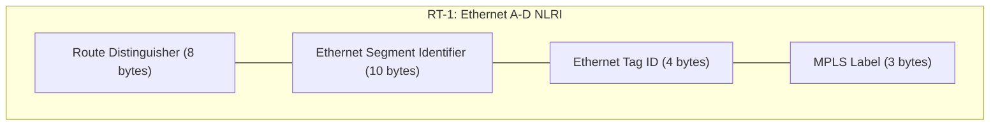

Use case: Multi-homing (a server connected to 2+ leaves). Not commonly tested
in CCIE DC lab (single-homing is the norm).

#### Route Type 2: MAC/IP Advertisement

Purpose: Advertises MAC addresses (and optionally IP addresses) learned on a VTEP.
This is the MOST IMPORTANT route type for VXLAN.

NLRI format:
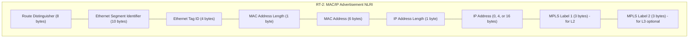

What it tells you:
- "MAC 0050.5601.0001 with IP 10.10.10.100 is behind VTEP 10.255.2.1 in VNI 10010"

```text
Leaf-1# show bgp l2vpn evpn route-type 2
Route Distinguisher: 10.255.2.1:10010    (L2VNI 10010)
*> [2]:[0]:[0]:[48]:[0050.5601.0001]:[32]:[10.10.10.100]/216
   next-hop 10.255.2.1
   Extended Community: RT:65000:10010 encap:8
```

#### Route Type 3: IMET (Inclusive Multicast Ethernet Tag)

Purpose: Advertises the BUM flood list for a VNI. Each VTEP sends an IMET route
for each VNI it participates in. Other VTEPs use these routes to build the
replication list for BUM traffic.

NLRI format:
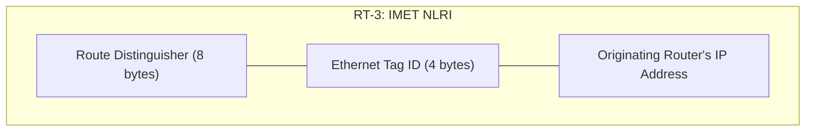

What it tells you:
- "VTEP 10.255.2.1 wants to receive BUM traffic for VNI 10010"

```text
Leaf-1# show bgp l2vpn evpn route-type 3
Route Distinguisher: 10.255.2.1:10010    (L2VNI 10010)
*> [3]:[0]:[32]:[10.255.2.1]/88
   next-hop 10.255.2.1
   Extended Community: RT:65000:10010 encap:8
```

> **CCIE Exam Tip:** If BUM traffic (broadcast, ARP) is not working but unicast is,
> check RT-3 (IMET) routes. `show bgp l2vpn evpn route-type 3` should show one
> IMET route per remote VTEP for each VNI. Missing IMET = no BUM replication.

#### Route Type 4: Ethernet Segment

Purpose: Used for multi-homing. Advertises Ethernet Segment identifiers and
participates in DF (Designated Forwarder) election.

NLRI format:
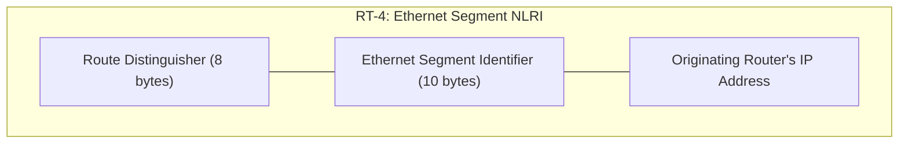

Use case: Multi-homing only. Rarely configured in CCIE DC lab.

#### Route Type 5: IP Prefix Advertisement

Purpose: Advertises IP prefixes for L3 services (inter-VXLAN routing, external routes).
This is how L3VNI routes are propagated across the fabric.

NLRI format:
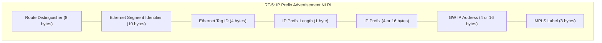

What it tells you:
- "Subnet 10.20.20.0/24 is reachable via VTEP 10.255.2.1 through L3VNI 500001"

```text
Leaf-1# show bgp l2vpn evpn route-type 5
Route Distinguisher: 10.255.2.1:500001    (L3VNI 500001)
*> [5]:[0]:[0]:[24]:[10.20.20.0]/224
   next-hop 10.255.2.1
   Extended Community: RT:65000:500001 encap:8
```

### EVPN Route Type Summary Table

| RT | Name | Purpose | Key Fields | Exam Frequency |
|----|------|---------|------------|----------------|
| 1 | Ethernet A-D | Multi-homing, ES | ESI, Ethernet Tag | Low |
| 2 | MAC/IP | MAC + IP reachability | MAC, IP, VNI | **HIGH** |
| 3 | IMET | BUM flood list | Originating Router IP | **HIGH** |
| 4 | Ethernet Segment | DF election | ESI, Router IP | Low |
| 5 | IP Prefix | L3 routes (L3VNI) | IP Prefix, GW IP | **HIGH** |

### EVPN Services

#### VLAN-Based Service

One EVPN Instance (EVI) per VLAN. Each VLAN maps to one VNI.
This is the standard model for Nexus 9000 VXLAN.

- VLAN 10 -> VNI 10010 -> EVI with RD x:10010, RT 65000:10010
- VLAN 20 -> VNI 10020 -> EVI with RD x:10020, RT 65000:10020

#### VLAN-Aware Bundle Service

Multiple VLANs share one EVI. Uses Ethernet Tag to distinguish VLANs.
Less common on Nexus 9000.

### Route Distinguisher (RD) and Route Target (RT) in EVPN

**RD (Route Distinguisher)**:
- 8-byte value that makes EVPN routes unique
- Format on Nexus: `VTEP_IP:VNI` (e.g., 10.255.1.1:10010)
- Auto-generated from VNI configuration
- NOT used for route filtering - only for uniqueness

**RT (Route Target)**:
- Extended community that controls route import/export
- Format on Nexus: `ASN:VNI` (e.g., 65000:10010)
- Auto-generated with `route-target both auto`
- VTEPs import EVPN routes whose RT matches their configured RT

```nxos
router bgp 65000
  vrf PROD
    address-family ipv4 unicast
      route-target both auto
      route-target both auto evpn
```

> **CCIE Exam Tip:** On Nexus 9000, RD and RT are auto-generated from the VNI when
> you use `route-target both auto`. You rarely configure them manually. But you MUST
> know how to READ them in `show bgp l2vpn evpn` output. RD = VTEP_IP:VNI,
> RT = ASN:VNI.

### EVPN and VXLAN Integration on Nexus 9000

The Nexus 9000 integrates EVPN and VXLAN through these components:

1. **VLAN-to-VNI mapping**: `vn-segment` under VLAN config
2. **NVE interface**: the VTEP, uses BGP for host reachability
3. **VNI configuration**: under NVE, maps VNI to EVPN (ingress-replication)
4. **SVI**: L3 gateway with anycast MAC
5. **L3VNI**: VLAN + SVI in a VRF for inter-VXLAN routing
6. **BGP EVPN**: address-family l2vpn evpn distributes routes

---

## Symmetric IRB vs Asymmetric IRB

### What is IRB?

IRB (Integrated Routing and Bridging) is the process of routing traffic between
VXLAN segments (VNIs). When a host in VNI 10010 needs to reach a host in VNI 10020,
the VTEP must route between the two VNIs.

### Asymmetric IRB

In asymmetric IRB, routing happens ONLY at the ingress VTEP.

Flow (Host A in VNI 10010 -> Host B in VNI 10020):
1. Host A sends frame to gateway (Leaf-1)
2. Leaf-1 routes from VNI 10010 to VNI 10020 (ingress routing)
3. Leaf-1 encapsulates with VNI 10020 (destination VNI)
4. Packet sent to Leaf-2 (which has Host B in VLAN 20/VNI 10020)
5. Leaf-2 decapsulates and delivers to Host B

Requirements:
- EVERY VTEP must have ALL VNIs configured (both source and destination)
- Leaf-1 must have VNI 10020 configured (even if no local hosts in VNI 10020)
- Each VNI has its own VLAN and SVI

Limitations:
- Does not scale: every leaf needs every VNI
- Configuration explosion: 100 VNIs = 100 VLANs + 100 SVIs on every leaf
- Wasted resources: VNIs with no local hosts still consume TCAM

### Symmetric IRB

In symmetric IRB, routing happens at BOTH ingress AND egress VTEPs, using a
single L3VNI for the entire VRF.

Flow (Host A in VNI 10010 -> Host B in VNI 10020):
1. Host A sends frame to gateway (Leaf-1)
2. Leaf-1 routes from VNI 10010 to L3VNI 500001 (ingress routing)
3. Leaf-1 encapsulates with VNI 500001 (L3VNI)
4. Packet sent to Leaf-2 via L3VNI
5. Leaf-2 decapsulates, routes from L3VNI 500001 to VNI 10020 (egress routing)
6. Leaf-2 delivers to Host B

Requirements:
- Each VRF has ONE L3VNI (e.g., 500001)
- VTEPs only need VNIs for locally attached hosts + the L3VNI
- L3VNI is the "transit VNI" for all inter-VXLAN routing

Advantages:
- Scales: leaves only need local VNIs + L3VNI
- Fewer configurations: no need for remote VNIs on every leaf
- Efficient TCAM usage

> **CCIE Exam Tip:** The CCIE DC exam uses SYMMETRIC IRB. Always configure L3VNI.
> If the task says "inter-VXLAN routing" or "inter-subnet routing," you need:
> 1. A VRF with a VNI (L3VNI)
> 2. A VLAN mapped to that VNI
> 3. An SVI in that VRF with `ip forward`
> 4. `fabric forwarding mode anycast-gw` on all SVIs

### Why Symmetric is Preferred

| Criteria | Asymmetric | Symmetric |
|----------|-----------|-----------|
| Routing point | Ingress only | Ingress + Egress |
| VNI requirement | All VNIs on all VTEPs | Local VNIs + L3VNI |
| Scalability | Poor (config explosion) | Excellent |
| TCAM usage | High | Low |
| Config complexity | High (many SVIs) | Low (one L3VNI per VRF) |
| CCIE exam usage | Rarely | **Always** |

---

## L3VNI Configuration

The L3VNI is the VNI used for inter-VXLAN routing within a VRF.

```nxos
vrf context PROD
  vni 500001
  address-family ipv4 unicast
    route-target both auto
    route-target both auto evpn

vlan 500
  vn-segment 500001

interface vlan 500
  no shutdown
  vrf member PROD
  ip forward
```

Key points:
- L3VNI (500001) is configured under the VRF
- A VLAN (500) is mapped to the L3VNI
- The SVI for that VLAN is in the VRF with `ip forward` (no IP address needed)
- `ip forward` enables L3 forwarding on the SVI without an IP address

### Anycast SVI and Distributed Anycast Gateway

All SVIs in the VXLAN fabric use the anycast gateway:

```nxos
fabric forwarding anycast-gw-mac 0000.1111.2222

interface vlan 10
  no shutdown
  ip address 10.10.10.1/24
  fabric forwarding mode anycast-gw
```

Every leaf in the fabric has the same SVI IP and MAC for each VLAN. This means:
- Hosts always use the local leaf as their gateway
- No FHRP (HSRP/VRRP) needed
- VM migration is seamless (same gateway MAC everywhere)

---

## EVPN Multi-Homing

### Ethernet Segment (ES)

An Ethernet Segment represents a set of links between a device (server/switch) and
multiple VTEPs. Used for multi-homing (dual-homed servers).

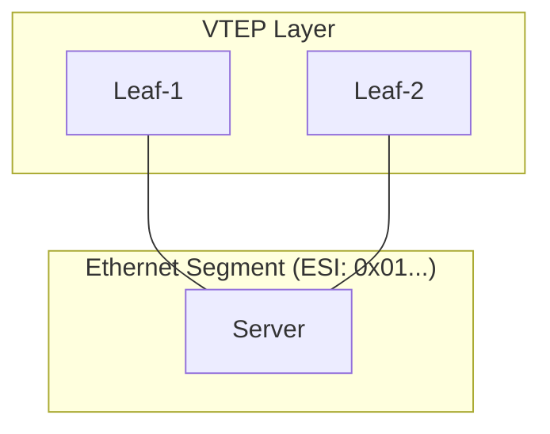

### DF Election (Designated Forwarder)

When multiple VTEPs share an Ethernet Segment, one is elected as the DF:
- DF forwards BUM traffic from the network to the multi-homed device
- Non-DF VTEPs block BUM traffic to prevent duplicates
- Election based on highest IP address (per Ethernet Tag)

### Split-Horizon

Split-horizon prevents loops in multi-homing:
- Traffic received from an ES is NOT sent back to the same ES
- DF handles BUM forwarding to the ES
- Non-DF drops BUM traffic destined to the ES

> **CCIE Exam Tip:** Multi-homing (EVPN ES, DF election) is conceptual for the CCIE DC
> lab. You will likely configure single-homed hosts (one NIC to one leaf, or vPC to
> a leaf pair). Know what ES, DF, and split-horizon ARE, but don't expect to configure
> them in the 8-hour lab.

---

## VXLAN Configuration on Nexus 9000 (FULL)

### Feature Set

```nxos
feature nv overlay
feature vn-segment-vlan-based
feature bgp
feature interface-vlan
feature ospf
feature lacp
feature vpc
```

### NVE Interface Configuration

The NVE (Network Virtualization Edge) interface is the VTEP:

```nxos
interface nve 1
  no shutdown
  source-interface loopback0
  host-reachability protocol bgp
  member vni 10010
    ingress-replication protocol bgp
  member vni 10020
    ingress-replication protocol bgp
  member vni 500001 associate-vrf
```

Key parameters:
- `source-interface loopback0`: VTEP source IP (must be in underlay routing)
- `host-reachability protocol bgp`: use BGP EVPN for VTEP discovery
- `ingress-replication protocol bgp`: use BGP IMET routes for BUM (no multicast)
- `associate-vrf`: maps L3VNI to a VRF (for L3 services)

Alternative: underlay multicast for BUM:
```nxos
interface nve 1
  member vni 10010
    mcast-group 239.1.1.10010
```

### VLAN-to-VNI Mapping

```nxos
vlan 10
  vn-segment 10010

vlan 20
  vn-segment 10020

vlan 500
  vn-segment 500001
```

### SVI Configuration (L2 Gateway)

```nxos
interface vlan 10
  no shutdown
  ip address 10.10.10.1/24
  fabric forwarding mode anycast-gw

interface vlan 20
  no shutdown
  ip address 10.10.20.1/24
  fabric forwarding mode anycast-gw
```

### L3VNI Configuration (L3 Gateway)

```nxos
vrf context PROD
  vni 500001
  address-family ipv4 unicast
    route-target both auto
    route-target both auto evpn

interface vlan 500
  no shutdown
  vrf member PROD
  ip forward
```

### BGP EVPN Configuration

```nxos
router bgp 65000
  router-id 10.255.1.1
  address-family l2vpn evpn
    retain route-target all

  neighbor 10.255.100.1
    remote-as 65000
    update-source loopback0
    address-family l2vpn evpn
      send-community extended
      route-reflector-client

  neighbor 10.255.100.2
    remote-as 65000
    update-source loopback0
    address-family l2vpn evpn
      send-community extended
      route-reflector-client
```

`advertise-pip` (Primary IP) - advertises the VTEP's primary IP in EVPN routes:
```nxos
router bgp 65000
  address-family l2vpn evpn
    advertise-pip
```

### Complete Leaf Configuration (VXLAN + EVPN)

```nxos
hostname Leaf-1

feature nv overlay
feature vn-segment-vlan-based
feature bgp
feature interface-vlan
feature ospf
feature lacp
feature vpc

system jumbo mtu 9216

fabric forwarding anycast-gw-mac 0000.1111.2222

vlan 10
  name WEB
  vn-segment 10010

vlan 20
  name APP
  vn-segment 10020

vlan 500
  name L3VNI_PROD
  vn-segment 500001

vrf context PROD
  vni 500001
  address-family ipv4 unicast
    route-target both auto
    route-target both auto evpn

interface loopback0
  ip address 10.255.1.1/32
  ip router ospf UNDERLAY area 0.0.0.0

interface Ethernet1/49
  no switchport
  mtu 9216
  ip address 10.0.1.1/31
  ip router ospf UNDERLAY area 0.0.0.0
  ip ospf network point-to-point
  no shutdown

interface Ethernet1/50
  no switchport
  mtu 9216
  ip address 10.0.1.3/31
  ip router ospf UNDERLAY area 0.0.0.0
  ip ospf network point-to-point
  no shutdown

interface nve 1
  no shutdown
  source-interface loopback0
  host-reachability protocol bgp
  member vni 10010
    ingress-replication protocol bgp
  member vni 10020
    ingress-replication protocol bgp
  member vni 500001 associate-vrf

interface vlan 10
  no shutdown
  ip address 10.10.10.1/24
  fabric forwarding mode anycast-gw

interface vlan 20
  no shutdown
  ip address 10.10.20.1/24
  fabric forwarding mode anycast-gw

interface vlan 500
  no shutdown
  vrf member PROD
  ip forward

router ospf UNDERLAY
  router-id 10.255.1.1

router bgp 65000
  router-id 10.255.1.1
  address-family l2vpn evpn
    retain route-target all
    advertise-pip
  neighbor 10.255.100.1
    remote-as 65000
    update-source loopback0
    address-family l2vpn evpn
      send-community extended
  neighbor 10.255.100.2
    remote-as 65000
    update-source loopback0
    address-family l2vpn evpn
      send-community extended
```

### Complete Spine Configuration (Route Reflector)

```nxos
hostname Spine-1

feature bgp
feature interface-vlan
feature ospf

system jumbo mtu 9216

interface loopback0
  ip address 10.255.100.1/32
  ip router ospf UNDERLAY area 0.0.0.0

interface Ethernet1/1
  no switchport
  mtu 9216
  ip address 10.0.1.0/31
  ip router ospf UNDERLAY area 0.0.0.0
  ip ospf network point-to-point
  no shutdown

interface Ethernet1/2
  no switchport
  mtu 9216
  ip address 10.0.1.2/31
  ip router ospf UNDERLAY area 0.0.0.0
  ip ospf network point-to-point
  no shutdown

router ospf UNDERLAY
  router-id 10.255.100.1

router bgp 65000
  router-id 10.255.100.1
  address-family l2vpn evpn
    retain route-target all
  neighbor 10.255.1.1
    remote-as 65000
    update-source loopback0
    address-family l2vpn evpn
      send-community extended
      route-reflector-client
  neighbor 10.255.2.1
    remote-as 65000
    update-source loopback0
    address-family l2vpn evpn
      send-community extended
      route-reflector-client
```

---

## Multi-Site VXLAN

### DCI (Data Center Interconnect)

Multi-site VXLAN extends the VXLAN fabric across multiple data centers.

Architecture:
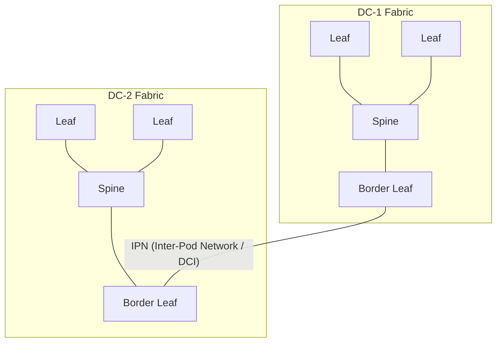

### Border Leaf

The border leaf connects the local fabric to the DCI network:
- Terminates local EVPN routes
- Re-advertises routes across the DCI
- Performs route translation between sites

### EVPN Multi-Site

In EVPN multi-site:
- Each site has its own VTEP addresses and underlay
- Border leaves exchange EVPN routes across the DCI
- L3VNI is extended across sites (same VNI in both DCs)
- RT is used to control which routes cross the DCI

### IPN (Inter-Pod Network)

The IPN is the L3 network connecting border leaves across sites:
- Provides IP connectivity between border leaf VTEPs
- Can be MPLS, IP, or VXLAN
- BGP EVPN runs over the IPN between border leaves

> **CCIE Exam Tip:** Multi-site VXLAN is a conceptual topic in the exam. You may
> need to explain the architecture or configure a border leaf. Know: border leaf
> connects fabrics, IPN provides DCI connectivity, L3VNI is stretched across sites.

---

## Lab 1: Full VXLAN Fabric (4 Leaves, 2 Spines, BGP EVPN)

### Topology

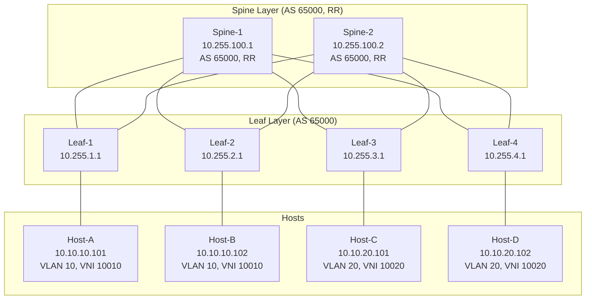
Underlay: OSPF Area 0, /31 P2P links
Overlay: BGP EVPN, iBGP, Spines as RR
L3VNI: 500001 (VRF PROD)

### Spine-1 Configuration

```nxos
hostname Spine-1

feature bgp
feature interface-vlan
feature ospf

system jumbo mtu 9216

interface loopback0
  ip address 10.255.100.1/32
  ip router ospf UNDERLAY area 0.0.0.0

interface Ethernet1/1
  no switchport
  mtu 9216
  ip address 10.0.1.0/31
  ip router ospf UNDERLAY area 0.0.0.0
  ip ospf network point-to-point
  no shutdown

interface Ethernet1/2
  no switchport
  mtu 9216
  ip address 10.0.2.0/31
  ip router ospf UNDERLAY area 0.0.0.0
  ip ospf network point-to-point
  no shutdown

interface Ethernet1/3
  no switchport
  mtu 9216
  ip address 10.0.3.0/31
  ip router ospf UNDERLAY area 0.0.0.0
  ip ospf network point-to-point
  no shutdown

interface Ethernet1/4
  no switchport
  mtu 9216
  ip address 10.0.4.0/31
  ip router ospf UNDERLAY area 0.0.0.0
  ip ospf network point-to-point
  no shutdown

router ospf UNDERLAY
  router-id 10.255.100.1

router bgp 65000
  router-id 10.255.100.1
  address-family l2vpn evpn
    retain route-target all
  neighbor 10.255.1.1
    remote-as 65000
    update-source loopback0
    address-family l2vpn evpn
      send-community extended
      route-reflector-client
  neighbor 10.255.2.1
    remote-as 65000
    update-source loopback0
    address-family l2vpn evpn
      send-community extended
      route-reflector-client
  neighbor 10.255.3.1
    remote-as 65000
    update-source loopback0
    address-family l2vpn evpn
      send-community extended
      route-reflector-client
  neighbor 10.255.4.1
    remote-as 65000
    update-source loopback0
    address-family l2vpn evpn
      send-community extended
      route-reflector-client
```

### Leaf-1 Configuration

```nxos
hostname Leaf-1

feature nv overlay
feature vn-segment-vlan-based
feature bgp
feature interface-vlan
feature ospf

system jumbo mtu 9216

fabric forwarding anycast-gw-mac 0000.1111.2222

vlan 10
  name WEB
  vn-segment 10010

vlan 500
  name L3VNI_PROD
  vn-segment 500001

vrf context PROD
  vni 500001
  address-family ipv4 unicast
    route-target both auto
    route-target both auto evpn

interface loopback0
  ip address 10.255.1.1/32
  ip router ospf UNDERLAY area 0.0.0.0

interface Ethernet1/1
  switchport mode access
  switchport access vlan 10
  spanning-tree port type edge

interface Ethernet1/49
  no switchport
  mtu 9216
  ip address 10.0.1.1/31
  ip router ospf UNDERLAY area 0.0.0.0
  ip ospf network point-to-point
  no shutdown

interface Ethernet1/50
  no switchport
  mtu 9216
  ip address 10.0.5.1/31
  ip router ospf UNDERLAY area 0.0.0.0
  ip ospf network point-to-point
  no shutdown

interface nve 1
  no shutdown
  source-interface loopback0
  host-reachability protocol bgp
  member vni 10010
    ingress-replication protocol bgp
  member vni 500001 associate-vrf

interface vlan 10
  no shutdown
  ip address 10.10.10.1/24
  fabric forwarding mode anycast-gw

interface vlan 500
  no shutdown
  vrf member PROD
  ip forward

router ospf UNDERLAY
  router-id 10.255.1.1

router bgp 65000
  router-id 10.255.1.1
  address-family l2vpn evpn
    retain route-target all
    advertise-pip
  neighbor 10.255.100.1
    remote-as 65000
    update-source loopback0
    address-family l2vpn evpn
      send-community extended
  neighbor 10.255.100.2
    remote-as 65000
    update-source loopback0
    address-family l2vpn evpn
      send-community extended
```

### Leaf-3 Configuration (VLAN 20 / VNI 10020)

```nxos
hostname Leaf-3

feature nv overlay
feature vn-segment-vlan-based
feature bgp
feature interface-vlan
feature ospf

system jumbo mtu 9216

fabric forwarding anycast-gw-mac 0000.1111.2222

vlan 20
  name APP
  vn-segment 10020

vlan 500
  name L3VNI_PROD
  vn-segment 500001

vrf context PROD
  vni 500001
  address-family ipv4 unicast
    route-target both auto
    route-target both auto evpn

interface loopback0
  ip address 10.255.3.1/32
  ip router ospf UNDERLAY area 0.0.0.0

interface Ethernet1/1
  switchport mode access
  switchport access vlan 20
  spanning-tree port type edge

interface Ethernet1/49
  no switchport
  mtu 9216
  ip address 10.0.3.1/31
  ip router ospf UNDERLAY area 0.0.0.0
  ip ospf network point-to-point
  no shutdown

interface Ethernet1/50
  no switchport
  mtu 9216
  ip address 10.0.7.1/31
  ip router ospf UNDERLAY area 0.0.0.0
  ip ospf network point-to-point
  no shutdown

interface nve 1
  no shutdown
  source-interface loopback0
  host-reachability protocol bgp
  member vni 10020
    ingress-replication protocol bgp
  member vni 500001 associate-vrf

interface vlan 20
  no shutdown
  ip address 10.10.20.1/24
  fabric forwarding mode anycast-gw

interface vlan 500
  no shutdown
  vrf member PROD
  ip forward

router ospf UNDERLAY
  router-id 10.255.3.1

router bgp 65000
  router-id 10.255.3.1
  address-family l2vpn evpn
    retain route-target all
    advertise-pip
  neighbor 10.255.100.1
    remote-as 65000
    update-source loopback0
    address-family l2vpn evpn
      send-community extended
  neighbor 10.255.100.2
    remote-as 65000
    update-source loopback0
    address-family l2vpn evpn
      send-community extended
```

### Verification

```text
Leaf-1# show nve peers
Interface Peer-IP                                 State LearnType Uptime   Router-Mac
--------- --------------------------------------  ----- --------- -------- -----------------
nve1      10.255.2.1                              Up    CP        00:15:22 0000.2222.3333
nve1      10.255.3.1                              Up    CP        00:15:20 0000.4444.5555
nve1      10.255.4.1                              Up    CP        00:15:18 0000.6666.7777

Leaf-1# show nve vni
Interface VNI      Multicast-group     State Mode Type [BD/VRF]      Flags
--------- -------- ------------------- ----- ---- ------------------ -----
nve1      10010    n/a                 Up    CP   L2 [10]
nve1      500001   n/a                 Up    CP   L3 [PROD]

Leaf-1# show bgp l2vpn evpn route-type 2
Route Distinguisher: 10.255.2.1:10010    (L2VNI 10010)
*> [2]:[0]:[0]:[48]:[0050.5601.0002]:[32]:[10.10.10.102]/216
   next-hop 10.255.2.1
   Extended Community: RT:65000:10010 encap:8

Leaf-1# show bgp l2vpn evpn route-type 3
Route Distinguisher: 10.255.2.1:10010    (L2VNI 10010)
*> [3]:[0]:[32]:[10.255.2.1]/88
   next-hop 10.255.2.1

Leaf-1# show bgp l2vpn evpn route-type 5
Route Distinguisher: 10.255.3.1:500001    (L3VNI 500001)
*> [5]:[0]:[0]:[24]:[10.10.20.0]/224
   next-hop 10.255.3.1
   Extended Community: RT:65000:500001 encap:8
```

---

## Lab 2: Symmetric IRB - Inter-VXLAN Routing

### Objective
Enable routing between VNI 10010 (10.10.10.0/24) and VNI 10020 (10.10.20.0/24)
using L3VNI 500001 in VRF PROD.

### Configuration (on ALL leaves)

Already included in Lab 1 configuration above. The key elements:

```nxos
vrf context PROD
  vni 500001
  address-family ipv4 unicast
    route-target both auto
    route-target both auto evpn

vlan 500
  vn-segment 500001

interface nve 1
  member vni 500001 associate-vrf

interface vlan 500
  no shutdown
  vrf member PROD
  ip forward
```

### Verification - Inter-VXLAN Routing

```text
Leaf-1# show ip route vrf PROD
IP Route Table for VRF "PROD"
'*' denotes best ucast next-hop
'**' denotes best mcast next-hop

10.10.10.0/24, ubest/mbest: 1/0, attached
    *via 10.10.10.1, Vlan10, [0/0], 01:00:00, direct
10.10.10.1/32, ubest/mbest: 1/0, attached
    *via 10.10.10.1, Vlan10, [0/0], 01:00:00, local
10.10.20.0/24, ubest/mbest: 1/0
    *via 10.255.3.1%default, [200/0], 00:15:30, bgp-65000, internal, tag 65000, segid: 500001 tunnelid: 0x0a00ff03 encap: VXLAN

Leaf-1# ping 10.10.20.101 vrf PROD
PING 10.10.20.101 (10.10.20.101): 56 data bytes
64 bytes from 10.10.20.101: icmp_seq=0 ttl=254 time=2.341 ms
64 bytes from 10.10.20.101: icmp_seq=1 ttl=254 time=1.892 ms
```

### Packet Flow: Host-A (VNI 10010) -> Host-C (VNI 10020)

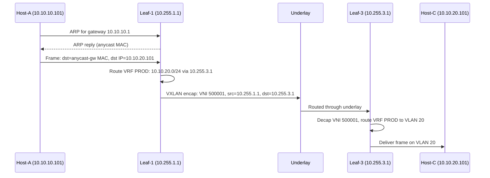

---

## Troubleshooting VXLAN/EVPN

### Problem 1: NVE Interface Down

**Symptom**: `show nve peers` shows no peers. `show interface nve 1` shows down.

**Checklist**:
1. NVE is not shut: `show interface nve 1`
2. Source interface is up: `show interface loopback0`
3. Source interface has IP: `show ip interface loopback0`
4. Underlay route to source exists: `show ip route 10.255.1.1`
5. Feature enabled: `show feature | include nv`

```text
Leaf-1# show interface nve 1
nve1 is up
  source-interface: loopback0
  host-reachability protocol: bgp
```

**Common fix**:
```nxos
interface nve 1
  no shutdown
  source-interface loopback0
  host-reachability protocol bgp
```

### Problem 2: VNI Not Up

**Symptom**: `show nve vni` shows VNI as Down.

**Checklist**:
1. VLAN exists and is mapped to VNI: `show vlan id 10`
2. NVE has the VNI configured: `show run interface nve 1`
3. Ingress-replication is configured: `ingress-replication protocol bgp`
4. BGP EVPN session is up: `show bgp l2vpn evpn summary`
5. For L3VNI: VRF exists and VNI is assigned: `show vrf PROD`

```text
Leaf-1# show nve vni
Interface VNI      Multicast-group     State Mode Type [BD/VRF]      Flags
--------- -------- ------------------- ----- ---- ------------------ -----
nve1      10010    n/a                 Down  CP   L2 [10]
```

**Common fix**: Missing `ingress-replication protocol bgp` under the VNI.
```nxos
interface nve 1
  member vni 10010
    ingress-replication protocol bgp
```

### Problem 3: EVPN Routes Missing

**Symptom**: `show bgp l2vpn evpn route-type 2` shows no routes from remote VTEPs.

**Checklist**:
1. BGP EVPN session is up: `show bgp l2vpn evpn summary`
2. `send-community extended` is configured on the neighbor
3. Route reflector is reflecting EVPN routes (check spine)
4. `retain route-target all` is configured
5. Remote VTEP has the VNI up and is advertising routes

```text
Spine-1# show bgp l2vpn evpn summary
Neighbor        V    AS MsgRcvd MsgSent   TblVer  InQ OutQ Up/Down  State/PfxRcd
10.255.1.1      4 65000     500     498       25    0    0 01:00:05 4
10.255.2.1      4 65000     498     496       25    0    0 01:00:02 4
```

**Common fix**: Missing `send-community extended` under EVPN AF.
```nxos
router bgp 65000
  neighbor 10.255.1.1
    address-family l2vpn evpn
      send-community extended
```

### Problem 4: MAC Not Learned

**Symptom**: Host is connected but `show mac address-table vlan 10` doesn't show the MAC.

**Checklist**:
1. Interface is up and in correct VLAN: `show interface Ethernet1/1 switchport`
2. Host is sending traffic (ARP, ping)
3. STP is not blocking the port: `show spanning-tree interface Ethernet1/1`
4. Port is not in err-disabled state: `show interface status err-disabled`
5. For remote MACs: EVPN RT-2 routes exist

```text
Leaf-1# show mac address-table vlan 10
        Mac Address Table for Vlan 10
VLAN     MAC Address      Type      age     Secure NTFY Ports
----+-----------------+--------+---------+------+----+------------------
  10     0050.5601.0001  dynamic  0         F      F    Eth1/1
G 10     0050.5601.0002  dynamic  0         F      F    nve1(10.255.2.1)
```

The `G` flag indicates a MAC learned via EVPN (from a remote VTEP).

### Problem 5: Asymmetric Routing Blackhole

**Symptom**: Inter-VXLAN routing fails. Ping from VNI 10010 to VNI 10020 times out.

**Checklist**:
1. L3VNI is configured: `show vrf PROD` (check VNI)
2. L3VNI VLAN exists: `show vlan id 500`
3. L3VNI SVI is up with `ip forward`: `show interface vlan 500`
4. NVE has L3VNI with `associate-vrf`: `show run interface nve 1`
5. VRF has route to destination: `show ip route vrf PROD`
6. RT-5 routes exist: `show bgp l2vpn evpn route-type 5`

**Common fix**: Missing `ip forward` on L3VNI SVI, or missing `associate-vrf` on NVE.

```nxos
interface vlan 500
  no shutdown
  vrf member PROD
  ip forward

interface nve 1
  member vni 500001 associate-vrf
```

### Problem 6: MTU Blackhole

**Symptom**: Small pings work, large transfers fail. Intermittent connectivity.

**Diagnosis**:
```text
Leaf-1# ping 10.255.3.1 source loopback0 size 1500 df-bit
PING 10.255.3.1 (10.255.3.1) from 10.255.1.1: 56 data bytes
!!!!!

Leaf-1# ping 10.255.3.1 source loopback0 size 9000 df-bit
PING 10.255.3.1 (10.255.3.1) from 10.255.1.1: 56 data bytes
..... (timeout)
```

**Fix**: Set jumbo MTU on ALL underlay interfaces.
```nxos
system jumbo mtu 9216

interface Ethernet1/49
  mtu 9216
```

> **Lab Exam Warning:** MTU is the SILENT KILLER of VXLAN labs. It works for small
> pings but fails for real traffic. ALWAYS set `system jumbo mtu 9216` and interface
> MTU on ALL spine and leaf underlay interfaces. Verify with a large ping with df-bit.

---

## Common Exam Scenarios

### Scenario 1: VXLAN Fabric Build from Scratch (Deploy Module)

**Task**: "Build a 4-leaf/2-spine VXLAN fabric with BGP EVPN, OSPF underlay, symmetric IRB, VRF PROD with L3VNI 500001."

**Time budget**: 45-60 minutes.

**Execution order** (memorize this):
1. `feature nv overlay`, `feature vn-segment-vlan-based`, `feature bgp`, `feature ospf`, `feature interface-vlan`
2. `system jumbo mtu 9216`
3. `fabric forwarding anycast-gw-mac 0000.1111.2222`
4. VLANs + `vn-segment`
5. VRF + `vni 500001` + `route-target both auto evpn`
6. Loopback0 + OSPF
7. Underlay interfaces (no switchport, mtu 9216, ip ospf network point-to-point)
8. NVE interface (source-interface, host-reachability, member vni + ingress-replication)
9. SVIs (ip address, fabric forwarding mode anycast-gw)
10. L3VNI SVI (vrf member, ip forward)
11. BGP EVPN (neighbor, send-community extended, route-reflector-client on spine)
12. Verify: `show nve peers`, `show bgp l2vpn evpn route-type 2`

**Partial credit**: If you get steps 1-8 done but miss BGP EVPN, you get credit for underlay + NVE but zero for overlay connectivity.

### Scenario 2: Inter-VXLAN Routing Broken (Troubleshoot Module)

**Task**: "Host-A in VNI 10010 cannot ping Host-C in VNI 10020. Both hosts can ping their local gateway."

**Diagnosis path**:
```text
1. show ip route vrf PROD          -> Is 10.10.20.0/24 present?
2. show bgp l2vpn evpn route-type 5 -> Are RT-5 routes exchanged?
3. show vrf PROD                    -> Is VNI 500001 assigned?
4. show interface vlan 500          -> Is L3VNI SVI up with ip forward?
5. show run interface nve 1         -> Is associate-vrf configured?
```

**Most common break**: Missing `ip forward` on L3VNI SVI, or missing `associate-vrf` on NVE.

### Scenario 3: EVPN Routes Not Propagating (Troubleshoot Module)

**Task**: "Leaf-1 and Leaf-2 are both up, NVE peers are formed, but MAC addresses are not learned remotely."

**Diagnosis path**:
```text
1. show bgp l2vpn evpn summary      -> Are EVPN sessions Established?
2. show bgp l2vpn evpn route-type 2 -> Any routes from remote VTEP?
3. On spine: show bgp l2vpn evpn summary -> Is spine reflecting?
4. Check: send-community extended   -> Missing = routes not propagated
5. Check: retain route-target all   -> Missing on spine = routes filtered
```

**Most common break**: Missing `send-community extended` under the EVPN address-family on the BGP neighbor. Without extended communities, RT is stripped and routes are not imported.

> **Lab Exam Warning:** In the troubleshooting module, VXLAN issues are worth the
> MOST points. A single VXLAN task can be 15-20% of the troubleshoot score.
> Always start with underlay verification (ping loopbacks), then NVE, then EVPN.
> Do NOT jump to data-plane debugging before confirming control plane is healthy.

---

## Complete Verification Commands Reference

```text
show nve peers
show nve peers detail
show nve vni
show nve vni 10010
show nve vni 10010 detail
show interface nve 1
show bgp l2vpn evpn summary
show bgp l2vpn evpn route-type 2
show bgp l2vpn evpn route-type 2 detail
show bgp l2vpn evpn route-type 3
show bgp l2vpn evpn route-type 5
show bgp l2vpn evpn route-type 5 detail
show mac address-table vlan 10
show ip arp vlan 10
show ip arp vrf PROD
show vlan id 10
show vlan vn-segment
show vrf
show vrf PROD
show vrf PROD detail
show ip route vrf PROD
show interface vlan 10
show interface vlan 500
show fabric forwarding anycast-gw
show ip ospf neighbors
show ip route
show bgp summary
show interface loopback0
ping 10.255.2.1 source loopback0 size 9000 df-bit
```

---

## Key Takeaways

1. **VXLAN**: Encapsulates L2 frames in UDP/IP. VNI = 24-bit segment ID. VTEP = leaf
   switch. Overhead = 50 bytes. Underlay MTU must be overlay + 50.

2. **EVPN**: BGP control plane for VXLAN. RT-2 (MAC/IP), RT-3 (IMET/BUM), RT-5 (IP prefix)
   are the critical route types. RD = VTEP:VNI, RT = ASN:VNI.

3. **Symmetric IRB**: Use L3VNI for inter-VXLAN routing. One L3VNI per VRF. Routing at
   both ingress and egress. Scales better than asymmetric.

4. **Configuration order**: Features -> VLANs/VNIs -> VRF/L3VNI -> Underlay (OSPF/BGP) ->
   NVE -> SVIs -> BGP EVPN -> Verify.

5. **Troubleshooting order**: Underlay (ping, routes) -> NVE (peers, VNI) -> BGP EVPN
   (sessions, routes) -> MAC/ARP table -> Data plane (ping, traceroute).

> **CCIE Exam Tip:** VXLAN/EVPN is 25% of the Network domain (the largest single topic).
> You WILL configure a full VXLAN fabric in the exam. Practice the complete leaf config
> until you can type it from memory in under 20 minutes. Know every show command.
> Know every failure mode. This is the single most important topic for the CCIE DC lab.

> **Lab Exam Warning:** The most common VXLAN exam mistakes:
> 1. Forgetting `feature vn-segment-vlan-based`
> 2. Forgetting `ingress-replication protocol bgp` under VNI
> 3. Forgetting `send-community extended` under BGP EVPN AF
> 4. Forgetting `ip forward` on L3VNI SVI
> 5. Forgetting `associate-vrf` on NVE for L3VNI
> 6. MTU not set on underlay interfaces
> 7. VNI mismatch between VLAN and NVE

---

*VXLAN/EVPN | CCIE DC v3.1 | Network Domain (30%) - Largest single topic*
*Reference: [vikiev/Vxlan](https://github.com/vikiev/Vxlan)*
