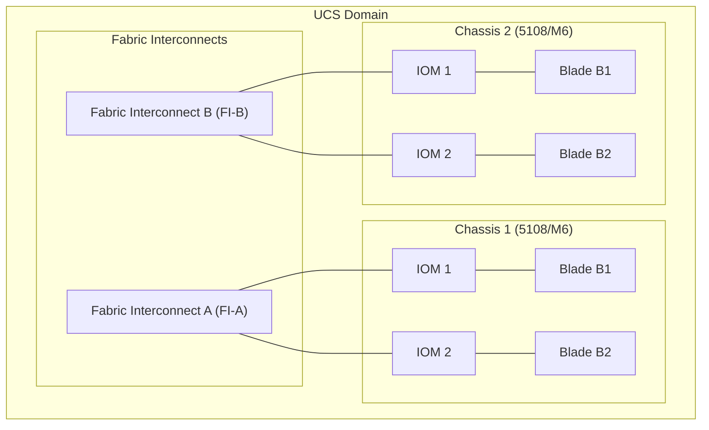
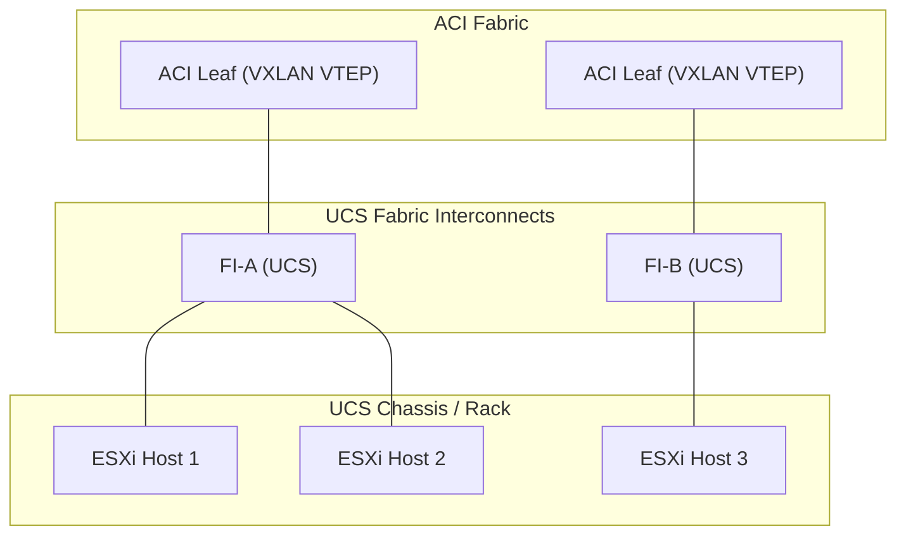
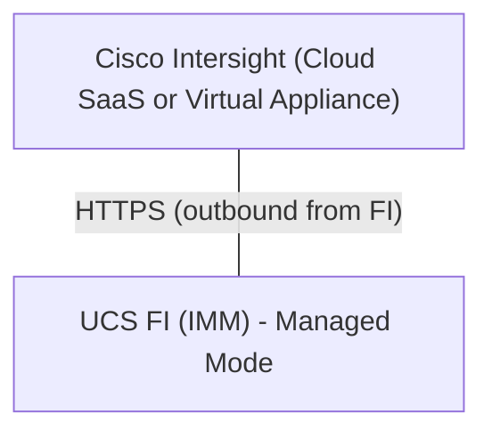
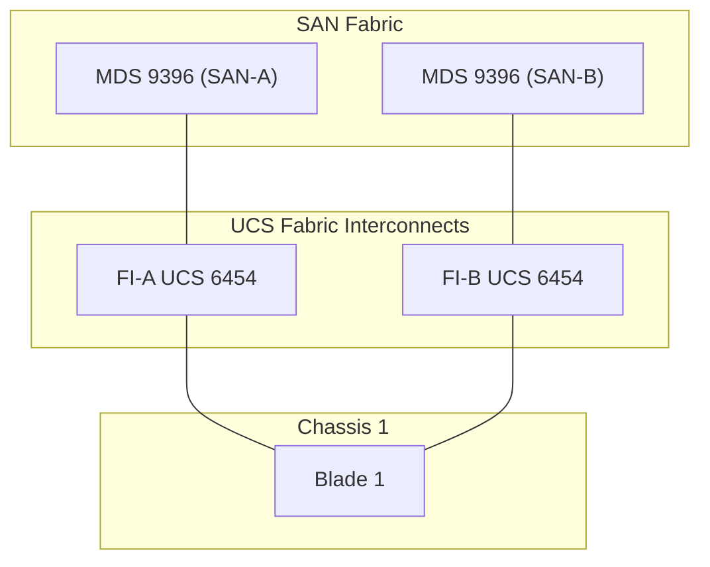

# UCS for CCIE DC v3.1

## Prerequisite Knowledge

- Basic understanding of server hardware (CPU, RAM, NIC, HBA)
- Ethernet switching fundamentals (VLANs, trunking, port channels)
- Fibre Channel fundamentals (WWN, zoning, VSAN)
- Understanding of stateless computing concepts
- Familiarity with data center network architecture (spine/leaf)
- Basic knowledge of firmware management concepts

---

## UCS Architecture Overview

Cisco Unified Computing System (UCS) is a data center server platform that integrates computing, networking, storage access, and virtualization into a single system. The key principle is **stateless computing** — server identity, configuration, and personality are abstracted from physical hardware.

### UCS Components



### Fabric Interconnects (FI)

The Fabric Interconnect is the management and networking brain of UCS. It provides:
- Unified management (UCS Manager runs on FI)
- Unified fabric (LAN + SAN convergence)
- Redundancy (always deployed in pairs: FI-A and FI-B)

#### Cisco UCS 6454 Fabric Interconnect

| Feature | Specification |
|---------|--------------|
| Form Factor | 1RU |
| Ports | 28x 10/25G SFP28, 4x 40/100G QSFP28 |
| Management | UCS Manager or Intersight |
| Throughput | Up to 2.56 Tbps |
| FCoE | Native FCoE support |
| NVMe/FC | FC-NVMe capable |

#### Cisco UCS 6536 Fabric Interconnect

| Feature | Specification |
|---------|--------------|
| Form Factor | 1RU |
| Ports | 32x 10/25G SFP28, 4x 40/100G QSFP28 |
| Management | UCS Manager or Intersight |
| Throughput | Up to 3.2 Tbps |
| FCoE | Native FCoE support |
| NVMe/FC | FC-NVMe capable |

> **CCIE Exam Tip:** Know that FI always comes in pairs (A/B) for redundancy. The FI is NOT a traditional switch — in end-host mode it does NOT run spanning tree and does NOT forward traffic between server ports directly.

### I/O Modules (IOM)

IOMs sit in the blade chassis and connect blades to the Fabric Interconnects.

#### UCS 2408 IOM (for M6/M7 chassis)

- 8x 40G QSFP+ uplinks to FI
- Supports up to 4 blades per chassis
- Provides full mesh connectivity to both FIs
- No local switching — all traffic goes to FI

#### UCS 2208 IOM (for M5 chassis, legacy)

- 8x 10G SFP+ uplinks to FI
- 4x 40G QSFP+ uplinks
- Supports up to 8 blades per chassis

### Blade Servers

#### UCS B200 M6

| Feature | Specification |
|---------|--------------|
| CPUs | 2x Intel Xeon Scalable 3rd Gen (Ice Lake) |
| Memory | 32 DIMM slots, up to 8TB |
| Mezzanine | 2x mezzanine slots (VIC 1495/1497) |
| Storage | 2x 2.5" drive bays |
| Form Factor | Half-width blade |

#### UCS B200 M7

| Feature | Specification |
|---------|--------------|
| CPUs | 2x Intel Xeon Scalable 4th/5th Gen (Sapphire/Emerald Rapids) |
| Memory | 32 DIMM slots, DDR5, up to 8TB |
| Mezzanine | 2x mezzanine slots (VIC 15235/15237) |
| Storage | 2x 2.5" NVMe drive bays |
| Form Factor | Half-width blade |

### Rack Servers

#### UCS C240 M7

| Feature | Specification |
|---------|--------------|
| CPUs | 2x Intel Xeon Scalable 4th/5th Gen |
| Memory | 32 DIMM slots, DDR5 |
| PCIe | Up to 11 PCIe slots |
| Storage | Up to 26x 2.5" drives (NVMe/SAS/SATA) |
| Networking | VIC 15235 (2x 25G) or VIC 15237 (4x 25G) |
| Management | Intersight or UCS Manager (via FI) |

### Virtual Interface Card (VIC)

The VIC is critical to UCS stateless computing:
- Presents multiple virtual NICs (vNICs) and virtual HBAs (vHBAs) to the OS
- Number of vNICs/vHBAs is configurable (up to 256 total)
- Identity (MAC, WWN) is assigned by UCS Manager, not burned into hardware
- Supports SR-IOV for VM passthrough
- Hardware offload for VXLAN encapsulation (VM-FEX)

---

## UCS Manager vs Intersight Managed Mode

### UCS Manager (UCSM)

- Runs directly on the Fabric Interconnects
- GUI (Java/HTML5) and CLI (NX-OS-like)
- Manages a single UCS domain (up to 160 blades, 160 rack servers)
- Local management — no cloud dependency
- XML API for automation

```text
UCSM CLI Access:
  SSH to FI VIP or individual FI
  connect nxos   -> access NX-OS CLI on FI
  connect local-mgmt -> access UCSM CLI
```

### Intersight Managed Mode (IMM)

- Cloud-based management via Cisco Intersight SaaS
- FI acts as managed device, policies pushed from cloud
- Supports both cloud-connected and air-gapped (Intersight Virtual Appliance)
- Provides analytics, recommendations, firmware compliance
- Replaces UCSM for new deployments

| Feature | UCSM | Intersight |
|---------|------|-----------|
| Management location | Local (on FI) | Cloud / Appliance |
| Scale | Single domain | Multiple domains |
| Analytics | Basic | Advanced (AI/ML) |
| Firmware | Manual/scheduled | Compliance-driven |
| API | XML API | REST API (OpenAPI) |
| Future | Maintenance mode | Active development |

> **CCIE Exam Tip:** The exam may ask about migration from UCSM to IMM. Key point: you cannot migrate in-place; you must decommission and re-associate servers under Intersight management.

---

## Service Profiles

Service Profiles are the core of UCS stateless computing. A Service Profile defines the complete identity and configuration of a server, decoupled from physical hardware.

### Service Profile Identity

#### UUID Pools

```text
UCSM GUI: Servers > Pools > root > UUID Suffix Pools
UCSM CLI:
  scope org
  create uuid-suffix-pool POOL_NAME
  create block 0000-000000000001 0000-0000000000FF
  commit-buffer
```

#### MAC Address Pools

```text
UCSM CLI:
  scope org
  create mac-pool MAC_POOL_A
  create block 00:25:B5:00:01:00 00:25:B5:00:01:FF
  commit-buffer
```

- One MAC pool per fabric (A and B) recommended
- OUI prefix should be unique per UCS domain
- Each vNIC gets one MAC from the pool

#### WWN Pools (WWPN and WWNN)

```text
UCSM CLI:
  scope org
  create wwn-pool WWPN_POOL_A node
  create block 20:00:00:25:B5:00:01:00 20:00:00:25:B5:00:01:FF
  commit-buffer

  scope org
  create wwn-pool WWNN_POOL node
  create block 20:00:00:25:B5:00:00:01 20:00:00:25:B5:00:00:FF
  commit-buffer
```

- WWNN: identifies the node (server)
- WWPN: identifies the port (vHBA)
- One WWNN per server, one WWPN per vHBA

### Firmware Policies

Firmware policies define the target firmware version for all components:

```text
Components managed:
  - BIOS
  - CIMC (for rack servers)
  - Adapter (VIC firmware)
  - Board controller
  - Storage controller
  - Disk firmware
  - Host firmware package (bundles all)
```

Host Firmware Packages bundle compatible firmware versions:

```text
UCSM GUI: Servers > Policies > root > Host Firmware Packages
  - Create package with target versions for each component
  - Assign to Service Profile via firmware policy
  - Auto-install triggers firmware update on association
```

### BIOS Policies

BIOS policies allow granular BIOS configuration:

```text
Key BIOS settings for DC workloads:
  - Hyper-Threading: Enabled
  - Turbo Boost: Enabled
  - VT-d (IOMMU): Enabled (for VM passthrough)
  - SR-IOV: Enabled (for VIC)
  - NUMA: Enabled
  - C-States: Disabled (for latency-sensitive)
  - Power Management: Maximum Performance
  - Boot Order: Configurable per profile
  - UEFI vs Legacy Boot: UEFI recommended
```

### Boot Policies

Boot policies define boot order and boot targets:

```text
Boot policy options:
  - Local disk (HDD/SSD)
  - SAN boot (FC/FCoE) - specify WWPN of storage target + LUN
  - iSCSI boot - specify target IQN + IP
  - PXE boot (LAN)
  - UEFI vs Legacy mode

SAN Boot configuration:
  scope org
  create boot-policy SAN_BOOT
    set descr "SAN boot for ESXi"
    create path san
      create vnic-san-path "vHBA-A"
        create san-image-path
          set type primary
          set wwn 50:0a:09:81:82:83:84:85
          set lun 0
      exit
      create vnic-san-path "vHBA-B"
        create san-image-path
          set type secondary
          set wwn 50:0a:09:81:82:83:84:86
          set lun 0
    commit-buffer
```

> **Lab Exam Warning:** SAN boot failures are common. Always verify: (1) WWPN in boot policy matches storage target, (2) zoning allows the vHBA WWPN to reach storage, (3) LUN is mapped and presented, (4) boot policy is UEFI if storage uses UEFI.

---

## Service Profile Templates

Service Profile Templates (SPTs) are the blueprint from which Service Profiles are instantiated.

### Template Types

| Type | Behavior |
|------|----------|
| Initial Template | Cannot be associated directly; used to create profiles |
| Updating Template | Changes to template propagate to all derived profiles |

### Creating a Service Profile Template

```text
UCSM GUI: Servers > Service Profile Templates > Create

Key configuration:
  1. Name and organization
  2. UUID: Pool or specific
  3. MAC pools: Fabric A pool, Fabric B pool
  4. WWN pools: WWNN pool, WWPN pool (A and B)
  5. Firmware policy
  6. BIOS policy
  7. Boot policy
  8. vNIC templates (LAN connectivity)
  9. vHBA templates (SAN connectivity)
  10. Local disk policy
  11. Maintenance policy (reboot behavior)
  12. Scrub policy (disk/BIOS scrub on disassociate)
```

### Template Inheritance and Updates

```text
Updating Template behavior:
  - Modify template -> all derived profiles get updated
  - Maintenance policy controls WHEN changes apply:
    - Immediate: apply now (may cause reboot)
    - User-ack: admin manually acknowledges
    - Timer: apply during maintenance window

Template inheritance:
  - Parent template -> Child template
  - Child inherits all settings, can override specific ones
  - Useful for org-specific customization
```

> **CCIE Exam Tip:** Know the difference between Initial and Updating templates. If you create profiles from an Initial template, changes to the template do NOT propagate. With Updating templates, they DO propagate according to the maintenance policy.

---

## vNIC and vHBA Templates

### vNIC Templates

vNIC templates define the Ethernet connectivity presented to the server:

```text
UCSM CLI:
  scope org
  create vnic-template vNIC-A fabric A
    set ident-pool-name MAC_POOL_A
    set mtu 9000
    set qos-policy GOLD_QOS
    set network-control-policy DEFAULT_NCP
    create vnics "eth0"
    commit-buffer

  create vnic-template vNIC-B fabric B
    set ident-pool-name MAC_POOL_B
    set mtu 9000
    set qos-policy GOLD_QOS
    create vnics "eth1"
    commit-buffer
```

Key vNIC template settings:
- **Fabric**: A or B (determines which FI path)
- **MAC pool**: Identity source
- **MTU**: Must match network (9000 for VXLAN/jumbo)
- **QoS policy**: Priority, bandwidth
- **Network control policy**: CDP, LLDP, MAC registration
- **VLANs**: Native + allowed VLANs
- **Failover**: Enable for active/standby across fabrics

### vHBA Templates

vHBA templates define the Fibre Channel connectivity:

```text
UCSM CLI:
  scope org
  create vhba-template vHBA-A fabric A
    set ident-pool-name WWPN_POOL_A
    set max-data-field-size 2112
    set persistent-luns yes
    create vfc-network "VSAN-A"
    commit-buffer

  create vhba-template vHBA-B fabric B
    set ident-pool-name WWPN_POOL_B
    set max-data-field-size 2112
    set persistent-luns yes
    create vfc-network "VSAN-B"
    commit-buffer
```

### QoS Policies for Compute

```text
QoS policy components:
  - System class priority (platinum, gold, silver, bronze, best-effort)
  - Bandwidth percentage (per class)
  - MTU per class
  - Pause policy (PFC enabled classes)

For FCoE:
  - FCoE traffic MUST use a lossless class (typically platinum or gold)
  - PFC (Priority Flow Control) must be enabled on that class
  - MTU for FCoE: 2158 (FC max frame 2112 + FCoE header)

UCSM CLI:
  scope qos
  scope system-class
    scope fc
      set priority platinum
      set mtu 2158
      set pause-policy enabled
    commit-buffer
```

---

## UCS Fabric Interconnect Configuration

### Uplink Modes

#### End-Host Mode (Default, Recommended)

```text
Characteristics:
  - FI does NOT run spanning tree
  - FI does NOT forward traffic between server ports
  - FI acts as a "pin group" — server traffic is pinned to uplinks
  - All external communication goes through uplink ports
  - No loops possible — no STP needed
  - Server-to-server traffic goes: Server -> FI -> External Switch -> FI -> Server
    (unless both servers are in same chassis, then FI can switch locally)

Uplink port behavior:
  - Uplinks form port channels to upstream switches
  - Pin groups: server vNICs are pinned to specific uplinks
  - Failover: if uplink fails, pin group reassigns to remaining uplinks
```

#### Switch Mode

```text
Characteristics:
  - FI operates as a traditional NX-OS switch
  - Runs spanning tree
  - Can forward between any ports
  - Server ports can communicate directly
  - NOT recommended for most deployments
  - Used when FI must act as aggregation switch
```

> **CCIE Exam Tip:** End-host mode is the default and recommended mode. Know that in end-host mode, the FI does NOT learn MAC addresses from uplink ports for forwarding decisions — it only learns from server ports. This prevents loops without STP.

### Server Ports and Network Ports

```text
Port types on FI:
  - Server ports: Connect to IOMs (backplane of chassis)
  - Network ports (uplinks): Connect to external switches
  - Management ports: Mgmt0 for out-of-band management
  - Appliance ports: Connect to storage (direct-attach)

Port channel configuration (uplinks):
  scope eth-uplink
  create port-channel 1
    add interface 1/49
    add interface 1/50
    commit-buffer

  scope fc-uplink
  create port-channel 1
    add interface 1/33
    add interface 1/34
    commit-buffer
```

---

## VLAN and VSAN Configuration in UCS

### VLAN Configuration

```text
UCSM CLI:
  scope eth-uplink
  scope vlan
    create vlan 100
      set id 100
      set native no
    create vlan 200
      set id 200
    commit-buffer

  scope org
  scope vnic-template vNIC-A
    create vlan 100
      set native yes
    create vlan 200
    commit-buffer
```

VLAN considerations:
- VLANs must exist on both FI and upstream switches
- Native VLAN on vNIC template = untagged traffic
- For VXLAN: VLAN is the access VLAN, VXLAN VNI is on the network side
- Trunk mode on vNIC: passes multiple VLANs (for hypervisor)

### VSAN Configuration

```text
UCSM CLI:
  scope fc-uplink
  scope vsan
    create vsan 100
      set id 100
      set fcoe-vlan 100
    create vsan 200
      set id 200
      set fcoe-vlan 200
    commit-buffer

  scope org
  scope vhba-template vHBA-A
    create vfc-network "vsan-100"
    commit-buffer
```

VSAN considerations:
- VSAN ID must match on FI, upstream MDS/Nexus, and storage
- FCoE VLAN maps to VSAN (one FCoE VLAN per VSAN)
- VSAN trunking on uplinks carries multiple VSANs

---

## UCS and VXLAN Integration (VMM Domain)

### Architecture



### VMM Domain Integration

When UCS is managed within an ACI VMM domain:
- ACI pushes DVS (Distributed Virtual Switch) configuration to vCenter
- EPGs map to DVS port groups
- VXLAN encapsulation handled by ACI leaf (VM-FEX or software VTEP)
- UCS vNIC templates reference the DVS port groups
- Endpoint learning: ACI leaf learns VM MAC/IP via COOP from hypervisor

### VM-FEX (Virtual Machine Fabric Extender)

```text
VM-FEX allows VIC to present vNICs directly to VMs:
  - Bypasses hypervisor virtual switch
  - VXLAN encap/decap done in VIC hardware
  - Lower latency, higher throughput
  - Requires: VIC 1400+, ESXi, ACI VMM domain with VM-FEX enabled

Configuration flow:
  1. ACI VMM domain created with VM-FEX mode
  2. DVS deployed with VM-FEX enabled
  3. UCS Service Profile vNICs use VM-FEX port profiles
  4. VMs get direct hardware vNICs with VXLAN offload
```

---

## UCS Firmware Management

### Host Firmware Packages

```text
Host Firmware Package bundles:
  - Adapter firmware (VIC)
  - BIOS firmware
  - Board controller
  - CIMC (rack servers)
  - Storage controller
  - Disk firmware

UCSM GUI: Servers > Policies > Host Firmware Packages
  - Create package
  - Select target versions for each component
  - Assign to Service Profile via Maintenance/Firmware policy
```

### Auto-Install Process

```text
Firmware update flow:
  1. Download firmware bundle to FI
  2. Create/modify Host Firmware Package with new versions
  3. Assign package to Service Profile (or template)
  4. Maintenance policy triggers update:
     - Immediate: reboot now
     - User-ack: wait for admin
     - Timer: scheduled window
  5. FI stages firmware to blade
  6. Blade reboots (or live-updates adapter)
  7. POST verifies new firmware
  8. Server re-associates with new firmware

UCSM CLI:
  scope org
  scope fw-pkg HOST_FW_PKG
    set version 4.2(1a)
    commit-buffer

  scope service-profile SP-01
    set fw-policy HOST_FW_PKG
    commit-buffer
```

### Firmware Activation Order

```text
Activation sequence matters:
  1. Adapter (VIC) - can be non-disruptive
  2. Board controller
  3. BIOS - requires reboot
  4. CIMC (rack only)
  5. Storage controller
  6. Disk firmware

> **Lab Exam Warning:** Never update BIOS and adapter simultaneously
> without understanding reboot impact. In production, use maintenance
> windows. In the lab, know the activation order for troubleshooting.
```

---

## UCS Troubleshooting

### Association Failures

```text
Common causes:
  1. Service Profile not associated to a blade
  2. Blade not discovered (IOM issue)
  3. Firmware mismatch (blade has incompatible firmware)
  4. VLAN/VSAN not available on FI
  5. MAC/WWN pool exhausted
  6. BIOS policy incompatible with blade model

Verification:
  UCSM# show service-profile assoc detail
  UCSM# show server inventory
  UCSM# show fault instance
  UCSM# show event detail | include "assoc"
```

### Boot Failures

```text
SAN boot troubleshooting:
  1. Verify vHBA association: show service-profile circuit
  2. Verify FLOGI: show flogi database (on FI or upstream MDS)
  3. Verify zoning: show zoneset active (on MDS)
  4. Verify LUN mapping: on storage array
  5. Verify boot policy WWPN matches storage target
  6. Check BIOS boot order: UEFI vs Legacy

PXE boot troubleshooting:
  1. Verify vNIC association and VLAN
  2. Verify DHCP relay/scope
  3. Verify PXE server reachability
  4. Check boot policy order (PXE before disk)
```

### Connectivity Issues

```text
Network connectivity:
  UCSM# show service-profile circuit
  UCSM# show mac-address-table
  UCSM# show vlan brief
  FI-A# show interface ethernet 1/49 (uplink)
  FI-A# show port-channel summary
  FI-A# show flogi database (for FC)

Common issues:
  - Pin group failure: uplink port-channel member down
  - VLAN mismatch: vNIC VLAN not on uplink trunk
  - MTU mismatch: vNIC MTU > uplink MTU (drops jumbo frames)
  - FCoE: PFC not enabled end-to-end
  - FCoE: FIP snooping blocking FLOGI
```

### FI Failover

```text
FI failover scenarios:
  - FI-A failure: all traffic fails over to FI-B
  - Uplink failure: pin group reassigns
  - IOM failure: blade loses connectivity to that fabric

Verification:
  UCSM# show cluster state
  UCSM# show cluster extended-state
  UCSM# show fabric-interconnect status

FI-A# show system redundancy
  System Redundancy: HA
  FI-A: Primary, Active
  FI-B: Subordinate, Ready
```

---

## Intersight Overview (for Exam)

### Intersight Architecture



### Claims Process

```text
To claim a UCS domain in Intersight:
  1. Configure FI for Intersight managed mode
  2. Set FI DNS, NTP, proxy (if needed)
  3. Generate claim code from Intersight portal
  4. Enter claim code on FI
  5. FI establishes outbound HTTPS to Intersight
  6. Domain appears in Intersight inventory

Intersight UI: Admin > Claims > Claim Device
FI CLI: scope system; set intersight claim-code <CODE>; commit
```

### Intersight Policies and Profiles

```text
Intersight policy model (similar to UCSM but cloud-based):
  - Server Profile (equivalent to Service Profile)
  - Server Profile Template
  - Policies:
    - BIOS Policy
    - Boot Order Policy
    - Firmware Policy (compliance-driven)
    - LAN Connectivity Policy (vNICs)
    - SAN Connectivity Policy (vHBAs)
    - Storage Policy
    - IMC Access Policy
    - Network QoS Policy

Key differences from UCSM:
  - Policies are reusable across domains
  - Firmware compliance (auto-remediation)
  - AI-driven recommendations
  - REST API (OpenAPI 3.0) for automation
```

---

## Verification Commands

```text
UCSM CLI:
  show service-profile assoc
  show service-profile circuit
  show server inventory
  show server detail
  show chassis detail
  show iom detail
  show fabric-interconnect status
  show cluster state
  show mac-address-table
  show flogi database
  show fcns database
  show vlan brief
  show vsan brief
  show port-channel summary
  show firmware detail
  show fault instance
  show event detail

FI NX-OS CLI (connect nxos):
  show interface brief
  show interface ethernet 1/49
  show port-channel summary
  show vlan brief
  show vsan brief
  show flogi database
  show npv flogi-table
  show mac address-table
  show spanning-tree brief
  show system redundancy
```

---

## Lab 1: Service Profile Creation and Association

### Objective
Create a complete Service Profile Template with SAN boot and associate it to a blade.

### Topology



### Configuration

#### Step 1: Create Identity Pools

```text
UCSM# scope org
UCSM /org # create uuid-suffix-pool UUID_POOL
UCSM /org/uuid-suffix-pool # create block 0000-000000000001 0000-000000000050
UCSM /org/uuid-suffix-pool* # commit-buffer

UCSM /org # create mac-pool MAC_POOL_A
UCSM /org/mac-pool # create block 00:25:B5:AA:01:00 00:25:B5:AA:01:FF
UCSM /org/mac-pool* # commit-buffer

UCSM /org # create mac-pool MAC_POOL_B
UCSM /org/mac-pool # create block 00:25:B5:BB:01:00 00:25:B5:BB:01:FF
UCSM /org/mac-pool* # commit-buffer

UCSM /org # create wwn-pool WWNN_POOL node
UCSM /org/wwn-pool # create block 20:00:00:25:B5:00:00:01 20:00:00:25:B5:00:00:FF
UCSM /org/wwn-pool* # commit-buffer

UCSM /org # create wwn-pool WWPN_POOL_A node
UCSM /org/wwn-pool # create block 20:00:00:25:B5:AA:01:00 20:00:00:25:B5:AA:01:FF
UCSM /org/wwn-pool* # commit-buffer

UCSM /org # create wwn-pool WWPN_POOL_B node
UCSM /org/wwn-pool # create block 20:00:00:25:B5:BB:01:00 20:00:00:25:B5:BB:01:FF
UCSM /org/wwn-pool* # commit-buffer
```

#### Step 2: Create vNIC Templates

```text
UCSM /org # create vnic-template vNIC-TEMPLATE-A fabric A
UCSM /org/vnic-template # set ident-pool-name MAC_POOL_A
UCSM /org/vnic-template # set mtu 9000
UCSM /org/vnic-template # set nw-ctrl-policy DEFAULT_NCP
UCSM /org/vnic-template # create vnics "eth0"
UCSM /org/vnic-template* # commit-buffer

UCSM /org # create vnic-template vNIC-TEMPLATE-B fabric B
UCSM /org/vnic-template # set ident-pool-name MAC_POOL_B
UCSM /org/vnic-template # set mtu 9000
UCSM /org/vnic-template # set nw-ctrl-policy DEFAULT_NCP
UCSM /org/vnic-template # create vnics "eth1"
UCSM /org/vnic-template* # commit-buffer
```

#### Step 3: Create vHBA Templates

```text
UCSM /org # create vhba-template vHBA-TEMPLATE-A fabric A
UCSM /org/vhba-template # set ident-pool-name WWPN_POOL_A
UCSM /org/vhba-template # set max-data-field-size 2112
UCSM /org/vhba-template # set persistent-luns yes
UCSM /org/vhba-template # create vfc-network "vsan-100"
UCSM /org/vhba-template* # commit-buffer

UCSM /org # create vhba-template vHBA-TEMPLATE-B fabric B
UCSM /org/vhba-template # set ident-pool-name WWPN_POOL_B
UCSM /org/vhba-template # set max-data-field-size 2112
UCSM /org/vhba-template # set persistent-luns yes
UCSM /org/vhba-template # create vfc-network "vsan-200"
UCSM /org/vhba-template* # commit-buffer
```

#### Step 4: Create Boot Policy (SAN Boot)

```text
UCSM /org # create boot-policy SAN_BOOT_ESXI
UCSM /org/boot-policy # set descr "SAN boot for ESXi"
UCSM /org/boot-policy # set enforce-vnic-name yes
UCSM /org/boot-policy # create path san
UCSM /org/boot-policy/path # create vnic-san-path "vHBA-A"
UCSM /org/boot-policy/path/vnic-san-path # create san-image-path
UCSM /org/boot-policy/path/vnic-san-path/san-image-path # set type primary
UCSM /org/boot-policy/path/vnic-san-path/san-image-path # set wwn 50:0a:09:81:82:83:84:85
UCSM /org/boot-policy/path/vnic-san-path/san-image-path # set lun 0
UCSM /org/boot-policy/path/vnic-san-path/san-image-path* # exit
UCSM /org/boot-policy/path/vnic-san-path* # exit
UCSM /org/boot-policy/path* # create vnic-san-path "vHBA-B"
UCSM /org/boot-policy/path/vnic-san-path # create san-image-path
UCSM /org/boot-policy/path/vnic-san-path/san-image-path # set type secondary
UCSM /org/boot-policy/path/vnic-san-path/san-image-path # set wwn 50:0a:09:81:82:83:84:86
UCSM /org/boot-policy/path/vnic-san-path/san-image-path # set lun 0
UCSM /org/boot-policy/path/vnic-san-path/san-image-path* # exit
UCSM /org/boot-policy/path/vnic-san-path* # exit
UCSM /org/boot-policy/path* # exit
UCSM /org/boot-policy* # commit-buffer
```

#### Step 5: Create Service Profile Template

```text
UCSM /org # create service-profile-template SPT-ESXI updating-template
UCSM /org/service-profile-template # set uuid-pool UUID_POOL
UCSM /org/service-profile-template # set ident-pool-name WWNN_POOL
UCSM /org/service-profile-template # set boot-policy SAN_BOOT_ESXI
UCSM /org/service-profile-template # set bios-policy ESXI_BIOS
UCSM /org/service-profile-template # set fw-policy HOST_FW_4_2
UCSM /org/service-profile-template # set maint-policy USER_ACK
UCSM /org/service-profile-template # set scrub-policy FULL_SCRUB
UCSM /org/service-profile-template # create vnic vNIC-A
UCSM /org/service-profile-template/vnic # set adapter-policy ESXi
UCSM /org/service-profile-template/vnic # set vnic-template vNIC-TEMPLATE-A
UCSM /org/service-profile-template/vnic* # exit
UCSM /org/service-profile-template* # create vnic vNIC-B
UCSM /org/service-profile-template/vnic # set adapter-policy ESXi
UCSM /org/service-profile-template/vnic # set vnic-template vNIC-TEMPLATE-B
UCSM /org/service-profile-template/vnic* # exit
UCSM /org/service-profile-template* # create vhba vHBA-A
UCSM /org/service-profile-template/vhba # set adapter-policy FC-Boot
UCSM /org/service-profile-template/vhba # set vhba-template vHBA-TEMPLATE-A
UCSM /org/service-profile-template/vhba* # exit
UCSM /org/service-profile-template* # create vhba vHBA-B
UCSM /org/service-profile-template/vhba # set adapter-policy FC-Boot
UCSM /org/service-profile-template/vhba # set vhba-template vHBA-TEMPLATE-B
UCSM /org/service-profile-template/vhba* # exit
UCSM /org/service-profile-template* # commit-buffer
```

#### Step 6: Derive Service Profile and Associate

```text
UCSM /org # create service-profile SP-BLADE-01 from-template SPT-ESXI
UCSM /org/service-profile # commit-buffer

UCSM /org # scope service-profile SP-BLADE-01
UCSM /org/service-profile # associate physical "sys/chassis-1/blade-1"
UCSM /org/service-profile* # commit-buffer
```

### Verification

```text
UCSM# show service-profile assoc
  Service Profile    Associated Server    State
  SP-BLADE-01       sys/chassis-1/blade-1  associated

UCSM# show service-profile circuit
  Service Profile: SP-BLADE-01
    vNIC vNIC-A: Fabric A, MAC 00:25:B5:AA:01:01, VLAN 100, State: up
    vNIC vNIC-B: Fabric B, MAC 00:25:B5:BB:01:01, VLAN 100, State: up
    vHBA vHBA-A: Fabric A, WWPN 20:00:00:25:B5:AA:01:01, VSAN 100, State: up
    vHBA vHBA-B: Fabric B, WWPN 20:00:00:25:B5:BB:01:01, VSAN 200, State: up
```

---

## Lab 2: Firmware Update and FI Failover

### Objective
Perform a firmware update via Host Firmware Package and verify FI failover.

### Step 1: Upload Firmware

```text
UCSM GUI: Equipment > Firmware Management > Download Firmware
  - Select firmware bundle (e.g., ucs-k9-bundle-infra.4.2.1a.A.bin)
  - Upload to both FI-A and FI-B
  - Wait for activation on FI (non-disruptive for infra)

UCSM CLI:
  scope firmware
  scope download-task
    set image "flash:/ucs-k9-bundle-infra.4.2.1a.A.bin"
    set admin-state trigger
    commit-buffer
```

### Step 2: Create Host Firmware Package

```text
UCSM /org # create fw-pkg HOST_FW_4_2_1
UCSM /org/fw-pkg # set adapter-version 4.2(1a)
UCSM /org/fw-pkg # set bios-version B200M6.4.2.1a.0
UCSM /org/fw-pkg # set board-controller-version 4.2(1a)
UCSM /org/fw-pkg # set cimc-version 4.2(1a)
UCSM /org/fw-pkg* # commit-buffer
```

### Step 3: Assign and Activate

```text
UCSM /org # scope service-profile-template SPT-ESXI
UCSM /org/service-profile-template # set fw-policy HOST_FW_4_2_1
UCSM /org/service-profile-template* # commit-buffer

(Maintenance policy USER_ACK triggers pending activities)
UCSM# show fsm status
  Pending Activities: 1
  Server: sys/chassis-1/blade-1 - Firmware Update - Pending User Ack

UCSM# scope server 1/1
UCSM /chassis/server # scope pending-activities
UCSM /chassis/server/pending-activities # set user-ack yes
UCSM /chassis/server/pending-activities* # commit-buffer
```

### Step 4: Verify FI Failover

```text
UCSM# show cluster state
  Cluster Id: 0x4a2b
  A: UP, PRIMARY
  B: UP, SUBORDINATE

(Simulate FI-A failure - in lab, reload FI-A)
UCSM# show cluster state
  Cluster Id: 0x4a2b
  A: DOWN
  B: UP, PRIMARY

UCSM# show service-profile circuit
  (All Fabric A vNICs/vHBAs show "down" or "failover")
  (Traffic continues on Fabric B paths)

(After FI-A recovers)
UCSM# show cluster state
  A: UP, SUBORDINATE
  B: UP, PRIMARY
  (Or re-election occurs based on priority)
```

> **Lab Exam Warning:** During FI failover, FCoE traffic on the failed fabric will be disrupted. Ensure multipathing (MPIO) is configured on the OS so storage access continues via the surviving fabric. In the exam, if you see storage connectivity loss after FI failover, check MPIO configuration first.

---

## Server Pool Policies and Maintenance/Scrub Policies

### Server Pool Policies

```text
Server Pools:
  - Logical grouping of physical servers for assignment
  - Used by Service Profile Templates to auto-select blades
  - Qualifiers: model, vendor, memory, CPU, firmware version

UCSM CLI:
  scope org
  create compute-pool ESXI_POOL
    set descr "ESXi blade pool"
    create compute-qualifier
      set model B200-M6
      set vendor Cisco
    commit-buffer

  scope service-profile-template SPT-ESXI
    set server-pool ESXI_POOL
    commit-buffer

Pool assignment behavior:
  - On association: UCSM selects available blade from pool
  - If pool empty: association fails (fault raised)
  - If pool has multiple: UCSM picks first available
  - Pool + template = fully automated provisioning
```

### Maintenance Policies (Detail)

```text
Maintenance Policy controls WHEN template changes apply:
  - Immediate: apply now, may cause reboot (disruptive)
  - User-ack: pending until admin acknowledges (controlled)
  - Timer: apply during scheduled window (maintenance window)

UCSM CLI:
  scope org
  create maint-policy USER_ACK
    set descr "Requires admin ack before reboot"
    set uptime-disr user-ack
    commit-buffer

  create maint-policy IMMEDIATE
    set uptime-disr immediate
    commit-buffer

  create maint-policy TIMER
    set uptime-disr timer
    create timer-policy MAINT_WINDOW
      set schedule "Saturday 02:00 - Saturday 06:00"
    commit-buffer

Assignment:
  scope service-profile-template SPT-ESXI
    set maint-policy USER_ACK
    commit-buffer
```

> **CCIE Exam Tip:** Maintenance policy is critical for firmware updates. If you set "immediate" and push a BIOS update, the blade reboots immediately. In production, always use "user-ack" or "timer". In the exam, if a blade reboots unexpectedly after a template change, check the maintenance policy.

### Scrub Policies

```text
Scrub Policy: controls what happens to blade state on disassociation
  - Disk scrub: overwrite local disks (security)
  - BIOS scrub: reset BIOS to defaults
  - FlexFlash scrub: wipe SD cards

UCSM CLI:
  scope org
  create scrub-policy FULL_SCRUB
    set descr "Full scrub on disassociate"
    set disk-scrub yes
    set bios-scrub yes
    set flexflash-scrub yes
    commit-buffer

  create scrub-policy NO_SCRUB
    set disk-scrub no
    set bios-scrub no
    commit-buffer

Assignment:
  scope service-profile-template SPT-ESXI
    set scrub-policy FULL_SCRUB
    commit-buffer
```

> **Lab Exam Warning:** Scrub policy with "disk-scrub yes" will DESTROY local disk data on disassociation. If the exam scenario involves SAN boot (no local disk), scrub policy is less critical. But if local storage is used, know that disassociation with full scrub is irreversible.

### Service Profile Disassociation

```text
Disassociation process:
  UCSM /org # scope service-profile SP-BLADE-01
  UCSM /org/service-profile # disassociate
  UCSM /org/service-profile* # commit-buffer

What happens on disassociation:
  1. vNICs/vHBAs removed from blade
  2. MAC/WWN returned to pools
  3. Scrub policy executes (if configured)
  4. Blade returns to "unassociated" state
  5. Blade available for new Service Profile

Re-association (to different blade):
  UCSM /org # scope service-profile SP-BLADE-01
  UCSM /org/service-profile # associate physical "sys/chassis-1/blade-3"
  UCSM /org/service-profile* # commit-buffer
  (Blade 3 now gets same identity: MAC, WWN, UUID, boot config)
```

---

## Common Exam Scenarios

### Scenario 1: Service Profile Association Failure

```text
Ticket: "SP-BLADE-01 fails to associate to blade 1/3"

Diagnosis:
  UCSM# show fault instance | include "assoc"
  -> Fault F0001: "Firmware version mismatch on blade 1/3"

Root cause: Blade has firmware 4.1(2a), template requires 4.2(1a)

Fix:
  1. Update blade firmware via Host Firmware Package
  2. Or: change template firmware policy to match blade
  3. Re-attempt association

Verification:
  UCSM# show service-profile assoc
  -> SP-BLADE-01: sys/chassis-1/blade-3, associated
```

### Scenario 2: SAN Boot Failure After Profile Migration

```text
Ticket: "Server boots to PXE after migrating SP to new blade"

Diagnosis:
  UCSM# show service-profile circuit
  -> vHBA-A: WWPN 20:00:00:25:B5:AA:01:01, VSAN 100, State: up

  mds# show zoneset active vsan 100
  -> Zone contains OLD WWPN (from previous blade's VIC)

Root cause: Zoning on MDS still references old WWPN

Fix:
  1. Get new WWPN from service profile circuit
  2. Update zone on MDS: replace old WWPN with new WWPN
  3. Re-activate zoneset
  4. Verify FLOGI and storage visibility

Key lesson: WWPN from pool is STABLE across blade migration
  (that's the point of stateless computing)
  If WWPN changed, pool was misconfigured
```

### Scenario 3: FI Failover Causes Storage Loss

```text
Ticket: "After FI-A reload, ESXi lost one storage path"

Diagnosis:
  UCSM# show cluster state
  -> A: DOWN, B: UP PRIMARY

  UCSM# show service-profile circuit
  -> vHBA-A: State: down (Fabric A)
  -> vHBA-B: State: up (Fabric B)

Root cause: Expected behavior during FI-A failure

Fix:
  1. Verify MPIO on ESXi: esxcli storage core path list
  2. Confirm active paths via Fabric B
  3. Wait for FI-A recovery
  4. Verify both paths restored

Key lesson: FI failover is expected. MPIO must be configured.
  If ALL storage lost: MPIO not configured or both fabrics down.
```

---

## Key Takeaways

1. **Stateless computing**: Service Profiles decouple server identity from hardware — MAC, WWN, UUID are pooled and assigned dynamically
2. **FI redundancy**: Always paired (A/B), end-host mode by default, no STP
3. **Templates**: Updating templates propagate changes; Initial templates do not
4. **Firmware**: Host Firmware Packages bundle all component versions; maintenance policy controls activation timing
5. **VXLAN integration**: UCS connects to ACI via VMM domain; VM-FEX provides hardware VXLAN offload
6. **Troubleshooting**: Association failures (pools, firmware), boot failures (zoning, LUN mapping), connectivity (pin groups, VLAN, MTU)
7. **Intersight**: Cloud-managed replacement for UCSM; claim-based onboarding; policy-driven management
8. **Server pools**: Auto-select blades by qualifier; maintenance policy controls reboot timing; scrub policy controls data destruction on disassociate
