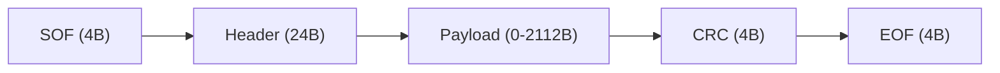
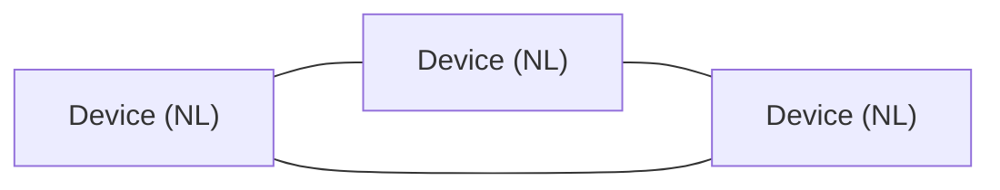
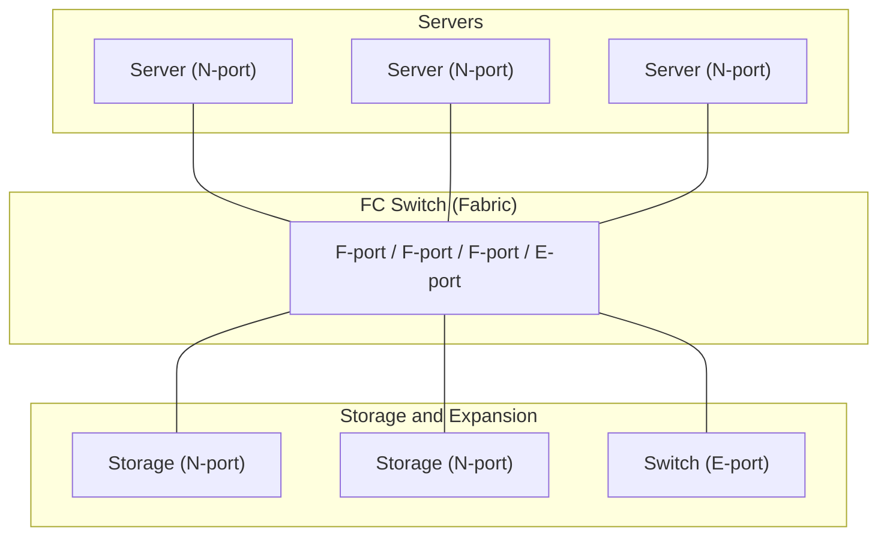
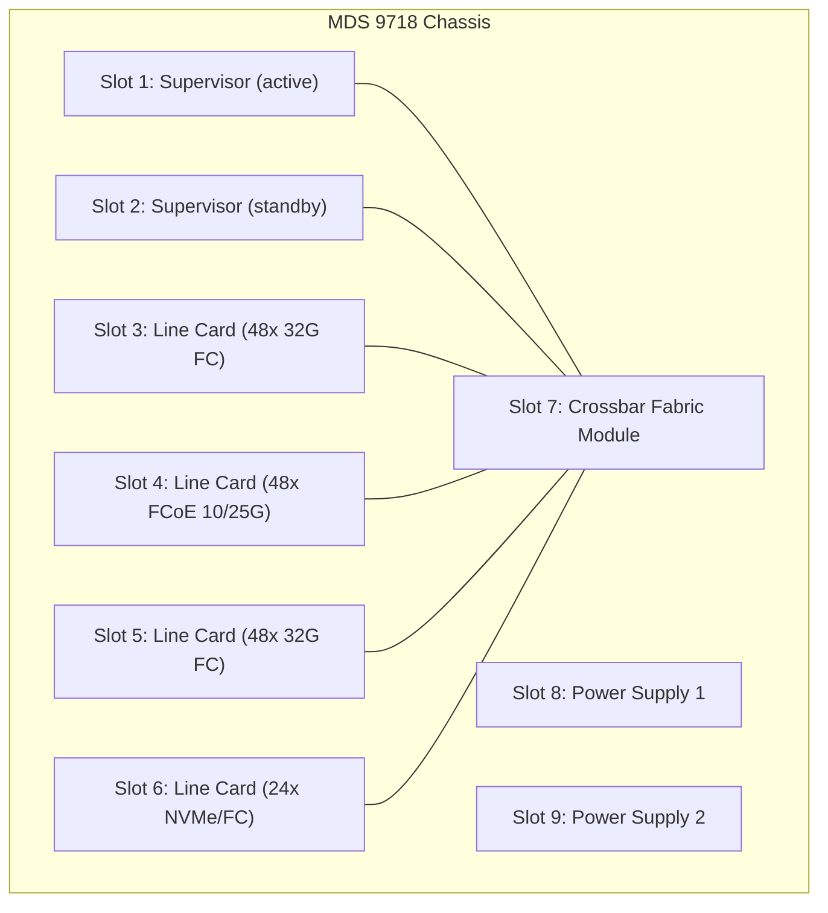
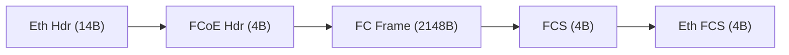
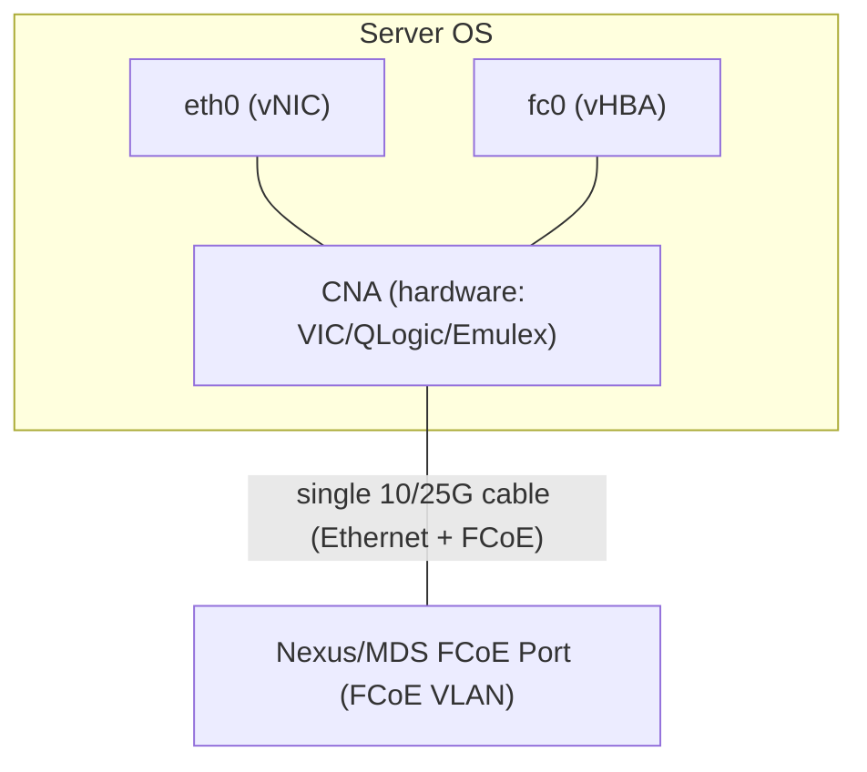
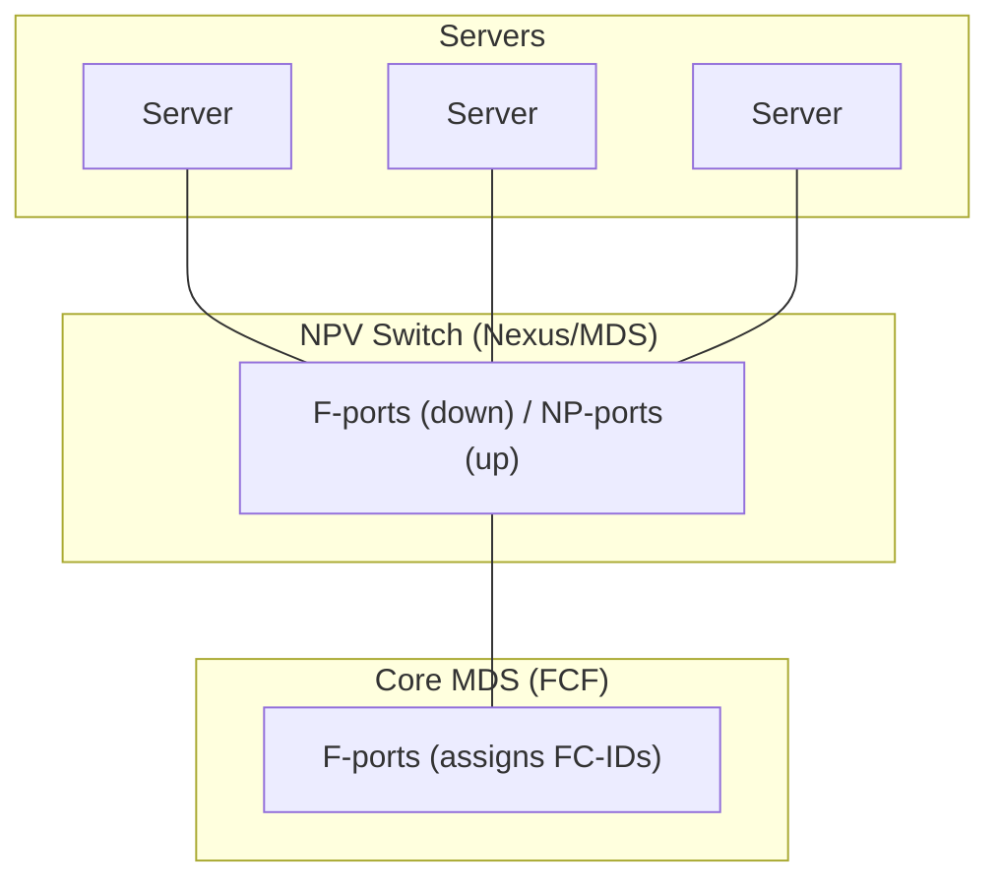
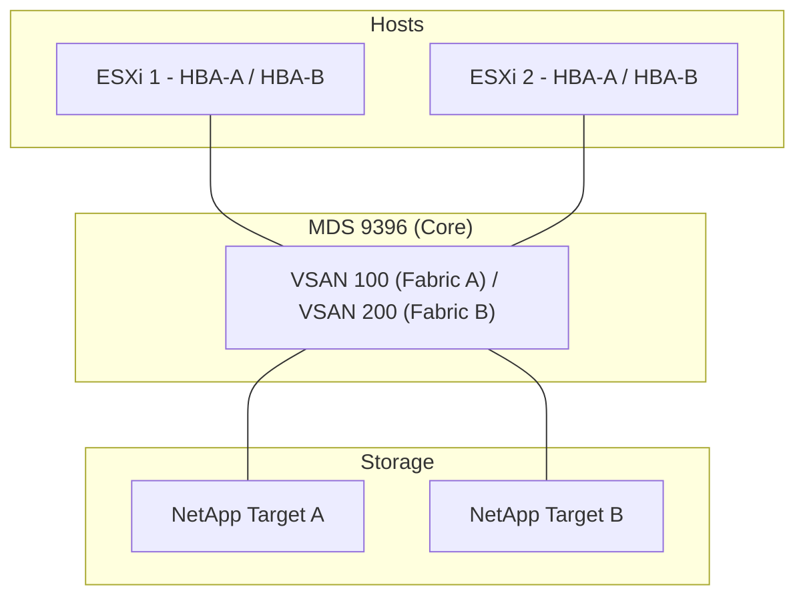
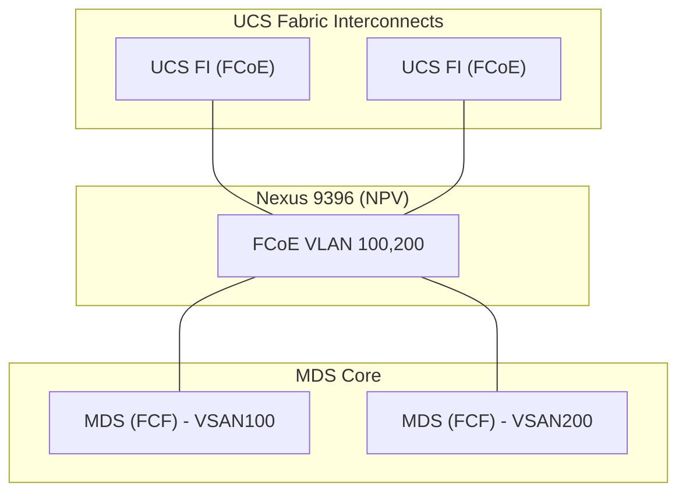

# Fibre Channel for CCIE DC v3.1

## Prerequisite Knowledge

- Basic understanding of storage concepts (LUN, RAID, block storage)
- Ethernet switching fundamentals (VLANs, trunking, port channels)
- Understanding of WWN addressing (similar to MAC but for FC)
- Familiarity with server HBA/CNA concepts
- Basic NX-OS CLI knowledge
- Understanding of lossless network requirements

---

## FC Fundamentals

### FC Addressing: FC-ID

```text
FC-ID format: Domain.Area.Port (24-bit address)
  - Domain (8 bits): Identifies the switch (1-239)
  - Area (8 bits): Identifies the port group/line card
  - Port (8 bits): Identifies the individual port

Example: 0x01.02.03
  - Domain 1, Area 2, Port 3
  - Assigned during FLOGI (Fabric Login)
  - Dynamic by default; can be statically assigned

FC-ID vs WWN:
  - FC-ID: Layer 3 address (like IP), changes on re-login
  - WWN: Layer 2 address (like MAC), permanent identifier
  - Zoning can use either (pWWN preferred for stability)
```

### World Wide Names (WWN)

```text
WWN types:
  - WWNN (World Wide Node Name): Identifies the device (node)
    Example: 20:00:00:25:B5:00:00:01
  - WWPN (World Wide Port Name): Identifies the port
    Example: 20:00:00:25:B5:00:01:01

WWN format (64-bit):
  - NAA (Network Address Authority): first nibble
    - 0x20: IEEE registered (Cisco)
    - 0x50: IEEE registered (other vendors)
    - 0x10: IEEE extended
  - OUI: next 3 bytes (vendor)
  - Vendor-specific: remaining bytes

Key rules:
  - Each HBA port has unique WWPN
  - Each HBA (node) has unique WWNN
  - Storage array: each target port has WWPN
  - Zoning by pWWN (port WWN) is best practice
```

### FC Frame Structure



Header fields:
  - R_CTL: Routing control (data, link control, extended)
  - D_ID: Destination FC-ID (24-bit)
  - S_ID: Source FC-ID (24-bit)
  - Type: FC-4 protocol (SCSI=0x08, IP=0x05, NVMe=0x28)
  - F_CTL: Frame control (sequence, exchange info)
  - SEQ_ID: Sequence identifier
  - SEQ_CNT: Sequence count
  - OX_ID: Originator exchange ID
  - RX_ID: Responder exchange ID

Max payload: 2112 bytes
Max frame: 2148 bytes (with SOF/EOF/CRC)

---

## FC Topology

### Point-to-Point


- Direct connection, no switch
- Simple, no fabric services
- Limited to 2 devices
- Legacy (rarely used in DC)

### Arbitrated Loop (FC-AL) — Legacy



- Shared bandwidth (token passing)
- Up to 126 devices per loop
- AL_PA (Arbitrated Loop Physical Address): 7-bit
- FL-port on switch connects to loop
- DEPRECATED: know for exam history only

### Switched Fabric (Modern)



- Full bandwidth per port (no sharing)
- Fabric services: name server, FSPF, zoning
- Scalable: multiple switches via E-ports (ISL)
- This is what CCIE DC focuses on

---

## FC Switching: MDS 9000

### MDS 9000 Models

#### MDS 9148

| Feature | Specification |
|---------|--------------|
| Form Factor | 1RU |
| Ports | 48x 8/16/32G FC (SFP+) |
| Throughput | 768 Gbps full duplex |
| Use Case | Top-of-rack FC access |
| Features | NPV, NPIV, FCoE (limited) |

#### MDS 9396

| Feature | Specification |
|---------|--------------|
| Form Factor | 1RU |
| Ports | 96x 8/16/32G FC (SFP+) |
| Throughput | 1.536 Tbps full duplex |
| Use Case | High-density FC access |
| Features | NPV, NPIV, FCoE, NVMe/FC |

#### MDS 9718

| Feature | Specification |
|---------|--------------|
| Form Factor | 9-slot chassis |
| Slots | 2x supervisor, 6x line cards, 1x crossbar |
| Line Cards | 48-port 32G FC, 48-port FCoE, 24-port NVMe/FC |
| Throughput | Up to 23 Tbps (with 32G modules) |
| Use Case | Core/director-class FC |
| Features | Full FCoE, NVMe/FC, FICON, encryption |

### MDS Architecture



Key components:
  - Supervisor: runs NX-OS, manages fabric services
  - Line cards: provide ports, hardware forwarding
  - Crossbar: non-blocking interconnect between line cards
  - Fabric: internal switching (no external loops)

---

## VSAN (Virtual Storage Area Network)

### VSAN Concepts

```text
VSAN = FC equivalent of VLAN
  - Logical partition of FC fabric
  - Each VSAN has own: fabric services, zoning, FSPF, domain IDs
  - Traffic isolated between VSANs
  - Default VSAN: 1 (cannot be deleted)
  - VSAN range: 1-4094

VSAN membership:
  - Port-based: assign FC port to VSAN
  - Interface-based: FCoE VLAN maps to VSAN
  - Trunk (TE-port): carries multiple VSANs between switches
```

### VSAN Configuration

```nxos
vsan database
  vsan 100 name PROD_SAN
  vsan 200 name DR_SAN

vsan 100 interface fc1/1-24
vsan 200 interface fc1/25-48

interface fc1/1
  switchport mode F
  switchport trunk mode off
  no shutdown

interface fc1/25
  switchport mode F
  switchport trunk mode off
  no shutdown
```

### VSAN Trunking (E-port and TE-port)

```text
E-port: Inter-Switch Link (ISL), carries single VSAN
TE-port: Trunk E-port, carries multiple VSANs (like Ethernet trunk)

TE-port configuration:
```

```nxos
interface fc1/48
  switchport mode TE
  switchport trunk allowed vsan 100,200
  no shutdown

interface port-channel 1
  switchport mode TE
  switchport trunk allowed vsan 100,200

interface fc1/47
  channel-group 1 mode active

interface fc1/48
  channel-group 1 mode active
```

### VSAN Database Verification

```text
mds# show vsan
  vsan 1 information
    name:default  state:active
    interoperability mode:default
    loadbalancing:src-id/dst-id
    fcid:0x010000

  vsan 100 information
    name:PROD_SAN  state:active
    interoperability mode:default
    loadbalancing:src-id/dst-id
    fcid:0x020000

mds# show vsan membership
  vsan 100 interfaces:
    fc1/1  fc1/2  fc1/3  fc1/4  fc1/5
  vsan 200 interfaces:
    fc1/25  fc1/26  fc1/27  fc1/28
```

> **CCIE Exam Tip:** VSAN 1 is the default and cannot be deleted or renamed. Always create dedicated VSANs for production. VSAN trunking (TE-port) is essential for multi-VSAN fabrics. Know that each VSAN has its own FSPF topology and zoning database.

---

## Zoning

### Hard Zoning vs Soft Zoning

```text
Hard Zoning (port-based, FC-ID based):
  - Enforcement in hardware (TCAM on MDS)
  - Frames are physically blocked if not in same zone
  - More secure (cannot be bypassed)
  - Members: pWWN or FC-ID
  - Recommended for production

Soft Zoning (name-server based):
  - Enforcement in fabric name server (FCNS)
  - Devices cannot discover targets outside their zone
  - But if device knows FC-ID, it CAN send frames (not blocked in HW)
  - Less secure
  - NOT recommended for production

CCIE exam: Always use hard zoning with pWWN members
```

### Zone Configuration

```text
Zone hierarchy:
  Zone -> Zoneset -> VSAN
  - Zone: group of members (initiators + targets)
  - Zoneset: collection of active zones
  - One active zoneset per VSAN

Best practice: Single initiator per zone
  - One HBA port (initiator) + one or more target ports
  - Prevents initiator-to-initiator communication
  - Simplifies troubleshooting
  - Required for some storage arrays
```

### Zoning Configuration on MDS

```nxos
zone name ZONE_ESXI01_HBA0 vsan 100
  member pwwn 20:00:00:25:B5:00:01:01
  member pwwn 50:0a:09:81:82:83:84:85
  member pwwn 50:0a:09:81:82:83:84:86

zone name ZONE_ESXI01_HBA1 vsan 100
  member pwwn 20:00:00:25:B5:00:01:02
  member pwwn 50:0a:09:81:82:83:84:85
  member pwwn 50:0a:09:81:82:83:84:86

zone name ZONE_ESXI02_HBA0 vsan 100
  member pwwn 20:00:00:25:B5:00:02:01
  member pwwn 50:0a:09:81:82:83:84:85
  member pwwn 50:0a:09:81:82:83:84:86

zoneset name ZONESET_PROD vsan 100
  member ZONE_ESXI01_HBA0
  member ZONE_ESXI01_HBA1
  member ZONE_ESXI02_HBA0

zoneset activate name ZONESET_PROD vsan 100
```

### Zoning Verification

```text
mds# show zoneset active vsan 100
  zoneset name ZONESET_PROD vsan 100
    zone name ZONE_ESXI01_HBA0 vsan 100
      pwwn 20:00:00:25:B5:00:01:01
      pwwn 50:0a:09:81:82:83:84:85
      pwwn 50:0a:09:81:82:83:84:86
    zone name ZONE_ESXI01_HBA1 vsan 100
      pwwn 20:00:00:25:B5:00:01:02
      pwwn 50:0a:09:81:82:83:84:85
      pwwn 50:0a:09:81:82:83:84:86

mds# show zone name ZONE_ESXI01_HBA0 vsan 100
  zone name ZONE_ESXI01_HBA0 vsan 100
    pwwn 20:00:00:25:B5:00:01:01 [esxi01-hba0]
    pwwn 50:0a:09:81:82:83:84:85 [netapp-target-0a]
    pwwn 50:0a:09:81:82:83:84:86 [netapp-target-0b]
```

> **Lab Exam Warning:** Forgetting to activate the zoneset is the #1 zoning mistake. After configuring zones, you MUST run `zoneset activate name <name> vsan <id>`. Also, zone changes require activation to take effect — modifying a zone without re-activating does nothing.

---

## FC Services

### FSPF (Fabric Shortest Path First)

```text
FSPF:
  - Link-state routing protocol for FC (like OSPF for IP)
  - Builds topology database per VSAN
  - Calculates shortest path between switches
  - Uses domain IDs to identify switches
  - Hello interval: 20 seconds, Dead interval: 80 seconds
  - Runs per VSAN (each VSAN has own FSPF instance)

Verification:
  mds# show fspf vsan 100
  mds# show fspf database vsan 100
  mds# show fspf topology vsan 100
```

### FCNS (Fabric Controller Name Server)

```text
FCNS (Name Server):
  - Database of all logged-in devices in a VSAN
  - Maps: WWPN -> FC-ID, port type, FC-4 protocol
  - Devices register during PLOGI
  - Initiators query name server to discover targets
  - Zoning filters what name server returns (soft zoning)

Verification:
  mds# show fcns database vsan 100
  FCNS Database:
    VSAN 100:
      FC-ID       Type  pWWN                    FC4-Type
      0x020101    N     20:00:00:25:B5:00:01:01 scsi-fcp (initiator)
      0x020201    N     50:0a:09:81:82:83:84:85 scsi-fcp (target)
      0x020202    N     50:0a:09:81:82:83:84:86 scsi-fcp (target)
```

### Fabric Login Process

```text
FC Login sequence:
  1. FLOGI (Fabric Login):
     - N-port -> F-port (switch)
     - N-port requests FC-ID assignment
     - Switch assigns FC-ID from domain.area.port
     - N-port registers with name server

  2. PLOGI (Port Login):
     - N-port -> N-port (device to device)
     - Establishes session between initiator and target
     - Exchanges service parameters (buffer credits, max frame)
     - Initiator discovers target via name server first

  3. PRLI (Process Login):
     - N-port -> N-port (FC-4 level)
     - Establishes FC-4 protocol session (SCSI, NVMe, IP)
     - For SCSI: establishes SCSI initiator/target relationship
     - For NVMe: establishes NVMe queue pair

  4. SCSI Discovery (after PRLI):
     - Initiator sends REPORT LUNS to target
     - Target returns list of available LUNs
     - Initiator sends INQUIRY to each LUN
     - OS sees storage devices

Verification:
  mds# show flogi database vsan 100
  mds# show plogi database vsan 100
  mds# show fcns database vsan 100
```

---

## FC Port Types

```text
+----------+--------------------------------------------------+
| Port Type| Description                                      |
+----------+--------------------------------------------------+
| N-port   | Node port (end device: server HBA, storage)      |
| F-port   | Fabric port (switch port connecting to N-port)   |
| E-port   | Expansion port (ISL between switches, 1 VSAN)   |
| TE-port  | Trunking E-port (ISL carrying multiple VSANs)    |
| FL-port  | Fabric Loop port (switch to FC-AL loop)         |
| NL-port  | Node Loop port (device on FC-AL loop)           |
| NP-port  | N-Port Virtualization (switch acts as N-port)   |
| SD-port  | Service Discovery port (analyzer/monitoring)    |
+----------+--------------------------------------------------+

Common configurations:
  - Server HBA (N-port) -> Switch (F-port): standard access
  - Switch (E-port) <-> Switch (E-port): ISL
  - Switch (TE-port) <-> Switch (TE-port): trunked ISL
  - Switch (NP-port) -> Core Switch (F-port): NPV mode
```

---

## FCoE (Fibre Channel over Ethernet)

### FCoE Architecture



  - EtherType: 0x8906 (FCoE data)
  - FCoE VLAN: dedicated VLAN for FCoE traffic
  - FC frame is UNCHANGED inside FCoE (transparent)
  - Requires lossless Ethernet (DCB/PFC)

### FCoE VLAN Requirements

```text
FCoE VLAN:
  - Dedicated VLAN per VSAN (1:1 mapping)
  - Must NOT carry any other traffic
  - Must be in same broadcast domain end-to-end
  - PFC (Priority Flow Control) enabled on FCoE VLAN/class
  - MTU: minimum 2158 (FC max frame 2112 + FCoE header 46)
  - Recommended MTU: 9000 (jumbo frames)

Mapping:
  VSAN 100 <-> FCoE VLAN 100
  VSAN 200 <-> FCoE VLAN 200
```

### CNA (Converged Network Adapter)

CNA = NIC + HBA in one adapter
  - Presents both Ethernet (vNIC) and FC (vHBA) to OS
  - Single cable for LAN + SAN traffic
  - Examples: Cisco VIC 1495, QLogic QLE8262, Emulex OCe14102
  - On UCS: VIC presents vNICs and vHBAs via Service Profile



### FCoE on Nexus 9000

```text
Nexus 9000 FCoE capabilities:
  - FCoE NPV: Nexus acts as FCoE NPV switch (upstream to MDS)
  - FCoE trunking: carry multiple FCoE VLANs/VSANs
  - FCoE initiation: Nexus can be FCoE target (limited)
  - Requires: FCoE license, DCB configuration

FCoE NPV on Nexus 9000:
```

```nxos
feature fcoe

fcoe vlan 100
  fcoe vsan 100

vsan database
  vsan 100

interface Ethernet1/1
  switchport mode trunk
  switchport trunk allowed vlan 100
  mtu 9216
  priority-flow-control mode on
  priority-flow-control priority 3 no-drop
  no shutdown

interface Ethernet1/1.100
  encapsulation dot1q 100
  fcoe vsan 100

interface vfc100
  bind interface Ethernet1/1.100
  switchport mode NP
  switchport trunk allowed vsan 100
  no shutdown

npv flogi database
```

### DCB Requirements

```text
DCB (Data Center Bridging) = lossless Ethernet for FCoE
  Components:
  1. PFC (Priority Flow Control, 802.1Qbb):
     - Per-priority pause (8 priorities, 0-7)
     - FCoE typically uses priority 3 (or 4)
     - Prevents frame drops for FCoE traffic
     - Must be enabled end-to-end (CNA -> Nexus -> MDS)

  2. ETS (Enhanced Transmission Selection, 802.1Qaz):
     - Bandwidth allocation per priority group
     - Ensures FCoE gets guaranteed bandwidth
     - Example: FCoE priority 3 gets 50%, LAN gets 50%

  3. DCBX (DCB Exchange, 802.1Qaz):
     - LLDP-based negotiation of PFC/ETS parameters
     - Auto-configures PFC/ETS between switches
     - Must match on both ends (or manual config)

  4. QCN (Quantized Congestion Notification, 802.1Qau):
     - End-to-end congestion management
     - Rarely deployed (PFC sufficient for most)
```

```nxos
policy-map type network-qos FCOE_NQ
  class type network-qos c-8q-nq-fcoe
    pause pfc-cos 3
    mtu 9216

policy-map type qos FCOE_QOS
  class type qos c-8q-fcoe
    set cos 3

system qos
  service-policy type network-qos FCOE_NQ
  service-policy type qos FCOE_QOS
```

### FIP (FCoE Initialization Protocol)

```text
FIP: FCoE discovery and login protocol
  - EtherType: 0x8914
  - Functions:
    1. FCF Discovery: CNA finds FCoE Forwarder (switch)
    2. FLOGI: CNA performs FC login over Ethernet
    3. Keep-alive: maintains FCoE session
    4. VLAN discovery: CNA discovers FCoE VLAN

FIP process:
  1. CNA sends FIP VLAN Discovery (broadcast)
  2. Switch responds with FCoE VLAN ID
  3. CNA sends FIP FCF Discovery Solicitation
  4. Switch responds with FCF Advertisement (FCF-MAC, priority)
  5. CNA selects FCF (highest priority)
  6. CNA sends FIP FLOGI (with WWPN)
  7. Switch assigns FC-ID, responds with FIP FLOGI Accept
  8. FC traffic flows (encapsulated in FCoE)

FIP Snooping (on non-FCoE switches):
  - Prevents rogue FCF advertisements
  - Only allows FIP from authorized FCoE switches
  - Configured on intermediate L2 switches
```

### FCoE on MDS (FCoE Line Cards)

```text
MDS 9718 FCoE line card:
  - 48-port 10/25G FCoE (SFP28)
  - Acts as FCF (FCoE Forwarder)
  - Terminates FCoE, switches native FC internally
  - Connects to Ethernet fabric (Nexus) via FCoE trunk

MDS FCoE configuration:
```

```nxos
feature fcoe

fcoe vlan 100
  fcoe vsan 100

vsan database
  vsan 100

interface Ethernet1/1
  switchport mode trunk
  switchport trunk allowed vlan 100
  mtu 9216
  priority-flow-control mode on
  priority-flow-control priority 3 no-drop
  no shutdown

interface vfc100
  bind interface Ethernet1/1
  switchport mode F
  switchport trunk allowed vsan 100
  no shutdown
```

---

## NPV/NPIV

### NPIV (N-Port ID Virtualization)

```text
NPIV:
  - Multiple FC-IDs (WWPNs) over single physical N-port
  - Allows multiple VMs to have unique WWPNs on one HBA
  - Switch sees each VM as separate N-port (separate FLOGI)
  - Required for: VM SAN boot, per-VM zoning
  - Supported on: MDS F-ports, Nexus FCoE ports

NPIV operation:
  Physical HBA (1 port) -> Switch F-port
    - VM1 WWPN: 20:00:00:25:B5:00:01:01 (FC-ID: 0x02.01.01)
    - VM2 WWPN: 20:00:00:25:B5:00:01:02 (FC-ID: 0x02.01.02)
    - VM3 WWPN: 20:00:00:25:B5:00:01:03 (FC-ID: 0x02.01.03)
  All share 1 physical cable, but have separate FC identities
```

### NPV (N-Port Virtualization)

NPV:
  - Switch operates as NPV proxy (not a full FC switch)
  - NPV switch does NOT run FSPF, does NOT have domain ID
  - Downstream: F-ports (connect to servers)
  - Uplink: NP-ports (connect to core switch as N-ports)
  - Core switch assigns FC-IDs to all devices (NPV is transparent)
  - Reduces domain ID consumption (limited to 239 per fabric)



NPV advantages:
  - No domain ID consumed by NPV switch
  - Simplified management (no FSPF, no zoning on NPV)
  - Zoning done on core switch only
  - Scales fabric beyond 239 domains

### NPV Configuration

```nxos
feature npiv

npv enabled

interface fc1/1
  switchport mode F
  no shutdown

interface fc1/2
  switchport mode F
  no shutdown

interface fc1/48
  switchport mode NP
  switchport trunk allowed vsan 100
  no shutdown

npv flogi database
```

```text
Verification:
  mds# show npv flogi-table
  NPV FLOGI Table:
    Interface   FC-ID     WWPN                    VSAN  Status
    fc1/1       0x020101  20:00:00:25:B5:00:01:01 100   Online
    fc1/2       0x020102  20:00:00:25:B5:00:02:01 100   Online

  mds# show npv traffic-map
  mds# show npv internal interface brief
```

> **CCIE Exam Tip:** NPV vs NPIV is a common exam topic. NPV = switch-level (switch proxies logins upstream). NPIV = port-level (multiple logins on one physical port). They work together: NPV switch uses NPIV on its NP-port uplinks to carry multiple server logins to the core.

---

## FC Troubleshooting

### FLOGI Database Issues

```text
Symptom: Server HBA not logging in

Troubleshooting steps:
  1. Physical: check SFP, cable, light levels
     mds# show interface fc1/1
     mds# show interface fc1/1 transceiver

  2. Port status: is F-port up?
     mds# show interface fc1/1 brief
     (Look for: "up", "F", "online")

  3. FLOGI: did server attempt login?
     mds# show flogi database vsan 100
     (If empty: server not sending FLOGI)

  4. VSAN membership: is port in correct VSAN?
     mds# show vsan membership

  5. Zoning: is server WWPN in active zoneset?
     mds# show zoneset active vsan 100

  6. Name server: is device registered?
     mds# show fcns database vsan 100

Common causes:
  - Wrong VSAN on port
  - Zoning blocks FLOGI (rare, FLOGI not zoned)
  - Speed mismatch (auto-negotiate failure)
  - SFP incompatible
  - Server HBA not configured (BIOS/driver)
```

### FCNS Database Issues

```text
Symptom: Server logged in but cannot see storage

Troubleshooting:
  1. FLOGI successful?
     mds# show flogi database vsan 100

  2. Storage target logged in?
     mds# show flogi database vsan 100
     (Look for storage WWPN with "target" type)

  3. Both in same VSAN?
     mds# show vsan membership

  4. Zoning correct?
     mds# show zoneset active vsan 100
     (Server WWPN and storage WWPN in same zone?)

  5. Name server shows both?
     mds# show fcns database vsan 100

  6. PLOGI successful?
     mds# show plogi database vsan 100

Common causes:
  - Zoning misconfiguration (most common)
  - Storage target not logged in (array issue)
  - VSAN mismatch between server and storage ports
  - Zoneset not activated
```

### Port-Channel Issues (FC)

```text
Symptom: FC port-channel not forming

Troubleshooting:
  mds# show port-channel summary
  mds# show port-channel database
  mds# show interface port-channel 1

Common causes:
  - Speed mismatch between members
  - VSAN mismatch between members
  - Trunk mode mismatch (one TE, one E)
  - Allowed VSAN list mismatch
  - Physical: one member down
  - Domain ID conflict (E-port)

Resolution:
  - Ensure all members: same speed, same VSAN config, same trunk mode
  - Check: show interface fc1/47 capabilities
```

---

## Verification Commands

```text
MDS 9000:
  show vsan
  show vsan membership
  show zoneset active vsan <id>
  show zone name <name> vsan <id>
  show flogi database vsan <id>
  show fcns database vsan <id>
  show plogi database vsan <id>
  show fspf vsan <id>
  show fspf topology vsan <id>
  show interface fc1/1
  show interface fc1/1 transceiver
  show port-channel summary
  show npv flogi-table
  show npv traffic-map
  show system redundancy
  show logging last 50

Nexus 9000 (FCoE):
  show fcoe vlan
  show fcoe database
  show interface vfc100
  show flogi database
  show fcns database
  show priority-flow-control interface Ethernet1/1
  show dcbx interface Ethernet1/1
```

---

## Lab 1: VSAN and Zoning on MDS 9396

### Objective
Configure VSANs, zoning, and verify end-to-end FC connectivity.

### Topology



### Configuration

```nxos
vsan database
  vsan 100 name FABRIC_A
  vsan 200 name FABRIC_B

vsan 100 interface fc1/1-4
vsan 200 interface fc1/5-8

interface fc1/1
  switchport mode F
  switchport speed auto
  no shutdown

interface fc1/2
  switchport mode F
  switchport speed auto
  no shutdown

interface fc1/5
  switchport mode F
  switchport speed auto
  no shutdown

interface fc1/6
  switchport mode F
  switchport speed auto
  no shutdown

zone name ZONE_ESXI1_A vsan 100
  member pwwn 20:00:00:25:B5:00:01:01
  member pwwn 50:0a:09:81:82:83:84:01
  member pwwn 50:0a:09:81:82:83:84:02

zone name ZONE_ESXI2_A vsan 100
  member pwwn 20:00:00:25:B5:00:02:01
  member pwwn 50:0a:09:81:82:83:84:01
  member pwwn 50:0a:09:81:82:83:84:02

zone name ZONE_ESXI1_B vsan 200
  member pwwn 20:00:00:25:B5:00:01:02
  member pwwn 50:0a:09:81:82:83:84:03
  member pwwn 50:0a:09:81:82:83:84:04

zone name ZONE_ESXI2_B vsan 200
  member pwwn 20:00:00:25:B5:00:02:02
  member pwwn 50:0a:09:81:82:83:84:03
  member pwwn 50:0a:09:81:82:83:84:04

zoneset name ZONESET_A vsan 100
  member ZONE_ESXI1_A
  member ZONE_ESXI2_A

zoneset name ZONESET_B vsan 200
  member ZONE_ESXI1_B
  member ZONE_ESXI2_B

zoneset activate name ZONESET_A vsan 100
zoneset activate name ZONESET_B vsan 200
```

### Verification

```text
mds# show flogi database vsan 100
  INTERFACE   VSAN  FC-ID       PORT WWN                  STATE
  fc1/1       100   0x020101    20:00:00:25:B5:00:01:01   online
  fc1/3       100   0x020201    50:0a:09:81:82:83:84:01   online
  fc1/4       100   0x020202    50:0a:09:81:82:83:84:02   online

mds# show fcns database vsan 100
  VSAN 100:
    FC-ID     TYPE  pWWN                    FC4-TYPE    ROLE
    0x020101  N     20:00:00:25:B5:00:01:01 scsi-fcp   initiator
    0x020201  N     50:0a:09:81:82:83:84:01 scsi-fcp   target
    0x020202  N     50:0a:09:81:82:83:84:02 scsi-fcp   target

mds# show zoneset active vsan 100
  zoneset name ZONESET_A vsan 100
    zone name ZONE_ESXI1_A vsan 100
      pwwn 20:00:00:25:B5:00:01:01
      pwwn 50:0a:09:81:82:83:84:01
      pwwn 50:0a:09:81:82:83:84:02
    zone name ZONE_ESXI2_A vsan 100
      pwwn 20:00:00:25:B5:00:02:01
      pwwn 50:0a:09:81:82:83:84:01
      pwwn 50:0a:09:81:82:83:84:02
```

---

## Lab 2: FCoE on Nexus 9000 with NPV

### Objective
Configure FCoE NPV on Nexus 9000, connect to upstream MDS, and verify FCoE login.

### Topology



### Nexus 9000 Configuration

```nxos
feature fcoe
feature npiv

fcoe vlan 100
  fcoe vsan 100

fcoe vlan 200
  fcoe vsan 200

vsan database
  vsan 100
  vsan 200

policy-map type network-qos FCOE_NQ
  class type network-qos c-8q-nq-fcoe
    pause pfc-cos 3
    mtu 9216

system qos
  service-policy type network-qos FCOE_NQ

interface Ethernet1/1
  description TO_UCS_FI_A
  switchport mode trunk
  switchport trunk allowed vlan 100
  mtu 9216
  priority-flow-control mode on
  priority-flow-control priority 3 no-drop
  no shutdown

interface Ethernet1/2
  description TO_UCS_FI_B
  switchport mode trunk
  switchport trunk allowed vlan 200
  mtu 9216
  priority-flow-control mode on
  priority-flow-control priority 3 no-drop
  no shutdown

interface Ethernet1/49
  description TO_MDS_CORE_A
  switchport mode trunk
  switchport trunk allowed vlan 100
  mtu 9216
  priority-flow-control mode on
  priority-flow-control priority 3 no-drop
  no shutdown

interface Ethernet1/50
  description TO_MDS_CORE_B
  switchport mode trunk
  switchport trunk allowed vlan 200
  mtu 9216
  priority-flow-control mode on
  priority-flow-control priority 3 no-drop
  no shutdown

interface vfc100
  bind interface Ethernet1/1
  switchport mode NP
  switchport trunk allowed vsan 100
  no shutdown

interface vfc101
  bind interface Ethernet1/2
  switchport mode NP
  switchport trunk allowed vsan 200
  no shutdown

interface vfc200
  bind interface Ethernet1/49
  switchport mode NP
  switchport trunk allowed vsan 100
  no shutdown

interface vfc201
  bind interface Ethernet1/50
  switchport mode NP
  switchport trunk allowed vsan 200
  no shutdown

npv enabled
```

### Verification

```text
nexus# show fcoe vlan
  FCoE VLAN: 100, VSAN: 100, State: active
  FCoE VLAN: 200, VSAN: 200, State: active

nexus# show interface vfc100
  vfc100 is up
    Bound interface: Ethernet1/1
    Mode: NP
    VSAN: 100
    FCoE VLAN: 100

nexus# show npv flogi-table
  NPV FLOGI Table:
    VFC    Interface  FC-ID     WWPN                    VSAN  Status
    vfc100 Eth1/1     0x020101  20:00:00:25:B5:00:01:01 100   Online
    vfc101 Eth1/2     0x030101  20:00:00:25:B5:00:01:02 200   Online

nexus# show priority-flow-control interface Ethernet1/1
  PFC enabled: priority 3
  PFC operational: yes
  RX pause frames (pri 3): 0
  TX pause frames (pri 3): 0

nexus# show flogi database
  INTERFACE   VSAN  FC-ID       PORT WWN                  STATE
  vfc100      100   0x020101    20:00:00:25:B5:00:01:01   online
  vfc101      200   0x030101    20:00:00:25:B5:00:01:02   online
```

> **Lab Exam Warning:** FCoE troubleshooting checklist: (1) PFC enabled on ALL hops? (2) FCoE VLAN matches VSAN mapping? (3) MTU >= 2158 end-to-end? (4) VFC interface bound and up? (5) NPV enabled? (6) Upstream MDS port in correct VSAN? Most FCoE failures are PFC or VLAN mismatch.

---

## Fabric Merge and Zone Merge

### Fabric Merge (E-port ISL Formation)

```text
Fabric merge occurs when two FC switches connect via E-port:
  1. E-port initialization: switches exchange ELP (Exchange Link Parameters)
  2. Domain ID negotiation: each switch must have unique domain ID
  3. FSPF adjacency: switches exchange FSPF hellos
  4. Topology sync: FSPF databases merged (link-state)
  5. Name server merge: FCNS databases combined
  6. Zone merge: zonesets compared and merged (if compatible)

Domain ID conflict:
  - If both switches have same domain ID: merge FAILS
  - E-port stays in "isolated" state
  - Resolution: change domain ID on one switch
    mds# configure terminal
    mds(config)# fcdomain domain 5 vsan 100
    mds(config)# no shutdown

Verification:
  mds# show fcdomain
  mds# show fspf vsan 100
  mds# show interface fc1/48 (E-port status)
```

### Zone Merge

```text
Zone merge behavior when fabrics join:
  - If both switches have zonesets for same VSAN:
    - Zones with same name + same members: merged (OK)
    - Zones with same name + different members: CONFLICT
    - Zones with different names: both kept (union)
  - Active zoneset: merged (union of all zones)
  - If conflict: zone merge fails, E-port isolated

Zone merge conflict resolution:
  1. Identify conflict: show zone name <name> vsan <id>
  2. Options:
     a. Rename one zone (make names unique)
     b. Make members identical (match both switches)
     c. Use "zone merge" command to force
  3. Re-activate zoneset after resolution

Preventing zone merge issues:
  - Use consistent zone naming across fabric
  - Configure zones on ONE switch, let merge propagate
  - Or: use "zoneset distribute full vsan <id>" to push to all
```

```nxos
zoneset distribute full vsan 100
```

### VSAN Isolation

```text
VSAN isolation:
  - Each VSAN is completely independent
  - Separate: FSPF topology, zoning, FCNS, domain IDs
  - Traffic in VSAN 100 CANNOT reach VSAN 200
  - E-port/TE-port: only carries allowed VSANs
  - Isolation enforced at hardware level (TCAM)

VSAN isolation verification:
  mds# show vsan 100
  mds# show fspf vsan 100
  mds# show zoneset active vsan 100
  mds# show fcns database vsan 100

  (Repeat for VSAN 200 - completely separate databases)

VSAN trunk isolation:
  interface fc1/48
    switchport mode TE
    switchport trunk allowed vsan 100,200
    (Only VSANs 100 and 200 cross this ISL)
    (VSAN 300 traffic blocked even if configured locally)
```

> **CCIE Exam Tip:** Fabric merge failures are a common exam scenario. If an E-port shows "isolated": (1) Check domain ID conflict (`show fcdomain`), (2) Check zone merge conflict (`show zone`), (3) Check VSAN mismatch on trunk, (4) Check speed mismatch. Domain ID conflict is the #1 cause.

---

## FIP Snooping Configuration

### FIP Snooping on Intermediate Switches

```text
FIP Snooping:
  - Deployed on L2 switches between CNA and FCoE switch (FCF)
  - Prevents rogue FCF advertisements
  - Only allows FIP from authorized FCoE switches
  - Blocks FIP FCF Discovery from unauthorized sources
  - Prevents CNA from logging into wrong/rogue FCF

When needed:
  - CNA connects to non-FCoE L2 switch
  - L2 switch connects to FCoE switch (FCF)
  - Without FIP snooping: any device could advertise as FCF
  - With FIP snooping: only designated FCF ports allowed
```

```nxos
feature fip-snooping

vlan 100
  fip-snooping

interface Ethernet1/1
  description TO_CNA_SERVER
  switchport mode trunk
  switchport trunk allowed vlan 100
  fip-snooping port-mode host

interface Ethernet1/49
  description TO_FCF_MDS
  switchport mode trunk
  switchport trunk allowed vlan 100
  fip-snooping port-mode fcf
```

```text
Verification:
  nexus# show fip-snooping database
    VLAN 100:
      FCF: Ethernet1/49 (MAC: 00:0d:ec:01:02:03)
      Hosts: Ethernet1/1 (CNA WWPN: 20:00:00:25:B5:00:01:01)

  nexus# show fip-snooping statistics
    FIP Discovery received: 15
    FIP Discovery forwarded: 15 (to FCF port only)
    FIP Discovery dropped: 0
    FIP FLOGI received: 3
    FIP FLOGI forwarded: 3
```

> **Lab Exam Warning:** FIP snooping misconfiguration is a common FCoE troubleshooting item. If CNA cannot FLOGI: (1) Is FIP snooping enabled on intermediate switch? (2) Is the FCF port correctly identified (`port-mode fcf`)? (3) Is the host port correctly identified (`port-mode host`)? (4) Is the FCoE VLAN allowed on trunk? Wrong port-mode = FIP blocked.

---

## Common Exam Scenarios

### Scenario 1: Zone Not Activated After Change

```text
Ticket: "Added new server to zone but storage not visible"

Diagnosis:
  mds# show zoneset active vsan 100
  -> Shows OLD zoneset (without new server)

  mds# show zone name ZONE_NEW_SERVER vsan 100
  -> Zone exists with correct members

Root cause: Zoneset modified but NOT re-activated

Fix:
  mds# configure terminal
  mds(config)# zoneset activate name ZONESET_PROD vsan 100
  mds(config)# end

Verification:
  mds# show zoneset active vsan 100
  -> ZONE_NEW_SERVER now present
  mds# show fcns database vsan 100
  -> New server visible to storage
```

### Scenario 2: FCoE VLAN Mismatch

```text
Ticket: "UCS FI FCoE uplink shows no FLOGI"

Diagnosis:
  nexus# show fcoe vlan
  -> FCoE VLAN: 100, VSAN: 100, State: active

  nexus# show interface Ethernet1/1 switchport
  -> Trunk allowed VLANs: 100,200,300

  UCS FI: show vsan
  -> VSAN 100, FCoE VLAN: 101 (MISMATCH!)

Root cause: UCS FI configured FCoE VLAN 101, Nexus expects 100

Fix:
  1. On UCS FI: change FCoE VLAN to 100 for VSAN 100
  2. Or: on Nexus: change FCoE VLAN mapping to 101
  3. Both sides MUST match

Verification:
  nexus# show flogi database
  -> UCS FI WWPNs now online
```

### Scenario 3: NPV FLOGI Not Forwarding

```text
Ticket: "Servers behind NPV switch cannot log into core MDS"

Diagnosis:
  npv-switch# show npv flogi-table
  -> Empty (no FLOGIs)

  npv-switch# show interface vfc100
  -> vfc100: down (PROBLEM)

  npv-switch# show interface Ethernet1/49
  -> Eth1/49: up, trunk, VLAN 100 allowed

  npv-switch# show interface vfc100 detail
  -> "Bound interface: Ethernet1/49, State: down"
  -> "Reason: VSAN not allowed on NP uplink"

Root cause: VFC interface trunk allowed VSAN mismatch

Fix:
  npv-switch(config)# interface vfc100
  npv-switch(config-if)# switchport trunk allowed vsan 100
  npv-switch(config-if)# no shutdown

Verification:
  npv-switch# show npv flogi-table
  -> Server WWPNs now online with FC-IDs from core
```

---

## Cross-References

- For PFC/QoS configuration details required by FCoE, see `01-network/qos-security.md`
- For UCS FCoE integration (VIC, vHBA, VSAN), see `02-compute/ucs.md`
- For NVMe/FC on MDS, see `03-storage/nvme-iscsi.md`

---

## Key Takeaways

1. **FC-ID**: Domain.Area.Port — assigned during FLOGI, dynamic by default
2. **WWN**: Permanent identifier; zone by pWWN (not FC-ID) for stability
3. **VSAN**: FC VLAN equivalent; each has own FSPF, zoning, name server
4. **Zoning**: Hard zoning (TCAM enforcement) with single-initiator-per-zone best practice
5. **FCoE**: FC frames in Ethernet; requires DCB (PFC, ETS, DCBX); dedicated VLAN per VSAN
6. **FIP**: Discovery and login protocol for FCoE; FCF selection, VLAN discovery
7. **NPV/NPIV**: NPV = switch proxy (saves domain IDs); NPIV = multiple logins per port
8. **Troubleshooting order**: Physical -> FLOGI -> VSAN -> Zoning -> FCNS -> PLOGI -> LUN
9. **Fabric merge**: Domain ID must be unique; zone merge conflicts isolate E-ports
10. **FIP snooping**: Protects against rogue FCF; port-mode host/fcf must be correct
