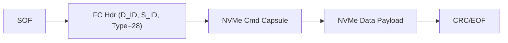
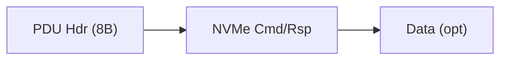
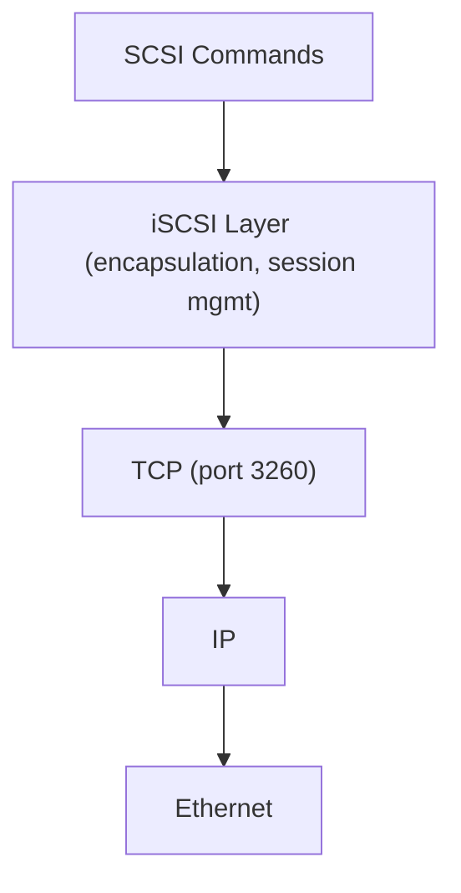
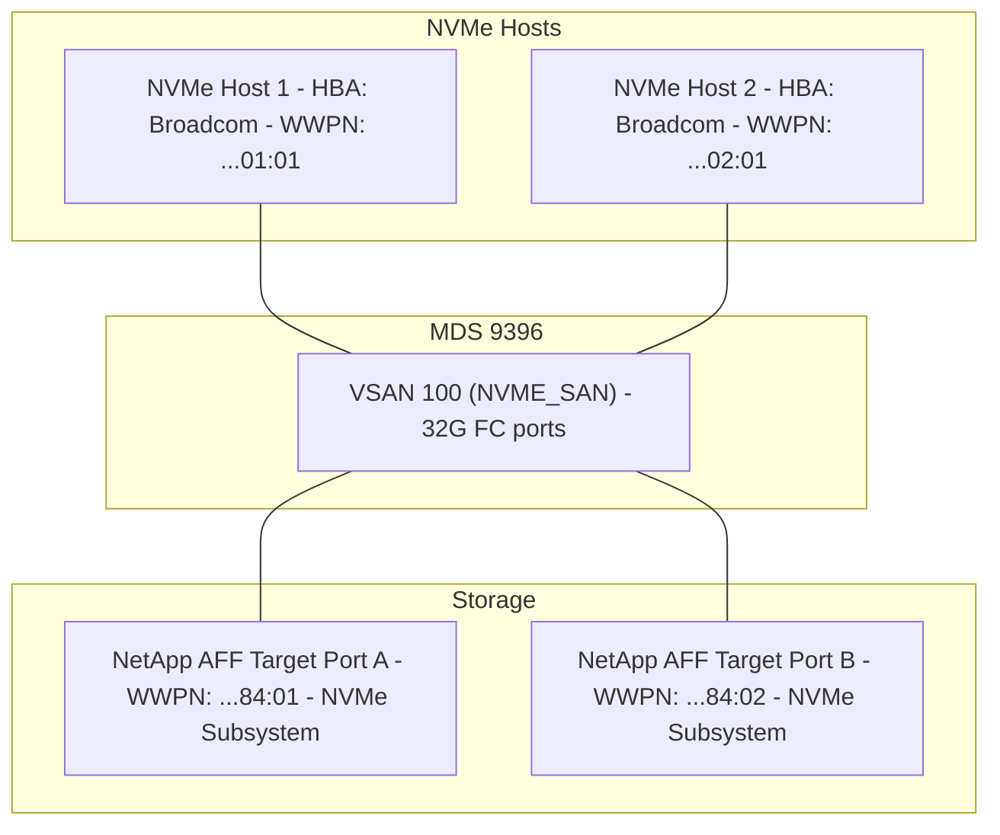
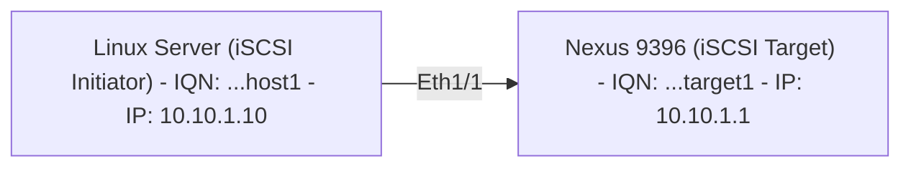

# NVMe-oF and iSCSI for CCIE DC v3.1

## Prerequisite Knowledge

- Fibre Channel fundamentals (WWN, zoning, VSAN, FLOGI)
- Understanding of block storage concepts (LUN, target, initiator)
- Basic TCP/IP networking (for iSCSI and NVMe/TCP)
- Understanding of RDMA concepts (RoCE, lossless Ethernet)
- MDS 9000 and Nexus 9000 platform knowledge
- Familiarity with storage array concepts (NetApp, Pure, Dell EMC)

---

## NVMe Fundamentals

### NVMe vs SCSI

```text
SCSI (traditional):
  - Single command queue (depth 32-256)
  - Designed for spinning disks (HDD)
  - High latency path: HBA -> FC fabric -> target -> LUN
  - Protocol overhead: SCSI CDB (Command Descriptor Block)
  - Transport: FC, SAS, iSCSI

NVMe (Non-Volatile Memory Express):
  - Up to 65,535 queues, each with 65,536 commands
  - Designed for flash/SSD (low latency media)
  - Minimal protocol overhead (register-based, memory-mapped)
  - Parallel I/O: multiple queues = multiple CPU cores
  - Transport: PCIe (local), FC, TCP, RDMA (fabric)

Performance comparison:
  +------------------+----------+----------+
  | Metric           | SCSI/FC  | NVMe/FC  |
  +------------------+----------+----------+
  | Queue depth      | 256      | 64K      |
  | Queues           | 1        | 64K      |
  | Latency          | ~100us   | ~10us    |
  | IOPS (per device)| ~500K    | ~10M     |
  | CPU overhead     | High     | Low      |
  +------------------+----------+----------+
```

### NVMe Architecture

```text
NVMe components:
  - Controller: NVMe endpoint (like SCSI target)
  - Namespace: logical block device (like LUN)
  - Queue Pair: Submission Queue (SQ) + Completion Queue (CQ)
  - Admin Queue: management commands (create namespace, etc.)
  - I/O Queues: data commands (read, write, flush)

NVMe addressing:
  - NQN (NVMe Qualified Name): unique identifier
    Format: nqn.2014-08.org.nvmexpress:uuid:<UUID>
    Or: nqn.2014-08.com.vendor:serial:<SN>
  - Host NQN: identifies the initiator (host)
  - Subsystem NQN: identifies the target (storage)
  - Namespace ID: identifies the LUN (1, 2, 3...)

NVMe over Fabrics additions:
  - Discovery Controller: host discovers available subsystems
  - Discovery Log: list of available targets (like FC name server)
  - Connect command: establishes queue pair over fabric
  - Keep-alive: maintains connection
```

### NVMe Namespaces

```text
Namespace = NVMe equivalent of LUN
  - Each namespace has: NSID, size, block size, NGUID/EUI-64
  - Multiple namespaces per subsystem (like multiple LUNs per target)
  - Namespace can be shared (multiple hosts) or private
  - Zoning/LUN masking equivalent: NVMe subsystem access control

NVMe namespace identification:
  - NGUID (Namespace Globally Unique Identifier): 128-bit
  - EUI-64: 64-bit (IEEE format)
  - Used for: multipathing identification, persistent reservations
```

---

## NVMe-oF Transports

### NVMe/FC (Fibre Channel Transport)

NVMe/FC:
  - NVMe commands encapsulated in FC frames
  - FC-4 type: 0x28 (NVMe)
  - Uses existing FC fabric (MDS 9000)
  - Same physical infrastructure as SCSI/FC
  - Zoning applies (pWWN-based, same as SCSI)
  - No IP network required
  - Lowest latency fabric transport



Requirements:
  - MDS 9000 with NVMe/FC support (9718, 9396 with NX-OS 9.x)
  - NVMe/FC capable HBA (Broadcom, Marvell/QLogic)
  - NVMe/FC capable storage array
  - Same zoning model as SCSI/FC (pWWN zoning)

### NVMe/TCP

NVMe/TCP:
  - NVMe commands encapsulated in TCP segments
  - Runs over standard Ethernet (no special hardware)
  - Uses TCP port 4420 (default)
  - No FC infrastructure required
  - No RDMA required (pure TCP)
  - Higher latency than FC/RDMA (TCP overhead)
  - Easiest to deploy (existing IP network)



Requirements:
  - Standard Ethernet NIC (no special HBA)
  - Nexus 9000 (NX-OS 10.x) for switching (no special config)
  - NVMe/TCP capable storage array
  - IP routing between host and target
  - Optional: CHAP authentication

Nexus support:
  - Nexus 9000: standard IP forwarding (no NVMe-specific config)
  - QoS recommended: prioritize NVMe/TCP traffic
  - ECMP for multipath

### NVMe/RoCE (RDMA over Converged Ethernet)

```text
NVMe/RoCE (RoCEv2):
  - NVMe over RDMA using RoCEv2 transport
  - Requires lossless Ethernet (PFC, like FCoE)
  - UDP port 4791 (RoCEv2)
  - Lowest latency Ethernet transport (kernel bypass)
  - Requires: RDMA-capable NIC (Mellanox ConnectX, Broadcom)
  - Requires: PFC-enabled switches (Nexus 9000)

RoCEv2 requirements:
  - PFC (Priority Flow Control): lossless for RDMA traffic
  - ECN (Explicit Congestion Notification): congestion feedback
  - DCBX: auto-negotiation of PFC/ECN parameters
  - Dedicated priority class for RoCE (typically priority 3 or 5)
  - MTU: 9000 recommended

NVMe/RoCE vs NVMe/TCP:
  +------------------+----------+----------+
  | Feature          | NVMe/TCP | NVMe/RoCE|
  +------------------+----------+----------+
  | Latency          | ~50us    | ~10us    |
  | CPU overhead     | Medium   | Very Low |
  | Network req      | Standard | Lossless |
  | NIC requirement  | Any      | RDMA     |
  | Complexity       | Low      | High     |
  +------------------+----------+----------+
```

### Transport Comparison

| Feature | NVMe/FC | NVMe/TCP | NVMe/RoCE |
|---------|---------|----------|-----------|
| Latency | ~10us | ~50us | ~10us |
| Infrastructure | FC fabric (MDS) | IP network | Lossless Ethernet |
| NIC | FC HBA (NVMe capable) | Standard NIC | RDMA NIC |
| Zoning/Security | FC zoning | IP ACL, CHAP | PFC, IP ACL |
| Multipath | FC multipath | TCP multipath | RDMA multipath |
| Maturity | High | Medium | Medium |
| Cisco platform | MDS 9000 | Nexus 9000 | Nexus 9000 |

> **CCIE Exam Tip:** Know the three NVMe-oF transports and their trade-offs. NVMe/FC reuses existing FC infrastructure (same zoning, same MDS). NVMe/TCP is simplest (standard IP). NVMe/RoCE is fastest on Ethernet but requires lossless config (PFC like FCoE).

---

## NVMe/FC on MDS 9000

### Platform Support

```text
MDS platforms supporting NVMe/FC:
  - MDS 9718: 24-port 32G NVMe/FC line card
  - MDS 9396: 32G ports with NVMe/FC support (NX-OS 9.3+)
  - MDS 9148: 32G ports with NVMe/FC support (NX-OS 9.3+)

Requirements:
  - NX-OS 9.3(x) or later
  - NVMe/FC license
  - 32G FC SFP+ modules
  - NVMe/FC capable HBA (Broadcom 8324, Marvell QLE2772)
  - NVMe/FC capable storage (NetApp AFF, Pure FlashArray, Dell PowerMax)
```

### NVMe/FC Configuration on MDS

```nxos
feature nvme

vsan database
  vsan 100 name NVME_SAN

vsan 100 interface fc1/1-16

interface fc1/1
  switchport mode F
  switchport speed 32000
  no shutdown

interface fc1/2
  switchport mode F
  switchport speed 32000
  no shutdown

zone name ZONE_NVME_HOST1 vsan 100
  member pwwn 20:00:00:10:9B:00:01:01
  member pwwn 50:0a:09:81:82:83:84:01
  member pwwn 50:0a:09:81:82:83:84:02

zone name ZONE_NVME_HOST2 vsan 100
  member pwwn 20:00:00:10:9B:00:02:01
  member pwwn 50:0a:09:81:82:83:84:01
  member pwwn 50:0a:09:81:82:83:84:02

zoneset name ZONESET_NVME vsan 100
  member ZONE_NVME_HOST1
  member ZONE_NVME_HOST2

zoneset activate name ZONESET_NVME vsan 100
```

### NVMe/FC Zoning Considerations

```text
NVMe/FC zoning is IDENTICAL to SCSI/FC zoning:
  - Same pWWN-based zoning
  - Same zoneset activation
  - Same VSAN membership
  - Same FLOGI process (FC layer is unchanged)

Difference is at FC-4 layer:
  - SCSI: FC-4 type 0x08
  - NVMe: FC-4 type 0x28
  - Both can coexist in same VSAN (different FC-4 types)
  - Zoning does not differentiate FC-4 type (zones by WWPN)

Mixed SCSI + NVMe in same fabric:
  - Same VSAN can carry both SCSI and NVMe traffic
  - Same zoning applies
  - HBA must support both FC-4 types
  - Storage target presents both SCSI LUNs and NVMe namespaces
```

### NVMe/FC Verification

```text
mds# show nvme-fc login vsan 100
  NVMe-FC Login Database:
    VSAN  FC-ID     Host WWPN                Subsys WWPN              State
    100   0x020101  20:00:00:10:9B:00:01:01  50:0a:09:81:82:83:84:01  Online
    100   0x020101  20:00:00:10:9B:00:01:01  50:0a:09:81:82:83:84:02  Online

mds# show nvme-fc discovery vsan 100
  NVMe-FC Discovery:
    VSAN  Host FC-ID  Subsys NQN                              State
    100   0x020101    nqn.2014-08.com.netapp:sn.12345         Active

mds# show fcns database vsan 100
  VSAN 100:
    FC-ID     TYPE  pWWN                    FC4-TYPE
    0x020101  N     20:00:00:10:9B:00:01:01 nvme-fcp (initiator)
    0x020201  N     50:0a:09:81:82:83:84:01 nvme-fcp (target)
    0x020202  N     50:0a:09:81:82:83:84:02 nvme-fcp (target)

mds# show interface fc1/1
  fc1/1 is up
    Hardware: Fibre Channel, SFP: 32G FC
    Port WWN: 20:01:00:0d:ec:00:01:01
    Port mode: F
    FC-4 type: nvme-fcp, scsi-fcp
    Speed: 32 Gbps
```

---

## NVMe/TCP Configuration Concepts

### Host-Side Configuration (Linux)

```text
NVMe/TCP host configuration:
  (Not switch config, but know for exam context)

  Install nvme-cli:
    yum install nvme-cli

  Discover targets:
    nvme discover -t tcp -a 10.1.1.100 -s 4420

  Connect to subsystem:
    nvme connect -t tcp -a 10.1.1.100 -s 4420 \
      -n nqn.2014-08.com.netapp:sn.12345 \
      -q nqn.2014-08.org.nvmexpress:uuid:host1

  List namespaces:
    nvme list

  Disconnect:
    nvme disconnect -n nqn.2014-08.com.netapp:sn.12345
```

### Nexus 9000 for NVMe/TCP

```text
Nexus 9000 role in NVMe/TCP:
  - Standard L3 forwarding (no NVMe-specific protocol)
  - QoS: prioritize NVMe/TCP traffic (DSCP marking)
  - ECMP: multipath across spines
  - No special NVMe configuration needed on switch

Recommended QoS:
```

```nxos
class-map type qos match-all NVME_TCP
  match dscp 26

policy-map type qos NVME_QOS
  class NVME_TCP
    priority level 1
  class class-default
    bandwidth remaining percent 100

interface Ethernet1/1
  service-policy type qos input NVME_QOS
```

---

## NVMe-oF vs FCoE Comparison

```text
+-------------------+-------------------+-------------------+
| Feature           | FCoE              | NVMe-oF           |
+-------------------+-------------------+-------------------+
| Protocol          | SCSI over FCoE    | NVMe over FC/TCP  |
| Transport         | Ethernet (DCB)    | FC, TCP, or RDMA  |
| Queue model       | Single queue      | Multi-queue (64K) |
| Latency           | ~100us            | ~10-50us          |
| Infrastructure    | DCB Ethernet      | FC or IP          |
| Encapsulation     | FC in Ethernet    | NVMe in FC/TCP    |
| Zoning            | FC zoning (pWWN)  | FC zoning or IP   |
| Lossless req      | PFC mandatory     | PFC (RoCE only)   |
| Maturity          | High (10+ years)  | Medium (5+ years) |
| Cisco platform    | Nexus + MDS       | MDS (FC), Nexus   |
+-------------------+-------------------+-------------------+

Migration path:
  FCoE (SCSI) -> NVMe/FC: same FC fabric, same MDS, same zoning
  FCoE (SCSI) -> NVMe/TCP: new IP network, no FC needed
  FCoE (SCSI) -> NVMe/RoCE: lossless Ethernet (similar to FCoE DCB)
```

> **CCIE Exam Tip:** NVMe/FC is the easiest migration from FCoE/SCSI because the FC fabric (MDS, zoning, VSAN) is unchanged. Only the FC-4 protocol changes (0x08 -> 0x28). The exam may ask about coexistence: same MDS can carry both SCSI and NVMe traffic simultaneously.

---

## NVMe Troubleshooting on MDS

### NVMe/FC Troubleshooting

```text
Symptom: NVMe host cannot discover target

Step 1: Verify FLOGI (FC layer)
  mds# show flogi database vsan 100
  (Host WWPN should be online with FC-ID assigned)

Step 2: Verify zoning
  mds# show zoneset active vsan 100
  (Host WWPN and target WWPN in same zone)

Step 3: Verify NVMe login
  mds# show nvme-fc login vsan 100
  (Should show host-to-subsystem connection)

Step 4: Verify FC-4 type
  mds# show fcns database vsan 100
  (FC4-TYPE should show nvme-fcp)

Step 5: Verify discovery
  mds# show nvme-fc discovery vsan 100
  (Discovery controller reachable?)

Common issues:
  - HBA firmware too old (no NVMe/FC support)
  - NX-OS version too old (need 9.3+)
  - NVMe/FC license not installed
  - Zoning correct but FC-4 type mismatch
  - Storage target not presenting NVMe subsystem
  - Host NVMe driver not loaded
```

### NVMe/FC Debug Commands

```text
mds# debug nvme-fc events vsan 100
mds# show nvme-fc login vsan 100 detail
mds# show nvme-fc statistics interface fc1/1
mds# show nvme-fc discovery vsan 100 detail
mds# clear nvme-fc login vsan 100 (force re-login)
```

---

## iSCSI Fundamentals

### iSCSI Architecture

iSCSI components:
  - Initiator: host requesting storage (server)
  - Target: storage device presenting LUNs
  - IQN (iSCSI Qualified Name): unique identifier
    Format: iqn.yyyy-mm.com.vendor:name
    Example: iqn.2024-01.com.cisco:nexus9k-initiator
    Example: iqn.2024-01.com.netapp:target-01
  - EUI (Extended Unique Identifier): alternative to IQN
    Format: eui.0123456789ABCDEF
  - Session: TCP connection between initiator and target
  - LUN: logical unit presented to initiator



### iSCSI Session Establishment

```text
iSCSI login process:
  1. TCP connection: initiator -> target port 3260
  2. Login Phase:
     - Initiator sends Login PDU (with IQN)
     - Target authenticates (CHAP or None)
     - Target accepts/rejects
  3. Discovery (optional):
     - SendTargets: target returns list of available targets
     - iSNS: query iSNS server for targets
  4. Full Feature Phase:
     - SCSI commands flow (READ, WRITE, INQUIRY, REPORT LUNS)
     - Initiator sees LUNs as local disks

iSCSI multipathing:
  - Multiple TCP sessions to same target (different IPs)
  - MPIO (Multipath I/O) at OS level
  - Or: multiple iSCSI sessions (MC/S - Multiple Connections per Session)
```

---

## iSCSI on Nexus 9000

### iSCSI Configuration

```text
Nexus 9000 iSCSI capabilities:
  - iSCSI target (present LUNs from Nexus)
  - iSCSI initiator (Nexus connects to external target)
  - iSCSI offload (hardware acceleration, limited platforms)
  - Primary use: boot-from-SAN for diskless servers

Nexus 9000 as iSCSI target:
```

```nxos
feature iscsi

iscsi target
  target iqn.2024-01.com.cisco:nexus-target-01
    lun 0
      description "DATASTORE_01"
    no shutdown

iscsi target interface Ethernet1/1
  ip address 10.10.1.1/24
  no shutdown

iscsi target portal-group 1
  interface Ethernet1/1
  port 3260
```

### iSCSI on Nexus (Initiator Mode)

```nxos
feature iscsi

iscsi initiator
  source-interface Vlan100
  target iqn.2024-01.com.netapp:target-01
    address 10.10.1.100 port 3260
    no shutdown
```

### iSCSI Verification on Nexus

```text
nexus# show iscsi session
  iSCSI Session:
    Target: iqn.2024-01.com.netapp:target-01
    Address: 10.10.1.100:3260
    State: Connected
    Session ID: 0x0001

nexus# show iscsi target
  Target: iqn.2024-01.com.cisco:nexus-target-01
    LUN 0: DATASTORE_01, State: online
    Portal: 10.10.1.1:3260

nexus# show iscsi statistics
  TX PDUs: 15234
  RX PDUs: 14892
  TX Bytes: 1048576000
  RX Bytes: 1024000000
```

---

## iSCSI on MDS

### MDS iSCSI Line Cards

MDS 9718 iSCSI capabilities:
  - 10/25G iSCSI line card (Ethernet ports)
  - iSCSI target and initiator
  - iSCSI-to-FC bridging (iSCSI hosts access FC storage)
  - Hardware offload for iSCSI


  Server uses iSCSI (IP network)
  MDS bridges to FC (VSAN, zoning)
  Storage uses native FC

### MDS iSCSI Configuration

```nxos
feature iscsi

interface Ethernet1/1
  ip address 10.10.1.1/24
  no shutdown

iscsi target
  target iqn.2024-01.com.cisco:mds-target-01
    virtual fc1/1
    no shutdown

interface fc1/1
  switchport mode F
  no shutdown
```

---

## iSCSI Security

### CHAP Authentication

```text
CHAP (Challenge Handshake Authentication Protocol):
  - One-way CHAP: target authenticates initiator
  - Mutual CHAP: both authenticate each other
  - Secret: shared password (configured on both ends)
  - Prevents unauthorized initiators from accessing targets

CHAP configuration (Linux initiator):
  /etc/iscsi/iscsid.conf:
    node.session.auth.authmethod = CHAP
    node.session.auth.username = initiator_user
    node.session.auth.password = secret123
    node.session.auth.username_in = target_user
    node.session.auth.password_in = target_secret

Nexus iSCSI CHAP:
```

```nxos
iscsi target
  target iqn.2024-01.com.cisco:nexus-target-01
    authentication chap
    chap username initiator_user password secret123
    no shutdown
```

### IPSec for iSCSI

```text
IPSec for iSCSI:
  - Encrypts iSCSI traffic (confidentiality)
  - Authenticates packets (integrity)
  - Overhead: significant (encryption per packet)
  - Rarely used in DC (physical security assumed)
  - Alternative: MACsec for L2 encryption

When to use IPSec:
  - iSCSI over untrusted network (WAN, shared infrastructure)
  - Compliance requirements (data encryption in transit)
  - NOT typical in DC (use physically isolated VLAN instead)
```

---

## iSCSI vs FCoE vs NVMe Comparison

```text
+-------------------+-------------------+-------------------+-------------------+
| Feature           | iSCSI             | FCoE              | NVMe-oF           |
+-------------------+-------------------+-------------------+-------------------+
| Protocol          | SCSI over TCP/IP  | SCSI over FCoE    | NVMe over FC/TCP  |
| Transport         | Ethernet (TCP)    | Ethernet (DCB)    | FC, TCP, RDMA     |
| Port              | TCP 3260          | FCoE VLAN         | FC or TCP 4420    |
| Addressing        | IQN/EUI + IP      | WWPN + VSAN       | NQN + FC-ID/IP    |
| Lossless req      | No (TCP handles)  | Yes (PFC)         | RoCE: Yes         |
| Latency           | ~50-100us         | ~100us            | ~10-50us          |
| CPU overhead      | High (TCP stack)  | Medium (offload)  | Low (NVMe)        |
| Multipath         | MPIO (IP-based)   | FC multipath      | FC or IP multipath|
| Security          | CHAP, IPSec       | FC zoning         | FC zoning, CHAP   |
| Infrastructure    | Standard Ethernet | DCB Ethernet + FC | FC or IP          |
| Cisco platform    | Nexus, MDS        | Nexus + MDS       | MDS (FC), Nexus   |
| Boot-from-SAN     | Yes (PXE+iSCSI)   | Yes (FC boot)     | Yes (NVMe boot)   |
| Complexity        | Low               | High              | Medium            |
+-------------------+-------------------+-------------------+-------------------+

When to use what:
  - iSCSI: simple, IP-based, no FC expertise needed, smaller environments
  - FCoE: converged fabric (LAN+SAN on one cable), existing FC investment
  - NVMe/FC: lowest latency, reuse FC fabric, flash-optimized workloads
  - NVMe/TCP: simplest NVMe deployment, no FC, standard IP network
  - NVMe/RoCE: lowest latency on Ethernet, requires DCB (like FCoE)
```

> **CCIE Exam Tip:** The exam loves comparison questions. Know: iSCSI uses TCP (lossy OK), FCoE requires PFC (lossless), NVMe/FC uses FC fabric (lossless by nature), NVMe/TCP uses standard IP (lossy OK), NVMe/RoCE requires PFC (lossless). The lossless requirement is the key differentiator.

---

## iSCSI Troubleshooting

### Common Issues

```text
Symptom: iSCSI initiator cannot connect to target

Step 1: IP connectivity
  ping <target-ip>
  traceroute <target-ip>
  (Must have L3 reachability to target port 3260)

Step 2: Firewall/ACL
  telnet <target-ip> 3260
  (Port must be open)

Step 3: iSCSI session
  iscsiadm -m session (Linux)
  show iscsi session (Nexus)

Step 4: Authentication
  Check CHAP credentials match on both ends
  Check IQN matches target ACL

Step 5: LUN visibility
  iscsiadm -m session -P3 (show LUNs)
  (Target must have LUN mapped to initiator IQN)

Common causes:
  - IP routing issue (no route to target)
  - ACL blocking TCP 3260
  - CHAP mismatch (wrong password)
  - IQN not authorized on target (LUN masking)
  - MTU mismatch (jumbo frames not end-to-end)
  - Multiple paths: asymmetric routing breaks session
```

### iSCSI Performance Troubleshooting

```text
Symptom: iSCSI I/O slow

Check:
  1. Network utilization: show interface counters
  2. TCP retransmits: netstat -s | grep retransmit
  3. MTU: jumbo frames (9000) enabled end-to-end?
  4. Queue depth: initiator queue depth setting
  5. Multipathing: all paths active?
  6. Target: storage array I/O latency
  7. CPU: iSCSI processing consuming CPU? (software initiator)

Nexus verification:
  nexus# show interface Ethernet1/1 counters
  nexus# show iscsi statistics
  nexus# show ip route 10.10.1.0/24
```

---

## Verification Commands

```text
MDS (NVMe/FC):
  show nvme-fc login vsan <id>
  show nvme-fc discovery vsan <id>
  show nvme-fc statistics interface fc1/1
  show fcns database vsan <id>
  show flogi database vsan <id>
  show zoneset active vsan <id>
  show interface fc1/1

Nexus (iSCSI):
  show iscsi session
  show iscsi target
  show iscsi initiator
  show iscsi statistics
  show interface Ethernet1/1
  show ip route

Linux (NVMe):
  nvme list
  nvme list-subsys
  nvme discover -t tcp -a <target-ip>
  nvme list-ctrl /dev/nvme0
  cat /sys/class/nvme/nvme0/transport

Linux (iSCSI):
  iscsiadm -m session
  iscsiadm -m session -P3
  iscsiadm -m discovery -t sendtargets -p <target-ip>
  cat /sys/class/iscsi_session/session*/targetname
```

---

## Lab 1: NVMe/FC Zoning on MDS 9396

### Objective
Configure NVMe/FC zoning on MDS 9396 and verify NVMe host-to-target connectivity.

### Topology



### Configuration

```nxos
feature nvme

vsan database
  vsan 100 name NVME_SAN

vsan 100 interface fc1/1-4

interface fc1/1
  switchport mode F
  switchport speed 32000
  no shutdown

interface fc1/2
  switchport mode F
  switchport speed 32000
  no shutdown

interface fc1/3
  switchport mode F
  switchport speed 32000
  no shutdown

interface fc1/4
  switchport mode F
  switchport speed 32000
  no shutdown

zone name ZONE_NVME_H1 vsan 100
  member pwwn 20:00:00:10:9B:00:01:01
  member pwwn 50:0a:09:81:82:83:84:01
  member pwwn 50:0a:09:81:82:83:84:02

zone name ZONE_NVME_H2 vsan 100
  member pwwn 20:00:00:10:9B:00:02:01
  member pwwn 50:0a:09:81:82:83:84:01
  member pwwn 50:0a:09:81:82:83:84:02

zoneset name ZONESET_NVME vsan 100
  member ZONE_NVME_H1
  member ZONE_NVME_H2

zoneset activate name ZONESET_NVME vsan 100
```

### Verification

```text
mds# show flogi database vsan 100
  INTERFACE   VSAN  FC-ID       PORT WWN                  STATE
  fc1/1       100   0x020101    20:00:00:10:9B:00:01:01   online
  fc1/2       100   0x020102    20:00:00:10:9B:00:02:01   online
  fc1/3       100   0x020201    50:0a:09:81:82:83:84:01   online
  fc1/4       100   0x020202    50:0a:09:81:82:83:84:02   online

mds# show fcns database vsan 100
  VSAN 100:
    FC-ID     TYPE  pWWN                    FC4-TYPE    ROLE
    0x020101  N     20:00:00:10:9B:00:01:01 nvme-fcp   initiator
    0x020102  N     20:00:00:10:9B:00:02:01 nvme-fcp   initiator
    0x020201  N     50:0a:09:81:82:83:84:01 nvme-fcp   target
    0x020202  N     50:0a:09:81:82:83:84:02 nvme-fcp   target

mds# show nvme-fc login vsan 100
  NVMe-FC Login Database:
    VSAN  FC-ID     Host WWPN                Subsys WWPN              NSID  State
    100   0x020101  20:00:00:10:9B:00:01:01  50:0a:09:81:82:83:84:01  1     Online
    100   0x020101  20:00:00:10:9B:00:01:01  50:0a:09:81:82:83:84:02  1     Online
    100   0x020102  20:00:00:10:9B:00:02:01  50:0a:09:81:82:83:84:01  1     Online
    100   0x020102  20:00:00:10:9B:00:02:01  50:0a:09:81:82:83:84:02  1     Online

Host verification (Linux):
  # nvme list
  Node             SN                   Model                Namespace
  /dev/nvme0n1     NETAPP-001           NetApp AFF A400      1
  /dev/nvme1n1     NETAPP-002           NetApp AFF A400      1

  # nvme list-subsys
  nvme-subsys0 - NQN=nqn.2014-08.com.netapp:sn.12345
    nvme0 fc traddr=50:0a:09:81:82:83:84:01 host_traddr=20:00:00:10:9B:00:01:01
    nvme1 fc traddr=50:0a:09:81:82:83:84:02 host_traddr=20:00:00:10:9B:00:01:01
```

---

## Lab 2: iSCSI Configuration on Nexus 9000

### Objective
Configure iSCSI target on Nexus 9000 and verify initiator connectivity.

### Topology



### Nexus Configuration

```nxos
feature iscsi

vlan 100
  name ISCSI_VLAN

interface Ethernet1/1
  description ISCSI_TARGET_PORT
  switchport mode trunk
  switchport trunk allowed vlan 100
  mtu 9216
  no shutdown

interface Vlan100
  ip address 10.10.1.1/24
  no shutdown

iscsi target
  target iqn.2024-01.com.cisco:nexus-target-01
    lun 0
      description "DATASTORE_01"
    authentication chap
    chap username host1_user password Str0ngP@ss1
    no shutdown

iscsi target portal-group 1
  interface Vlan100
  port 3260
```

### Host Configuration (Linux)

```text
Install and configure iSCSI initiator:
  yum install iscsi-initiator-utils

  echo "InitiatorName=iqn.2024-01.com.cisco:host1" > /etc/iscsi/initiatorname.iscsi

  Configure CHAP in /etc/iscsi/iscsid.conf:
    node.session.auth.authmethod = CHAP
    node.session.auth.username = host1_user
    node.session.auth.password = Str0ngP@ss1

  systemctl restart iscsid

  Discover target:
    iscsiadm -m discovery -t sendtargets -p 10.10.1.1:3260
    Output: 10.10.1.1:3260,1 iqn.2024-01.com.cisco:nexus-target-01

  Login:
    iscsiadm -m node -T iqn.2024-01.com.cisco:nexus-target-01 -p 10.10.1.1:3260 --login

  Verify:
    iscsiadm -m session
    Output: tcp: [1] 10.10.1.1:3260,1 iqn.2024-01.com.cisco:nexus-target-01

    lsblk
    Output: sdb  8:16  0  100G  0 disk  (iSCSI LUN appears as local disk)
```

### Verification

```text
nexus# show iscsi session
  iSCSI Session:
    Target: iqn.2024-01.com.cisco:nexus-target-01
    Initiator: iqn.2024-01.com.cisco:host1
    Address: 10.10.1.10:45678 -> 10.10.1.1:3260
    State: Connected
    Auth: CHAP
    LUN 0: DATASTORE_01, Mapped

nexus# show iscsi statistics
  Target: iqn.2024-01.com.cisco:nexus-target-01
    TX PDUs: 5234
    RX PDUs: 5102
    TX Data Bytes: 524288000
    RX Data Bytes: 104857600
    Login Attempts: 3
    Login Successes: 3
    Auth Failures: 0

nexus# show interface Vlan100
  Vlan100 is up, line protocol is up
    IP address: 10.10.1.1/24
    MTU: 9216
```

> **Lab Exam Warning:** iSCSI troubleshooting in the exam: (1) Can you ping the target IP? (2) Is TCP 3260 reachable? (3) Does IQN match exactly (case-sensitive)? (4) CHAP credentials match? (5) Is LUN mapped to the initiator IQN? (6) MTU mismatch causing fragmentation? Check these in order.

---

## NVMe-oF Discovery Controller

### Discovery Process (NVMe/TCP and NVMe/RoCE)

```text
NVMe-oF Discovery:
  - Discovery Controller: special NVMe subsystem that lists available targets
  - Host connects to Discovery Controller first
  - Discovery Controller returns Discovery Log (list of subsystems)
  - Host then connects to desired subsystem(s)

Discovery Log Page (DLP):
  - Entry per available subsystem:
    - Subsystem NQN (target identity)
    - Transport type (FC, TCP, RDMA)
    - Transport address (IP:port or FC WWPN)
    - Controller ID
    - ANA state (Asymmetric Namespace Access)

NVMe/TCP discovery:
  nvme discover -t tcp -a 10.1.1.100 -s 4420
  Output:
    Discovery Log:
      Entry 0:
        trtype: tcp
        adrfam: ipv4
        subtype: nvme subsystem
        treq: not specified
        portid: 1
        trsvcid: 4420
        subnqn: nqn.2014-08.com.netapp:sn.12345
        traddr: 10.1.1.100

NVMe/FC discovery:
  - Automatic via FC fabric (no manual discovery needed)
  - Host FLOGI -> FCNS query -> finds NVMe targets (FC-4 type 0x28)
  - MDS acts as discovery mechanism (FCNS = discovery controller)
  - Host sends Discovery command to any target's Discovery Controller

Persistent Discovery:
  - /etc/nvme/discovery.conf (Linux)
  - Stores discovery controller addresses
  - Systemd service: nvmf-autoconnect
  - Auto-reconnect on reboot
```

### NVMe Zones vs FC Zones

```text
IMPORTANT: "NVMe zones" are NOT the same as FC zones

FC Zoning (on MDS):
  - Controls which WWPNs can communicate
  - Configured on switch (MDS)
  - Enforcement: TCAM (hard zoning)
  - Members: pWWN
  - Applies to: FC layer (both SCSI and NVMe/FC)

NVMe "Zoning" (access control):
  - NVMe does NOT have its own zoning protocol
  - For NVMe/FC: uses FC zoning (same as SCSI)
  - For NVMe/TCP: uses IP ACLs + CHAP + subsystem ACLs
  - For NVMe/RoCE: uses IP ACLs + PFC isolation

NVMe subsystem access control (on storage array):
  - Host NQN whitelist (which hosts can connect)
  - Namespace mapping (which namespaces visible to which host)
  - Similar to LUN masking in SCSI world

Summary:
  +-------------------+-------------------+-------------------+
  | Transport         | Access Control    | Configured On     |
  +-------------------+-------------------+-------------------+
  | NVMe/FC           | FC zoning (pWWN)  | MDS switch        |
  | NVMe/TCP          | IP ACL + CHAP     | Storage + switch  |
  | NVMe/RoCE         | IP ACL + PFC      | Storage + switch  |
  +-------------------+-------------------+-------------------+
```

> **CCIE Exam Tip:** The exam may try to confuse you with "NVMe zones." There is no separate NVMe zoning protocol. NVMe/FC uses the SAME FC zoning as SCSI (pWWN-based, on MDS). NVMe/TCP uses IP-based access control. Know this distinction.

---

## Common Exam Scenarios

### Scenario 1: NVMe/FC Host Cannot See Namespaces

```text
Ticket: "NVMe host logged into fabric but no namespaces visible"

Diagnosis:
  mds# show flogi database vsan 100
  -> Host WWPN online (FC layer OK)

  mds# show nvme-fc login vsan 100
  -> Empty (NVMe layer NOT connected)

  mds# show fcns database vsan 100
  -> Host: FC4-TYPE = scsi-fcp (PROBLEM - should be nvme-fcp)

Root cause: HBA firmware not NVMe/FC capable, or NVMe driver not loaded

Fix:
  1. Check HBA firmware version (needs NVMe/FC support)
  2. Check host: lspci | grep -i nvme
  3. Load NVMe/FC driver: modprobe nvme-fc
  4. Verify HBA registers with FC-4 type 0x28

Verification:
  mds# show fcns database vsan 100
  -> FC4-TYPE: nvme-fcp (initiator)
  mds# show nvme-fc login vsan 100
  -> Host connected to subsystem
```

### Scenario 2: NVMe/TCP Performance Degradation

```text
Ticket: "NVMe/TCP IOPS dropped 50% after network change"

Diagnosis:
  1. Check MTU end-to-end:
     host# ip link show eth0 -> MTU 9000
     nexus# show interface Ethernet1/1 -> MTU 1500 (PROBLEM)

  2. Check TCP retransmits:
     host# netstat -s | grep retransmit
     -> 15234 retransmits (HIGH)

  3. Check path:
     host# traceroute 10.10.1.100
     -> Goes through nexus (MTU 1500 bottleneck)

Root cause: MTU mismatch after interface reconfiguration

Fix:
  nexus(config)# interface Ethernet1/1
  nexus(config-if)# mtu 9216

Verification:
  host# nvme list -> namespaces visible
  host# fio --name=test --rw=randread -> IOPS restored
```

### Scenario 3: iSCSI Multipath Failure

```text
Ticket: "iSCSI LUN lost one path, performance degraded"

Diagnosis:
  host# iscsiadm -m session
  -> Session 1: 10.10.1.1:3260 (Active)
  -> Session 2: 10.10.2.1:3260 (MISSING)

  host# ping 10.10.2.1
  -> 100% packet loss

  nexus# show interface Vlan200
  -> Vlan200: down (PROBLEM)

  nexus# show vlan 200
  -> VLAN 200: not found (DELETED)

Root cause: VLAN 200 accidentally deleted on Nexus

Fix:
  nexus(config)# vlan 200
  nexus(config-vlan)# name ISCSI_PATH_B
  nexus(config)# interface Vlan200
  nexus(config-if)# ip address 10.10.2.1/24
  nexus(config-if)# no shutdown

Verification:
  host# iscsiadm -m session
  -> Both sessions active
  host# iscsiadm -m session -P3
  -> LUN: 2 paths, both running
```

---

## Cross-References

- For PFC/QoS configuration required by NVMe/RoCE, see `01-network/qos-security.md`
- For FC zoning fundamentals (used by NVMe/FC), see `03-storage/fibre-channel.md`
- For FCoE DCB requirements (similar to NVMe/RoCE), see `03-storage/fibre-channel.md`

---

## Key Takeaways

1. **NVMe vs SCSI**: NVMe has 64K queues, designed for flash; SCSI has 1 queue, designed for HDD
2. **NVMe-oF transports**: FC (reuse MDS), TCP (standard IP), RoCE (lossless Ethernet) — know trade-offs
3. **NVMe/FC zoning**: Identical to SCSI/FC zoning (pWWN-based); same MDS, same VSAN, same zoneset
4. **NVMe addressing**: NQN (not WWN) for NVMe identity; FC-ID still used at FC layer
5. **iSCSI**: SCSI over TCP/IP; uses IQN; no lossless requirement; CHAP for security
6. **FCoE vs NVMe/RoCE**: Both need PFC/lossless Ethernet; FCoE carries SCSI, RoCE carries NVMe
7. **Migration**: NVMe/FC is easiest (same FC fabric); NVMe/TCP is simplest (standard IP)
8. **Troubleshooting**: NVMe/FC follows FC troubleshooting (FLOGI->zoning->FCNS); iSCSI follows IP (ping->port->auth->LUN)
9. **Discovery**: NVMe/TCP uses Discovery Controller; NVMe/FC uses FCNS (automatic)
10. **Access control**: NVMe/FC = FC zoning; NVMe/TCP = IP ACL + CHAP; no separate "NVMe zoning" protocol
