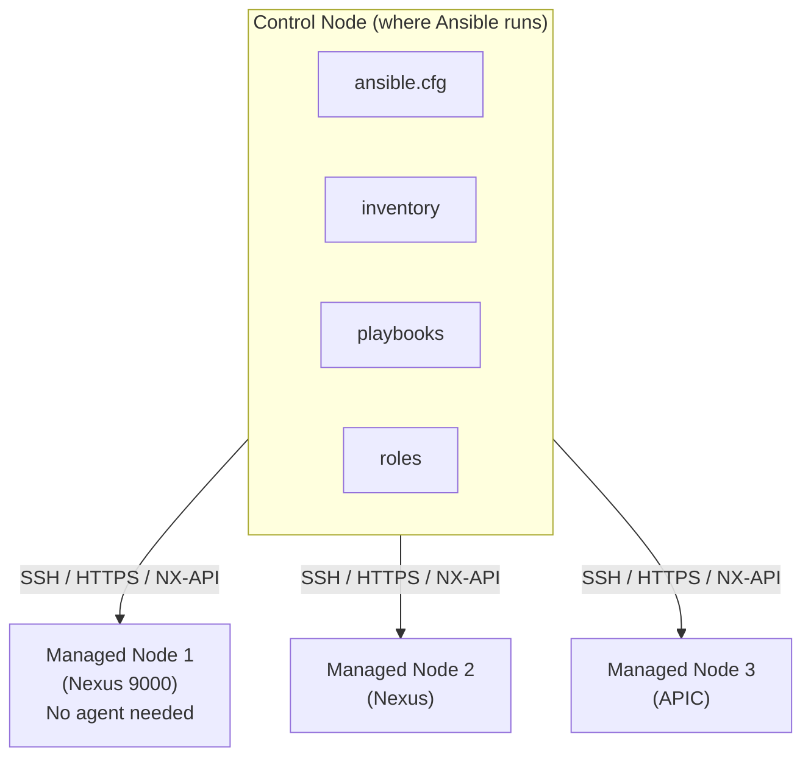

# Ansible and Terraform for CCIE DC v3.1

## Prerequisite Knowledge

- Basic YAML syntax (for Ansible playbooks)
- Understanding of network automation concepts (idempotency, desired state)
- NX-OS CLI fundamentals (VLAN, BGP, VXLAN configuration)
- ACI policy model (Tenant, VRF, BD, EPG, Contract)
- Basic understanding of REST APIs
- Familiarity with version control (Git)
- Understanding of Infrastructure as Code principles

---

## Ansible Architecture

### Core Components



```text
Key concepts:
  - Control node: runs playbooks (Linux/Mac, NOT Windows)
  - Managed nodes: targets (switches, APIC, servers)
  - Inventory: list of managed nodes (INI or YAML)
  - Playbook: YAML file defining tasks
  - Role: reusable collection of tasks/vars/templates
  - Module: unit of work (nxos_vlan, aci_tenant, etc.)
  - Collection: packaged modules + roles (cisco.nxos, cisco.aci)
  - Facts: gathered device information (ansible_net_*)
```

### Ansible Collections for Cisco DC

```text
Required collections:
  cisco.nxos    - NX-OS modules (VLAN, interface, BGP, VXLAN)
  cisco.aci     - ACI APIC modules (tenant, EPG, contract)
  ansible.netcommon - base network modules (cli_command, netconf)

Install:
  ansible-galaxy collection install cisco.nxos
  ansible-galaxy collection install cisco.aci
  ansible-galaxy collection install ansible.netcommon

Verify:
  ansible-galaxy collection list | grep cisco
```

### Inventory Configuration

```yaml
all:
  children:
    nxos:
      hosts:
        leaf101:
          ansible_host: 192.168.1.101
        leaf102:
          ansible_host: 192.168.1.102
        spine201:
          ansible_host: 192.168.1.201
        spine202:
          ansible_host: 192.168.1.202
      vars:
        ansible_network_os: cisco.nxos.nxos
        ansible_connection: ansible.netcommon.httpapi
        ansible_httpapi_use_ssl: true
        ansible_httpapi_validate_certs: false
        ansible_user: admin
        ansible_password: Cisco123!

    aci:
      hosts:
        apic1:
          ansible_host: 192.168.1.10
      vars:
        ansible_network_os: cisco.aci.aci
        ansible_connection: ansible.netcommon.httpapi
        ansible_httpapi_use_ssl: true
        ansible_httpapi_validate_certs: false
        ansible_user: admin
        ansible_password: Cisco123!
```

---

## Cisco NX-OS Ansible Modules

### Key Modules

```text
cisco.nxos modules:
  nxos_vlan          - VLAN management
  nxos_interface     - Interface configuration
  nxos_l2_interface  - L2 interface (access/trunk)
  nxos_l3_interface  - L3 interface (IP address)
  nxos_bgp           - BGP global config
  nxos_bgp_neighbor  - BGP neighbor config
  nxos_bgp_af        - BGP address family
  nxos_vrf           - VRF management
  nxos_vxlan_vtep    - NVE interface (VXLAN)
  nxos_vxlan_vtep_vni - VNI under NVE
  nxos_feature       - Enable/disable features
  nxos_config        - Raw CLI commands (fallback)
  nxos_command       - Run show commands
  nxos_facts         - Gather device facts
  nxos_portchannel   - Port channel config
  nxos_ospf          - OSPF configuration
  nxos_acl           - ACL configuration
  nxos_ntp           - NTP configuration
  nxos_snmp_server   - SNMP configuration
  nxos_logging       - Syslog configuration
```

### nxos_vlan

```yaml
- name: Configure VLANs
  cisco.nxos.nxos_vlan:
    vlan_id: "{{ item.id }}"
    name: "{{ item.name }}"
    state: present
  loop:
    - { id: 100, name: "WEB_TIER" }
    - { id: 200, name: "APP_TIER" }
    - { id: 300, name: "DB_TIER" }
    - { id: 900, name: "VXLAN_UNDERLAY" }
```

### nxos_interface

```yaml
- name: Configure uplink interfaces
  cisco.nxos.nxos_interface:
    name: "{{ item }}"
    description: "TO_SPINE"
    mode: layer3
    admin_state: up
  loop:
    - Ethernet1/49
    - Ethernet1/50

- name: Configure server-facing interfaces
  cisco.nxos.nxos_l2_interface:
    name: "{{ item.name }}"
    mode: access
    access_vlan: "{{ item.vlan }}"
  loop:
    - { name: "Ethernet1/1", vlan: 100 }
    - { name: "Ethernet1/2", vlan: 200 }
```

### nxos_bgp and nxos_vrf

```yaml
- name: Configure VRF
  cisco.nxos.nxos_vrf:
    name: PROD_VRF
    vni: 50001
    rd: "65001:50001"
    state: present

- name: Configure BGP
  cisco.nxos.nxos_bgp:
    asn: 65001
    router_id: 10.255.1.1
    state: present

- name: Configure BGP neighbors
  cisco.nxos.nxos_bgp_neighbor:
    asn: 65001
    neighbor: "{{ item }}"
    remote_as: 65001
    update_source: loopback0
    state: present
  loop:
    - 10.255.2.1
    - 10.255.2.2

- name: Configure BGP L2VPN EVPN
  cisco.nxos.nxos_bgp_af:
    asn: 65001
    afi: l2vpn
    safi: evpn
    neighbor: "{{ item }}"
    send_community: both
    state: present
  loop:
    - 10.255.2.1
    - 10.255.2.2
```

### nxos_vxlan_vtep

```yaml
- name: Configure NVE interface
  cisco.nxos.nxos_vxlan_vtep:
    interface: nve1
    description: "VXLAN_VTEP"
    host_reachability: true
    source_interface: loopback0
    state: present

- name: Configure VNI under NVE
  cisco.nxos.nxos_vxlan_vtep_vni:
    interface: nve1
    vni: "{{ item }}"
    ingress_replication: bgp
    state: present
  loop:
    - 10100
    - 10200
    - 10300
```

---

## Cisco ACI Ansible Modules

### Key Modules

```text
cisco.aci modules:
  aci_tenant         - Tenant management
  aci_vrf            - VRF (context) management
  aci_bd             - Bridge Domain management
  aci_bd_subnet      - BD subnet configuration
  aci_ap             - Application Profile
  aci_epg            - Endpoint Group
  aci_epg_to_domain  - EPG to domain binding
  aci_contract       - Contract management
  aci_contract_subject - Contract subject
  aci_filter         - Filter management
  aci_filter_entry   - Filter entry (protocol/port)
  aci_l3out          - L3Out configuration
  aci_l3out_extepg   - External EPG
  aci_domain         - Physical/VMM domain
  aci_vlan_pool      - VLAN pool
  aci_aep            - Attachable Access Entity Profile
  aci_interface_policy_group - Interface policy group
  aci_interface_selector - Interface profile selector
  aci_rest           - Raw REST API (fallback)
```

### aci_tenant, aci_ap, aci_epg

```yaml
- name: Create ACI Tenant
  cisco.aci.aci_tenant:
    host: "{{ apic_host }}"
    username: "{{ apic_user }}"
    password: "{{ apic_pass }}"
    validate_certs: false
    tenant: PROD_TENANT
    description: "Production Tenant"
    state: present

- name: Create VRF
  cisco.aci.aci_vrf:
    host: "{{ apic_host }}"
    username: "{{ apic_user }}"
    password: "{{ apic_pass }}"
    validate_certs: false
    tenant: PROD_TENANT
    vrf: PROD_VRF
    state: present

- name: Create Bridge Domain
  cisco.aci.aci_bd:
    host: "{{ apic_host }}"
    username: "{{ apic_user }}"
    password: "{{ apic_pass }}"
    validate_certs: false
    tenant: PROD_TENANT
    bd: WEB_BD
    vrf: PROD_VRF
    arp_flooding: false
    l2_unknown_unicast: proxy
    state: present

- name: Create BD Subnet
  cisco.aci.aci_bd_subnet:
    host: "{{ apic_host }}"
    username: "{{ apic_user }}"
    password: "{{ apic_pass }}"
    validate_certs: false
    tenant: PROD_TENANT
    bd: WEB_BD
    gateway: 10.1.1.1
    mask: 24
    scope: public
    state: present

- name: Create Application Profile
  cisco.aci.aci_ap:
    host: "{{ apic_host }}"
    username: "{{ apic_user }}"
    password: "{{ apic_pass }}"
    validate_certs: false
    tenant: PROD_TENANT
    ap: WEB_AP
    state: present

- name: Create EPG
  cisco.aci.aci_epg:
    host: "{{ apic_host }}"
    username: "{{ apic_user }}"
    password: "{{ apic_pass }}"
    validate_certs: false
    tenant: PROD_TENANT
    ap: WEB_AP
    epg: WEB_EPG
    bd: WEB_BD
    state: present
```

### aci_contract

```yaml
- name: Create Filter
  cisco.aci.aci_filter:
    host: "{{ apic_host }}"
    username: "{{ apic_user }}"
    password: "{{ apic_pass }}"
    validate_certs: false
    tenant: PROD_TENANT
    filter: WEB_TO_DB_FILTER
    state: present

- name: Create Filter Entry
  cisco.aci.aci_filter_entry:
    host: "{{ apic_host }}"
    username: "{{ apic_user }}"
    password: "{{ apic_pass }}"
    validate_certs: false
    tenant: PROD_TENANT
    filter: WEB_TO_DB_FILTER
    entry: allow-sql
    ether_type: ip
    ip_protocol: tcp
    dst_port_start: 1433
    dst_port_end: 1433
    state: present

- name: Create Contract
  cisco.aci.aci_contract:
    host: "{{ apic_host }}"
    username: "{{ apic_user }}"
    password: "{{ apic_pass }}"
    validate_certs: false
    tenant: PROD_TENANT
    contract: WEB_TO_DB_CONTRACT
    scope: context
    state: present

- name: Create Contract Subject
  cisco.aci.aci_contract_subject:
    host: "{{ apic_host }}"
    username: "{{ apic_user }}"
    password: "{{ apic_pass }}"
    validate_certs: false
    tenant: PROD_TENANT
    contract: WEB_TO_DB_CONTRACT
    subject: sql-access
    filter: WEB_TO_DB_FILTER
    state: present

- name: Apply Contract (provider)
  cisco.aci.aci_epg_to_contract:
    host: "{{ apic_host }}"
    username: "{{ apic_user }}"
    password: "{{ apic_pass }}"
    validate_certs: false
    tenant: PROD_TENANT
    ap: DB_AP
    epg: DB_EPG
    contract: WEB_TO_DB_CONTRACT
    contract_type: provider
    state: present

- name: Apply Contract (consumer)
  cisco.aci.aci_epg_to_contract:
    host: "{{ apic_host }}"
    username: "{{ apic_user }}"
    password: "{{ apic_pass }}"
    validate_certs: false
    tenant: PROD_TENANT
    ap: WEB_AP
    epg: WEB_EPG
    contract: WEB_TO_DB_CONTRACT
    contract_type: consumer
    state: present
```

### aci_l3out

```yaml
- name: Create L3Out
  cisco.aci.aci_l3out:
    host: "{{ apic_host }}"
    username: "{{ apic_user }}"
    password: "{{ apic_pass }}"
    validate_certs: false
    tenant: PROD_TENANT
    l3out: EXT_L3OUT
    vrf: PROD_VRF
    domain: EXT_DOMAIN
    route_control: export
    state: present

- name: Create External EPG
  cisco.aci.aci_l3out_extepg:
    host: "{{ apic_host }}"
    username: "{{ apic_user }}"
    password: "{{ apic_pass }}"
    validate_certs: false
    tenant: PROD_TENANT
    l3out: EXT_L3OUT
    extepg: EXT_EPG
    state: present
```

---

## Ansible Playbook Examples for DC

### Full VXLAN Fabric Deployment

```yaml
---
- name: Deploy VXLAN EVPN Fabric
  hosts: nxos
  gather_facts: true
  vars:
    fabric_asn: 65001
    vlans:
      - { id: 100, name: "WEB", vni: 10100 }
      - { id: 200, name: "APP", vni: 10200 }
      - { id: 300, name: "DB", vni: 10300 }
    vrf:
      name: PROD_VRF
      vni: 50001
    nve_source: loopback0

  tasks:
    - name: Enable required features
      cisco.nxos.nxos_feature:
        feature: "{{ item }}"
        state: enabled
      loop:
        - nv overlay
        - vn-segment-vlan-based
        - bgp
        - interface-vlan
        - nvi

    - name: Create VLANs with VNI
      cisco.nxos.nxos_config:
        lines:
          - "vn-segment {{ item.vni }}"
        parents: "vlan {{ item.id }}"
      loop: "{{ vlans }}"

    - name: Configure VRF
      cisco.nxos.nxos_config:
        lines:
          - "vni {{ vrf.vni }}"
          - "rd auto"
          - "address-family ipv4 unicast"
          - "route-target both auto"
          - "route-target both auto evpn"
        parents: "vrf context {{ vrf.name }}"

    - name: Configure SVI for VLANs
      cisco.nxos.nxos_config:
        lines:
          - "no shutdown"
          - "vrf member {{ vrf.name }}"
          - "ip address {{ item.svi_ip }}/{{ item.mask }}"
          - "ip router ospf UNDERLAY area 0.0.0.0"
        parents: "interface Vlan{{ item.id }}"
      loop:
        - { id: 100, svi_ip: "10.1.1.1", mask: 24 }
        - { id: 200, svi_ip: "10.1.2.1", mask: 24 }
        - { id: 300, svi_ip: "10.1.3.1", mask: 24 }

    - name: Configure NVE interface
      cisco.nxos.nxos_vxlan_vtep:
        interface: nve1
        host_reachability: true
        source_interface: "{{ nve_source }}"
        state: present

    - name: Add VNIs to NVE
      cisco.nxos.nxos_vxlan_vtep_vni:
        interface: nve1
        vni: "{{ item.vni }}"
        ingress_replication: bgp
        state: present
      loop: "{{ vlans }}"

    - name: Configure BGP
      cisco.nxos.nxos_config:
        lines:
          - "router-id {{ router_id }}"
          - "address-family l2vpn evpn"
          - "retain route-target all"
        parents: "router bgp {{ fabric_asn }}"

    - name: Configure BGP neighbors
      cisco.nxos.nxos_config:
        lines:
          - "remote-as {{ fabric_asn }}"
          - "update-source loopback0"
          - "address-family l2vpn evpn"
          - "send-community"
          - "send-community extended"
        parents:
          - "router bgp {{ fabric_asn }}"
          - "neighbor {{ item }}"
      loop: "{{ bgp_peers }}"

    - name: Verify BGP
      cisco.nxos.nxos_command:
        commands:
          - show ip bgp summary
      register: bgp_output

    - name: Display BGP status
      debug:
        msg: "{{ bgp_output.stdout_lines }}"
```

### ACI Tenant Deployment

```yaml
---
- name: Deploy ACI Tenant with Full Policy
  hosts: aci
  gather_facts: false
  vars:
    apic_host: "192.168.1.10"
    apic_user: "admin"
    apic_pass: "Cisco123!"
    tenant: "PROD_TENANT"
    vrf: "PROD_VRF"
    app_profiles:
      - name: "WEB_AP"
        epgs:
          - { name: "WEB_EPG", bd: "WEB_BD", vlan: 100 }
          - { name: "LB_EPG", bd: "WEB_BD", vlan: 101 }
      - name: "APP_AP"
        epgs:
          - { name: "APP_EPG", bd: "APP_BD", vlan: 200 }
      - name: "DB_AP"
        epgs:
          - { name: "DB_EPG", bd: "DB_BD", vlan: 300 }
    bridge_domains:
      - { name: "WEB_BD", subnet: "10.1.1.1/24" }
      - { name: "APP_BD", subnet: "10.1.2.1/24" }
      - { name: "DB_BD", subnet: "10.1.3.1/24" }
    contracts:
      - name: "WEB_TO_APP"
        provider: { ap: "APP_AP", epg: "APP_EPG" }
        consumer: { ap: "WEB_AP", epg: "WEB_EPG" }
        filter: "ALLOW_HTTP"
        port: 8080
      - name: "APP_TO_DB"
        provider: { ap: "DB_AP", epg: "DB_EPG" }
        consumer: { ap: "APP_AP", epg: "APP_EPG" }
        filter: "ALLOW_SQL"
        port: 1433

  tasks:
    - name: Create Tenant
      cisco.aci.aci_tenant:
        host: "{{ apic_host }}"
        username: "{{ apic_user }}"
        password: "{{ apic_pass }}"
        validate_certs: false
        tenant: "{{ tenant }}"
        state: present

    - name: Create VRF
      cisco.aci.aci_vrf:
        host: "{{ apic_host }}"
        username: "{{ apic_user }}"
        password: "{{ apic_pass }}"
        validate_certs: false
        tenant: "{{ tenant }}"
        vrf: "{{ vrf }}"
        state: present

    - name: Create Bridge Domains
      cisco.aci.aci_bd:
        host: "{{ apic_host }}"
        username: "{{ apic_user }}"
        password: "{{ apic_pass }}"
        validate_certs: false
        tenant: "{{ tenant }}"
        bd: "{{ item.name }}"
        vrf: "{{ vrf }}"
        state: present
      loop: "{{ bridge_domains }}"

    - name: Create BD Subnets
      cisco.aci.aci_bd_subnet:
        host: "{{ apic_host }}"
        username: "{{ apic_user }}"
        password: "{{ apic_pass }}"
        validate_certs: false
        tenant: "{{ tenant }}"
        bd: "{{ item.name }}"
        gateway: "{{ item.subnet.split('/')[0] }}"
        mask: "{{ item.subnet.split('/')[1] }}"
        scope: public
        state: present
      loop: "{{ bridge_domains }}"

    - name: Create Application Profiles
      cisco.aci.aci_ap:
        host: "{{ apic_host }}"
        username: "{{ apic_user }}"
        password: "{{ apic_pass }}"
        validate_certs: false
        tenant: "{{ tenant }}"
        ap: "{{ item.name }}"
        state: present
      loop: "{{ app_profiles }}"

    - name: Create EPGs
      cisco.aci.aci_epg:
        host: "{{ apic_host }}"
        username: "{{ apic_user }}"
        password: "{{ apic_pass }}"
        validate_certs: false
        tenant: "{{ tenant }}"
        ap: "{{ item.0.name }}"
        epg: "{{ item.1.name }}"
        bd: "{{ item.1.bd }}"
        state: present
      loop: "{{ app_profiles | subelements('epgs') }}"

    - name: Create Filters
      cisco.aci.aci_filter:
        host: "{{ apic_host }}"
        username: "{{ apic_user }}"
        password: "{{ apic_pass }}"
        validate_certs: false
        tenant: "{{ tenant }}"
        filter: "{{ item.filter }}"
        state: present
      loop: "{{ contracts }}"

    - name: Create Filter Entries
      cisco.aci.aci_filter_entry:
        host: "{{ apic_host }}"
        username: "{{ apic_user }}"
        password: "{{ apic_pass }}"
        validate_certs: false
        tenant: "{{ tenant }}"
        filter: "{{ item.filter }}"
        entry: "allow-{{ item.port }}"
        ether_type: ip
        ip_protocol: tcp
        dst_port_start: "{{ item.port }}"
        dst_port_end: "{{ item.port }}"
        state: present
      loop: "{{ contracts }}"

    - name: Create Contracts
      cisco.aci.aci_contract:
        host: "{{ apic_host }}"
        username: "{{ apic_user }}"
        password: "{{ apic_pass }}"
        validate_certs: false
        tenant: "{{ tenant }}"
        contract: "{{ item.name }}"
        scope: context
        state: present
      loop: "{{ contracts }}"

    - name: Create Contract Subjects
      cisco.aci.aci_contract_subject:
        host: "{{ apic_host }}"
        username: "{{ apic_user }}"
        password: "{{ apic_pass }}"
        validate_certs: false
        tenant: "{{ tenant }}"
        contract: "{{ item.name }}"
        subject: "subject-{{ item.port }}"
        filter: "{{ item.filter }}"
        state: present
      loop: "{{ contracts }}"

    - name: Bind Contracts (Provider)
      cisco.aci.aci_epg_to_contract:
        host: "{{ apic_host }}"
        username: "{{ apic_user }}"
        password: "{{ apic_pass }}"
        validate_certs: false
        tenant: "{{ tenant }}"
        ap: "{{ item.provider.ap }}"
        epg: "{{ item.provider.epg }}"
        contract: "{{ item.name }}"
        contract_type: provider
        state: present
      loop: "{{ contracts }}"

    - name: Bind Contracts (Consumer)
      cisco.aci.aci_epg_to_contract:
        host: "{{ apic_host }}"
        username: "{{ apic_user }}"
        password: "{{ apic_pass }}"
        validate_certs: false
        tenant: "{{ tenant }}"
        ap: "{{ item.consumer.ap }}"
        epg: "{{ item.consumer.epg }}"
        contract: "{{ item.name }}"
        contract_type: consumer
        state: present
      loop: "{{ contracts }}"
```

### Day-2 Operations: Config Backup

```yaml
---
- name: Backup NX-OS Configurations
  hosts: nxos
  gather_facts: false

  tasks:
    - name: Get running config
      cisco.nxos.nxos_command:
        commands:
          - show running-config
      register: running_config

    - name: Save config to file
      copy:
        content: "{{ running_config.stdout[0] }}"
        dest: "./backups/{{ inventory_hostname }}_{{ ansible_date_time.iso8601 }}.cfg"
      delegate_to: localhost

    - name: Get BGP summary
      cisco.nxos.nxos_command:
        commands:
          - show ip bgp summary
      register: bgp_status

    - name: Save BGP status
      copy:
        content: "{{ bgp_status.stdout[0] }}"
        dest: "./backups/{{ inventory_hostname }}_bgp_{{ ansible_date_time.iso8601 }}.txt"
      delegate_to: localhost
```

---

## Ansible Best Practices

### Idempotency

```text
Idempotency: running a playbook multiple times produces same result
  - Use state: present (not raw CLI commands)
  - Modules check current state before making changes
  - "changed" vs "ok" in output shows if changes were made
  - Avoid nxos_config with raw commands when structured modules exist
  - Use nxos_config only when no structured module available
```

### Handlers

```yaml
- name: Configure logging
  cisco.nxos.nxos_logging:
    dest: server
    dest_level: informational
    server: 192.168.1.50
    state: present
  notify: save config

handlers:
  - name: save config
    cisco.nxos.nxos_config:
      save_when: always
```

### Vault for Secrets

```text
ansible-vault encrypt group_vars/all/vault.yml
ansible-vault edit group_vars/all/vault.yml
ansible-vault decrypt group_vars/all/vault.yml

vault.yml:
  vault_apic_password: "S3cur3P@ss!"
  vault_nxos_password: "N3tw0rkP@ss!"

Reference in playbook:
  password: "{{ vault_apic_password }}"

Run with vault:
  ansible-playbook deploy.yml --ask-vault-pass
  ansible-playbook deploy.yml --vault-password-file .vault_pass
```

---

## Terraform Fundamentals

### Core Concepts

```text
Terraform:
  - Infrastructure as Code (IaC) tool by HashiCorp
  - Declarative: define desired state, Terraform converges
  - Providers: plugins for APIs (Cisco ACI, AWS, Azure, etc.)
  - Resources: objects managed by providers
  - State: terraform.tfstate (tracks current vs desired)
  - Plan: shows what will change (terraform plan)
  - Apply: makes changes (terraform apply)
  - Destroy: removes all resources (terraform destroy)

Workflow:
  1. Write .tf files (desired state)
  2. terraform init (download providers)
  3. terraform plan (preview changes)
  4. terraform apply (make changes)
  5. terraform state (manage state)
```

### Provider Configuration

```hcl
terraform {
  required_providers {
    aci = {
      source  = "CiscoDevNet/aci"
      version = ">= 2.0.0"
    }
  }
}

provider "aci" {
  username = var.apic_username
  password = var.apic_password
  url      = "https://192.168.1.10"
  insecure = true
}
```

### Variables

```hcl
variable "apic_username" {
  type    = string
  default = "admin"
}

variable "apic_password" {
  type      = string
  sensitive = true
}

variable "tenant_name" {
  type    = string
  default = "PROD_TENANT"
}

variable "vrf_name" {
  type    = string
  default = "PROD_VRF"
}

variable "bridge_domains" {
  type = list(object({
    name   = string
    subnet = string
    mask   = number
  }))
  default = [
    { name = "WEB_BD", subnet = "10.1.1.1", mask = 24 },
    { name = "APP_BD", subnet = "10.1.2.1", mask = 24 },
    { name = "DB_BD", subnet = "10.1.3.1", mask = 24 },
  ]
}
```

---

## Cisco ACI Terraform Provider

### Tenant, VRF, BD

```hcl
resource "aci_tenant" "prod" {
  name        = var.tenant_name
  description = "Production Tenant"
}

resource "aci_vrf" "prod_vrf" {
  tenant_dn = aci_tenant.prod.id
  name      = var.vrf_name
}

resource "aci_bridge_domain" "bds" {
  for_each = { for bd in var.bridge_domains : bd.name => bd }

  tenant_dn          = aci_tenant.prod.id
  name               = each.value.name
  relation_fv_rs_ctx = aci_vrf.prod_vrf.name
  arp_flood          = "no"
  unk_mac_ucast      = "proxy"
}

resource "aci_subnet" "bd_subnets" {
  for_each = { for bd in var.bridge_domains : bd.name => bd }

  parent_dn = aci_bridge_domain.bds[each.key].id
  ip        = "${each.value.subnet}/${each.value.mask}"
  scope     = ["public"]
}
```

### Application Profile and EPG

```hcl
resource "aci_application_profile" "web_ap" {
  tenant_dn = aci_tenant.prod.id
  name      = "WEB_AP"
}

resource "aci_application_epg" "web_epg" {
  application_profile_dn = aci_application_profile.web_ap.id
  name                   = "WEB_EPG"
  relation_fv_rs_bd      = aci_bridge_domain.bds["WEB_BD"].name
}

resource "aci_application_epg" "app_epg" {
  application_profile_dn = aci_application_profile.web_ap.id
  name                   = "APP_EPG"
  relation_fv_rs_bd      = aci_bridge_domain.bds["APP_BD"].name
}

resource "aci_application_epg" "db_epg" {
  application_profile_dn = aci_application_profile.web_ap.id
  name                   = "DB_EPG"
  relation_fv_rs_bd      = aci_bridge_domain.bds["DB_BD"].name
}
```

### Contracts

```hcl
resource "aci_filter" "web_to_app" {
  tenant_dn = aci_tenant.prod.id
  name      = "WEB_TO_APP_FILTER"
}

resource "aci_filter_entry" "allow_8080" {
  filter_dn  = aci_filter.web_to_app.id
  name       = "allow-8080"
  ether_t    = "ip"
  prot       = "tcp"
  d_from_port = "8080"
  d_to_port   = "8080"
}

resource "aci_contract" "web_to_app" {
  tenant_dn = aci_tenant.prod.id
  name      = "WEB_TO_APP_CONTRACT"
  scope     = "context"
}

resource "aci_contract_subject" "web_to_app_subject" {
  contract_dn                  = aci_contract.web_to_app.id
  name                         = "web-to-app-subject"
  relation_vz_rs_subj_filt_att = [aci_filter.web_to_app.id]
}

resource "aci_contract_subject_to_filter" "web_to_app_filter" {
  contract_subject_dn = aci_contract_subject.web_to_app_subject.id
  filter_dn           = aci_filter.web_to_app.id
}

resource "aci_epg_to_contract" "app_provider" {
  application_epg_dn = aci_application_epg.app_epg.id
  contract_dn        = aci_contract.web_to_app.id
  contract_type      = "provider"
}

resource "aci_epg_to_contract" "web_consumer" {
  application_epg_dn = aci_application_epg.web_epg.id
  contract_dn        = aci_contract.web_to_app.id
  contract_type      = "consumer"
}
```

### L3Out

```hcl
resource "aci_l3_outside" "ext_l3out" {
  tenant_dn                    = aci_tenant.prod.id
  name                         = "EXT_L3OUT"
  relation_l3ext_rs_ectx       = aci_vrf.prod_vrf.name
  relation_l3ext_rs_l3_dom_att = "EXT_DOMAIN"
}

resource "aci_external_network_instance_profile" "ext_epg" {
  l3_outside_dn = aci_l3_outside.ext_l3out.id
  name          = "EXT_EPG"
}

resource "aci_l3_ext_subnet" "ext_subnet" {
  external_network_instance_profile_dn = aci_external_network_instance_profile.ext_epg.id
  ip                                   = "0.0.0.0/0"
  scope                                = ["import-security"]
}
```

---

## Terraform State Management

### State File

```text
terraform.tfstate:
  - JSON file tracking current infrastructure state
  - Maps resources in .tf files to real objects on APIC
  - Used by terraform plan to calculate diffs
  - NEVER edit manually
  - Store remotely for team use (S3, Terraform Cloud, Consul)

State operations:
  terraform state list          - list all resources
  terraform state show <resource> - show resource details
  terraform state rm <resource> - remove from state (not destroy)
  terraform state mv <old> <new> - rename resource
  terraform import <resource> <id> - import existing resource
```

### Remote State Backend

```hcl
terraform {
  backend "s3" {
    bucket         = "terraform-state-bucket"
    key            = "aci-prod/terraform.tfstate"
    region         = "us-east-1"
    dynamodb_table = "terraform-locks"
    encrypt        = true
  }
}
```

### Terraform Modules

```hcl
module "aci_tenant" {
  source = "./modules/aci-tenant"

  tenant_name = "PROD_TENANT"
  vrf_name    = "PROD_VRF"
  bridge_domains = [
    { name = "WEB_BD", subnet = "10.1.1.1", mask = 24 },
    { name = "APP_BD", subnet = "10.1.2.1", mask = 24 },
  ]
  epgs = [
    { name = "WEB_EPG", bd = "WEB_BD", ap = "WEB_AP" },
    { name = "APP_EPG", bd = "APP_BD", ap = "APP_AP" },
  ]
}
```

### Workspaces

```text
terraform workspace new dev
terraform workspace new staging
terraform workspace new prod
terraform workspace select prod
terraform workspace list

Use in code:
  resource "aci_tenant" "main" {
    name = "${terraform.workspace}-TENANT"
  }
```

---

## Ansible vs Terraform Comparison

```text
+-------------------+-------------------+-------------------+
| Feature           | Ansible           | Terraform         |
+-------------------+-------------------+-------------------+
| Paradigm          | Procedural/Decl.  | Declarative       |
| State             | Stateless         | Stateful          |
| Best for          | Config mgmt       | Infrastructure    |
| Idempotency       | Module-dependent  | Always            |
| Rollback          | Manual            | terraform destroy |
| Dependencies      | Task ordering     | Auto (graph)      |
| Drift detection   | No (check mode)   | Yes (plan)        |
| ACI support       | cisco.aci         | CiscoDevNet/aci   |
| NX-OS support     | cisco.nxos        | Limited           |
| Learning curve    | Low (YAML)        | Medium (HCL)      |
| Day-2 operations  | Excellent         | Limited           |
| Day-0 provisioning| Good              | Excellent         |
+-------------------+-------------------+-------------------+

When to use what:
  - Ansible: Day-2 config changes, firmware upgrades, compliance checks
  - Terraform: Day-0 provisioning, full tenant builds, reproducible infra
  - Both: Terraform provisions, Ansible manages ongoing operations
```

> **CCIE Exam Tip:** The exam may present a scenario and ask which tool is appropriate. Terraform for "build this infrastructure from scratch" (declarative, stateful). Ansible for "configure these devices" or "verify compliance" (procedural, agentless). Know both ACI module sets.

---

## Verification Commands

```text
Ansible:
  ansible --version
  ansible-galaxy collection list
  ansible-inventory --list
  ansible all -m ping
  ansible-playbook --syntax-check playbook.yml
  ansible-playbook --check playbook.yml (dry run)
  ansible-playbook playbook.yml -v (verbose)
  ansible-doc cisco.nxos.nxos_vlan
  ansible-doc cisco.aci.aci_tenant

Terraform:
  terraform version
  terraform init
  terraform validate
  terraform plan
  terraform plan -out=plan.tfplan
  terraform apply plan.tfplan
  terraform state list
  terraform show
  terraform destroy
  terraform fmt
  terraform import aci_tenant.prod "uni/tn-PROD_TENANT"
```

---

## Lab 1: Full VXLAN Fabric Deployment with Ansible

### Objective
Deploy a complete VXLAN EVPN fabric on 2 leafs and 2 spines using Ansible.

### Inventory (inventory.yml)

```yaml
all:
  children:
    spines:
      hosts:
        spine201:
          ansible_host: 192.168.1.201
          router_id: 10.255.2.1
          loopback_ip: 10.255.2.1/32
        spine202:
          ansible_host: 192.168.1.202
          router_id: 10.255.2.2
          loopback_ip: 10.255.2.2/32
      vars:
        role: spine
    leafs:
      hosts:
        leaf101:
          ansible_host: 192.168.1.101
          router_id: 10.255.1.1
          loopback_ip: 10.255.1.1/32
          bgp_peers: [10.255.2.1, 10.255.2.2]
        leaf102:
          ansible_host: 192.168.1.102
          router_id: 10.255.1.2
          loopback_ip: 10.255.1.2/32
          bgp_peers: [10.255.2.1, 10.255.2.2]
      vars:
        role: leaf
  vars:
    ansible_network_os: cisco.nxos.nxos
    ansible_connection: ansible.netcommon.httpapi
    ansible_httpapi_use_ssl: true
    ansible_httpapi_validate_certs: false
    ansible_user: admin
    ansible_password: Cisco123!
    fabric_asn: 65001
```

### Playbook (deploy_vxlan.yml)

```yaml
---
- name: Deploy VXLAN EVPN Fabric - Spines
  hosts: spines
  gather_facts: false
  tasks:
    - name: Enable features on spines
      cisco.nxos.nxos_feature:
        feature: "{{ item }}"
        state: enabled
      loop:
        - bgp
        - ospf

    - name: Configure loopback
      cisco.nxos.nxos_config:
        lines:
          - "ip address {{ loopback_ip }}"
          - "ip router ospf UNDERLAY area 0.0.0.0"
        parents: "interface loopback0"

    - name: Configure OSPF
      cisco.nxos.nxos_config:
        lines:
          - "router-id {{ router_id }}"
        parents: "router ospf UNDERLAY"

    - name: Configure BGP on spines
      cisco.nxos.nxos_config:
        lines:
          - "router-id {{ router_id }}"
          - "address-family l2vpn evpn"
          - "retain route-target all"
        parents: "router bgp {{ fabric_asn }}"

    - name: BGP neighbors (leafs)
      cisco.nxos.nxos_config:
        lines:
          - "remote-as {{ fabric_asn }}"
          - "update-source loopback0"
          - "address-family l2vpn evpn"
          - "send-community"
          - "send-community extended"
          - "route-reflector-client"
        parents:
          - "router bgp {{ fabric_asn }}"
          - "neighbor {{ item }}"
      loop:
        - 10.255.1.1
        - 10.255.1.2

- name: Deploy VXLAN EVPN Fabric - Leafs
  hosts: leafs
  gather_facts: false
  vars:
    vlans:
      - { id: 100, name: "WEB", vni: 10100, svi: "10.1.1.1/24" }
      - { id: 200, name: "APP", vni: 10200, svi: "10.1.2.1/24" }
      - { id: 300, name: "DB", vni: 10300, svi: "10.1.3.1/24" }
  tasks:
    - name: Enable features on leafs
      cisco.nxos.nxos_feature:
        feature: "{{ item }}"
        state: enabled
      loop:
        - nv overlay
        - vn-segment-vlan-based
        - bgp
        - ospf
        - interface-vlan
        - nvi

    - name: Configure loopback
      cisco.nxos.nxos_config:
        lines:
          - "ip address {{ loopback_ip }}"
          - "ip router ospf UNDERLAY area 0.0.0.0"
        parents: "interface loopback0"

    - name: Create VLANs with VNI
      cisco.nxos.nxos_config:
        lines:
          - "name {{ item.name }}"
          - "vn-segment {{ item.vni }}"
        parents: "vlan {{ item.id }}"
      loop: "{{ vlans }}"

    - name: Configure VRF
      cisco.nxos.nxos_config:
        lines:
          - "vni 50001"
          - "rd auto"
          - "address-family ipv4 unicast"
          - "route-target both auto"
          - "route-target both auto evpn"
        parents: "vrf context PROD_VRF"

    - name: Configure SVIs
      cisco.nxos.nxos_config:
        lines:
          - "no shutdown"
          - "vrf member PROD_VRF"
          - "ip address {{ item.svi }}"
          - "ip router ospf UNDERLAY area 0.0.0.0"
        parents: "interface Vlan{{ item.id }}"
      loop: "{{ vlans }}"

    - name: Configure NVE
      cisco.nxos.nxos_config:
        lines:
          - "no shutdown"
          - "host-reachability protocol bgp"
          - "source-interface loopback0"
        parents: "interface nve1"

    - name: Add VNIs to NVE
      cisco.nxos.nxos_config:
        lines:
          - "ingress-replication protocol bgp"
        parents:
          - "interface nve1"
          - "member vni {{ item.vni }}"
      loop: "{{ vlans }}"

    - name: Configure BGP
      cisco.nxos.nxos_config:
        lines:
          - "router-id {{ router_id }}"
          - "address-family l2vpn evpn"
          - "retain route-target all"
        parents: "router bgp {{ fabric_asn }}"

    - name: BGP neighbors (spines)
      cisco.nxos.nxos_config:
        lines:
          - "remote-as {{ fabric_asn }}"
          - "update-source loopback0"
          - "address-family l2vpn evpn"
          - "send-community"
          - "send-community extended"
        parents:
          - "router bgp {{ fabric_asn }}"
          - "neighbor {{ item }}"
      loop: "{{ bgp_peers }}"

    - name: Verify BGP
      cisco.nxos.nxos_command:
        commands:
          - show ip bgp l2vpn evpn summary
      register: bgp_verify

    - name: Show BGP status
      debug:
        var: bgp_verify.stdout_lines
```

### Running

```text
$ ansible-playbook -i inventory.yml deploy_vxlan.yml

PLAY [Deploy VXLAN EVPN Fabric - Spines] ***
TASK [Enable features on spines] ***
changed: [spine201] => (item=bgp)
changed: [spine202] => (item=bgp)
ok: [spine201] => (item=ospf)
ok: [spine202] => (item=ospf)
...

PLAY RECAP ***
spine201 : ok=5  changed=3  unreachable=0  failed=0
spine202 : ok=5  changed=3  unreachable=0  failed=0
leaf101  : ok=10 changed=8  unreachable=0  failed=0
leaf102  : ok=10 changed=8  unreachable=0  failed=0
```

---

## Lab 2: ACI Tenant with Terraform

### Objective
Deploy a complete ACI tenant using Terraform and compare with Ansible approach.

### main.tf

```hcl
terraform {
  required_providers {
    aci = {
      source  = "CiscoDevNet/aci"
      version = ">= 2.0.0"
    }
  }
}

provider "aci" {
  username = var.apic_username
  password = var.apic_password
  url      = var.apic_url
  insecure = true
}

resource "aci_tenant" "prod" {
  name        = "TERRAFORM_TENANT"
  description = "Deployed via Terraform"
}

resource "aci_vrf" "prod_vrf" {
  tenant_dn = aci_tenant.prod.id
  name      = "PROD_VRF"
}

resource "aci_bridge_domain" "web_bd" {
  tenant_dn          = aci_tenant.prod.id
  name               = "WEB_BD"
  relation_fv_rs_ctx = aci_vrf.prod_vrf.name
  arp_flood          = "no"
  unk_mac_ucast      = "proxy"
}

resource "aci_subnet" "web_subnet" {
  parent_dn = aci_bridge_domain.web_bd.id
  ip        = "10.1.1.1/24"
  scope     = ["public"]
}

resource "aci_bridge_domain" "db_bd" {
  tenant_dn          = aci_tenant.prod.id
  name               = "DB_BD"
  relation_fv_rs_ctx = aci_vrf.prod_vrf.name
  arp_flood          = "no"
  unk_mac_ucast      = "proxy"
}

resource "aci_subnet" "db_subnet" {
  parent_dn = aci_bridge_domain.db_bd.id
  ip        = "10.1.2.1/24"
  scope     = ["public"]
}

resource "aci_application_profile" "prod_ap" {
  tenant_dn = aci_tenant.prod.id
  name      = "PROD_AP"
}

resource "aci_application_epg" "web_epg" {
  application_profile_dn = aci_application_profile.prod_ap.id
  name                   = "WEB_EPG"
  relation_fv_rs_bd      = aci_bridge_domain.web_bd.name
}

resource "aci_application_epg" "db_epg" {
  application_profile_dn = aci_application_profile.prod_ap.id
  name                   = "DB_EPG"
  relation_fv_rs_bd      = aci_bridge_domain.db_bd.name
}

resource "aci_filter" "web_to_db" {
  tenant_dn = aci_tenant.prod.id
  name      = "WEB_TO_DB_FILTER"
}

resource "aci_filter_entry" "allow_sql" {
  filter_dn   = aci_filter.web_to_db.id
  name        = "allow-sql"
  ether_t     = "ip"
  prot        = "tcp"
  d_from_port = "1433"
  d_to_port   = "1433"
}

resource "aci_contract" "web_to_db" {
  tenant_dn = aci_tenant.prod.id
  name      = "WEB_TO_DB_CONTRACT"
  scope     = "context"
}

resource "aci_contract_subject" "web_to_db_subj" {
  contract_dn                  = aci_contract.web_to_db.id
  name                         = "sql-subject"
  relation_vz_rs_subj_filt_att = [aci_filter.web_to_db.id]
}

resource "aci_epg_to_contract" "db_provider" {
  application_epg_dn = aci_application_epg.db_epg.id
  contract_dn        = aci_contract.web_to_db.id
  contract_type      = "provider"
}

resource "aci_epg_to_contract" "web_consumer" {
  application_epg_dn = aci_application_epg.web_epg.id
  contract_dn        = aci_contract.web_to_db.id
  contract_type      = "consumer"
}

output "tenant_dn" {
  value = aci_tenant.prod.id
}

output "web_epg_dn" {
  value = aci_application_epg.web_epg.id
}
```

### terraform.tfvars

```hcl
apic_username = "admin"
apic_password = "Cisco123!"
apic_url      = "https://192.168.1.10"
```

### Running Terraform

```text
$ terraform init
Initializing provider plugins...
- Installing ciscodevnet/aci v2.6.1...
- Installed ciscodevnet/aci v2.6.1

$ terraform plan
Terraform will perform the following actions:
  # aci_tenant.prod will be created
  + resource "aci_tenant" "prod" {
      + name = "TERRAFORM_TENANT"
    }
  # aci_vrf.prod_vrf will be created
  # aci_bridge_domain.web_bd will be created
  # aci_bridge_domain.db_bd will be created
  # aci_application_epg.web_epg will be created
  # aci_application_epg.db_epg will be created
  # aci_contract.web_to_db will be created
  ...
Plan: 14 to add, 0 to change, 0 to destroy.

$ terraform apply
Apply complete! Resources: 14 added, 0 changed, 0 destroyed.

Outputs:
tenant_dn = "uni/tn-TERRAFORM_TENANT"
web_epg_dn = "uni/tn-TERRAFORM_TENANT/ap-PROD_AP/epg-WEB_EPG"
```

> **Lab Exam Warning:** When using Terraform with ACI in the exam: (1) Always run `terraform plan` before `apply`, (2) Check state file is not corrupted, (3) Know `terraform import` for existing resources, (4) Understand dependency graph (Terraform auto-orders, but explicit `depends_on` may be needed), (5) Never store passwords in .tf files — use variables or environment variables.

---

## aci_rest Module (Raw REST Fallback)

### When to Use aci_rest

```text
aci_rest is the fallback module when no structured module exists:
  - New ACI features not yet in cisco.aci collection
  - Complex nested objects (service graphs, ESG)
  - Bulk operations (multiple objects in one POST)
  - When you know the REST API DN and JSON payload

Syntax:
  cisco.aci.aci_rest:
    host: "{{ apic_host }}"
    username: "{{ apic_user }}"
    password: "{{ apic_pass }}"
    validate_certs: false
    path: /api/node/mo/uni/tn-PROD.json
    method: post
    content:
      fvTenant:
        attributes:
          name: PROD
          descr: "Production"
```

### aci_rest Example: Create ESG

```yaml
- name: Create Endpoint Security Group via aci_rest
  cisco.aci.aci_rest:
    host: "{{ apic_host }}"
    username: "{{ apic_user }}"
    password: "{{ apic_pass }}"
    validate_certs: false
    path: /api/node/mo/uni/tn-PROD.json
    method: post
    content:
      fvESg:
        attributes:
          name: WEB_ESG
          descr: "Web ESG"
        children:
          - fvRsESgToBD:
              attributes:
                tnFvBDName: WEB_BD

- name: Add IP subnet selector to ESG
  cisco.aci.aci_rest:
    host: "{{ apic_host }}"
    username: "{{ apic_user }}"
    password: "{{ apic_pass }}"
    validate_certs: false
    path: /api/node/mo/uni/tn-PROD/esg-WEB_ESG.json
    method: post
    content:
      fvESg:
        attributes:
          name: WEB_ESG
        children:
          - fvIPSubnetSelector:
              attributes:
                name: web-subnet
                ip: "10.1.1.0/24"
```

### aci_rest Example: Contract with Service Graph

```yaml
- name: Apply service graph to contract subject
  cisco.aci.aci_rest:
    host: "{{ apic_host }}"
    username: "{{ apic_user }}"
    password: "{{ apic_pass }}"
    validate_certs: false
    path: /api/node/mo/uni/tn-PROD/brc-WEB_TO_DB/subj-sql.json
    method: post
    content:
      vzSubj:
        attributes:
          name: sql
        children:
          - vzRsSubjGraphAtt:
              attributes:
                tnVnsAbsGraphName: FW_GRAPH
```

> **CCIE Exam Tip:** The exam may provide an aci_rest task and ask you to identify what it creates. Know the DN structure: `uni/tn-<tenant>/ap-<ap>/epg-<epg>`. The class name (fvTenant, fvAEPg, vzBrCP) tells you the object type. If a structured module exists (aci_tenant, aci_epg), prefer it over aci_rest for idempotency.

---

## Common Exam Scenarios

### Scenario 1: Ansible Playbook Not Idempotent

```text
Ticket: "Playbook shows 'changed' every run even when config exists"

Diagnosis:
  Task uses nxos_config with raw commands:
    - name: Set MTU
      cisco.nxos.nxos_config:
        lines:
          - "mtu 9216"
        parents: "interface Ethernet1/1"

  Problem: nxos_config compares command text, not actual state
  If output format differs slightly, it reports "changed"

Fix: Use structured module instead:
  - name: Set MTU
    cisco.nxos.nxos_interface:
      name: Ethernet1/1
      mtu: 9216
      state: present

Key lesson: Structured modules (nxos_vlan, nxos_interface, nxos_bgp)
  are idempotent. nxos_config with raw CLI is NOT reliably idempotent.
```

### Scenario 2: Terraform State Drift

```text
Ticket: "terraform plan shows changes but nothing was modified"

Diagnosis:
  $ terraform plan
  -> aci_tenant.prod: name changed from "PROD_TENANT" to "PROD"

Root cause: Someone renamed tenant via APIC GUI (outside Terraform)

Fix options:
  1. Revert APIC change (rename back to PROD_TENANT)
  2. Update .tf file to match new name
  3. terraform import to re-sync state:
     terraform state rm aci_tenant.prod
     terraform import aci_tenant.prod "uni/tn-PROD"

Key lesson: Terraform state MUST match reality.
  If someone changes APIC outside Terraform, state is stale.
  Always: terraform plan before apply to detect drift.
```

### Scenario 3: ACI Module Authentication Failure

```text
Ticket: "Ansible ACI playbook fails with 'Authentication failed'"

Diagnosis:
  Error: "Unable to authenticate to APIC: 401 Unauthorized"

  Check inventory:
    ansible_user: admin
    ansible_password: Cisco123!

  Test manually:
    curl -k -X POST https://192.168.1.10/api/aaaLogin.json \
      -d '{"aaaUser":{"attributes":{"name":"admin","pwd":"Cisco123!"}}}'
    -> 401 (password wrong)

Root cause: APIC password changed, inventory not updated

Fix:
  1. Update ansible vault: ansible-vault edit group_vars/aci/vault.yml
  2. Update password variable
  3. Re-run playbook

Verification:
  ansible apic1 -m cisco.aci.aci_tenant -a "tenant=test state=query"
  -> SUCCESS
```

---

## Cross-References

- For Python NX-API scripts (alternative to Ansible), see `04-automation/python-nxos.md`
- For ACI policy model and REST API, see `05-aci/aci-complete.md`
- For ACI reference repository: https://github.com/vikiev/aci-ccie-dc

---

## Key Takeaways

1. **Ansible**: Agentless, YAML playbooks, cisco.nxos + cisco.aci collections, best for Day-2 operations
2. **Terraform**: Declarative, stateful, HCL, CiscoDevNet/aci provider, best for Day-0 provisioning
3. **NX-OS modules**: nxos_vlan, nxos_bgp, nxos_vxlan_vtep, nxos_feature — structured config
4. **ACI modules**: aci_tenant, aci_epg, aci_contract, aci_l3out — full policy model
5. **Idempotency**: Both tools support it; Ansible via modules, Terraform via state comparison
6. **Secrets**: Ansible Vault for Ansible; variables/environment for Terraform
7. **State**: Terraform requires state management (remote backend for teams); Ansible is stateless
8. **Exam**: Know module names, playbook structure, Terraform workflow (init/plan/apply)
9. **aci_rest**: Fallback for objects without structured modules; know DN structure
10. **Drift**: Terraform detects via plan; Ansible detects via check mode (--check)
