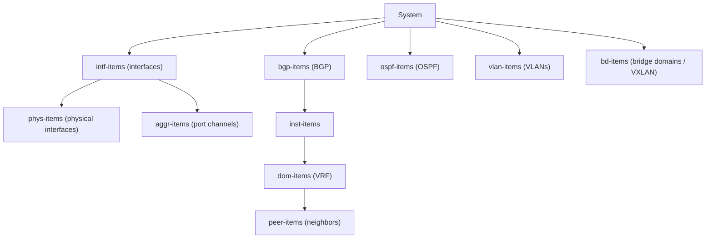

# Python and NX-OS Programmability for CCIE DC v3.1

## Prerequisite Knowledge

- Basic programming concepts (variables, loops, functions)
- NX-OS CLI fundamentals (VLAN, interface, routing configuration)
- Understanding of REST APIs (HTTP methods, JSON)
- Basic understanding of XML and data modeling
- Familiarity with Linux command line
- Understanding of network protocols (BGP, OSPF, VXLAN)

---

## Python Fundamentals for Network Automation

### Essential Data Types

```python
hostname = "leaf101"
mgmt_ip = "192.168.1.101"
asn = 65001
vlans = [100, 200, 300, 400]
interfaces = {"Eth1/1": "up", "Eth1/2": "down", "Eth1/3": "up"}
bgp_config = {
    "asn": 65001,
    "router_id": "10.1.1.1",
    "neighbors": [
        {"ip": "10.1.1.2", "asn": 65002, "remote_as": 65002},
        {"ip": "10.1.1.3", "asn": 65003, "remote_as": 65003}
    ]
}
is_spine = True
```

### Loops and Conditionals

```python
for vlan in vlans:
    if vlan >= 200:
        print(f"VLAN {vlan} is in extended range")
    else:
        print(f"VLAN {vlan} is in normal range")

for iface, status in interfaces.items():
    if status == "down":
        print(f"ALERT: {iface} is down")

for neighbor in bgp_config["neighbors"]:
    print(f"Peer: {neighbor['ip']} AS{neighbor['remote_as']}")

spine_count = 0
while spine_count < 4:
    spine_count += 1
```

### Functions and Error Handling

```python
def configure_vlan(ssh_conn, vlan_id, vlan_name):
    try:
        commands = [
            f"vlan {vlan_id}",
            f"name {vlan_name}",
        ]
        output = ssh_conn.send_config_set(commands)
        return {"status": "success", "vlan": vlan_id, "output": output}
    except Exception as e:
        return {"status": "error", "vlan": vlan_id, "error": str(e)}

def get_interface_status(ssh_conn, interface):
    try:
        output = ssh_conn.send_command(f"show interface {interface} brief")
        if "up" in output:
            return "up"
        elif "down" in output:
            return "down"
        else:
            return "unknown"
    except Exception as e:
        print(f"Error checking {interface}: {e}")
        return "error"

results = []
for vlan_id in range(100, 105):
    result = configure_vlan(ssh_conn, vlan_id, f"VLAN_{vlan_id}")
    results.append(result)
```

### File I/O and JSON

```python
import json

with open("fabric_config.json", "r") as f:
    fabric = json.load(fabric)

for switch in fabric["switches"]:
    print(f"{switch['hostname']}: {switch['role']} - {switch['mgmt_ip']}")

output_data = {"timestamp": "2024-01-15T10:30:00", "switches": results}
with open("results.json", "w") as f:
    json.dump(output_data, f, indent=2)
```

---

## NX-OS Programmability Interfaces

### NX-API (REST)

```text
NX-API provides REST access to NX-OS:
  - JSON-RPC: send CLI commands, get JSON responses
  - CLI API: send show/config commands via HTTP POST
  - URL: https://<switch-ip>/ins (JSON-RPC)
  - URL: https://<switch-ip>/cli (CLI API)
  - Authentication: HTTP Basic Auth
  - Transport: HTTPS (port 443)
  - Must be enabled: feature nxapi

NX-API modes:
  - cli: execute CLI commands (show or config)
  - cli_show: show commands only (read-only)
  - cli_conf: configuration commands
  - bash: execute bash commands (guestshell)
```

#### Enabling NX-API

```nxos
feature nxapi
nxapi ssl port 443
nxapi sandbox
```

#### NX-API JSON-RPC Request/Response

```python
import requests
import json
import urllib3
urllib3.disable_warnings()

switch = "192.168.1.101"
url = f"https://{switch}/ins"
headers = {"content-type": "application/json-rpc"}
auth = ("admin", "Cisco123!")

payload = {
    "jsonrpc": "2.0",
    "method": "cli",
    "params": {
        "cmd": "show vlan brief",
        "version": 1.2
    },
    "id": 1
}

response = requests.post(url, json=payload, headers=headers,
                         auth=auth, verify=False)
data = response.json()

for vlan in data["result"]["body"]["TABLE_vlanbrief"]["ROW_vlanbrief"]:
    print(f"VLAN {vlan['vlanshowbr-vlanid']}: {vlan['vlanshowbr-vlanname']} - {vlan['vlanshowbr-vlanstate']}")
```

#### NX-API Configuration Example

```python
import requests
import json
import urllib3
urllib3.disable_warnings()

def nxapi_config(switch, commands, auth=("admin", "Cisco123!")):
    url = f"https://{switch}/ins"
    headers = {"content-type": "application/json-rpc"}

    if isinstance(commands, str):
        commands = [commands]

    payload = {
        "jsonrpc": "2.0",
        "method": "cli",
        "params": {
            "cmd": commands[0] if len(commands) == 1 else commands,
            "version": 1.2
        },
        "id": 1
    }

    response = requests.post(url, json=payload, headers=headers,
                             auth=auth, verify=False)
    return response.json()

vlans_to_create = [
    {"id": 100, "name": "VXLAN_UNDERLAY"},
    {"id": 200, "name": "VXLAN_OVERLAY"},
    {"id": 300, "name": "SERVER_VLAN"},
]

for vlan in vlans_to_create:
    commands = [
        f"vlan {vlan['id']}",
        f"name {vlan['name']}"
    ]
    result = nxapi_config("192.168.1.101", commands)
    if "error" in result:
        print(f"Failed VLAN {vlan['id']}: {result['error']}")
    else:
        print(f"Created VLAN {vlan['id']}: {vlan['name']}")
```

---

### NETCONF/YANG

```text
NETCONF:
  - XML-based network configuration protocol
  - RFC 6241 (NETCONF), RFC 7950 (YANG)
  - Transport: SSH (port 830) or TLS
  - Operations: <get>, <get-config>, <edit-config>, <commit>
  - Datastores: running, candidate, startup
  - Capabilities: advertised by device, define supported operations
  - Locking: <lock> prevents concurrent modifications
  - YANG: data modeling language (defines structure of config/state)

NX-OS NETCONF:
  - Enabled: feature netconf
  - SSH port 830
  - Supports: candidate datastore, confirmed-commit
  - YANG models: Cisco-native + IETF + OpenConfig
  - Not all NX-OS features have YANG models (check docs)
```

#### Enabling NETCONF on NX-OS

```nxos
feature netconf
ssh port 830
```

#### NETCONF with ncclient

```python
from ncclient import manager
import xml.etree.ElementTree as ET

switch = "192.168.1.101"

with manager.connect(host=switch, port=830,
                     username="admin", password="Cisco123!",
                     hostkey_verify=False,
                     device_params={"name": "nexus"}) as m:

    caps = m.server_capabilities
    for cap in caps:
        if "bgp" in cap.lower():
            print(cap)

    result = m.get(filter=("subtree",
        "<System xmlns='http://cisco.com/ns/yang/cisco-nx-os-device'>"
        "<bgp-items/>"
        "</System>"))
    print(result.xml)
```

#### NETCONF BGP Configuration

```python
from ncclient import manager

bgp_config = """
<config>
  <System xmlns="http://cisco.com/ns/yang/cisco-nx-os-device">
    <bgp-items>
      <inst-items>
        <asn>65001</asn>
        <dom-items>
          <Dom-list>
            <name>default</name>
            <rtrid>10.1.1.1</rtrid>
            <peer-items>
              <Peer-list>
                <addr>10.1.1.2</addr>
                <asn>65002</asn>
                <type>ebgp</type>
              </Peer-list>
              <Peer-list>
                <addr>10.1.1.3</addr>
                <asn>65003</asn>
                <type>ebgp</type>
              </Peer-list>
            </peer-items>
          </Dom-list>
        </dom-items>
      </inst-items>
    </bgp-items>
  </System>
</config>
"""

with manager.connect(host="192.168.1.101", port=830,
                     username="admin", password="Cisco123!",
                     hostkey_verify=False,
                     device_params={"name": "nexus"}) as m:

    m.lock(target="candidate")
    try:
        m.edit_config(target="candidate", config=bgp_config)
        m.validate()
        m.commit()
        print("BGP configuration committed")
    except Exception as e:
        m.discard_changes()
        print(f"Error: {e}")
    finally:
        m.unlock(target="candidate")
```

---

### gRPC/gNMI Telemetry

```text
gRPC (gRPC Remote Procedure Call):
  - High-performance RPC framework (HTTP/2 + Protocol Buffers)
  - Used for: telemetry streaming, configuration, operational data
  - NX-OS: gRPC dial-in (client connects to switch)
  - Port: 50001 (default)

gNMI (gRPC Network Management Interface):
  - OpenConfig standard for network management
  - Operations: Subscribe, Get, Set, Capabilities
  - Subscribe modes:
    - ONCE: single snapshot
    - POLL: on-demand polling
    - STREAM: continuous (periodic or on-change)
  - Paths: /interfaces/interface[name=Ethernet1/1]/state/oper-status
  - Encoding: JSON, PROTO (protobuf)

Model-Driven Telemetry (MDT):
  - Push-based (vs SNMP pull-based)
  - Switch streams data to collector
  - Sensor paths define what data to stream
  - Subscription: sensor-group + destination-group + frequency
```

#### Enabling gRPC on NX-OS

```nxos
feature grpc
grpc port 50001
grpc certificate /bootflash/grpc.crt
grpc key /bootflash/grpc.key
```

#### gRPC Telemetry Subscription (Python)

```python
import grpc
from grpc import ssl_channel_credentials
import json

switch = "192.168.1.101"
port = 50001

def telemetry_subscribe():
    channel = grpc.secure_channel(
        f"{switch}:{port}",
        grpc.ssl_channel_credentials(
            root_certificates=open("grpc-ca.crt", "rb").read()
        )
    )

    metadata = [("username", "admin"), ("password", "Cisco123!")]

    subscription = {
        "encode": 0,
        "subscriptions": [
            {
                "path": "sys/intf/phys-[eth1/1]/rtst",
                "sample_interval": 10000
            },
            {
                "path": "sys/bgp/inst/dom-[default]/peer-[10.1.1.2]/ent-[10.1.1.2]/operSt",
                "sample_interval": 5000
            }
        ]
    }

    print(f"Subscribed to telemetry from {switch}")
    print("Waiting for data...")

telemetry_subscribe()
```

#### Telemetry Configuration on NX-OS

```nxos
feature telemetry

telemetry
  destination-group 1
    ip address 192.168.1.200 port 50001 protocol gRPC encoding GPB

  sensor-group 1
    path sys/intf depth 0 query-condition rsp-foreign-subtree=ephemeral
    path sys/bgp/inst/dom-[default]/peer depth 0

  sensor-group 2
    path sys/ospf/inst/dom-[default] depth 0

  subscription 1
    snsr-grp 1 sample-interval 10000
    dst-grp 1

  subscription 2
    snsr-grp 2 sample-interval 5000
    dst-grp 1
```

---

### Bash Shell / Guest Shell on NX-OS

```text
NX-OS Guest Shell:
  - Linux container running on NX-OS
  - Python 3.x, pip, standard Linux tools
  - Access to NX-OS via: dohostcmd (CLI), nxapi (REST)
  - Isolated from NX-OS (cannot crash switch)
  - Persistent storage: /bootflash/guestshare/

Enable guest shell:
```

```nxos
feature guestshell
guestshell enable
guestshell resize rootfs 500
guestshell resize memory 1024
```

```text
Access guest shell:
  leaf101# guestshell
  leaf101(guestshell)# python3
  >>> import requests
  >>> print("Python running on NX-OS")

Run NX-OS CLI from guest shell:
  leaf101(guestshell)# dohostcmd "show vlan brief"
  leaf101(guestshell)# dohostcmd "show ip bgp summary"

Python script in guest shell:
  leaf101(guestshell)# python3 /bootflash/guestshare/check_bgp.py
```

```python
import subprocess
import json

def get_bgp_summary():
    result = subprocess.run(
        ["dohostcmd", "show ip bgp summary json"],
        capture_output=True, text=True
    )
    return json.loads(result.stdout)

bgp = get_bgp_summary()
for peer, info in bgp["TABLE_vrf"]["ROW_vrf"]["TABLE_neighbor"]["ROW_neighbor"].items():
    state = info.get("state", "unknown")
    if state != "Established":
        print(f"ALERT: BGP peer {peer} is {state}")
    else:
        print(f"OK: BGP peer {peer} Established, prefixes: {info.get('pfxRcd', 0)}")
```

---

## Python Libraries for Network Automation

### requests (HTTP/REST)

```python
import requests
import urllib3
urllib3.disable_warnings()

class NXAPI:
    def __init__(self, switch, username="admin", password="Cisco123!"):
        self.url = f"https://{switch}/ins"
        self.auth = (username, password)
        self.headers = {"content-type": "application/json-rpc"}

    def cli(self, command):
        payload = {
            "jsonrpc": "2.0",
            "method": "cli",
            "params": {"cmd": command, "version": 1.2},
            "id": 1
        }
        response = requests.post(self.url, json=payload,
                                 headers=self.headers,
                                 auth=self.auth, verify=False)
        response.raise_for_status()
        return response.json()["result"]["body"]

    def config(self, commands):
        if isinstance(commands, str):
            commands = [commands]
        payload = {
            "jsonrpc": "2.0",
            "method": "cli",
            "params": {"cmd": commands, "version": 1.2},
            "id": 1
        }
        response = requests.post(self.url, json=payload,
                                 headers=self.headers,
                                 auth=self.auth, verify=False)
        response.raise_for_status()
        return response.json()

leaf = NXAPI("192.168.1.101")
vlans = leaf.cli("show vlan brief")
print(json.dumps(vlans, indent=2))

leaf.config(["vlan 500", "name AUTOMATION_TEST"])
```

### ncclient (NETCONF)

```python
from ncclient import manager
from ncclient.xml_ import new_ele, sub_ele

def get_running_config(host, filter_xml=None):
    with manager.connect(host=host, port=830,
                         username="admin", password="Cisco123!",
                         hostkey_verify=False,
                         device_params={"name": "nexus"}) as m:
        if filter_xml:
            result = m.get_config(source="running", filter=filter_xml)
        else:
            result = m.get_config(source="running")
        return result.xml

def configure_interface(host, interface, description, mtu=9216):
    config = f"""
    <config>
      <System xmlns="http://cisco.com/ns/yang/cisco-nx-os-device">
        <intf-items>
          <phys-items>
            <PhysIf-list>
              <id>{interface}</id>
              <descr>{description}</descr>
              <mtu>{mtu}</mtu>
              <adminSt>up</adminSt>
            </PhysIf-list>
          </phys-items>
        </intf-items>
      </System>
    </config>
    """
    with manager.connect(host=host, port=830,
                         username="admin", password="Cisco123!",
                         hostkey_verify=False,
                         device_params={"name": "nexus"}) as m:
        m.edit_config(target="candidate", config=config)
        m.commit()

configure_interface("192.168.1.101", "eth1/49", "TO_SPINE01", 9216)
```

### pyATS/Genie

```python
from pyats.topology import loader
from genie.testbed import load

testbed = load("testbed.yaml")

device = testbed.devices["leaf101"]
device.connect()

output = device.parse("show ip bgp summary")
print(f"BGP Router ID: {output['vrf']['default']['router_id']}")

for peer, info in output['vrf']['default']['neighbor'].items():
    state = info['session_state']
    prefixes = info.get('prefix_received', 0)
    print(f"  {peer}: {state} ({prefixes} prefixes)")

interfaces = device.parse("show interface")
for iface, data in interfaces.items():
    if data.get('oper_status') == 'down':
        print(f"DOWN: {iface}")

device.disconnect()
```

#### testbed.yaml

```yaml
devices:
  leaf101:
    os: nxos
    type: switch
    connections:
      defaults:
        class: unicon.Unicon
      mgmt:
        protocol: ssh
        ip: 192.168.1.101
        arguments:
          username: admin
          password: Cisco123!
      nxapi:
        class: rest.Rest
        ip: 192.168.1.101
        protocol: https
        arguments:
          username: admin
          password: Cisco123!

  leaf102:
    os: nxos
    type: switch
    connections:
      defaults:
        class: unicon.Unicon
      mgmt:
        protocol: ssh
        ip: 192.168.1.102
        arguments:
          username: admin
          password: Cisco123!
```

---

## NX-OS Automation Examples

### Python Script: Configure VXLAN Fabric

```python
import requests
import json
import urllib3
urllib3.disable_warnings()

class VXLANFabricDeployer:
    def __init__(self, switch_ip, auth=("admin", "Cisco123!")):
        self.url = f"https://{switch_ip}/ins"
        self.auth = auth
        self.headers = {"content-type": "application/json-rpc"}

    def send_config(self, commands):
        payload = {
            "jsonrpc": "2.0",
            "method": "cli",
            "params": {"cmd": commands, "version": 1.2},
            "id": 1
        }
        response = requests.post(self.url, json=payload,
                                 headers=self.headers,
                                 auth=self.auth, verify=False)
        return response.json()

    def deploy_vxlan(self, config):
        commands = []

        commands.append(f"feature nv overlay")
        commands.append(f"feature vn-segment-vlan-based")
        commands.append(f"feature bgp")
        commands.append(f"feature interface-vlan")
        commands.append(f"feature nvi")

        for vlan in config["vlans"]:
            commands.append(f"vlan {vlan['id']}")
            commands.append(f"vn-segment {vlan['vni']}")

        for vni in config["vnis"]:
            commands.append(f"vrf context {vni['vrf']}")
            commands.append(f"vni {vni['vni']}")
            commands.append(f"rd auto")
            commands.append(f"address-family ipv4 unicast")
            commands.append(f"route-target both auto")
            commands.append(f"route-target both auto evpn")

        commands.append(f"interface nve1")
        commands.append(f"no shutdown")
        commands.append(f"host-reachability protocol bgp")
        commands.append(f"source-interface loopback0")

        for vlan in config["vlans"]:
            commands.append(f"member vni {vlan['vni']}")
            commands.append(f"ingress-replication protocol bgp")

        commands.append(f"router bgp {config['asn']}")
        commands.append(f"router-id {config['router_id']}")
        commands.append(f"address-family l2vpn evpn")
        commands.append(f"retain route-target all")

        for peer in config["bgp_peers"]:
            commands.append(f"neighbor {peer['ip']}")
            commands.append(f"remote-as {peer['asn']}")
            commands.append(f"update-source loopback0")
            commands.append(f"address-family l2vpn evpn")
            commands.append(f"send-community")
            commands.append(f"send-community extended")

        result = self.send_config(commands)
        return result

fabric_config = {
    "asn": 65001,
    "router_id": "10.255.1.1",
    "vlans": [
        {"id": 100, "vni": 10100, "name": "WEB"},
        {"id": 200, "vni": 10200, "name": "APP"},
        {"id": 300, "vni": 10300, "name": "DB"},
    ],
    "vnis": [
        {"vrf": "PROD_VRF", "vni": 50001},
    ],
    "bgp_peers": [
        {"ip": "10.255.2.1", "asn": 65001},
        {"ip": "10.255.2.2", "asn": 65001},
    ]
}

deployer = VXLANFabricDeployer("192.168.1.101")
result = deployer.deploy_vxlan(fabric_config)
print(json.dumps(result, indent=2))
```

### NETCONF Script: Configure BGP

```python
from ncclient import manager
import xml.etree.ElementTree as ET

def configure_bgp_netconf(host, asn, router_id, neighbors):
    peer_xml = ""
    for n in neighbors:
        peer_xml += f"""
        <Peer-list>
          <addr>{n['ip']}</addr>
          <asn>{n['asn']}</asn>
          <type>{n['type']}</type>
          <inherit-items>
            <peer-ctrl-items>
              <PeerCtrl-list>
                <name>SPINE_PEER</name>
              </PeerCtrl-list>
            </peer-ctrl-items>
          </inherit-items>
        </Peer-list>
        """

    config = f"""
    <config>
      <System xmlns="http://cisco.com/ns/yang/cisco-nx-os-device">
        <bgp-items>
          <inst-items>
            <asn>{asn}</asn>
            <dom-items>
              <Dom-list>
                <name>default</name>
                <rtrid>{router_id}</rtrid>
                <peer-items>
                  {peer_xml}
                </peer-items>
              </Dom-list>
            </dom-items>
          </inst-items>
        </bgp-items>
      </System>
    </config>
    """

    with manager.connect(host=host, port=830,
                         username="admin", password="Cisco123!",
                         hostkey_verify=False,
                         device_params={"name": "nexus"}) as m:
        m.lock(target="candidate")
        try:
            m.edit_config(target="candidate", config=config)
            m.validate()
            m.commit()
            print(f"BGP AS{asn} configured on {host}")
            return True
        except Exception as e:
            m.discard_changes()
            print(f"Error on {host}: {e}")
            return False
        finally:
            m.unlock(target="candidate")

neighbors = [
    {"ip": "10.255.2.1", "asn": 65001, "type": "ibgp"},
    {"ip": "10.255.2.2", "asn": 65001, "type": "ibgp"},
]

configure_bgp_netconf("192.168.1.101", 65001, "10.255.1.1", neighbors)
```

### pyATS Verification Script

```python
from genie.testbed import load
import json
import sys

def verify_fabric(testbed_file):
    testbed = load(testbed_file)
    results = {"passed": [], "failed": []}

    for device_name in testbed.devices:
        device = testbed.devices[device_name]
        try:
            device.connect()
        except Exception as e:
            results["failed"].append({"device": device_name, "test": "connectivity", "error": str(e)})
            continue

        try:
            bgp = device.parse("show ip bgp summary")
            for vrf_name, vrf_data in bgp.get("vrf", {}).items():
                for peer, peer_data in vrf_data.get("neighbor", {}).items():
                    state = peer_data.get("session_state", "unknown")
                    if state == "Established":
                        results["passed"].append({
                            "device": device_name,
                            "test": f"bgp_peer_{peer}",
                            "state": state
                        })
                    else:
                        results["failed"].append({
                            "device": device_name,
                            "test": f"bgp_peer_{peer}",
                            "state": state
                        })
        except Exception as e:
            results["failed"].append({"device": device_name, "test": "bgp_parse", "error": str(e)})

        try:
            nve = device.parse("show nve peers")
            peer_count = len(nve.get("vni", {}).get("10100", {}).get("peer", {}))
            if peer_count >= 2:
                results["passed"].append({
                    "device": device_name,
                    "test": "nve_peers",
                    "count": peer_count
                })
            else:
                results["failed"].append({
                    "device": device_name,
                    "test": "nve_peers",
                    "count": peer_count,
                    "expected": ">=2"
                })
        except Exception as e:
            results["failed"].append({"device": device_name, "test": "nve_parse", "error": str(e)})

        device.disconnect()

    print(f"\n{'='*60}")
    print(f"RESULTS: {len(results['passed'])} passed, {len(results['failed'])} failed")
    print(f"{'='*60}")

    for item in results["failed"]:
        print(f"  FAIL: {item['device']} - {item['test']}: {item.get('state', item.get('error', ''))}")

    return len(results["failed"]) == 0

if __name__ == "__main__":
    success = verify_fabric("testbed.yaml")
    sys.exit(0 if success else 1)
```

---

## Model-Driven Programmability: YANG Models for NX-OS

### YANG Model Structure

```text
NX-OS YANG models:
  - Cisco-native: cisco-nx-os-device (most complete)
  - IETF: ietf-interfaces, ietf-bgp (standard but limited NX-OS support)
  - OpenConfig: openconfig-interfaces, openconfig-bgp (vendor-neutral)
```



```text
Finding YANG models:
  - GitHub: github.com/YangModels/yang
  - Cisco: developer.cisco.com/docs/nx-os
  - On switch: show yang model (limited)
```

### YANG Path Examples

```text
Interface operational status:
  /System/intf-items/phys-items/PhysIf-list[id='eth1/1']/operSt

BGP neighbor state:
  /System/bgp-items/inst-items/dom-items/Dom-list[name='default']/peer-items/Peer-list[addr='10.1.1.2']/operSt

VLAN configuration:
  /System/vlan-items/vlan-items/Vlan-list[id='100']

NVE (VXLAN) peers:
  /System/nvo-items/nve-items/Nve-list[id='nve1']/peer-items
```

---

## Verification Commands

```text
NX-OS:
  show nxapi
  show nxapi ssl
  show netconf status
  show grpc
  show telemetry subscription
  show telemetry destination-group
  show telemetry sensor-group
  show guestshell detail
  show feature | include nxapi
  show feature | include netconf
  show feature | include telemetry
  show feature | include grpc

Python (verification):
  python3 -c "import requests; print(requests.__version__)"
  python3 -c "from ncclient import manager; print('ncclient OK')"
  python3 -c "import grpc; print(grpc.__version__)"
  pyats version
  genie --help
```

---

## Lab 1: NX-API VLAN Configuration

### Objective
Use Python with NX-API to create VLANs, configure interfaces, and verify.

### Script

```python
import requests
import json
import urllib3
urllib3.disable_warnings()

SWITCH = "192.168.1.101"
AUTH = ("admin", "Cisco123!")
URL = f"https://{SWITCH}/ins"
HEADERS = {"content-type": "application/json-rpc"}

def nxapi_cli(commands):
    if isinstance(commands, str):
        commands = [commands]
    payload = {
        "jsonrpc": "2.0",
        "method": "cli",
        "params": {"cmd": commands, "version": 1.2},
        "id": 1
    }
    resp = requests.post(URL, json=payload, headers=HEADERS, auth=AUTH, verify=False)
    resp.raise_for_status()
    return resp.json()

def create_vlans(vlans):
    for vlan in vlans:
        commands = [f"vlan {vlan['id']}", f"name {vlan['name']}"]
        result = nxapi_cli(commands)
        if "error" not in result:
            print(f"[OK] VLAN {vlan['id']} ({vlan['name']}) created")
        else:
            print(f"[FAIL] VLAN {vlan['id']}: {result['error']['message']}")

def configure_interfaces(interfaces):
    for iface in interfaces:
        commands = [
            f"interface {iface['name']}",
            f"description {iface['desc']}",
            f"switchport mode {iface['mode']}",
        ]
        if iface.get("access_vlan"):
            commands.append(f"switchport access vlan {iface['access_vlan']}")
        if iface.get("trunk_vlans"):
            commands.append(f"switchport trunk allowed vlan {iface['trunk_vlans']}")
        commands.append("no shutdown")
        result = nxapi_cli(commands)
        if "error" not in result:
            print(f"[OK] {iface['name']} configured")
        else:
            print(f"[FAIL] {iface['name']}: {result['error']['message']}")

def verify_vlans():
    result = nxapi_cli("show vlan brief")
    body = result["result"]["body"]
    vlans = body["TABLE_vlanbrief"]["ROW_vlanbrief"]
    print(f"\n{'VLAN':<8}{'Name':<25}{'Status':<10}")
    print("-" * 43)
    for v in vlans:
        print(f"{v['vlanshowbr-vlanid']:<8}{v['vlanshowbr-vlanname']:<25}{v['vlanshowbr-vlanstate']:<10}")

vlans = [
    {"id": 100, "name": "WEB_TIER"},
    {"id": 200, "name": "APP_TIER"},
    {"id": 300, "name": "DB_TIER"},
    {"id": 900, "name": "VXLAN_UNDERLAY"},
]

interfaces = [
    {"name": "Ethernet1/1", "desc": "TO_SERVER_01", "mode": "access", "access_vlan": 100},
    {"name": "Ethernet1/2", "desc": "TO_SERVER_02", "mode": "access", "access_vlan": 200},
    {"name": "Ethernet1/49", "desc": "TO_SPINE01", "mode": "trunk", "trunk_vlans": "100,200,300,900"},
]

print("=== Creating VLANs ===")
create_vlans(vlans)

print("\n=== Configuring Interfaces ===")
configure_interfaces(interfaces)

print("\n=== Verification ===")
verify_vlans()
```

### Expected Output

```text
=== Creating VLANs ===
[OK] VLAN 100 (WEB_TIER) created
[OK] VLAN 200 (APP_TIER) created
[OK] VLAN 300 (DB_TIER) created
[OK] VLAN 900 (VXLAN_UNDERLAY) created

=== Configuring Interfaces ===
[OK] Ethernet1/1 configured
[OK] Ethernet1/2 configured
[OK] Ethernet1/49 configured

=== Verification ===
VLAN    Name                     Status
-------------------------------------------
1       default                  active
100     WEB_TIER                 active
200     APP_TIER                 active
300     DB_TIER                  active
900     VXLAN_UNDERLAY           active
```

---

## Lab 2: pyATS Fabric Verification

### Objective
Use pyATS/Genie to verify VXLAN fabric health across multiple switches.

### testbed.yaml

```yaml
devices:
  leaf101:
    os: nxos
    type: switch
    connections:
      defaults:
        class: unicon.Unicon
      mgmt:
        protocol: ssh
        ip: 192.168.1.101
        arguments:
          username: admin
          password: Cisco123!

  leaf102:
    os: nxos
    type: switch
    connections:
      defaults:
        class: unicon.Unicon
      mgmt:
        protocol: ssh
        ip: 192.168.1.102
        arguments:
          username: admin
          password: Cisco123!

  spine201:
    os: nxos
    type: switch
    connections:
      defaults:
        class: unicon.Unicon
      mgmt:
        protocol: ssh
        ip: 192.168.1.201
        arguments:
          username: admin
          password: Cisco123!
```

### Verification Script

```python
from genie.testbed import load
from pyats import aetest
import logging

log = logging.getLogger(__name__)

class VXLANFabricVerification(aetest.Testcase):

    @aetest.test
    def test_bgp_established(self, testbed):
        for device_name in ["leaf101", "leaf102"]:
            device = testbed.devices[device_name]
            device.connect()
            bgp = device.parse("show ip bgp summary")

            for vrf, vrf_data in bgp.get("vrf", {}).items():
                for peer, peer_data in vrf_data.get("neighbor", {}).items():
                    state = peer_data.get("session_state")
                    assert state == "Established", \
                        f"{device_name}: BGP peer {peer} is {state}"
                    log.info(f"{device_name}: BGP peer {peer} Established")
            device.disconnect()

    @aetest.test
    def test_nve_peers(self, testbed):
        for device_name in ["leaf101", "leaf102"]:
            device = testbed.devices[device_name]
            device.connect()
            nve = device.parse("show nve peers")

            peer_count = 0
            for vni, vni_data in nve.get("vni", {}).items():
                for peer_ip, peer_data in vni_data.get("peer", {}).items():
                    state = peer_data.get("state")
                    assert state == "Up", \
                        f"{device_name}: NVE peer {peer_ip} VNI {vni} is {state}"
                    peer_count += 1

            assert peer_count >= 2, \
                f"{device_name}: Expected >=2 NVE peers, got {peer_count}"
            log.info(f"{device_name}: {peer_count} NVE peers Up")
            device.disconnect()

    @aetest.test
    def test_vlan_vni_mapping(self, testbed):
        expected = {100: 10100, 200: 10200, 300: 10300}

        for device_name in ["leaf101", "leaf102"]:
            device = testbed.devices[device_name]
            device.connect()
            vlans = device.parse("show vlan")

            for vlan_id, vni in expected.items():
                vlan_key = str(vlan_id)
                assert vlan_key in vlans.get("vlans", {}), \
                    f"{device_name}: VLAN {vlan_id} not found"
                actual_vni = vlans["vlans"][vlan_key].get("vni")
                assert str(actual_vni) == str(vni), \
                    f"{device_name}: VLAN {vlan_id} VNI mismatch: {actual_vni} != {vni}"
                log.info(f"{device_name}: VLAN {vlan_id} -> VNI {vni} OK")
            device.disconnect()

    @aetest.test
    def test_interface_status(self, testbed):
        for device_name in ["leaf101", "leaf102", "spine201"]:
            device = testbed.devices[device_name]
            device.connect()
            interfaces = device.parse("show interface")

            for iface, data in interfaces.items():
                admin = data.get("admin_state", "unknown")
                oper = data.get("oper_status", "unknown")
                if admin == "up" and oper != "up":
                    log.warning(f"{device_name}: {iface} admin up but oper {oper}")
            device.disconnect()

if __name__ == "__main__":
    from pyats.easypy import run
    run(testscript="verify_fabric.py", testbed="testbed.yaml")
```

### Running the Test

```text
$ pyats run job verify_fabric_job.py

Expected output:
  +--------------------------------------------------------------------+
  | Testcase: VXLANFabricVerification                                  |
  +--------------------------------------------------------------------+
  | test_bgp_established                                    PASSED     |
  | test_nve_peers                                          PASSED     |
  | test_vlan_vni_mapping                                   PASSED     |
  | test_interface_status                                   PASSED     |
  +--------------------------------------------------------------------+
  | Overall Result: PASSED                                             |
  +--------------------------------------------------------------------+
```

> **CCIE Exam Tip:** The automation section of the CCIE DC lab exam tests your ability to: (1) read and modify existing Python scripts, (2) use NX-API or NETCONF to configure devices, (3) verify configurations programmatically. You will NOT write scripts from scratch — you'll modify provided templates. Focus on understanding the structure, not memorizing syntax.

> **Lab Exam Warning:** Common automation mistakes: (1) Forgetting `verify=False` for self-signed certs, (2) Wrong JSON-RPC method name, (3) Not handling errors (script crashes on first failure), (4) NX-API not enabled on switch (`feature nxapi`), (5) Wrong YANG namespace in NETCONF. Always verify the feature is enabled first.

---

## Common Exam Scenarios

### Scenario 1: NX-API Script Returns Error

```text
Ticket: "Python script fails with 'Connection refused' on NX-API"

Diagnosis:
  1. Check if NX-API is enabled:
     leaf101# show feature | include nxapi
     -> nxapi: disabled (PROBLEM)

  2. Check SSL port:
     leaf101# show nxapi ssl
     -> "NX-API is not enabled"

Fix:
  leaf101(config)# feature nxapi
  leaf101(config)# nxapi ssl port 443

Verification:
  python3 -c "
  import requests, urllib3
  urllib3.disable_warnings()
  r = requests.post('https://192.168.1.101/ins',
      json={'jsonrpc':'2.0','method':'cli',
            'params':{'cmd':'show version','version':1.2},'id':1},
      headers={'content-type':'application/json-rpc'},
      auth=('admin','Cisco123!'), verify=False)
  print(r.json()['result']['body']['sys_ver_str'])
  "
  -> NX-OS 10.3(4a)
```

### Scenario 2: pyATS Parse Failure

```text
Ticket: "pyATS script crashes on 'show nve peers' parse"

Diagnosis:
  1. Run manually:
     device.parse("show nve peers")
     -> SchemaMissingKeyError: 'vni'

  2. Check actual output:
     device.execute("show nve peers")
     -> "No NVE peers found" (empty output)

Root cause: NVE interface not configured or down

Fix:
  1. Check NVE: show interface nve1
  2. If down: configure NVE with source-interface
  3. If no peers: check BGP EVPN sessions

Key lesson: Always handle empty output in pyATS scripts:
  try:
      nve = device.parse("show nve peers")
  except Exception:
      nve = {"vni": {}}
```

### Scenario 3: NETCONF Commit Fails

```text
Ticket: "NETCONF edit-config returns 'invalid value' error"

Diagnosis:
  Error: "Invalid value for leaf 'asn': '65001' is not valid"

Root cause: YANG model expects ASN as string, not integer

Fix:
  Change: <asn>65001</asn>
  To:     <asn>"65001"</asn>
  Or check YANG model for correct type

Key lesson: NX-OS YANG models have specific types.
  Always check: show yang model <module>
  Common issues: string vs integer, enum values, path format
```

---

## Cross-References

- For Ansible NX-OS modules (alternative to Python scripts), see `04-automation/ansible-terraform.md`
- For ACI REST API automation, see `05-aci/aci-complete.md`
- For telemetry collector configuration, see `06-assurance/telemetry-monitoring.md`

---

## Key Takeaways

1. **NX-API**: REST/JSON-RPC interface; easiest for CLI automation; `feature nxapi` required
2. **NETCONF/YANG**: XML-based; candidate datastore; better for structured config; `feature netconf`
3. **gRPC/gNMI**: Streaming telemetry; push-based; replaces SNMP; `feature telemetry`
4. **Guest Shell**: Linux container on NX-OS; run Python directly on switch
5. **pyATS/Genie**: Test framework; structured output parsing; multi-device verification
6. **YANG models**: Cisco-native most complete for NX-OS; path-based data access
7. **Exam focus**: Modify existing scripts, not write from scratch; understand structure and flow
8. **Libraries**: requests (REST), ncclient (NETCONF), grpc (telemetry), pyATS (testing)
9. **NX-API endpoint**: `https://<switch>/ins` with JSON-RPC; content-type: application/json-rpc
10. **On-box automation**: Guest shell + dohostcmd for CLI access from Python on switch
