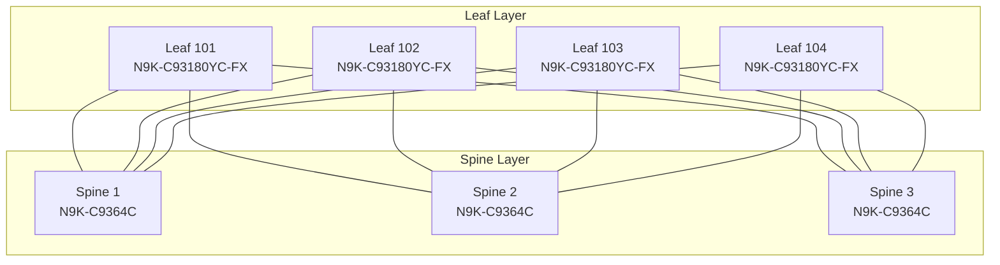
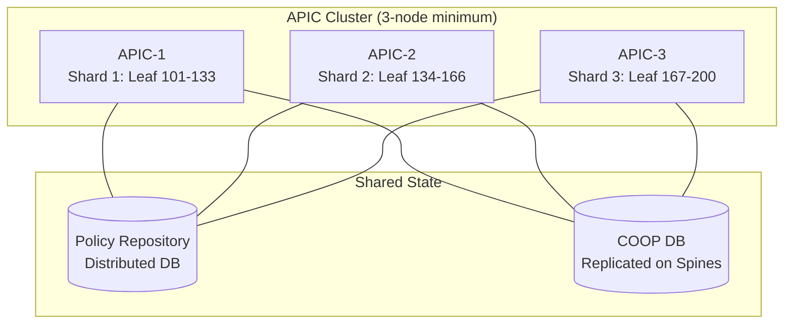
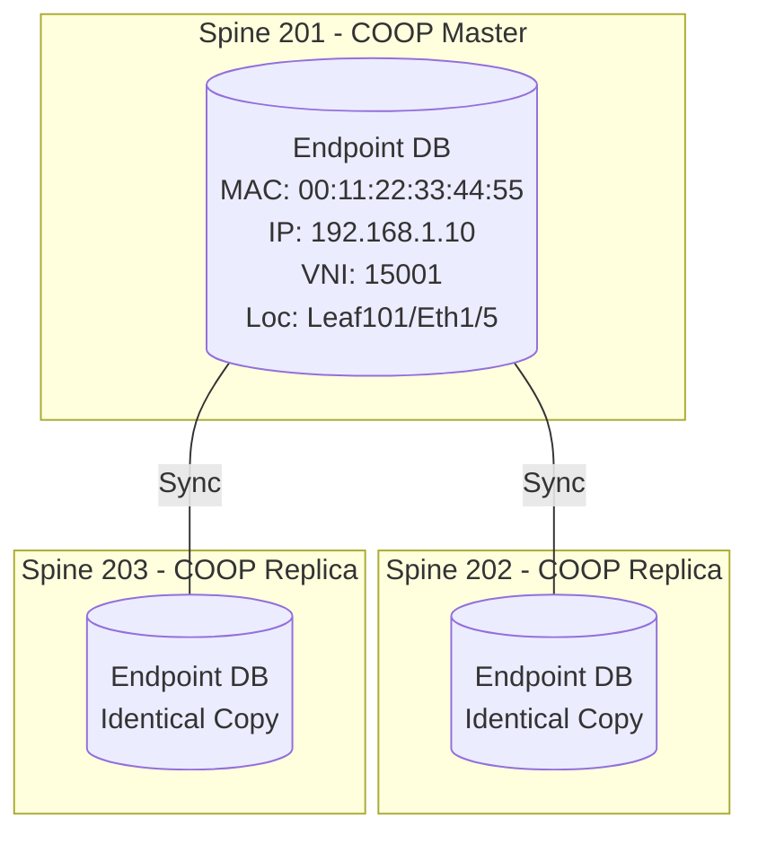
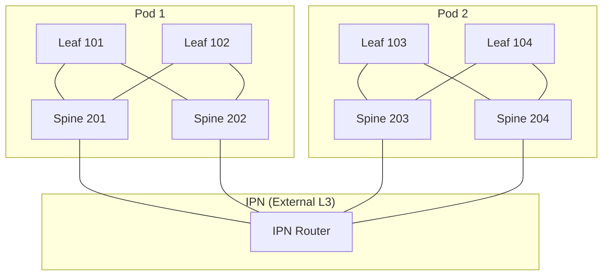

## ACI Architecture and Fabric Operations - CCIE DC v3.1 Deep Dive

> Reference: https://github.com/vikiev/aci-ccie-dc (Chapters 1-4)
> This document goes DEEPER on exam-critical fabric operations topics.

---


### ACI Architecture Deep Dive

#### Spine/Leaf Topology: Design Principles

The ACI fabric uses a **Clos network** (spine/leaf) topology. Understanding WHY this specific topology is non-negotiable for the exam.

**Why Full-Mesh (every leaf connects to every spine):**



**Design Rules (EXAM CRITICAL):**

| Rule | Reason |
|------|--------|
| Every leaf connects to EVERY spine | Equal-cost paths, predictable latency (1 hop leaf-to-leaf) |
| NO spine-to-spine links | Spines are transit-only; inter-spine traffic would break ECMP model |
| NO leaf-to-leaf links | All east-west traffic transits spines; direct leaf links create routing loops in IS-IS |
| Spines do NOT connect to endpoints | Spines are pure L3 transit + COOP database holders |
| Leaf-to-spine is always L3 | No L2 adjacency between leaf and spine (VXLAN overlay handles L2) |

> **CCIE Exam Tip:** If a question asks "why can't two leafs be directly connected?" the answer is: IS-IS underlay would form a direct adjacency creating a shortcut that bypasses the spine proxy model, breaking COOP endpoint location tracking and ECMP distribution.

**Latency Model:**
- Leaf-to-leaf (same pod): exactly 1 spine hop = ~5 microseconds
- Leaf-to-leaf (multi-pod): leaf -> spine -> IPN -> spine -> leaf = ~15-20 microseconds
- There is NO variation in hop count - this is the key advantage of Clos

#### Hardware: APIC Controllers

**APIC-L3 (APIC-L3):**
- 2RU server, Intel Xeon, 128GB RAM, 2x SSD (RAID1)
- 3x 40G QSFP+ (fabric connections) + 2x 10G SFP+ (mgmt)
- Runs APIC software (policy engine, COOP coordinator, GUI/REST)
- Minimum 3 per fabric (quorum requirement)
- Maximum 9 per fabric (3 clusters of 3 for geo-distribution)

**APIC-L4 (APIC-L4):**
- Same form factor, upgraded CPU/RAM for larger fabrics
- Supports up to 500+ leaf switches
- Required for fabrics > 200 nodes

**Nexus 9000 Switch Roles:**

| Platform | Role | Key Specs |
|----------|------|-----------|
| N9K-C93180YC-FX | Leaf | 48x 10/25G SFP28 + 6x 40/100G QSFP28 |
| N9K-C93180YC-EX | Leaf | 48x 10/25G + 6x 40/100G (older) |
| N9K-C9364C | Spine | 64x 40/100G QSFP28 (high radix) |
| N9K-C93600CD-GX | Spine | 28x 400G QSFP-DD (next-gen) |
| N9K-C9808 | Spine | Modular chassis, 8 slots, massive scale |
| N9K-C9300-GX | Leaf | 32x 100G QSFP28 |

> **CCIE Exam Tip:** Know that N9K-C9364C and N9K-C9808 are spine-optimized (high port density, no buffering for access). N9K-C93180YC-FX is the most common leaf. The exam may show SKUs and ask you to identify the role.

**APIC Cluster Architecture:**



**Sharding:**
- Each APIC "owns" a subset of leaf switches (its shard)
- Policy changes are computed by the owning APIC, then replicated
- ALL APICs hold a full copy of the policy model (for failover)
- Shard assignment is automatic based on node ID ranges

**Quorum and Failover (EXAM CRITICAL - know exact behavior):**

| APICs Down | Behavior |
|------------|----------|
| 1 of 3 down | Fabric fully operational. Remaining 2 APICs elect new leader. Shard redistributed. NO traffic impact. |
| 2 of 3 down | Fabric CONTINUES forwarding (policy cached on switches). NO new policy changes possible. GUI read-only. Existing endpoints continue to work. New endpoint learning still works (COOP on spines is independent). |
| All 3 down | Fabric CONTINUES forwarding indefinitely. All existing VXLAN tunnels, endpoints, contracts remain active. NO new configuration. NO new EPGs/BDs can be created. Switch reboots will rejoin with last-known config. |

> **CCIE Exam Tip:** The #1 exam question about APIC failure: "What happens to traffic when all APICs are down?" Answer: Traffic continues forwarding normally. The data plane is completely independent of the control plane (APIC). Policy is cached in hardware TCAM on every leaf.

> **Lab Exam Warning:** Do NOT reboot APICs during a lab exam unless specifically instructed. If you must, do ONE at a time and wait for cluster to stabilize (show cluster status = "fully-fit").

#### APIC-to-Switch Communication

**Protocol: SSL/TLS over TCP port 443**

```text
APIC (controller) <--SSL/TLS--> Leaf/Spine (managed node)

Communication flow:
1. APIC pushes policy as XML/JSON over SSL
2. Switch acknowledges receipt
3. Switch compiles policy to hardware (TCAM entries)
4. Switch reports compilation status back to APIC
5. APIC updates health score based on success/failure
```

**Heartbeat Mechanism:**
- APIC sends heartbeat every 10 seconds to each managed node
- If 3 consecutive heartbeats missed (30s), node marked "inactive"
- Inactive node: APIC raises fault F0532 (node unreachable)
- Node continues forwarding traffic even when marked inactive
- When node recovers, it syncs missed policy updates automatically

**Policy Versioning:**
- Every policy change increments a global revision counter
- Each switch tracks its "applied revision" vs "current revision"
- If switch falls behind (e.g., during reboot), it requests delta from APIC
- Full sync only needed if delta exceeds threshold (rare)

**Verification Commands:**

```nxos
show controller internal debug epm stats
show fabric internal event-history
show system internal connection-stats
```

On APIC CLI:
```text
acidiag fnvread          (show all fabric nodes and status)
acidiag avread           (show APIC cluster status)
show cluster status      (detailed cluster health)
```

#### Data Path Independence

**Critical Concept: Policy is CACHED on Switches**

When APIC pushes a contract (e.g., allow HTTP from EPG-Web to EPG-App):
1. APIC compiles the contract into "zoning rules"
2. Zoning rules are pushed to EVERY leaf in the fabric
3. Each leaf programs rules into hardware TCAM
4. Traffic matching happens entirely in hardware (ASIC)
5. APIC is NOT in the data path - never has been

**What this means operationally:**
- APIC can be completely offline: traffic flows continue
- New flows that match existing policies: work fine
- New EPGs created while APIC is down: impossible (need APIC)
- Endpoint moves while APIC is down: COOP handles this (spines are independent)

---

### Underlay Fabric

#### IS-IS Underlay: Why IS-IS and Not OSPF

**APIC auto-provisions IS-IS as the underlay IGP. You cannot change this.**

| Factor | IS-IS (ACI choice) | OSPF (not used) |
|--------|-------------------|-----------------|
| L2/L3 native | IS-IS is L2 protocol, runs directly on Ethernet | OSPF requires IP to run |
| Bootstrap | No IP needed to form adjacency (uses MAC) | Needs IP addressing first (chicken-and-egg) |
| Scalability | Better for large L2 topologies | Area design complexity |
| VXLAN fit | TEP IPs can be assigned AFTER IS-IS converges | OSPF needs IPs before adjacency |
| Multi-instance | Easy to run multiple IS-IS instances | OSPF multi-instance is clunky |

> **CCIE Exam Tip:** The exam may ask "why IS-IS?" The key answer: IS-IS can form adjacencies using MAC addresses before any IP addressing exists. This allows APIC to auto-provision the fabric without pre-configuring IP addresses on interfaces.

**IS-IS Configuration (auto-provisioned, read-only):**
- IS-IS area: 1 (fixed)
- IS-IS level: Level-2 only (no L1/L2 hierarchy)
- Hello interval: 10 seconds
- Hold time: 30 seconds (3x hello)
- Authentication: HMAC-MD5 (auto-generated key per fabric)
- MTU: 9144 (jumbo, matches fabric MTU)

**Verification Commands:**

```nxos
show isis neighbors
show isis interface
show isis database
show isis route
show routing ipv6
```

Example output:
```text
leaf101# show isis neighbors

Tag aci-underlay:
  System Id    Type Interface   IP Address      State
  spine201     L2   Eth1/49     10.0.0.1        UP
  spine202     L2   Eth1/50     10.0.0.2        UP
  spine203     L2   Eth1/51     10.0.0.3        UP
```

#### TEP (Tunnel Endpoint) Pool

**What is the TEP Pool:**
- A block of IP addresses reserved for VTEP (VXLAN Tunnel Endpoint) assignment
- Configured during initial fabric setup
- Typically a /16 (e.g., 10.0.0.0/16) or /24 for small fabrics
- APIC assigns individual /32 addresses from this pool to each switch

**TEP Assignment Process:**
1. During setup wizard, admin provides TEP pool (e.g., 10.0.0.0/16)
2. APIC assigns a /32 from pool to each switch's loopback0
3. Assignment is sequential: first switch gets .1, second gets .2, etc.
4. Spines get addresses from the same pool (no separate spine pool)
5. TEP addresses are permanent - they survive reboots and firmware upgrades

**Example TEP assignments:**
```text
Spine 201: loopback0 = 10.0.0.1/32
Spine 202: loopback0 = 10.0.0.2/32
Leaf 101:  loopback0 = 10.0.0.3/32
Leaf 102:  loopback0 = 10.0.0.4/32
Leaf 103:  loopback0 = 10.0.0.5/32
```

> **Lab Exam Warning:** The TEP pool CANNOT be changed after fabric setup without a complete factory reset. If the exam gives you a TEP pool, use it exactly as specified. Do not "improve" it.

**Verification:**

```nxos
show interface loopback0
show ip interface brief | include loopback
show fabric isis database detail
```

#### Spine Proxy Model

**Spines act as VTEP proxies - this is fundamental to ACI.**

In a traditional VXLAN network, leaf switches maintain a full mapping of remote VTEPs. In ACI:

1. Leaf 101 wants to send traffic to an endpoint on Leaf 104
2. Leaf 101 does NOT know Leaf 104's TEP address directly
3. Leaf 101 sends the VXLAN packet to a SPINE (using spine TEP as outer dst IP)
4. Spine looks up destination in COOP database
5. Spine rewrites outer destination IP to Leaf 104's TEP
6. Spine forwards to Leaf 104

**Why spine proxy?**
- Leaf switches don't need full-mesh VXLAN tunnels to every other leaf
- Spine holds the authoritative endpoint location database (COOP)
- Endpoint moves only update spine COOP, not every leaf
- Scales to thousands of leafs without N-squared tunnel problem

**Inner vs Outer headers in VXLAN:**

```text
+----------------------------------------------------------+
| Outer Ethernet | Outer IP (src=leaf TEP, dst=spine TEP)  |
| Outer UDP (dst port 4789) | VXLAN Header (VNI)          |
| Inner Ethernet (original frame) | Inner IP (endpoint)    |
| Inner Payload                                            |
+----------------------------------------------------------+
```

After spine proxy rewrite:
```text
Outer IP dst changes: spine TEP -> destination leaf TEP
Everything else remains unchanged
```

> **CCIE Exam Tip:** VXLAN UDP destination port in ACI is 4789 (standard). The VNI in ACI maps to the BD/EPG - specifically, each BD gets a unique VNI. EPGs within the same BD share the same VNI but use different pcTag (policy group tag) for contract enforcement.

#### ECMP (Equal-Cost Multi-Path)

**Path Calculation:**
- With 3 spines and 4 leafs: each leaf has 3 equal-cost paths to any other leaf
- Maximum supported: 16 ECMP paths (hardware dependent)
- Typical deployment: 2-4 spines = 2-4 ECMP paths

**Hash Algorithm:**
- Default: source-IP + destination-IP + source-port + destination-port + protocol
- Configurable via fabric policy (but rarely changed in exam)
- Hash is computed on OUTER headers (VXLAN encapsulated)
- This means: two different inner flows may hash to same spine (normal)

**ECMP Verification:**

```nxos
show ip route 10.0.0.5
show forwarding ipv4 route 10.0.0.5
```

Example:
```text
leaf101# show ip route 10.0.0.5
  10.0.0.5/32, ubest/mbest: 3/0
    via 10.0.0.1, Eth1/49, [115/10], isis
    via 10.0.0.2, Eth1/50, [115/10], isis
    via 10.0.0.3, Eth1/51, [115/10], isis
```

#### MTU and Jumbo Frames

**Default Fabric MTU: 9000 bytes (jumbo frames)**

Why jumbo frames matter for VXLAN:
- VXLAN adds 50 bytes overhead (14 outer Eth + 20 outer IP + 8 UDP + 8 VXLAN)
- Inner frame of 1500 bytes becomes 1550 bytes after VXLAN encap
- Without jumbo frames: fragmentation or drops
- With 9000 MTU: inner frames up to 8950 bytes fit without fragmentation

**MTU Configuration:**
- Fabric MTU set during setup (default 9000, cannot exceed 9216)
- Applied to ALL fabric interfaces automatically
- Access port MTU: configurable per interface policy (default 9000)
- If endpoint sends > access MTU: frame dropped (no fragmentation in ACI)

> **CCIE Exam Tip:** If you see MTU-related drops in the exam, check: (1) fabric MTU vs access port MTU, (2) VXLAN overhead (50 bytes), (3) whether the endpoint is sending jumbo frames into a non-jumbo access port.

**Verification:**

```nxos
show interface ethernet 1/1 | include MTU
show system mtu
show interface counters errors
```

---

### COOP (Council of Oracles Protocol)

#### Overview: Runs on SPINES Only

COOP is the endpoint location database protocol. It runs EXCLUSIVELY on spine switches.

**What COOP stores (per endpoint):**
- MAC address
- IP address (all IPs associated with that MAC)
- VNI (which EPG/BD the endpoint belongs to)
- Location: leaf TEP + physical port
- Timestamp (for aging)
- Flags: local/remote, static/dynamic, bounce entry

**COOP Database Structure:**



#### COOP Lookup Flow (EXAM CRITICAL)

**Scenario: Leaf 101 receives a frame destined for an endpoint on Leaf 104**

```text
Step 1: Leaf 101 receives frame on Eth1/5 (access port)
Step 2: Leaf 101 checks LOCAL endpoint table
        -> Destination MAC NOT found locally
Step 3: Leaf 101 sends COOP query to Spine (via SSL/TCP 443)
        Query: "Where is MAC 00:AA:BB:CC:DD:EE in VNI 15001?"
Step 4: Spine checks COOP database
        -> Found: MAC 00:AA:BB:CC:DD:EE is on Leaf 104, Eth1/12
        -> Leaf 104 TEP = 10.0.0.6
Step 5: Spine responds to Leaf 101 with location info
Step 6: Leaf 101 encapsulates frame in VXLAN
        Outer dst IP = 10.0.0.6 (Leaf 104 TEP)
        VNI = 15001
Step 7: Leaf 101 forwards to spine (normal L3 routing)
Step 8: Spine forwards to Leaf 104
Step 9: Leaf 104 decapsulates, delivers to Eth1/12
```

**Key Point:** After Step 5, Leaf 101 CACHES the remote endpoint location. Subsequent frames to the same destination do NOT trigger another COOP query.

#### COOP vs Traditional ARP/Flooding

| Traditional Network | ACI with COOP |
|--------------------|--------------|
| Unknown unicast: FLOOD to all ports in VLAN | Unknown unicast: query COOP, unicast to correct leaf |
| ARP broadcast to entire subnet | ARP handled by leaf (proxy ARP) or COOP lookup |
| MAC table: local only, learned by flooding | MAC table: global, learned via COOP database |
| STP blocks redundant paths | All paths active (ECMP), no STP |
| Broadcast storm risk | No broadcast storms (flooding is controlled) |

> **CCIE Exam Tip:** ACI eliminates broadcast storms by design. Unknown unicast is NOT flooded by default - it goes to COOP. ARP can be handled by the leaf (proxy ARP) without broadcasting. This is a fundamental difference from traditional L2 networks.

#### COOP Database Aging

**Default Timers:**
- Endpoint aging timer: 180 seconds (3 minutes)
- Refresh mechanism: any traffic FROM the endpoint resets the timer
- If no traffic seen for 180s: endpoint marked "stale"
- Stale endpoint: COOP sends a "bounce" GARP to verify endpoint still exists
- If no response to bounce: endpoint removed from COOP database

**Bounce Entry:**
- When an endpoint ages out, a "bounce entry" is created on the spine
- Bounce entry: tells other leafs "this endpoint was here, but is now unconfirmed"
- If traffic arrives for a bounce entry: leaf floods within the BD (temporary)
- Bounce entries last 630 seconds before full removal

**COOP GARP (Gratuitous ARP on Endpoint Move):**
- When endpoint moves from Leaf 101 to Leaf 104:
  1. Leaf 104 learns endpoint locally (sees frame on access port)
  2. Leaf 104 reports new location to spine COOP
  3. Spine updates database: location = Leaf 104
  4. Spine sends GARP notification to Leaf 101 (old location)
  5. Leaf 101 removes stale local entry
  6. Spine notifies ALL leafs that had cached the old location

> **Lab Exam Warning:** If endpoints are flapping between leafs in the lab, check for: (1) duplicate MAC addresses, (2) misconfigured port-channels causing MAC flaps, (3) STP misconfiguration on external switches connected to ACI leafs.

#### COOP Verification Commands

```nxos
show coop internal ip-mac-vni all
show coop internal ip-mac-vni vni 15001
show endpoint internal
show endpoint mac 00:11:22:33:44:55
show endpoint ip 192.168.1.10
show endpoint vni 15001
show endpoint internal flags bounce
show endpoint internal flags remote
```

On spine:
```nxos
show coop internal ip-mac-vni all detail
show coop internal stats
show coop internal event-history
```

Example output:
```text
spine201# show coop internal ip-mac-vni all

Flags: L - Local, R - Remote, B - Bounce, S - Static
MAC               IP              VNI     Flags   Leaf    Port
00:11:22:33:44:55 192.168.1.10   15001   L       101     Eth1/5
00:AA:BB:CC:DD:EE 192.168.1.20   15001   R       104     Eth1/12
00:11:22:33:44:66 192.168.2.10   15002   L       102     Eth1/3
```

---

### Endpoint Learning

#### Local Endpoint Learning

When a leaf switch sees a frame on an access port:

```text
1. Frame arrives on Eth1/5 (assigned to EPG-Web, VLAN 101)
2. Leaf extracts: source MAC, source IP (if L3), VLAN -> VNI mapping
3. Leaf creates LOCAL endpoint entry:
   - MAC: 00:11:22:33:44:55
   - IP: 192.168.1.10 (if IP present in frame)
   - VNI: 15001 (mapped from VLAN 101)
   - Location: local, Eth1/5
   - Timestamp: current time
4. Leaf reports endpoint to spine COOP (asynchronous)
5. Leaf programs hardware forwarding entry (TCAM)
```

**Important:** Endpoint learning is DATA-DRIVEN. The leaf learns endpoints by observing traffic, not by configuration.

#### Remote Endpoint Learning

Two methods:

**Method 1: COOP Query (on-demand)**
- Leaf needs to send traffic to unknown destination
- Queries spine COOP for location
- Receives response with remote leaf TEP + port
- Caches result locally (marked as "remote")

**Method 2: VXLAN Decap (passive)**
- Leaf receives VXLAN-encapsulated traffic from remote leaf
- Inner source MAC/IP is extracted during decap
- Leaf creates remote endpoint entry for the source
- No COOP query needed (learned from data plane)

#### Endpoint Move Detection

**MAC Move:**
- Same MAC seen on different port (same leaf): port move
- Same MAC seen on different leaf: leaf move (COOP update)
- Rapid moves (>3 in 10 seconds): flagged as "MAC flap"
- MAC flap triggers: syslog, fault F1556, potential port shutdown (if configured)

**IP Move:**
- Same IP seen with different MAC: possible IP conflict
- Same IP seen on different leaf: endpoint migration
- IP move is normal for VM migration (vMotion)

**Rogue Endpoint Detection:**
- Endpoint appears in wrong EPG (VLAN not assigned to that EPG)
- Endpoint uses IP outside its BD subnet (if "Limit IP Learning to Subnet" enabled)
- Rogue EP triggers fault F1385
- Action: endpoint NOT learned, traffic dropped

#### Endpoint Retention Timers

| Timer | Default | Purpose |
|-------|---------|---------|
| Aging timer | 180s | Remove endpoint if no traffic seen |
| Bounce timer | 630s | Keep bounce entry after aging |
| Retention timer (remote) | 300s | Keep remote endpoint cache |
| Hold-down (move) | 0s (disabled) | Prevent rapid re-learning after move |

> **CCIE Exam Tip:** Endpoint retention is configured under: Tenant > Bridge Domain > L2 Configuration > Endpoint Retention Policy. The exam may ask you to adjust these timers for specific scenarios (e.g., VMs that are frequently migrated).

#### Endpoint Verification

```nxos
show endpoint
show endpoint vni 15001
show endpoint ip 192.168.1.10
show endpoint mac 00:11:22:33:44:55
show endpoint internal
show endpoint internal flags local
show endpoint internal flags remote
show endpoint internal flags bounce
show endpoint internal flags peer
show endpoint summary
```

---

### Fabric Discovery and Setup

#### Initial Setup Wizard

When APICs are first powered on, the setup wizard runs automatically on APIC-1:

**Required Parameters:**

| Parameter | Example | Notes |
|-----------|---------|-------|
| Admin password | Str0ng!Pass | Minimum 8 chars, complexity required |
| TEP pool | 10.0.0.0/16 | CANNOT be changed later |
| Fabric MTU | 9000 | Default, rarely changed |
| NTP server | 172.16.1.1 | Required for cert generation |
| DNS server | 8.8.8.8 | Optional but recommended |
| Domain name | lab.local | Used for certificates |
| Pod ID | 1 | Default 1, change for multi-pod |

**GUI Path:** `Fabric > Fabric Policies > Setup` (post-setup)

> **Lab Exam Warning:** If the exam provides a pre-configured fabric, DO NOT run setup wizard again. If you see the setup screen, the fabric has been reset - this is a problem. Report to proctor.

#### Switch Discovery Process

**LLDP-Based Discovery:**

```text
1. New switch powered on with factory-default config
2. Switch sends LLDP frames on all ports (default enabled)
3. Existing fabric leaf/spine receives LLDP from new switch
4. LLDP information forwarded to APIC
5. APIC identifies switch by: serial number + model (PID)
6. Admin must REGISTER the switch in APIC:
   - Fabric > Inventory > Fabric Membership
   - Enter: Node ID, Name, Role (leaf/spine)
7. APIC pushes initial configuration to new switch
8. Switch downloads firmware image from APIC
9. Switch reboots into ACI mode
10. Switch joins fabric, forms IS-IS adjacencies
```

**Firmware Management:**
- APIC stores firmware images (uploaded to APIC)
- Auto-install: new switches automatically get fabric's target firmware
- Manual: maintenance policy controls upgrade timing
- Firmware location on APIC: `/firmware/` directory

**Verification:**

```nxos
show fabric path
show lldp neighbors
show lldp neighbors detail
show version
show install all status
```

On APIC:
```text
acidiag fnvread
show firmware repository
show maintenance policy
```

#### Pod Architecture (Multi-Pod)

**Single Pod (default):**
- All leafs and spines in one pod
- Pod ID = 1
- All spines run COOP for the entire fabric

**Multi-Pod:**
- Multiple pods connected via IPN (Inter-Pod Network)
- Each pod has its own spines (and COOP database)
- IPN: external L3 network connecting pod spines
- Pod ID range: 1-255
- Each pod needs unique TEP pool (or shared with /16 split)



**IPN Requirements:**
- L3 connectivity between all pod spines
- MTU >= 9000 (jumbo frames for VXLAN transit)
- BGP or static routing between pods
- Multicast NOT required (ACI uses head-end replication or BGP EVPN)

---

### Fabric Operations

#### Graceful Maintenance

**Maintenance Policy:**
- GUI: `Admin > Firmware > Maintenance Policies`
- Defines: WHEN and HOW nodes are upgraded/rebooted
- Options:
  - Immediate: upgrade now
  - Scheduled: specific date/time window
  - Paused: manual trigger required
- Graceful: drains traffic before reboot (PC/VPC aware)

**Reboot Process (graceful):**
```text
1. APIC sends "drain" command to leaf
2. Leaf stops learning new endpoints
3. Leaf waits for in-flight transactions to complete (30s max)
4. If VPC: peer takes over (no traffic loss)
5. Leaf reloads
6. Leaf reboots, loads new firmware
7. Leaf re-forms IS-IS adjacencies
8. Leaf syncs policy from APIC
9. Leaf resumes forwarding
```

#### Firmware Upgrade Order (EXAM CRITICAL)

**Correct Order:**
1. Upload firmware to APIC
2. Upgrade APIC cluster FIRST (all 3 APICs)
3. Upgrade SPINES second
4. Upgrade LEAFS last

**Why this order:**
- APIC must run >= switch firmware version (always)
- Spines before leafs: COOP database compatibility
- If you upgrade leafs before APIC: APIC may not understand new features

> **CCIE Exam Tip:** If the exam asks about firmware upgrade order, it's ALWAYS: APIC -> Spines -> Leafs. Reversing this order causes compatibility faults and potential traffic disruption.

> **Time Trap:** Firmware upgrades take 15-20 minutes per node. In a lab exam, you will NOT have time to actually upgrade firmware. The exam will test your knowledge of the PROCESS, not make you wait for actual upgrades.

#### Configuration Rollback

**Snapshots:**
- GUI: `Admin > Config Rollbacks`
- Automatic snapshot: before every policy commit
- Manual snapshot: admin-triggered
- Retention: configurable (default 5 most recent)
- Rollback: select snapshot > apply > confirm

**Config Export/Import:**
- Export: `Admin > Import/Export > Export Policies`
- Format: JSON or XML
- Scope: entire fabric, specific tenant, or specific policy
- Import: reverse process, merges or replaces

#### Fabric Health and Faults

**Health Scores:**
- Range: 0-100 (100 = perfect)
- Calculated per: node, tenant, EPG, interface, overall fabric
- GUI: `Dashboard > Health Scores`
- Score < 65: considered "critical"
- Score affects: fault severity calculation

**Fault Lifecycle:**

```text
raised -> soaking -> raised (if persists) -> cleared (if resolved)

States:
- raised: fault is active
- soaking: fault was raised, waiting to see if it clears (debounce)
- cleared: fault resolved, in retention period
- clearing: transitioning from raised to cleared
```

**Common Faults (know these for exam):**

| Fault ID | Description | Typical Cause |
|----------|-------------|---------------|
| F0532 | Node unreachable | Switch powered off / cable disconnected |
| F1556 | MAC flap detected | Loop or misconfigured port-channel |
| F1385 | Rogue endpoint | EP in wrong VLAN/EPG |
| F0467 | Interface down | Cable/SFP failure |
| F1264 | Firmware mismatch | Upgrade in progress |
| F2500 | IS-IS adjacency down | MTU mismatch / auth failure |

**Verification:**

```nxos
show fault
show fault severity critical
show fault lifecycle
show health
show health detail
```

On APIC:
```text
show faults
show faults severity critical
show health-score all
```

#### Backup and Restore

**APIC Backup:**
- GUI: `Admin > Import/Export > Remote Locations`
- Configure: SCP/SFTP server for backup storage
- Automatic backup: configurable schedule (daily/weekly)
- Contents: full policy model, AAA config, certificates
- Does NOT include: firmware images, endpoint database (dynamic)

**Restore:**
- Only to same-size or larger APIC cluster
- Restore overwrites ALL existing configuration
- Endpoint database rebuilt automatically after restore
- Firmware NOT restored (must be re-uploaded if needed)

#### AAA (Authentication, Authorization, Accounting)

**Supported Methods:**
- Local users (APIC internal database)
- RADIUS (UDP 1812/1813)
- TACACS+ (TCP 49)
- LDAP (TCP 389/636)

**Configuration Order:**
1. Create remote location (for RADIUS/TACACS+ server)
2. Create AAA provider (specify server, key, timeout)
3. Create login domain (associate provider)
4. Set default login domain (or per-user)
5. Create roles (if custom RBAC needed)

**Default Roles:**
- admin: full access
- read-only: view only
- vrf-admin: VRF/BD management only
- tenant-admin: specific tenant access

**Verification:**

```text
show aaa users
show aaa sessions
show aaa providers
show role
```

---

### Lab 1: Fabric Verification and Health Check

#### Objective
Verify complete fabric health: all nodes discovered, IS-IS converged, TEPs reachable, endpoints learning.

#### Step 1: Verify All Nodes Discovered

On APIC CLI:
```text
apic1# acidiag fnvread

ID   Name        Type     State     IP           Version
201  spine201    spine    active    10.0.0.1     6.0(2h)
202  spine202    spine    active    10.0.0.2     6.0(2h)
101  leaf101     leaf     active    10.0.0.3     6.0(2h)
102  leaf102     leaf     active    10.0.0.4     6.0(2h)
103  leaf103     leaf     active    10.0.0.5     6.0(2h)
```

Expected: ALL nodes show "active" state.

#### Step 2: Verify IS-IS Neighbors

On each leaf:
```nxos
leaf101# show isis neighbors

Tag aci-underlay:
  System Id    Type Interface   IP Address      State   Uptime
  spine201     L2   Eth1/49     10.0.0.1        UP      5d12h
  spine202     L2   Eth1/50     10.0.0.2        UP      5d12h
```

Expected: One adjacency per spine, all UP.

#### Step 3: Verify TEP Reachability

```nxos
leaf101# ping 10.0.0.1
leaf101# ping 10.0.0.2
leaf101# ping 10.0.0.4
leaf101# ping 10.0.0.5
```

All pings should succeed (IS-IS advertises all loopback0 /32s).

#### Step 4: Check Health Scores

On APIC:
```text
apic1# show health-score all

Object              Score   Description
fabric              100     Overall fabric health
node-201            100     spine201
node-202            100     spine202
node-101            98      leaf101 (minor interface fault)
node-102            100     leaf102
```

#### Step 5: Check Faults

```text
apic1# show faults severity critical
apic1# show faults severity warning
```

Expected: Zero critical faults in a healthy fabric.

#### Step 6: Verify Firmware Versions

```nxos
leaf101# show version
Cisco Nexus Operating System (NX-OS) Software
  Software Version: 6.0(2h)
  Kernel Version: 5.2
```

All nodes should run the SAME firmware version.

#### Step 7: Verify Endpoint Learning

```nxos
leaf101# show endpoint

VLAN  Domain  MAC             IP              IfIdx  Flags
101   prod    00:11:22:33:44:55 192.168.1.10  Eth1/5 L
101   prod    00:AA:BB:CC:DD:EE 192.168.1.20  -      R
```

Flags: L = Local (on this leaf), R = Remote (learned via COOP)

---

### Lab 2: Firmware Upgrade Simulation

#### Objective
Understand the firmware upgrade process and verification steps.

#### Step 1: Upload Firmware to APIC

GUI Path: `Admin > Firmware > Images > Add Image`
- Select: SCP/SFTP location or local file
- Upload: n9000-dk9.6.0.3g.bin
- Wait for upload completion (verify in Images list)

#### Step 2: Create Maintenance Policy

GUI Path: `Admin > Firmware > Maintenance Policies > Create`

```text
Name: upgrade-pod1
Scheduler: on-demand
Run Mode: paused (manual trigger)
Graceful: yes
Ignore Compat: no
```

#### Step 3: Upgrade APICs First

GUI Path: `Admin > Firmware > Controllers`
- Select all 3 APICs
- Set target version: 6.0(3g)
- Apply maintenance policy
- APICs upgrade ONE AT A TIME (automatic)
- Wait for each APIC to rejoin cluster before next

Verification during upgrade:
```text
apic1# show cluster status
Cluster is fully-fit: yes
Leader: apic2
```

#### Step 4: Upgrade Spines

GUI Path: `Admin > Firmware > Spines`
- Select all spines
- Set target version: 6.0(3g)
- Spines upgrade one at a time (graceful)
- COOP database maintained by remaining spines during upgrade

Verification:
```nxos
spine201# show version
spine201# show coop internal stats
```

#### Step 5: Upgrade Leafs

GUI Path: `Admin > Firmware > Leafs`
- Select all leafs (or group by VPC pair)
- VPC pairs upgrade together (one at a time within pair)
- Non-VPC leafs: one at a time

Verification after upgrade:
```nxos
leaf101# show version
leaf101# show isis neighbors
leaf101# show endpoint
leaf101# show interface status
```

#### Step 6: Post-Upgrade Verification

```text
apic1# acidiag fnvread        (all nodes active, same version)
apic1# show faults           (no new faults)
apic1# show health-score all (all scores 100)
```

> **Lab Exam Warning:** If you accidentally start a firmware upgrade in the exam, CANCEL IT IMMEDIATELY. You cannot complete a firmware upgrade within exam time, and nodes going down will break your lab.

---

### Key Takeaways: Architecture and Fabric

1. **APIC is NOT in the data path.** Traffic forwarding is 100% hardware-based on leaf ASICs. APIC failure = no new config, but existing traffic flows forever.

2. **COOP runs on SPINES ONLY.** It's the global endpoint database. Leafs query spines for remote endpoint locations.

3. **IS-IS underlay is auto-provisioned.** You cannot change the IGP. It uses MAC-based adjacencies (no IP needed for bootstrap).

4. **Spine proxy model:** Leafs send VXLAN to spines, spines rewrite destination to correct leaf TEP. Leafs never need full-mesh tunnels.

5. **Firmware order: APIC -> Spines -> Leafs.** Always. No exceptions.

6. **TEP pool is permanent.** Set during initial setup, cannot be changed without factory reset.

7. **Endpoint learning is data-driven.** Leafs learn by observing traffic, report to COOP, cache remote endpoints.

8. **Fault lifecycle: raised -> soaking -> cleared.** Health scores range 0-100. Critical faults need immediate attention.

---

### Complete Verification Command Reference

```nxos
show fabric path
show isis neighbors
show isis database
show isis interface
show ip route
show interface loopback0
show interface ethernet 1/1
show endpoint
show endpoint vni 15001
show endpoint ip 192.168.1.10
show endpoint mac 00:11:22:33:44:55
show endpoint internal
show endpoint internal flags bounce
show coop internal ip-mac-vni all
show coop internal stats
show version
show lldp neighbors
show fault
show health
show system mtu
show forwarding ipv4 route
show hardware internal access-listmgr info
show install all status
show firmware repository
```

APIC CLI:
```text
acidiag fnvread
acidiag avread
show cluster status
show faults
show health-score all
show aaa users
show firmware repository
```

---

### Advanced Fabric Topics

#### VXLAN Encapsulation Details

**VXLAN Header Format (8 bytes):**
```text
 0                   1                   2                   3
 0 1 2 3 4 5 6 7 8 9 0 1 2 3 4 5 6 7 8 9 0 1 2 3 4 5 6 7 8 9 0 1
+-+-+-+-+-+-+-+-+-+-+-+-+-+-+-+-+-+-+-+-+-+-+-+-+-+-+-+-+-+-+-+-+
|R|R|R|R|I|R|R|R|            Reserved                           |
+-+-+-+-+-+-+-+-+-+-+-+-+-+-+-+-+-+-+-+-+-+-+-+-+-+-+-+-+-+-+-+-+
|                VXLAN Network Identifier (VNI)       |Reserved |
+-+-+-+-+-+-+-+-+-+-+-+-+-+-+-+-+-+-+-+-+-+-+-+-+-+-+-+-+-+-+-+-+
```

**ACI VNI Assignments:**
- VNIs are auto-assigned by APIC from a pool (starting at 15001)
- Each Bridge Domain gets a unique VNI
- EPGs within the same BD share the VNI but differ by pcTag
- pcTag (Policy Group Tag): 16-bit identifier for contract enforcement
- VNI range: 1-16,777,215 (24-bit field)

**VXLAN UDP Port:** 4789 (IANA standard, same as RFC 7348)

> **CCIE Exam Tip:** Know the difference between VNI and pcTag. VNI identifies the L2 segment (Bridge Domain). pcTag identifies the policy group (EPG) for contract matching. Two EPGs in the same BD have the SAME VNI but DIFFERENT pcTags.

#### Fabric Internal VLANs (IVLANs)

ACI uses internal VLANs for fabric operations:
- IVLAN range: 4000-4095 (reserved, not user-configurable)
- Used for: IS-IS underlay adjacencies, COOP communication
- NOT visible in `show vlan` on leaf access ports
- Each fabric link (leaf-to-spine) gets a unique IVLAN for IS-IS

#### Fabric Link Utilization and Monitoring

**Link State Tracking:**
- Fabric links (leaf-to-spine) are monitored via IS-IS hellos
- If a fabric link goes down: IS-IS reconverges (< 1 second)
- Traffic automatically shifts to remaining spines (ECMP)
- No manual intervention needed

**Optical Monitoring:**

```nxos
show interface ethernet 1/49 transceiver
show interface ethernet 1/49 counters
show interface ethernet 1/49 | include rate|error|drop
```

#### Multi-Destination Traffic Handling

**Broadcast, Unknown Unicast, Multicast (BUM) in ACI:**

| Traffic Type | Default Behavior | Alternative |
|-------------|-----------------|-------------|
| Broadcast | Flood within BD (all EPGs in BD) | Cannot disable for ARP |
| Unknown Unicast | Proxy (query COOP) | Flood in BD (legacy mode) |
| Multicast | Flood in BD | PIM (if L3 multicast enabled) |

**Head-End Replication (default for BUM):**
- Ingress leaf replicates packet for each remote leaf in the BD
- No multicast group needed in underlay
- Scales well for small-medium BDs
- For large BDs: enable PIM multicast in underlay (ingress replication -> PIM)

**PIM in Underlay (optional):**
- Configured per BD: Multi-Destination Flooding = "Flood in Encap"
- Requires: PIM RP configured in fabric
- Spine acts as RP (auto-configured)
- Reduces replication load on ingress leaf for large BDs

> **CCIE Exam Tip:** Default BUM handling is head-end replication (ingress replication). The exam may ask when to switch to PIM: when a BD has endpoints on many leafs (>10) and BUM traffic volume is high.

#### Fabric Security

**Control Plane Security:**
- APIC-to-switch: TLS 1.2+ (certificates auto-generated during setup)
- COOP queries: TLS encrypted
- IS-IS authentication: HMAC-MD5 (auto-key, per-fabric)
- Management access: HTTPS only (HTTP redirects to HTTPS)

**Data Plane Security:**
- VXLAN provides segment isolation (VNI boundary)
- Contracts enforce L3/L4 policy between EPGs
- No inter-EPG traffic without explicit contract (default deny)
- Rogue endpoint detection prevents unauthorized access

**Certificate Management:**
- APIC generates self-signed CA during setup
- Each switch gets a certificate signed by APIC CA
- Certificates used for: APIC-switch SSL, APIC-APIC cluster comm
- Expiry: 10 years (auto-renewed by APIC)
- GUI: `Admin > System > Certificates`

#### Troubleshooting Fabric Issues

**Symptom: Leaf not joining fabric**
```text
1. Check physical connectivity (LLDP visible?)
2. Verify serial number is registered in APIC
3. Check firmware compatibility
4. Verify TEP pool has available addresses
5. Check IS-IS authentication (auto, but verify not corrupted)
```

**Symptom: Endpoint not learning**
```text
1. Verify port is assigned to correct EPG (show endpoint)
2. Check VLAN encap matches (show vlan)
3. Verify BD has unicast routing enabled (if L3 needed)
4. Check "Limit IP Learning to Subnet" (may block EP)
5. Verify no rogue EP detection blocking (show fault F1385)
```

**Symptom: Intermittent connectivity**
```text
1. Check for MAC flaps (show fault F1556)
2. Verify all IS-IS neighbors UP (show isis neighbors)
3. Check for interface errors (show interface counters)
4. Verify MTU consistency (show system mtu)
5. Check COOP database consistency (show coop internal)
```

> **Time Trap:** In the lab exam, if connectivity fails, do NOT start rebuilding config. First run: show endpoint, show isis neighbors, show fault. 90% of issues are: wrong VLAN encap, missing static binding, or contract not applied.
