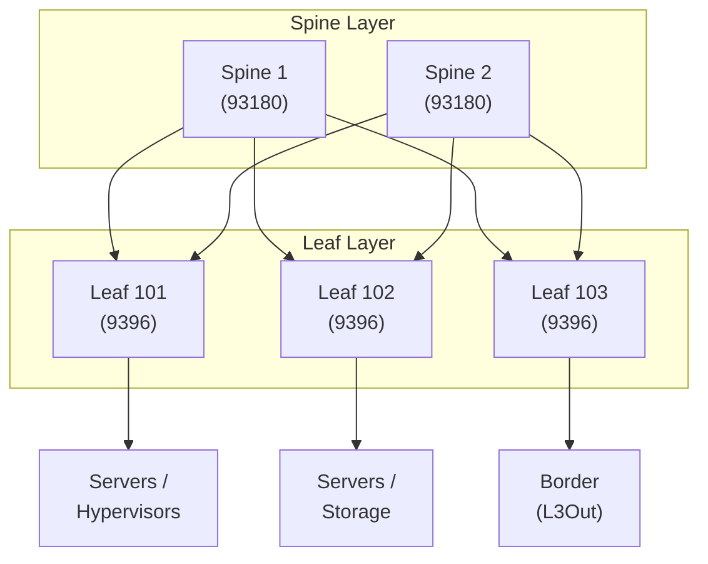
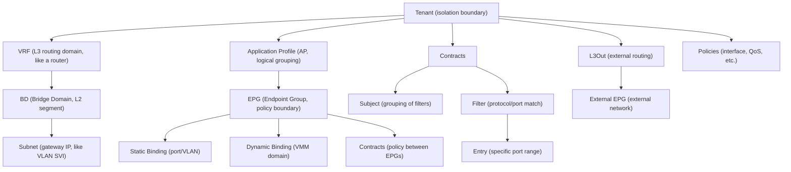
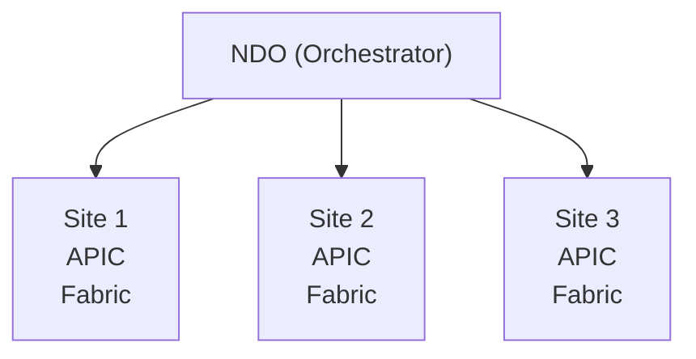
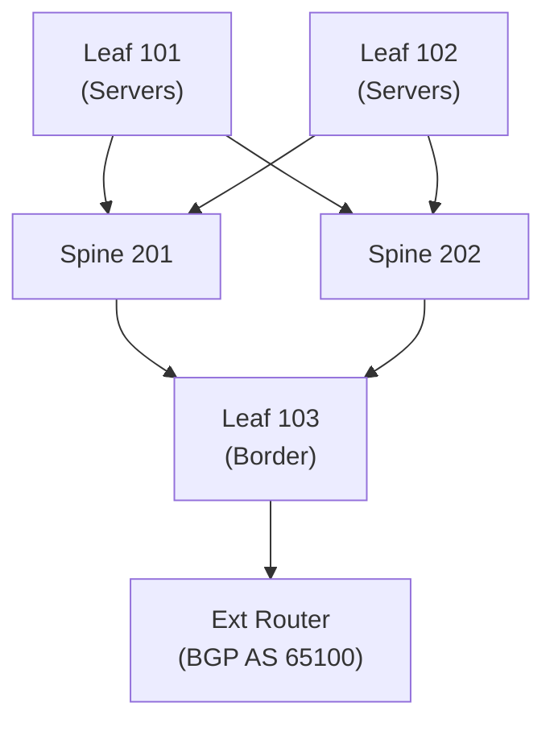
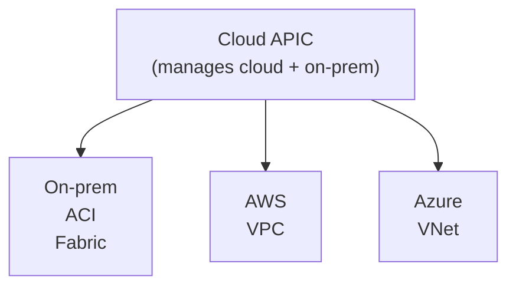

# Complete ACI for CCIE DC v3.1

## Prerequisite Knowledge

- Reference repository: https://github.com/vikiev/aci-ccie-dc
- Ethernet switching fundamentals (VLANs, VXLAN, spanning tree)
- IP routing (OSPF, BGP fundamentals)
- Understanding of overlay/underlay network concepts
- Basic understanding of policy-based networking
- Familiarity with REST APIs and JSON
- VMware vSphere basics (for VMM integration)

> This document supplements the existing ACI content at https://github.com/vikiev/aci-ccie-dc. Focus here is on exam-critical depth, troubleshooting, and lab scenarios.

---

## ACI Architecture

### Spine/Leaf Topology



```text
Design principles:
  - Every leaf connects to every spine (full mesh)
  - Spines do NOT connect to each other
  - Leafs do NOT connect to each other (except vPC peer-link)
  - Equal-cost paths: leaf-to-leaf always 2 hops (via spine)
  - No spanning tree: IS-IS underlay with ECMP
  - Scale: up to 64 leafs per fabric (with 2 spines)
```

### APIC Cluster

```text
APIC (Application Policy Infrastructure Controller):
  - Management and policy plane ONLY (not in data path)
  - Deployed as 3-node cluster (minimum) for production
  - Runs on dedicated hardware (APIC-L3/L4) or virtual (APIC-Cloud)
  - Provides: GUI, REST API, CLI, policy distribution
  - Data path works even if ALL APICs are down (policy cached on switches)

APIC cluster operation:
  - Policy replicated across all 3 APICs (sharded)
  - Any APIC can accept writes (distributed transaction)
  - Read from any APIC (eventually consistent)
  - Cluster quorum: 2 of 3 must be up for writes
  - If 1 APIC fails: no impact (2 remaining)
  - If 2 APICs fail: read-only (policy still enforced on switches)
  - If all 3 fail: data path continues, no new policy changes

APIC-to-switch communication:
  - APIC pushes policy to leafs/spines via SSL
  - Switches cache policy locally (survive APIC failure)
  - Heartbeat: APIC <-> switch every 60 seconds
  - Policy versioning: each change increments version number
```

### COOP (Council of Oracles Protocol)

```text
COOP:
  - Distributed endpoint database
  - Runs on SPINES (not leafs)
  - Stores: MAC, IP, VNI, location (which leaf/port)
  - Leaf learns endpoint -> reports to COOP on spine
  - Leaf needs to reach unknown endpoint -> queries COOP
  - COOP responds with location -> leaf builds VXLAN tunnel

COOP database:
  - Key: (MAC, IP, VNI)
  - Value: (leaf IP, port, timestamp)
  - Replicated across all spines
  - Aging: 180 seconds (default), refreshed on traffic

COOP vs traditional ARP:
  - Traditional: broadcast ARP to find MAC
  - ACI: unicast query to COOP (no broadcast flooding)
  - Result: no ARP storms, no broadcast domains in overlay
```

### IS-IS Underlay

```text
ACI underlay:
  - Protocol: IS-IS (not OSPF)
  - Runs on all spine-leaf links (physical)
  - Purpose: IP reachability for VTEP addresses (loopback0)
  - Each switch has loopback0 = VTEP IP (Tunnel Endpoint)
  - ECMP: multiple equal-cost paths via spines
  - No manual configuration (APIC provisions automatically)

Underlay addressing:
  - Spine loopback0: 10.0.0.1/32, 10.0.0.2/32
  - Leaf loopback0: 10.0.1.1/32, 10.0.1.2/32
  - Spine-leaf links: /30 point-to-point (auto-assigned)
  - IS-IS area: 1 (all switches same area)
  - MTU: 9000 (jumbo frames for VXLAN)

Verification:
  leaf101# show isis neighbors
  leaf101# show isis route
  leaf101# show ip route 10.0.0.1/32
  leaf101# show interface loopback0
```

---

## ACI Policy Model Deep Dive

### Hierarchy



### Tenant -> VRF -> BD -> Subnet

```text
Tenant:
  - Top-level isolation (like a VDC or separate customer)
  - Contains: VRFs, APs, Contracts, Filters, L3Outs
  - Default tenant: "common" (shared policies)
  - Naming: unique within fabric

VRF (Virtual Routing and Forwarding):
  - L3 routing instance (like a VRF on Nexus)
  - Contains: BDs, L3Outs
  - Route table isolated per VRF
  - One VRF can have multiple BDs
  - VRF enforces L3 isolation (no inter-VRF routing without contract)

BD (Bridge Domain):
  - L2 broadcast domain (like a VLAN + SVI)
  - Belongs to one VRF
  - Has one or more subnets (gateway IPs)
  - VXLAN VNID assigned automatically
  - Settings: ARP flooding, unknown unicast (proxy/flood), multicast

Subnet:
  - Gateway IP for the BD (like SVI IP)
  - Scope: public (advertised), private (internal), shared (inter-VRF)
  - One BD can have multiple subnets (multi-gateway)
  - Anycast: same gateway IP on all leafs (distributed anycast gateway)
```

### Tenant -> AP -> EPG -> Binding

```text
Application Profile (AP):
  - Logical grouping of EPGs (application tier)
  - Example: "Web-AP" contains Web-EPG, LB-EPG
  - No technical function (organizational only)
  - Naming: <app>-AP convention

EPG (Endpoint Group):
  - Policy enforcement boundary
  - Members: endpoints (VMs, servers, containers)
  - All members share same policy (contracts)
  - One EPG = one policy domain
  - EPG maps to: VLAN (static) or port-group (VMM)

Static Binding:
  - EPG bound to specific interface + VLAN
  - Path: leaf/port, VLAN encap
  - Used for: bare-metal servers, network devices
  - Example: Leaf101/Eth1/1, VLAN 100 -> Web-EPG

Dynamic Binding (VMM):
  - EPG bound to VMM domain (VMware, KVM)
  - Port group created automatically
  - VM connects to port group = joins EPG
  - Endpoint learned via LLDP/CDP/VMware Tools
```

### Contracts: Subjects, Filters, Actions

```text
Contract:
  - Policy between EPGs (like ACL but bidirectional)
  - Provider EPG: offers service
  - Consumer EPG: uses service
  - Scope: context (VRF), tenant, application-profile, global
  - Default: deny all between EPGs (whitelist model)

Subject:
  - Grouping within a contract
  - Can have: filters, actions, service graph
  - Reverse filter: auto-create reverse rules (stateful)
  - Priority: Level 1 (highest) to Level 4 (lowest)

Filter:
  - Match criteria (protocol + port)
  - Contains: filter entries
  - Example: "WEB_FILTER" with entries: tcp/80, tcp/443

Filter Entry:
  - Specific match: ether_type, ip_protocol, src_port, dst_port
  - Stateful: yes (default) - return traffic auto-permitted
  - Actions: permit, deny, log

Actions:
  - permit: allow traffic
  - deny: drop traffic (implicit at end)
  - log: send to syslog (does not affect forwarding)
```

### Taboo Contracts and vzAny

```text
Taboo Contract:
  - Explicit DENY between EPGs
  - Overrides permit contracts (deny wins)
  - Use case: block specific traffic even if permit exists
  - Example: block SSH between Web-EPG and DB-EPG

vzAny:
  - "Any" provider/consumer within a VRF
  - Applies contract to ALL EPGs in VRF
  - Provider vzAny: all EPGs provide this contract
  - Consumer vzAny: all EPGs consume this contract
  - Use case: allow all EPGs to reach external (L3Out)
  - Example: vzAny consumer -> L3Out provider (internet access)

vzAny configuration:
  APIC GUI: Tenant > VRF > vzAny > Provider/Consumer Labels
  - Add contract to vzAny provider: all EPGs provide it
  - Add contract to vzAny consumer: all EPGs consume it
```

> **CCIE Exam Tip:** The default ACI policy is DENY ALL between EPGs. If traffic is not flowing, the #1 cause is missing contract. Check: (1) Contract exists, (2) Correct provider/consumer binding, (3) Filter matches the traffic (protocol + port), (4) Scope is correct (VRF-level for inter-AP).

---

## ACI Networking

### L2: VLAN Pool, AEP, Interface Policy Group, Interface Profile

```text
L2 connectivity chain (bottom-up):
  1. VLAN Pool: range of VLANs available for EPGs
  2. AEP (Attachable Access Entity Profile): links VLAN pool to physical
  3. Interface Policy Group: bundles interface policies (CDP, LLDP, STP, etc.)
  4. Interface Profile: selects physical ports
  5. EPG Static Binding: ties EPG to interface + VLAN

Configuration order:
  VLAN Pool -> AEP -> Interface Policy Group -> Interface Profile -> EPG Binding
```

```text
APIC GUI path:
  Fabric > Access Policies > VLAN Pools > Create
  Fabric > Access Policies > AEP > Create (associate VLAN pool)
  Fabric > Access Policies > Interface Policies > Policy Groups > Create
  Fabric > Access Policies > Interface Profiles > Create
  Tenant > EPG > Static Ports > Add (select leaf/port/VLAN)
```

### L3: L3Out Configuration

```text
L3Out: connects ACI fabric to external routers
  - Types: Routed, SVI, Sub-interface
  - Protocols: OSPF, BGP, Static
  - External EPG: represents external network in ACI policy
  - Contracts apply between External EPG and internal EPGs

L3Out components:
  1. L3Out instance (name, VRF, domain)
  2. Logical Node Profile (which leaf, which router)
  3. Interface Profile (physical connection)
  4. External EPG (subnet match for policy)
  5. Protocol config (BGP peer, OSPF area)
```

#### Routed L3Out (Point-to-Point)

```text
Use case: direct /30 link to external router
  - Leaf interface: L3 (no VLAN)
  - IP: 10.100.1.1/30 (leaf) <-> 10.100.1.2/30 (router)
  - BGP or OSPF over the /30

APIC GUI:
  Tenant > L3Outs > Create
    Name: EXT_L3OUT
    VRF: PROD_VRF
    Domain: EXT_DOMAIN (physical)
    Protocol: BGP
    Node Profile: Leaf103
    Interface: Eth1/49
    IP: 10.100.1.1/30
    BGP Peer: 10.100.1.2, AS 65100
```

#### SVI L3Out (VLAN-based)

```text
Use case: connect to switch trunk (multiple VLANs)
  - Leaf interface: trunk with VLAN
  - SVI on leaf with IP
  - Multiple SVIs possible (multiple subnets)

APIC GUI:
  L3Out > Node Profile > Interface Profile
    Type: SVI
    VLAN: 500
    IP: 10.100.2.1/24
    BGP Peer: 10.100.2.254, AS 65100
```

#### Sub-interface L3Out

```text
Use case: router-on-a-stick (multiple subnets on one link)
  - Leaf interface: sub-interfaces with dot1q
  - Each sub-interface: different VLAN + IP

APIC GUI:
  L3Out > Node Profile > Interface Profile
    Type: Sub-interface
    Sub-interface: Eth1/49.100, VLAN 100, IP 10.100.3.1/24
    Sub-interface: Eth1/49.200, VLAN 200, IP 10.100.4.1/24
```

### External EPG and Contracts

```text
External EPG:
  - Represents external network in ACI policy
  - Subnet match: which external IPs match this EPG
  - Example: 0.0.0.0/0 = all external traffic
  - Contracts: between External EPG and internal EPGs

Configuration:
  APIC GUI: Tenant > L3Outs > EXT_L3OUT > External EPGs
    Name: EXT_EPG
    Subnet: 0.0.0.0/0 (match all)
    Scope: import-security

Contract application:
  - EXT_EPG as provider + Internal EPG as consumer
  - Or: Internal EPG as provider + EXT_EPG as consumer
  - Filter: what traffic is permitted
```

---

## ACI VMM Integration

### VMware VMM Domain

```text
VMM Domain creation:
  APIC GUI: Virtual Networking > VMM Domains > VMware > Create
    Name: VMM-VC01
    vCenter: vc01.datacenter.local
    Credentials: admin (stored in APIC)
    DVS Name: ACI-DVS
    Datacenter: DC01
    Uplinks: uplink1, uplink2
    Encap: VLAN (or VXLAN for VM-FEX)

What APIC does:
  1. Connects to vCenter via API
  2. Creates DVS (ACI-DVS)
  3. Creates port groups per EPG
  4. Pushes: VLAN, teaming, security, MTU policies
  5. Monitors: VM creation/deletion, MAC learning
```

### EPG to Port-Group Mapping

```text
Automatic mapping:
  - EPG associated with VMM domain
  - APIC creates port group: <tenant>|<ap>|<epg>
  - VM connected to port group = endpoint in EPG
  - No manual VLAN assignment (APIC manages)

Verification:
  vCenter: Networking > ACI-DVS > Port Groups
    Prod-Tenant|Web-AP|Web-EPG (VLAN 100)
    Prod-Tenant|DB-AP|DB-EPG (VLAN 200)

  APIC: Tenant > EPG > Operational > Endpoints
    VM: web-vm-01, IP: 10.1.1.10, Port: ACI-DVS:Web-EPG
```

### Microsegmentation with VMM

```text
uSeg EPG (microsegmentation):
  - Dynamic EPG membership based on VM attributes
  - Attributes: OS, IP, MAC, vCenter tag, custom attribute
  - VM moves between uSeg EPGs automatically (attribute change)
  - Contracts between uSeg EPGs = micro-level policy

Example:
  uSeg EPG: "Windows-DB"
    Attribute: OS = Windows
    Attribute: vCenter Tag = "database"
  Any Windows VM tagged "database" joins this EPG automatically
  Contract: allow SQL (1433) from App-EPG to Windows-DB-EPG
```

---

## ACI Multi-Site

### Multi-Site Orchestrator (MSO/NDO)

```text
Nexus Dashboard Orchestrator (NDO, formerly MSO):
  - Manages multiple ACI fabrics (sites)
  - Stretched policy across sites
  - Centralized policy management
  - Sites connected via IPN (Inter-Pod Network) or WAN
```



### Stretched BD/EPG

```text
Stretched BD:
  - Same BD (same VNID) exists on multiple sites
  - VMs in same BD can be on different sites
  - L2 adjacency across sites (same subnet)
  - BUM traffic replicated between sites (ingress replication)

Stretched EPG:
  - Same EPG on multiple sites
  - Policy (contracts) consistent across sites
  - Endpoint can migrate between sites (vMotion)
  - COOP extended: site-local COOP + multi-site COOP

Limitations:
  - Max 3 sites (typically)
  - RTT between sites: < 10ms recommended
  - Bandwidth: dedicated IPN links
  - Not all features supported multi-site (check compatibility)
```

### Inter-Site L3Out

```text
Inter-site L3Out:
  - Routing between sites (not just L2 stretch)
  - Each site has local L3Out
  - NDO coordinates route advertisement
  - Route preference: local site preferred
  - Failover: if site fails, traffic reroutes

Configuration:
  NDO: Application > Template > L3Out
    - Deploy to Site 1 and Site 2
    - BGP peering with local routers
    - Route-maps for preference
```

### Multi-Site Underlay (IPN)

```text
IPN (Inter-Pod Network):
  - Connects spines of different sites
  - L3 network (typically MPLS or IP)
  - Carries: VXLAN traffic, COOP sync, APIC communication
  - Requirements:
    - MTU >= 9100 (VXLAN + headers)
    - Low latency (< 10ms RTT)
    - Dedicated bandwidth
    - Multicast or ingress replication for BUM

IPN vs traditional DCI:
  - Traditional: L2 stretch (dark fiber, OTV)
  - IPN: L3 overlay (any IP/MPLS network)
  - IPN is more flexible (works over WAN)
```

---

## ACI Service Graph

### L4-L7 Device Integration

```text
Service Graph:
  - Inserts L4-L7 devices (firewall, ADC, IDS) into traffic path
  - Policy-based: traffic matching contract is redirected
  - Uses PBR (Policy-Based Routing) on leaf
  - Device can be: physical (appliance) or virtual (VM)

Supported devices:
  - Cisco ASA/FTD (firewall)
  - Citrix NetScaler / F5 BIG-IP (ADC/load balancer)
  - Cisco IPS/IDS
  - Palo Alto, Check Point (via device package)
  - Generic (any device with IP)

Service Graph components:
  1. Device: physical or virtual appliance
  2. Device Package: driver for device management
  3. Function Node: represents device in graph
  4. Service Graph Template: topology (one-arm, two-arm)
  5. Contract binding: which EPGs use the graph
```

### Service Graph Configuration

```text
APIC GUI:
  1. L4-L7 > Devices > Create Device
     - Type: Physical / Virtual
     - Management IP, credentials
     - Interfaces (connect to leaf ports)

  2. L4-L7 > Service Graph Templates > Create
     - Add function node (firewall)
     - Connect: consumer EPG -> FW -> provider EPG
     - Type: GoTo (one-arm) or GoThrough (two-arm)

  3. Contract > Subject > Service Graph
     - Apply graph to contract subject
     - Traffic matching contract is redirected through device

PBR on leaf (automatic):
  - Leaf creates PBR policy for service graph
  - Traffic: EPG-A -> Leaf -> PBR redirect -> FW -> Leaf -> EPG-B
  - Return: EPG-B -> Leaf -> PBR redirect -> FW -> Leaf -> EPG-A
```

### PBR-Based Service Insertion

```text
How PBR works in ACI service graph:
  1. Endpoint in EPG-A sends traffic to EPG-B
  2. Leaf receives packet, matches contract with service graph
  3. Leaf applies PBR: redirect to FW interface (VLAN)
  4. FW inspects/permits traffic
  5. FW sends back to leaf (different VLAN or same)
  6. Leaf forwards to EPG-B

Verification:
  leaf101# show ip pbr statistics
  leaf101# show access-list | include pbr
  leaf101# show service-graph

  APIC: L4-L7 > Devices > Operational > Connections
  APIC: Tenant > Contract > Subject > Service Graph (status)
```

---

## ACI Security

### Contracts as Microsegmentation

```text
ACI microsegmentation model:
  - Default: deny all between EPGs
  - Explicit contracts permit specific flows
  - Granularity: per EPG (group) or per uSeg (individual VM)
  - Stateful: return traffic auto-permitted
  - Logging: contract hit counters, syslog

Best practices:
  - One contract per application flow (not one giant permit)
  - Use filters with specific ports (not "any")
  - Taboo contracts for explicit deny (overrides permit)
  - Log critical contracts (forensics)
  - Scope: context (VRF) for inter-AP, tenant for intra-tenant
```

### ESG (Endpoint Security Groups)

```text
ESG (newer than EPG):
  - Policy based on endpoint attributes (not port/VLAN)
  - Attributes: IP subnet, tag, VMM attribute
  - More flexible than EPG (no static binding needed)
  - Can coexist with EPGs
  - Use case: cloud-native, dynamic workloads

ESG vs EPG:
  - EPG: bound to port/VLAN/VMM (static or dynamic)
  - ESG: bound to attributes (IP, tag) - purely logical
  - ESG: no encap required (works with any network)
  - EPG: requires VLAN/VXLAN encap
```

### ACI and ISE Integration

```text
ISE (Identity Services Engine) with ACI:
  - ISE provides identity context (user, device type)
  - ACI uses ISE attributes for policy (SGT - Security Group Tag)
  - pxGrid: ISE shares endpoint context with APIC
  - SGT-based contracts: policy based on security group

Flow:
  1. Endpoint authenticates (802.1X, MAB, web auth)
  2. ISE assigns SGT (Security Group Tag)
  3. ISE shares SGT with APIC via pxGrid
  4. APIC maps SGT to ESG or EPG
  5. Contracts enforce policy based on SGT/ESG

Configuration:
  APIC: System > System Settings > ISE Integration
    - ISE server IP, pxGrid credentials
    - SGT to ESG mapping
```

---

## ACI Monitoring and Troubleshooting

### APIC Fault Lifecycle

```text
Fault severity:
  - Cleared: issue resolved
  - Warning: informational
  - Minor: non-critical issue
  - Major: significant issue
  - Critical: service-impacting

Fault lifecycle:
  1. Raised: condition detected
  2. Acknowledged: admin acknowledges (optional)
  3. Retained: persists until condition clears
  4. Cleared: condition resolved

Viewing faults:
  APIC GUI: Operations > Faults > All Faults
  APIC GUI: specific object > Faults tab
  APIC REST: /api/node/class/faultInfo.json
  APIC REST: /api/node/class/faultInst.json?query-target-filter=eq(faultInst.severity,"critical")
```

### Show Commands on Leaf/Spine (NX-OS under ACI)

```text
Access leaf CLI:
  APIC GUI: Fabric > Inventory > Leaf > Access CLI (SSH)
  Or: ssh admin@<leaf-mgmt-ip>

Key commands:
  leaf101# show endpoint database
  leaf101# show ip arp vrf <vrf-name>
  leaf101# show ip route vrf <vrf-name>
  leaf101# show bgp l2vpn evpn
  leaf101# show bgp l2vpn evpn route-type mac-ip
  leaf101# show nve peers
  leaf101# show nve vni
  leaf101# show vlan
  leaf101# show interface brief
  leaf101# show lldp neighbors
  leaf101# show cdp neighbors
  leaf101# show isis neighbors
  leaf101# show ip route
  leaf101# show hardware internal access-list resource tcam region ifacl
  leaf101# show zoning-rule
  leaf101# show platform software internal epm endpoint vrf <vrf>
  leaf101# show ip arp vrf overlay-1
  leaf101# show vxlan vtep
```

### Common Failures and Resolution

#### Endpoint Not Learned

```text
Symptom: VM/server not appearing in APIC endpoint list

Troubleshooting:
  1. Physical: is link up?
     leaf101# show interface eth1/1
     (Check: admin up, oper up, no errors)

  2. LLDP/CDP: is neighbor discovered?
     leaf101# show lldp neighbors interface eth1/1
     (For VMM: LLDP must be enabled on DVS uplink)

  3. VLAN: is endpoint's VLAN allowed on port?
     leaf101# show vlan
     (Check: VLAN exists, port is member)

  4. EPG binding: is EPG bound to this port/VLAN?
     APIC: Tenant > EPG > Static Ports (or VMM domain)

  5. COOP: is endpoint in spine database?
     spine201# show coop endpoint database
     (Search for MAC/IP)

  6. VMM: is APIC connected to vCenter?
     APIC: Virtual Networking > VMM Domains > Faults
     (Check: vCenter reachable, credentials valid)

Common causes:
  - LLDP disabled on hypervisor uplink
  - VLAN mismatch (EPG encap != port VLAN)
  - EPG not bound to correct interface
  - vCenter credentials expired
  - APIC-to-vCenter connectivity issue
```

#### Contract Not Hitting

```text
Symptom: traffic denied between EPGs despite contract

Troubleshooting:
  1. Contract exists and is active?
     APIC: Tenant > Contracts > <contract> > Operational

  2. Provider/Consumer binding correct?
     APIC: Contract > Used By (providers/consumers)
     (Provider EPG and Consumer EPG must be correct)

  3. Filter matches traffic?
     APIC: Contract > Subject > Filter > Entries
     (Check: protocol, port, direction)

  4. Scope correct?
     (context = VRF-wide, tenant = tenant-wide)
     (If EPGs in different APs, need context scope)

  5. Hit counters?
     leaf101# show zoning-rule
     (Check: rule exists, hit count incrementing)

  6. Taboo contract overriding?
     APIC: Tenant > Contracts > Taboo
     (Taboo deny overrides permit)

  7. vzAny conflict?
     APIC: Tenant > VRF > vzAny
     (vzAny contract may override specific contract)

Common causes:
  - Wrong scope (tenant vs context)
  - Filter port mismatch (80 vs 8080)
  - Provider/consumer reversed
  - Taboo contract blocking
  - Contract not deployed (pending)
```

#### L3Out Down

```text
Symptom: external routing not working

Troubleshooting:
  1. Interface up?
     leaf101# show interface eth1/49
     (Physical link, no errors)

  2. IP configured correctly?
     leaf101# show ip interface brief
     (Check: L3Out interface has correct IP)

  3. BGP/OSPF neighbor up?
     leaf101# show ip bgp neighbors
     leaf101# show ip ospf neighbors
     (Check: state Established/Full)

  4. Routes received?
     leaf101# show ip route vrf <vrf>
     leaf101# show ip bgp vrf <vrf>
     (Check: external routes present)

  5. External EPG subnet correct?
     APIC: L3Out > External EPG > Subnets
     (Must match routes being advertised)

  6. Contract to External EPG?
     APIC: External EPG > Contracts
     (Must have contract for traffic to flow)

Common causes:
  - BGP AS mismatch
  - Wrong peer IP
  - Interface not in correct VRF
  - External EPG subnet too specific (not matching routes)
  - Missing contract between internal EPG and External EPG
  - MTU mismatch on L3Out link
```

---

## Verification Commands

```text
APIC REST API:
  GET /api/node/class/fvTenant.json
  GET /api/node/class/fvCtx.json (VRFs)
  GET /api/node/class/fvBD.json (Bridge Domains)
  GET /api/node/class/fvAEPg.json (EPGs)
  GET /api/node/class/vzBrCP.json (Contracts)
  GET /api/node/class/l3extOut.json (L3Outs)
  GET /api/node/class/faultInfo.json (Faults)
  GET /api/node/class/eqptFabricP.json (Fabric members)

Leaf/Spine CLI:
  show endpoint database
  show ip arp vrf <vrf>
  show ip route vrf <vrf>
  show bgp l2vpn evpn summary
  show bgp l2vpn evpn route-type mac-ip <mac> <ip>
  show nve peers
  show nve vni
  show vlan
  show interface brief
  show lldp neighbors
  show isis neighbors
  show zoning-rule
  show ip pbr statistics
  show hardware internal access-list resource tcam region ifacl
  show platform software internal epm endpoint vrf <vrf>
  show vxlan vtep
  show coop endpoint database (on spine)
```

---

## Lab 1: Full Tenant Build with L3Out and BGP

### Objective
Create a complete ACI tenant with 3 EPGs, contracts, and BGP L3Out.

### Topology



### Configuration (APIC REST API)

```text
Step 1: Create Tenant
POST /api/node/mo/uni/tn-PROD.json
{
  "fvTenant": {
    "attributes": {
      "name": "PROD",
      "descr": "Production Tenant"
    }
  }
}

Step 2: Create VRF
POST /api/node/mo/uni/tn-PROD/ctx-PROD_VRF.json
{
  "fvCtx": {
    "attributes": {
      "name": "PROD_VRF"
    }
  }
}

Step 3: Create Bridge Domains
POST /api/node/mo/uni/tn-PROD/BD-WEB_BD.json
{
  "fvBD": {
    "attributes": {
      "name": "WEB_BD",
      "arpFlood": "no",
      "unkMacUcastAct": "proxy"
    },
    "children": [
      {
        "fvRsCtx": {
          "attributes": {
            "tnFvCtxName": "PROD_VRF"
          }
        }
      },
      {
        "fvSubnet": {
          "attributes": {
            "ip": "10.1.1.1/24",
            "scope": "public"
          }
        }
      }
    ]
  }
}

Step 4: Create AP and EPGs
POST /api/node/mo/uni/tn-PROD/ap-PROD_AP.json
{
  "fvAp": {
    "attributes": {
      "name": "PROD_AP"
    },
    "children": [
      {
        "fvAEPg": {
          "attributes": {
            "name": "WEB_EPG"
          },
          "children": [
            {
              "fvRsBd": {
                "attributes": {
                  "tnFvBDName": "WEB_BD"
                }
              }
            }
          ]
        }
      },
      {
        "fvAEPg": {
          "attributes": {
            "name": "APP_EPG"
          },
          "children": [
            {
              "fvRsBd": {
                "attributes": {
                  "tnFvBDName": "APP_BD"
                }
              }
            }
          ]
        }
      },
      {
        "fvAEPg": {
          "attributes": {
            "name": "DB_EPG"
          },
          "children": [
            {
              "fvRsBd": {
                "attributes": {
                  "tnFvBDName": "DB_BD"
                }
              }
            }
          ]
        }
      }
    ]
  }
}

Step 5: Create Contract (WEB to APP)
POST /api/node/mo/uni/tn-PROD/brc-WEB_TO_APP.json
{
  "vzBrCP": {
    "attributes": {
      "name": "WEB_TO_APP",
      "scope": "context"
    },
    "children": [
      {
        "vzSubj": {
          "attributes": {
            "name": "http-https"
          },
          "children": [
            {
              "vzRsSubjFiltAtt": {
                "attributes": {
                  "tnVzFilterName": "WEB_FILTER"
                }
              }
            }
          ]
        }
      }
    ]
  }
}

Step 6: Create Filter
POST /api/node/mo/uni/tn-PROD/flt-WEB_FILTER.json
{
  "vzFilter": {
    "attributes": {
      "name": "WEB_FILTER"
    },
    "children": [
      {
        "vzEntry": {
          "attributes": {
            "name": "http",
            "etherT": "ip",
            "prot": "tcp",
            "dFromPort": "http",
            "dToPort": "http"
          }
        }
      },
      {
        "vzEntry": {
          "attributes": {
            "name": "https",
            "etherT": "ip",
            "prot": "tcp",
            "dFromPort": "https",
            "dToPort": "https"
          }
        }
      }
    ]
  }
}
```

### Verification

```text
leaf101# show endpoint database
  VLAN  Domain    MAC Address       IP Address    Interface
  100   WEB_EPG   00:50:56:a1:01:01 10.1.1.10    Eth1/1
  200   APP_EPG   00:50:56:a1:02:01 10.1.2.10    Eth1/2
  300   DB_EPG    00:50:56:a1:03:01 10.1.3.10    Eth1/3

leaf101# show zoning-rule
  Rule ID  Source     Dest       Filter     Action  Hits
  4096     WEB_EPG    APP_EPG    http       permit  5234
  4097     WEB_EPG    APP_EPG    https      permit  12890
  4098     APP_EPG    DB_EPG     sql-1433   permit  8901
  4099     WEB_EPG    DB_EPG     default    deny    156

leaf103# show ip bgp neighbors 10.100.1.2
  BGP neighbor: 10.100.1.2, remote AS 65100, state: Established
  Received routes: 15
  Advertised routes: 3

leaf103# show ip route vrf PROD_VRF
  10.1.1.0/24, ubest/mbest: 1/0, attached
  10.1.2.0/24, ubest/mbest: 1/0, attached
  10.1.3.0/24, ubest/mbest: 1/0, attached
  0.0.0.0/0, ubest/mbest: 1/0, via 10.100.1.2, [20/0], bgp-65001
```

---

## Lab 2: Troubleshooting Scenarios

### Scenario 1: Endpoint Not Learned

```text
Problem: VM connected to ESXi but not showing in APIC endpoints

Resolution steps:
  1. leaf101# show interface eth1/1
     -> Ethernet1/1 is up (OK)

  2. leaf101# show lldp neighbors interface eth1/1
     -> No neighbors found (PROBLEM)

  3. Check ESXi DVS uplink:
     esxcli network vswitch dvs vmware list
     -> LLDP: disabled (ROOT CAUSE)

  4. Fix: Enable LLDP on DVS uplink
     vCenter: DVS > Manage > Settings > Advanced > LLDP: Both

  5. Verify:
     leaf101# show lldp neighbors interface eth1/1
     -> esxi01.datacenter.local, vmnic0 (FIXED)

  6. APIC: Tenant > EPG > Operational > Endpoints
     -> VM now appears (endpoint learned)
```

### Scenario 2: Contract Not Permitting Traffic

```text
Problem: Web server cannot reach App server on port 8080

Resolution steps:
  1. leaf101# show zoning-rule | include 8080
     -> No rule for port 8080 (PROBLEM)

  2. APIC: Tenant > Contracts > WEB_TO_APP > Subject > Filter
     -> Filter entry: tcp/80 only (ROOT CAUSE - missing 8080)

  3. Fix: Add filter entry for tcp/8080
     APIC: Filter > Add Entry > tcp, dst port 8080

  4. Verify:
     leaf101# show zoning-rule | include 8080
     -> Rule 4100: WEB_EPG -> APP_EPG, tcp-8080, permit

  5. Test:
     web-vm# curl http://10.1.2.10:8080
     -> 200 OK (FIXED)
```

### Scenario 3: L3Out BGP Down

```text
Problem: External routes not received via L3Out

Resolution steps:
  1. leaf103# show ip bgp neighbors 10.100.1.2
     -> State: Idle (PROBLEM)

  2. leaf103# show ip interface eth1/49
     -> IP: 10.100.1.1/32 (ROOT CAUSE - wrong mask, should be /30)

  3. Fix: Correct IP mask on L3Out interface
     APIC: L3Out > Node Profile > Interface > Change to /30

  4. Verify:
     leaf103# show ip bgp neighbors 10.100.1.2
     -> State: Established (FIXED)

  5. leaf103# show ip route vrf PROD_VRF | include bgp
     -> External routes now present
```

> **Lab Exam Warning:** In the CCIE DC lab troubleshooting section, work systematically: (1) Identify the symptom, (2) Check physical/interface, (3) Check L2 (VLAN, EPG binding), (3) Check L3 (routing, BGP), (4) Check policy (contracts, zoning-rule), (5) Verify endpoint learning. Do NOT jump to conclusions. Most issues are configuration errors, not hardware failures.

---

## ESG (Endpoint Security Groups) Configuration

### ESG Overview and Configuration

```text
ESG (Endpoint Security Groups):
  - Newer policy construct (ACI 5.0+)
  - Policy based on endpoint ATTRIBUTES (not port/VLAN)
  - No static binding required (purely logical)
  - Selectors: IP subnet, tag, VMM attribute
  - Can coexist with EPGs in same VRF
  - Contracts apply between ESGs (same as EPGs)

ESG vs EPG:
  +-------------------+-------------------+-------------------+
  | Feature           | EPG               | ESG               |
  +-------------------+-------------------+-------------------+
  | Binding           | Port/VLAN/VMM     | Attributes (IP/tag)|
  | Encap required    | Yes (VLAN/VXLAN)  | No                |
  | Membership        | Static or dynamic | Dynamic (selector)|
  | Mobility          | Port-bound        | Attribute-bound   |
  | Use case          | Traditional       | Cloud-native      |
  | Contract support  | Yes               | Yes               |
  +-------------------+-------------------+-------------------+
```

### ESG Configuration (APIC REST API)

```text
Step 1: Create ESG
POST /api/node/mo/uni/tn-PROD/esg-WEB_ESG.json
{
  "fvESg": {
    "attributes": {
      "name": "WEB_ESG",
      "descr": "Web tier ESG"
    },
    "children": [
      {
        "fvRsESgToBD": {
          "attributes": {
            "tnFvBDName": "WEB_BD"
          }
        }
      }
    ]
  }
}

Step 2: Add IP Subnet Selector
POST /api/node/mo/uni/tn-PROD/esg-WEB_ESG/ipsubnetselect-web.json
{
  "fvIPSubnetSelector": {
    "attributes": {
      "name": "web-subnet",
      "ip": "10.1.1.0/24"
    }
  }
}

Step 3: Add Tag Selector (alternative)
POST /api/node/mo/uni/tn-PROD/esg-DB_ESG/tagselect-db.json
{
  "fvTagSelector": {
    "attributes": {
      "name": "db-tag",
      "matchKey": "tier",
      "matchValue": "database"
    }
  }
}

Step 4: Contract between ESGs
POST /api/node/mo/uni/tn-PROD/esg-WEB_ESG/rsESgProvCons-DB_CONTRACT.json
{
  "fvRsESgProvCons": {
    "attributes": {
      "tnVzBrCPName": "WEB_TO_DB_CONTRACT"
    }
  }
}
```

### ESG Verification

```text
APIC GUI: Tenant > ESG > WEB_ESG > Operational > Endpoints
  -> Endpoints matching selector: 10.1.1.10, 10.1.1.11, 10.1.1.12

Leaf CLI:
  leaf101# show endpoint database
  -> Endpoints in ESG shown with ESG tag

  leaf101# show zoning-rule
  -> Rules for ESG-to-ESG contracts appear same as EPG rules
```

> **CCIE Exam Tip:** ESG is newer and may appear as a "what's different" question. Key: ESG uses attribute selectors (IP subnet, tag) instead of port/VLAN binding. ESG does NOT require VLAN encap. Contracts work identically between ESGs and EPGs. If the exam asks "how to apply policy without knowing port," answer: ESG.

---

## Contract TCAM Capacity

### TCAM Resources for Contracts

```text
ACI contract enforcement uses TCAM on leaf switches:
  - Each contract rule = TCAM entry
  - TCAM is finite (hardware resource)
  - Exceeding TCAM = new contracts cannot be programmed

TCAM regions on ACI leaf:
  - ifacl: interface ACL (contracts)
  - racl: routed ACL
  - vacl: VLAN ACL
  - copp: control plane policing

Verification:
  leaf101# show hardware internal access-list resource tcam region ifacl
    Region: ifacl
      Used: 1523
      Free: 16861
      Total: 18384

TCAM consumption factors:
  - Number of EPG pairs with contracts
  - Number of filter entries per contract
  - Number of endpoints (affects endpoint TCAM)
  - vzAny contracts (multiply by all EPGs)

TCAM exhaustion symptoms:
  - New contract not enforced (silent failure)
  - APIC fault: "TCAM programming failed"
  - show zoning-rule: missing rules

Mitigation:
  - Reduce contract scope (fewer EPG pairs)
  - Consolidate filters (fewer entries)
  - Use ESG (reduces per-endpoint rules)
  - Check: show hardware internal access-list resource tcam
```

> **Lab Exam Warning:** If you configure a contract and traffic still doesn't flow, check TCAM: `show hardware internal access-list resource tcam region ifacl`. If "Free: 0", TCAM is exhausted. This is rare in lab but common in production. The exam may test your ability to identify TCAM as the root cause.

---

## ACI Cloud (Cloud APIC)

### Cloud APIC Overview

```text
ACI Cloud (formerly Cloud ACI):
  - Extends ACI policy to public cloud (AWS, Azure)
  - Cloud APIC: manages cloud resources with ACI policy model
  - Same Tenant/VRF/BD/EPG/Contract model
  - Cloud resources (VMs, VNets, subnets) mapped to ACI objects
```



```text
Cloud APIC mapping:
  - VPC/VNet -> VRF
  - Subnet -> BD
  - Security Group -> EPG
  - NACL/NSG -> Contract
  - Transit Gateway -> L3Out

Use case:
  - Consistent policy across on-prem ACI and cloud
  - Single pane of glass (APIC GUI)
  - Contracts enforced in cloud via security groups
  - Connectivity: cloud <-> on-prem via L3Out or Direct Connect
```

> **CCIE Exam Tip:** Cloud APIC is a "know it exists" topic. You won't configure it in the lab. But know: (1) Same policy model (Tenant/EPG/Contract), (2) Cloud resources map to ACI objects, (3) Connectivity via L3Out or cloud interconnect, (4) Cloud APIC can manage both on-prem and cloud simultaneously.

---

## Common Exam Scenarios

### Scenario 1: Contract Deployed But Not Enforced

```text
Ticket: "Contract created and bound but traffic still blocked"

Diagnosis:
  1. APIC: Tenant > Contracts > WEB_TO_DB > Operational
     -> Status: Deployed (OK)

  2. leaf101# show zoning-rule | include DB
     -> No rules for DB_EPG (PROBLEM)

  3. APIC: Tenant > Contracts > WEB_TO_DB > Faults
     -> Fault: "TCAM programming failed on leaf101"

  4. leaf101# show hardware internal access-list resource tcam region ifacl
     -> Used: 18384, Free: 0 (TCAM FULL)

Root cause: TCAM exhausted, new rules cannot be programmed

Fix:
  1. Identify unused contracts: show zoning-rule (zero hit count)
  2. Remove unnecessary contracts via APIC
  3. Wait for TCAM reprogramming (30-60 seconds)
  4. Verify: show zoning-rule (new rules present)

Prevention:
  - Monitor TCAM: show hardware internal access-list resource tcam
  - Alert at 80% utilization
  - Consolidate filters (fewer entries per contract)
```

### Scenario 2: L3Out OSPF Adjacency Not Forming

```text
Ticket: "L3Out OSPF neighbor stuck in Init state"

Diagnosis:
  leaf103# show ip ospf neighbors
  -> 10.100.1.2: State: Init (received hello, not 2-way)

  leaf103# show ip ospf interface eth1/49
  -> Area: 0.0.0.0, Network: point-to-point
  -> Hello: 10, Dead: 40

  External router: show ip ospf interface
  -> Area: 0.0.0.1 (MISMATCH!)

Root cause: OSPF area mismatch (ACI: area 0, router: area 1)

Fix:
  APIC: L3Out > Node Profile > OSPF > Change area to 0.0.0.1
  Or: External router: change area to 0.0.0.0

Verification:
  leaf103# show ip ospf neighbors
  -> 10.100.1.2: State: Full
```

### Scenario 3: VMM Domain EPG Not Learning Endpoints

```text
Ticket: "VMs connected to ACI-DVS port group but not in APIC endpoints"

Diagnosis:
  1. APIC: VMM Domain > Status: Connected (OK)
  2. vCenter: Port group exists (OK)
  3. VM connected to port group (OK)
  4. leaf101# show endpoint database -> VM not present

  5. leaf101# show lldp neighbors interface eth1/33
     -> No neighbors (PROBLEM)

  6. ESXi: esxcli network vswitch dvs vmware list
     -> LLDP: Disabled (ROOT CAUSE)

Root cause: LLDP disabled on DVS uplink

Fix:
  vCenter: DVS > Manage > Settings > Advanced
  -> LLDP: Enable (Both transmit and receive)

Verification:
  leaf101# show lldp neighbors
  -> esxi01, vmnic0 (discovered)
  APIC: EPG > Operational > Endpoints -> VM present
```

---

## Key Takeaways

1. **Architecture**: Spine/leaf with IS-IS underlay, COOP on spines, APIC for policy only
2. **Policy model**: Tenant > VRF > BD > Subnet; Tenant > AP > EPG > Contracts
3. **Default deny**: No traffic between EPGs without explicit contract
4. **L3Out**: Routed/SVI/Sub-interface; External EPG for policy; BGP/OSPF for routing
5. **VMM**: APIC manages DVS; EPG = port group; endpoint learning via LLDP/CDP
6. **Multi-site**: NDO orchestrates; stretched BD/EPG; IPN connects sites
7. **Service Graph**: PBR-based insertion; device package; contract binding
8. **Troubleshooting**: endpoint learning (LLDP), contracts (zoning-rule), L3Out (BGP state)
9. **ESG**: Attribute-based policy (IP/tag selectors); no port binding; contracts same as EPG
10. **TCAM**: Finite resource for contract rules; monitor utilization; exhaustion = silent failure
11. **Cloud APIC**: Extends ACI policy to AWS/Azure; same model; know it exists
