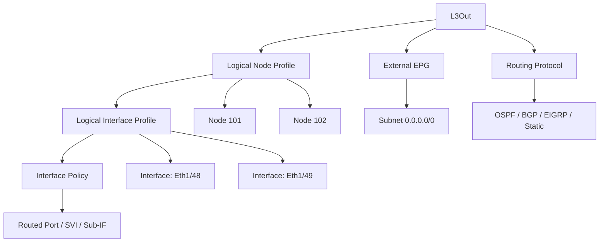
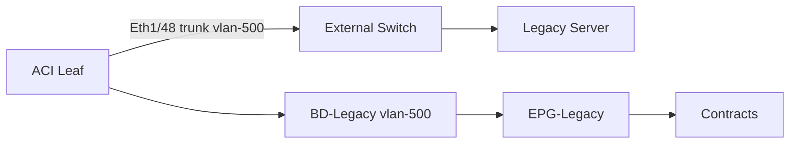

## ACI L3Out and External Networking - CCIE DC v3.1 Deep Dive

> Reference: https://github.com/vikiev/aci-ccie-dc (Chapters 8-10)
> This material goes DEEPER than the repo on exam-critical L3Out topics.

---

### L3Out Architecture

#### What is an L3Out?

An L3Out (Layer 3 Outside) is the ACI construct that connects the ACI fabric to external Layer 3 networks. It is the boundary between the ACI policy domain and the external routing domain. Every packet that enters or leaves the ACI fabric at Layer 3 traverses an L3Out.

The L3Out is NOT a physical interface. It is a logical policy object that:
- Terminates routing protocols (OSPF, BGP, EIGRP, Static)
- Defines which external prefixes ACI will learn
- Defines which internal subnets ACI will advertise
- Binds to an External EPG for policy enforcement

#### L3Out Ownership Model

Every L3Out belongs to exactly:
- One Tenant (e.g., "CORP", "common")
- One VRF within that tenant

This means:
- L3Out routes are installed into the VRF routing table
- Multiple L3Outs can exist in the same VRF (e.g., one to WAN, one to DMZ)
- L3Outs in different VRFs are completely isolated (no route leaking unless explicitly configured)

```text
Tenant: CORP
  VRF: PROD-VRF
    L3Out: WAN-L3OUT (to ISP router)
    L3Out: DMZ-L3OUT (to DMZ firewall)
  VRF: DEV-VRF
    L3Out: DEV-WAN-L3OUT (separate routing domain)
```

> **CCIE Exam Tip:** L3Outs in the "common" tenant can be shared across tenants using VRF leaking (shared services). This is a common exam pattern for shared WAN connectivity.

#### L3Out Interface Types

There are three physical connectivity models for L3Out:

##### Type 1: Routed (L3) Port

- Untagged interface (no VLAN)
- Point-to-point link: /30 or /31 subnet
- ACI leaf port configured as Layer 3 (no bridge domain)
- One external router per link
- Simplest model, most common in exam

```text
Leaf101 Eth1/48 --- [10.255.1.0/30] --- CSR1000v Gi1
  ACI side: 10.255.1.1/30
  Router side: 10.255.1.2/30
```

Key characteristics:
- Port is removed from any VLAN pool / AEP association
- Interface policy: L3Out interface (routed)
- No encapsulation (untagged)
- MTU must match on both sides (default 9000 on ACI, often 1500 on router)

> **Lab Exam Warning:** MTU mismatch is the #1 cause of OSPF adjacency failure on routed L3Out ports. ACI defaults to 9000. If the external router is 1500, OSPF hello packets may pass but DBD packets will fail silently. Always verify MTU first.

##### Type 2: SVI (Switched Virtual Interface)

- Physical port is a trunk (L2)
- SVI created on top with VLAN tag
- Multiple SVIs possible on same physical link (different VLANs)
- Used when connecting to a switch that carries multiple L3Outs

```text
Leaf101 Eth1/48 (trunk) --- Nexus 9K (trunk)
  SVI VLAN 100: 10.255.2.0/30 (L3Out to Router A)
  SVI VLAN 200: 10.255.3.0/30 (L3Out to Router B)
```

Key characteristics:
- Physical port uses access policy (AEP, interface policy group)
- VLAN must be in the VLAN pool associated with the L3Out domain
- SVI encap: vlan-100, vlan-200, etc.
- Multiple nodes can share the same physical link via different VLANs

##### Type 3: Sub-Interface (802.1Q)

- Physical port is a trunk
- Sub-interfaces with 802.1Q tags
- Similar to router-on-a-stick concept
- Less common in ACI, but appears in exam scenarios

```text
Leaf101 Eth1/48 (trunk)
  Sub-interface vlan-100: 10.255.4.0/30
  Sub-interface vlan-200: 10.255.5.0/30
```

#### L3Out Object Hierarchy

The L3Out object model is deeply nested. Understanding this hierarchy is CRITICAL for the exam:



Detailed hierarchy:

```text
L3Out (l3extOut)
  Logical Node Profile (l3extLNodeP)
    Node 101 (l3extRsNodeL3OutAtt)
      Router ID: 10.1.1.101
      Interface Profile (l3extLIfP)
        Interface: Eth1/48 (l3extRsPathL3OutAtt)
          IP: 10.255.1.1/30
          Encap: untagged (routed) or vlan-X (SVI)
          MTU: 9000
    Node 102 (l3extRsNodeL3OutAtt)
      Router ID: 10.1.1.102
      Interface Profile (l3extLIfP)
        Interface: Eth1/48 (l3extRsPathL3OutAtt)
          IP: 10.255.1.5/30
          Encap: untagged
  External EPG (l3extInstP)
    Subnet: 0.0.0.0/0
      Scope: import-security, import-route-control, export-route-control
    Contract bindings (fvRsProv, fvRsCons)
  Routing Protocol
    OSPF External Profile (ospfExtP)
      Area ID, Area Type, Area Cost
    BGP Peer (bgpPeerP)
      ASN, Peer IP, Address Family
    Static Route (ipRouteP)
      Prefix: 0.0.0.0/0, Next-Hop: 10.255.1.2
```

> **CCIE Exam Tip:** In the lab exam, you will likely need to create L3Outs on MULTIPLE leaf nodes (for redundancy). The Logical Node Profile contains per-node configuration (router ID, interface IP). The External EPG and routing protocol are shared across all nodes in the L3Out.

#### L3Out and Routing Behavior

What ACI advertises externally:
- BD subnets (if "Advertise Externally" is checked on the BD subnet)
- External EPG subnets (if "Export Route Control" is set)
- Static routes configured in the VRF (if redistribution is enabled)

What ACI learns externally:
- Prefixes received via OSPF/BGP/EIGRP from the external router
- Static routes configured on the L3Out
- These routes are installed in the VRF routing table

Redistribution rules:
- Connected (BD subnets) -> OSPF/BGP: configured in the L3Out routing protocol
- Static -> OSPF/BGP: configured in the L3Out routing protocol
- From other L3Outs: inter-L3Out route leaking (requires shared route control)

```text
Route Flow:
  BD Subnet 10.1.10.0/24 (Advertise Externally = YES)
    -> Redistributed into BGP on L3Out
    -> Advertised to external peer 10.255.1.2
    -> External router installs 10.1.10.0/24 via BGP

  External prefix 192.168.0.0/16 received via BGP
    -> Import Route Control on External EPG (0.0.0.0/0 matches)
    -> Installed in VRF PROD-VRF routing table
    -> Reachable from all EPGs in PROD-VRF
```

---

### L3Out with OSPF

#### OSPF Interface Profile Configuration

When configuring OSPF on an L3Out, you define:

1. OSPF External Profile (per L3Out):
   - Area ID (e.g., 0, 1, 0.0.0.1)
   - Area Type: Regular, NSSA, Stub
   - Area Cost (for NSSA/stub default route)

2. OSPF Interface Profile (per interface):
   - Network Type: broadcast, point-to-point, p2mp
   - Authentication: none, simple password, MD5
   - Hello Interval: 10s (broadcast), 30s (p2p)
   - Dead Interval: 40s (broadcast), 120s (p2p)
   - Cost: interface metric

> **CCIE Exam Tip:** For routed /30 or /31 links, ALWAYS use point-to-point network type. Using broadcast on a /30 will cause DR/BDR election issues and potential adjacency problems. The exam loves to test this.

#### OSPF Area Types in ACI

Regular Area (Area 0 or non-stub):
- Full LSA flooding
- ACI sends Type 5 (External) LSAs for BD subnets
- External router sends all routes normally

NSSA (Not-So-Stubby Area):
- ACI sends Type 7 LSAs (converted to Type 5 by ABR)
- Useful when ACI is not in Area 0
- External router must also be NSSA
- Default route injected by ABR

Stub Area:
- No external LSAs allowed
- ACI receives default route from ABR
- ACI cannot advertise BD subnets as external (limitation)
- Rarely used in ACI L3Out (exam awareness only)

#### Route Redistribution: BD Subnets into OSPF

For BD subnets to be advertised via OSPF:

1. BD subnet must have "Advertise Externally" checked
2. L3Out OSPF must have redistribution enabled (automatic in ACI)
3. The subnet is advertised as a Type 5 LSA (or Type 7 in NSSA)

```text
BD: BD-Web
  Subnet: 10.1.10.1/24
    Advertise Externally: YES
    Shared between VRFs: (if needed)
    Scope: Public

Result: 10.1.10.0/24 advertised as OSPF E2 external route
```

#### External EPG Subnet: Import Route Control

The External EPG subnet with "Import Route Control" determines which external prefixes ACI will accept:

```text
External EPG: EXT-EPG
  Subnet: 0.0.0.0/0
    Import Security: YES (apply contracts)
    Import Route Control: YES (install routes in VRF)
    Export Route Control: YES (advertise routes externally)
```

- 0.0.0.0/0 with import-route-control = accept ALL external routes
- 192.168.0.0/16 with import-route-control = accept only 192.168.x.x
- Multiple subnets can be defined for granular control

> **Lab Exam Warning:** If you forget "Import Route Control" on the External EPG subnet, OSPF/BGP will form adjacency and exchange routes, but the routes will NOT be installed in the VRF routing table. Traffic will fail silently. This is the #2 most common L3Out mistake in the lab exam.

#### Full OSPF L3Out Configuration (GUI)

```text
Step 1: Create L3Out
  Tenant > Networking > L3Outs > Create L3Out
  Name: WAN-OSPF-L3OUT
  VRF: PROD-VRF
  Routing Protocol: OSPF

Step 2: OSPF External Profile
  Area ID: 0
  Area Type: Regular

Step 3: Logical Node Profile
  Name: WAN-NODES
  Node: 101, Router ID: 10.1.1.101
  Node: 102, Router ID: 10.1.1.102

Step 4: Interface Profile (per node)
  Node 101:
    Interface: Eth1/48
    Type: Routed (L3 Port)
    IP Address: 10.255.1.1/30
    MTU: 1500 (match external router!)
    OSPF Interface:
      Network Type: point-to-point
      Authentication: MD5
      Key: cisco123
      Key ID: 1
  Node 102:
    Interface: Eth1/48
    IP Address: 10.255.2.1/30
    (same OSPF settings)

Step 5: External EPG
  Name: EXT-OSPF-EPG
  Subnet: 0.0.0.0/0
    Import Security: YES
    Import Route Control: YES
    Export Route Control: YES

Step 6: Contract Binding
  EXT-OSPF-EPG provides: WEB-CONTRACT
  EXT-OSPF-EPG consumes: WEB-CONTRACT
```

#### Full OSPF L3Out Configuration (REST API)

```json
{
  "l3extOut": {
    "attributes": {
      "name": "WAN-OSPF-L3OUT",
      "rn": "out-WAN-OSPF-L3OUT"
    },
    "children": [
      {
        "l3extRsEctx": {
          "attributes": { "tnFvCtxName": "PROD-VRF" }
        }
      },
      {
        "ospfExtP": {
          "attributes": { "areaId": "0", "areaType": "regular" }
        }
      },
      {
        "l3extLNodeP": {
          "attributes": { "name": "WAN-NODES" },
          "children": [
            {
              "l3extRsNodeL3OutAtt": {
                "attributes": {
                  "tDn": "topology/pod-1/node-101",
                  "rtrId": "10.1.1.101"
                },
                "children": [
                  {
                    "l3extLIfP": {
                      "attributes": { "name": "WAN-IF" },
                      "children": [
                        {
                          "l3extRsPathL3OutAtt": {
                            "attributes": {
                              "tDn": "topology/pod-1/paths-101/pathep-[eth1/48]",
                              "addr": "10.255.1.1/30",
                              "encap": "unknown",
                              "mtu": "1500",
                              "ifInstT": "l3-port"
                            },
                            "children": [
                              {
                                "ospfIfP": {
                                  "attributes": {
                                    "authType": "md5",
                                    "authKeyId": "1",
                                    "authKey": "cisco123",
                                    "nwT": "p2p"
                                  }
                                }
                              }
                            ]
                          }
                        }
                      ]
                    }
                  }
                ]
              }
            }
          ]
        }
      },
      {
        "l3extInstP": {
          "attributes": { "name": "EXT-OSPF-EPG" },
          "children": [
            {
              "l3extSubnet": {
                "attributes": {
                  "ip": "0.0.0.0/0",
                  "scope": "import-security,import-rtctrl,export-rtctrl"
                }
              }
            }
          ]
        }
      }
    ]
  }
}
```

POST to: `https://<APIC>/api/mo/uni/tn-CORP.json`

#### OSPF Verification Commands

On the APIC CLI:

```text
apic1# show l3out CORP/WAN-OSPF-L3OUT
apic1# show l3out CORP/WAN-OSPF-L3OUT nodes
apic1# show l3out CORP/WAN-OSPF-L3OUT interfaces
```

On the Leaf CLI (SSH to leaf, then vsh):

```nxos
leaf101# show ip ospf neighbors vrf CORP:PROD-VRF
leaf101# show ip ospf interface vrf CORP:PROD-VRF ethernet1/48
leaf101# show ip route vrf CORP:PROD-VRF
leaf101# show ip route vrf CORP:PROD-VRF 192.168.1.0/24
leaf101# show ip ospf database external vrf CORP:PROD-VRF
```

Expected output for healthy OSPF:

```text
leaf101# show ip ospf neighbors vrf CORP:PROD-VRF

OSPF Process ID 1 VRF CORP:PROD-VRF
Total number of neighbors: 1
Neighbor ID     Pri State           Up Time  Address         Interface
10.255.1.2      0   FULL/ -         00:05:23 10.255.1.2      Eth1/48
```

> **CCIE Exam Tip:** If OSPF neighbor shows "EXSTART" or "EXCHANGE" state and stays there, it is almost always an MTU mismatch. Check `show interface ethernet1/48` on the leaf and compare MTU with the external router.

---

### L3Out with BGP

#### BGP Peer Configuration

BGP is the most commonly tested routing protocol for L3Out in the CCIE DC lab exam.

BGP peer configuration parameters:

```text
BGP Peer:
  Peer Address: 10.255.1.2
  Remote ASN: 65001
  Local ASN: 65000 (configured at L3Out level)
  Authentication: MD5 (password)
  Admin State: enabled
  Peer Controls: allow-self-as, send-community
  Address Family: IPv4 Unicast
  Maximum Prefixes: 10000
  Restart Time: 60 seconds (graceful restart)
```

#### BGP ASN Configuration

The Local ASN is configured at the L3Out level (BGP Protocol Profile):

```text
L3Out: WAN-BGP-L3OUT
  BGP Protocol Profile:
    Local ASN: 65000
    Graceful Restart: enabled
    Graceful Restart Time: 120 seconds
```

Each peer specifies its Remote ASN:

```text
Node 101, Interface Eth1/48:
  BGP Peer: 10.255.1.2
    Remote ASN: 65001 (eBGP)

Node 101, Interface Eth1/49:
  BGP Peer: 10.255.1.6
    Remote ASN: 65000 (iBGP, requires allow-self-as)
```

#### BGP Authentication (MD5)

```text
BGP Peer: 10.255.1.2
  Authentication Type: MD5
  Password: BgpS3cret!
```

> **Lab Exam Warning:** BGP MD5 password is case-sensitive and must match EXACTLY on both sides. A single character mismatch will cause the TCP connection to fail silently (no BGP error, just TCP RST). Always verify with `show bgp neighbors` looking for "TCP connection" errors.

#### Route Maps in ACI BGP

```text
Route Map: IMPORT-FROM-WAN
  Sequence 10:
    Match: Prefix List "ALLOWED-EXTERNAL"
    Action: permit
    Set: Community 65000:100
  Sequence 20:
    Match: (any)
    Action: deny

Route Map: EXPORT-TO-WAN
  Sequence 10:
    Match: Prefix List "BD-SUBNETS"
    Action: permit
    Set: Community 65000:200
  Sequence 20:
    Action: deny
```

#### BGP Communities for Route Control

```text
Export Community: 65000:100 (tag routes advertised to WAN)
Import Community: 65001:200 (match routes received from WAN)

Use case:
  Tag BD subnets with 65000:100 when advertising
  External router uses community to apply policy
  Match incoming routes with community 65001:200
```

#### Full BGP L3Out Configuration (GUI)

```text
Step 1: Create L3Out
  Tenant > Networking > L3Outs > Create L3Out
  Name: WAN-BGP-L3OUT
  VRF: PROD-VRF
  Routing Protocol: BGP

Step 2: BGP Protocol Profile
  Local ASN: 65000
  Graceful Restart: Enabled
  Graceful Restart Time: 120

Step 3: Logical Node Profile
  Name: BGP-NODES
  Node: 101, Router ID: 10.1.1.101
  Node: 102, Router ID: 10.1.1.102

Step 4: Interface Profile
  Node 101:
    Interface: Eth1/48
    Type: Routed
    IP: 10.255.1.1/30
    MTU: 1500
    BGP Peer:
      Peer Address: 10.255.1.2
      Remote ASN: 65001
      Password: BgpS3cret!
      Admin State: enabled
      Peer Controls: send-community
      Address Family: IPv4 Unicast
        Maximum Prefixes: 10000
  Node 102:
    Interface: Eth1/48
    IP: 10.255.2.1/30
    BGP Peer: 10.255.2.2, ASN 65001

Step 5: External EPG
  Name: EXT-BGP-EPG
  Subnet: 0.0.0.0/0
    Import Security: YES
    Import Route Control: YES
    Export Route Control: YES

Step 6: Contracts
  EXT-BGP-EPG provides: EXT-TO-WEB
  EXT-BGP-EPG consumes: WEB-TO-EXT
```

#### Full BGP L3Out Configuration (REST API)

```json
{
  "l3extOut": {
    "attributes": { "name": "WAN-BGP-L3OUT" },
    "children": [
      {
        "l3extRsEctx": {
          "attributes": { "tnFvCtxName": "PROD-VRF" }
        }
      },
      {
        "bgpExtP": {
          "attributes": {
            "asn": "65000",
            "gracefulRestart": "enabled",
            "gracefulRestartTime": "120"
          }
        }
      },
      {
        "l3extLNodeP": {
          "attributes": { "name": "BGP-NODES" },
          "children": [
            {
              "l3extRsNodeL3OutAtt": {
                "attributes": {
                  "tDn": "topology/pod-1/node-101",
                  "rtrId": "10.1.1.101"
                },
                "children": [
                  {
                    "l3extLIfP": {
                      "attributes": { "name": "BGP-IF" },
                      "children": [
                        {
                          "l3extRsPathL3OutAtt": {
                            "attributes": {
                              "tDn": "topology/pod-1/paths-101/pathep-[eth1/48]",
                              "addr": "10.255.1.1/30",
                              "encap": "unknown",
                              "mtu": "1500",
                              "ifInstT": "l3-port"
                            },
                            "children": [
                              {
                                "bgpPeerP": {
                                  "attributes": {
                                    "addr": "10.255.1.2",
                                    "asn": "65001",
                                    "authType": "md5",
                                    "authKey": "BgpS3cret!",
                                    "adminSt": "enabled",
                                    "peerControls": "send-com"
                                  },
                                  "children": [
                                    {
                                      "bgpPeerAf": {
                                        "attributes": {
                                          "type": "ipv4-ucast",
                                          "maxPfx": "10000"
                                        }
                                      }
                                    }
                                  ]
                                }
                              }
                            ]
                          }
                        }
                      ]
                    }
                  }
                ]
              }
            }
          ]
        }
      },
      {
        "l3extInstP": {
          "attributes": { "name": "EXT-BGP-EPG" },
          "children": [
            {
              "l3extSubnet": {
                "attributes": {
                  "ip": "0.0.0.0/0",
                  "scope": "import-security,import-rtctrl,export-rtctrl"
                }
              }
            },
            {
              "fvRsProv": { "attributes": { "tnVzBrCPName": "EXT-TO-WEB" } }
            },
            {
              "fvRsCons": { "attributes": { "tnVzBrCPName": "WEB-TO-EXT" } }
            }
          ]
        }
      }
    ]
  }
}
```

#### BGP Verification Commands

```nxos
leaf101# show bgp summary vrf CORP:PROD-VRF
leaf101# show bgp neighbors 10.255.1.2 vrf CORP:PROD-VRF
leaf101# show bgp neighbors 10.255.1.2 vrf CORP:PROD-VRF received-routes
leaf101# show bgp neighbors 10.255.1.2 vrf CORP:PROD-VRF advertised-routes
leaf101# show ip route vrf CORP:PROD-VRF bgp
leaf101# show ip route vrf CORP:PROD-VRF 192.168.100.0/24
```

Expected healthy BGP output:

```text
leaf101# show bgp summary vrf CORP:PROD-VRF

BGP summary information for VRF CORP:PROD-VRF, address family IPv4 Unicast
BGP router identifier 10.1.1.101, local AS number 65000
BGP table version is 45, main routing table version 45

Neighbor        V    AS MsgRcvd MsgSent   TblVer  InQ OutQ Up/Down  State/PfxRcd
10.255.1.2      4 65001     234     240       45    0    0 01:23:45 3
```

> **CCIE Exam Tip:** If BGP shows "Idle" or "Active" state, check: (1) Can you ping the peer IP? (2) Is the ASN correct on both sides? (3) Is MD5 password matching? (4) Is there an ACL blocking TCP 179?

---

### L3Out with Static Routes

#### Static Route Configuration

Static routes on L3Out are the simplest external connectivity option:

```text
L3Out: WAN-STATIC
  VRF: PROD-VRF
  Interface: Eth1/48 (routed, 10.255.1.1/30)
  Static Route:
    Prefix: 0.0.0.0/0
    Next-Hop: 10.255.1.2
    Preference: 1 (lower = preferred)
```

#### Next-Hop Tracking

ACI performs next-hop tracking for static routes:
- If the next-hop becomes unreachable (interface down, ARP failure), the static route is removed
- This provides basic failover capability
- Multiple static routes with different next-hops = load sharing or backup

```text
Static Route 1: 0.0.0.0/0 via 10.255.1.2 (preference 1) - PRIMARY
Static Route 2: 0.0.0.0/0 via 10.255.2.2 (preference 10) - BACKUP
```

#### Use Cases for Static L3Out

- Simple internet breakout (single upstream router)
- Lab environments (no dynamic routing needed)
- Management network connectivity
- When external device does not support routing protocols

> **CCIE Exam Tip:** Static routes are rarely the primary answer in the lab exam, but they appear as a "quick fix" troubleshooting step. If BGP/OSPF is broken and you need connectivity NOW, add a static route as a temporary measure while fixing the dynamic protocol.

#### Static Route Configuration (GUI)

```text
Tenant > Networking > L3Outs > WAN-STATIC
  Logical Node Profile > Node 101 > Interface Profile > Eth1/48
    Static Routes:
      Prefix: 0.0.0.0/0
      Next-Hop: 10.255.1.2
      Preference: 1
```

#### Static Route REST API

```json
{
  "ipRouteP": {
    "attributes": {
      "ip": "0.0.0.0/0",
      "pref": "1"
    },
    "children": [
      {
        "ipNexthopP": {
          "attributes": {
            "nhAddr": "10.255.1.2",
            "pref": "1"
          }
        }
      }
    ]
  }
}
```

POST to: `https://<APIC>/api/mo/uni/tn-CORP/out-WAN-STATIC/lnodep-NODES/lifp-IF/rspathL3OutAtt-[topology/pod-1/paths-101/pathep-[eth1/48]].json`

#### Static Route Verification

```nxos
leaf101# show ip route vrf CORP:PROD-VRF static
leaf101# show ip route vrf CORP:PROD-VRF 0.0.0.0/0

  0.0.0.0/0, ubest/mbest: 1/0
    *via 10.255.1.2, [1/0], 02:15:33, static
```

---

### External EPG (ExtEPG)

#### What is an External EPG?

The External EPG (l3extInstP) is the policy construct that represents the external network in ACI's policy model. It is NOT a group of endpoints (like internal EPGs). Instead, it is a classification mechanism for external traffic.

Key properties:
- Belongs to an L3Out (one ExtEPG per L3Out typically)
- Contains subnets that classify external traffic
- Binds to contracts (provides and/or consumes)
- Determines which external prefixes are installed in the VRF

#### External EPG Subnets

```text
External EPG: EXT-EPG
  Subnet 1: 0.0.0.0/0 (catch-all, matches everything)
  Subnet 2: 192.168.0.0/16 (specific match)
  Subnet 3: 10.100.0.0/16 (specific match)
```

Longest prefix match applies: traffic from 192.168.1.1 matches Subnet 2, not Subnet 1.

#### Subnet Scope Flags (CRITICAL)

Each subnet on an External EPG has scope flags that control behavior:

| Flag | Purpose | Effect |
|------|---------|--------|
| import-security | Apply contracts | Traffic matching this subnet is subject to contract enforcement |
| import-rtctrl | Install routes | Prefixes matching this subnet are installed in VRF routing table |
| export-rtctrl | Advertise routes | Prefixes matching this subnet are advertised to external peer |
| shared-rtctrl | Inter-VRF leaking | Routes are shared across VRFs (shared services) |

> **Lab Exam Warning:** The THREE most common External EPG mistakes in the lab exam:
> 1. Missing "import-rtctrl" = routes learned but NOT installed in VRF (traffic fails)
> 2. Missing "import-security" = routes work but contracts NOT enforced (security gap)
> 3. Missing "export-rtctrl" = BD subnets NOT advertised to external peer

#### Contract Binding on External EPG

The External EPG must have contracts bound for traffic to flow:

```text
Scenario: External users access web servers in EPG-Web

EXT-EPG consumes: WEB-ACCESS-CONTRACT (external initiates to internal)
EPG-Web provides: WEB-ACCESS-CONTRACT (internal serves external)

Result: External traffic CAN reach EPG-Web on HTTP/HTTPS
```

> **CCIE Exam Tip:** CRITICAL RULE: For BIDIRECTIONAL traffic, the External EPG must BOTH provide AND consume contracts. If you only configure one direction:
> - Only provides: external can receive but not initiate
> - Only consumes: external can initiate but not receive return traffic
>
> In practice, for most exam scenarios:
> - EXT-EPG provides: CONTRACT-A (allows return traffic from internal to external)
> - EXT-EPG consumes: CONTRACT-A (allows external to initiate to internal)
> - Internal EPG provides: CONTRACT-A (serves the traffic)
> - Internal EPG consumes: CONTRACT-A (can send return traffic)

#### Common Exam Mistake: One-Way Contract

```text
WRONG (only one direction):
  EXT-EPG consumes: WEB-CONTRACT
  EPG-Web provides: WEB-CONTRACT
  Result: External -> Web works, but Web -> External (return traffic) is DROPPED

CORRECT (bidirectional):
  EXT-EPG provides: WEB-CONTRACT
  EXT-EPG consumes: WEB-CONTRACT
  EPG-Web provides: WEB-CONTRACT
  EPG-Web consumes: WEB-CONTRACT
  Result: Full bidirectional connectivity
```

> **Time Trap:** Students waste 10+ minutes troubleshooting "why can't I ping from external" when the answer is simply: add the missing contract direction on the External EPG. ALWAYS configure both provide AND consume on first attempt.

---

### L2Out (External Bridging)

#### What is an L2Out?

An L2Out extends a VLAN (bridge domain) outside the ACI fabric at Layer 2. No routing occurs. The external device is in the same broadcast domain as the ACI bridge domain.

Use cases:
- Migrating legacy workloads that require L2 adjacency
- Connecting to devices that cannot do L3 (old servers, appliances)
- Temporary migration step before converting to L3Out
- Extending a VLAN to a non-ACI switch for specific devices

#### L2Out Object Model

```text
L2Out (l2extOut)
  External Bridge Domain (l2extLNodeP)
    VLAN encap: vlan-500
  External EPG (l2extInstP)
    Contract bindings
  Associated BD: BD-Legacy (in tenant)
```



#### L2Out Configuration

```text
Step 1: Create L2Out
  Tenant > Networking > L2Outs > Create L2Out
  Name: LEGACY-L2OUT
  Bridge Domain: BD-Legacy
  VLAN: 500

Step 2: Logical Node Profile
  Node: 101
  Interface: Eth1/48
  Encap: vlan-500
  Mode: trunk (or regular)

Step 3: External EPG
  Name: EXT-L2-EPG
  Contracts: provide/consume as needed
```

#### WARNING: No STP in ACI

> **Lab Exam Warning:** ACI does NOT run Spanning Tree Protocol. If you create an L2Out that creates a Layer 2 loop (e.g., two L2Out interfaces on the same VLAN connecting to the same external switch), you WILL cause a broadcast storm that can take down the entire bridge domain. There is no STP to block the loop.

Mitigation:
- Never create redundant L2Out paths without external STP
- Use L3Out instead of L2Out whenever possible
- If L2Out is required, ensure loop-free topology externally
- Monitor for broadcast storms: `show interface counters` (high broadcast count)

#### When to Use L2Out vs L3Out (Exam Decision)

| Criteria | Use L3Out | Use L2Out |
|----------|-----------|-----------|
| External device supports routing | YES | - |
| Need routing protocol | YES | - |
| Need policy enforcement (contracts) | YES | YES (via ExtEPG) |
| Legacy device, no L3 capability | - | YES |
| Migration in progress | - | YES (temporary) |
| Multiple subnets on external | YES | - |
| Same subnet must extend outside | - | YES |
| Exam default choice | YES | Only if explicitly required |

> **CCIE Exam Tip:** In the lab exam, ALWAYS prefer L3Out over L2Out unless the scenario explicitly states "Layer 2 extension required" or "same subnet must span outside fabric." L2Out is a migration tool, not a design choice.

---

### Route Control and Filtering

#### Route Maps in ACI

ACI route maps (rtctrlRtMap) are used for:
- Filtering which prefixes are accepted (import)
- Filtering which prefixes are advertised (export)
- Setting BGP attributes (community, metric, local-preference)
- Matching on prefix, community, or other attributes

```text
Route Map: IMPORT-FROM-ISP
  Entry 10 (permit):
    Match: Prefix List "ISP-ROUTES" (192.168.0.0/16, 172.16.0.0/12)
    Set: Community 65000:100
  Entry 20 (deny):
    Match: any (implicit deny all)

Route Map: EXPORT-TO-ISP
  Entry 10 (permit):
    Match: Prefix List "MY-SUBNETS" (10.1.0.0/16)
    Set: Community 65000:200
    Set: Metric 100
  Entry 20 (deny):
    Match: any
```

#### Prefix Lists

Prefix lists define which networks to match:

```text
Prefix List: ISP-ROUTES
  Entry 10: 192.168.0.0/16 ge 24 le 32 (permit)
  Entry 20: 172.16.0.0/12 ge 16 le 24 (permit)
  Entry 30: 0.0.0.0/0 (deny)

Prefix List: MY-SUBNETS
  Entry 10: 10.1.10.0/24 (permit)
  Entry 20: 10.1.20.0/24 (permit)
  Entry 30: 10.1.30.0/24 (permit)
```

#### Import vs Export Route Control

Import Route Control:
- Applied to routes RECEIVED from external peer
- Determines which routes are installed in VRF
- Configured on: External EPG subnet (import-rtctrl flag) + BGP/OSPF peer import policy

Export Route Control:
- Applied to routes ADVERTISED to external peer
- Determines which internal routes are sent externally
- Configured on: External EPG subnet (export-rtctrl flag) + BGP/OSPF peer export policy

```text
Import Flow:
  External Router --[BGP Update]--> ACI Leaf
    --> BGP Peer Import Policy (route-map)
    --> External EPG Subnet Match (import-rtctrl)
    --> VRF Routing Table

Export Flow:
  BD Subnet (Advertise Externally)
    --> External EPG Subnet Match (export-rtctrl)
    --> BGP Peer Export Policy (route-map)
    --> [BGP Update] --> External Router
```

#### Route Redistribution Between L3Outs

When multiple L3Outs exist in the same VRF, routes can be redistributed:

```text
VRF: PROD-VRF
  L3Out-A (WAN): learns 192.168.0.0/16 from ISP
  L3Out-B (DMZ): should advertise 192.168.0.0/16 to DMZ router

Configuration:
  L3Out-B External EPG:
    Subnet: 192.168.0.0/16
      import-rtctrl: YES (accept from L3Out-A)
      export-rtctrl: YES (advertise via L3Out-B)
```

#### Shared Route Control (Inter-VRF)

For shared services (e.g., common DNS, NTP servers in a shared VRF):

```text
Shared VRF: COMMON-VRF (in tenant "common")
  BD: DNS-BD (10.0.0.0/24)
  L3Out: SHARED-SERVICES

Consumer VRF: PROD-VRF (in tenant "CORP")
  Inter-VRF Route Leaking:
    Import routes from COMMON-VRF
    Subnet: 10.0.0.0/24 (shared-rtctrl)
```

---

### Labs

### Lab 1: L3Out with BGP (Full Build)

#### Scenario

```text
Topology:
  Leaf101 Eth1/48 --- CSR1000v Gi1 (10.255.1.2/30, ASN 65001)

ACI Configuration:
  Tenant: CORP
  VRF: PROD-VRF
  BD-Web: 10.1.10.0/24 (Advertise Externally)
  BD-App: 10.1.20.0/24 (Advertise Externally)
  EPG-Web: in BD-Web
  EPG-App: in BD-App
  L3Out: WAN-BGP (BGP, ASN 65000)
  External EPG: EXT-WAN (0.0.0.0/0)
  Contract: WEB-ACCESS (HTTP/HTTPS)

Goal:
  - BGP peering established between ACI and CSR1000v
  - ACI advertises 10.1.10.0/24 and 10.1.20.0/24 to CSR
  - CSR advertises 192.168.100.0/24 to ACI
  - Ping from CSR to 10.1.10.x (web server) succeeds
  - Contract allows HTTP/HTTPS from external to EPG-Web
```

#### Step-by-Step Solution (GUI)

```text
PHASE 1: Verify Prerequisites (2 min)
  1. Confirm Leaf101 is active: Fabric > Inventory > Pod 1 > Leaf 101
  2. Confirm Eth1/48 is available (not in use)
  3. Confirm VRF PROD-VRF exists
  4. Confirm BD-Web and BD-App exist with subnets

PHASE 2: Create L3Out (5 min)
  Tenant CORP > Networking > L3Outs > + Create L3Out

  Page 1 - General:
    Name: WAN-BGP
    VRF: PROD-VRF
    Routing Protocol: BGP
    [Next]

  Page 2 - BGP Parameters:
    Local ASN: 65000
    Graceful Restart: Enabled
    [Next]

  Page 3 - Logical Node Profile:
    Name: WAN-NODES
    + Add Node:
      Node ID: 101
      Router ID: 10.1.1.101
    [Next]

  Page 4 - Interface Profile:
    + Add Interface:
      Interface: eth1/48
      Type: Routed Interface - L3 Port
      IP Address: 10.255.1.1
      Mask: 30
      MTU: 1500
      BGP Peer:
        Peer Address: 10.255.1.2
        Peer ASN: 65001
        Password: BgpS3cret!
        Admin State: enabled
        Address Family IPv4:
          Maximum Prefixes: 10000
    [Next]

  Page 5 - External EPG:
    Name: EXT-WAN
    Subnet: 0.0.0.0/0
    Scope:
      Import Security: YES
      Import Route Control: YES
      Export Route Control: YES
    [Finish]

PHASE 3: Bind Contracts (2 min)
  Tenant CORP > Networking > L3Outs > WAN-BGP > External EPGs > EXT-WAN

  Contracts tab:
    + Add Provided Contract: WEB-ACCESS
    + Add Consumed Contract: WEB-ACCESS

  Verify EPG-Web also provides WEB-ACCESS:
  Tenant CORP > Application Profiles > APP1 > EPGs > EPG-Web
    Contracts tab:
      Provided: WEB-ACCESS (should already exist)

PHASE 4: Verify BD Subnet Advertisement (1 min)
  Tenant CORP > Networking > Bridge Domains > BD-Web
    Subnets tab:
      10.1.10.1/24:
        Advertise Externally: YES (MUST be checked)
        Scope: Public

  Repeat for BD-App (10.1.20.1/24)

PHASE 5: Configure External Router (CSR1000v) (3 min)
```

CSR1000v Configuration:

```nxos
interface GigabitEthernet1
 ip address 10.255.1.2 255.255.255.252
 no shutdown

router bgp 65001
 neighbor 10.255.1.1 remote-as 65000
 neighbor 10.255.1.1 password BgpS3cret!
 address-family ipv4
  neighbor 10.255.1.1 activate
  network 192.168.100.0 mask 255.255.255.0
 exit-address-family

interface Loopback0
 ip address 192.168.100.1 255.255.255.0
```

#### Verification Checklist

```nxos
leaf101# show bgp summary vrf CORP:PROD-VRF
leaf101# show bgp neighbors 10.255.1.2 vrf CORP:PROD-VRF
leaf101# show ip route vrf CORP:PROD-VRF bgp
leaf101# show ip route vrf CORP:PROD-VRF 192.168.100.0/24
```

On CSR1000v:

```nxos
CSR# show bgp summary
CSR# show ip route bgp
CSR# show ip bgp neighbors 10.255.1.1 received-routes
CSR# ping 10.1.10.1 source 192.168.100.1
```

Expected results:

```text
CSR# show ip route bgp
  B  10.1.10.0/24 [20/0] via 10.255.1.1, 00:05:00
  B  10.1.20.0/24 [20/0] via 10.255.1.1, 00:05:00

CSR# ping 10.1.10.1 source 192.168.100.1
  Sending 5, 100-byte ICMP Echos to 10.1.10.1, timeout is 2 seconds:
  !!!!!
  Success rate is 100 percent (5/5)
```

#### REST API Full Build

```json
{
  "l3extOut": {
    "attributes": {
      "name": "WAN-BGP",
      "enforceRtctrl": "export,import"
    },
    "children": [
      {
        "l3extRsEctx": {
          "attributes": { "tnFvCtxName": "PROD-VRF" }
        }
      },
      {
        "bgpExtP": {
          "attributes": { "asn": "65000" }
        }
      },
      {
        "l3extLNodeP": {
          "attributes": { "name": "WAN-NODES" },
          "children": [
            {
              "l3extRsNodeL3OutAtt": {
                "attributes": {
                  "tDn": "topology/pod-1/node-101",
                  "rtrId": "10.1.1.101"
                },
                "children": [
                  {
                    "l3extLIfP": {
                      "attributes": { "name": "WAN-IF" },
                      "children": [
                        {
                          "l3extRsPathL3OutAtt": {
                            "attributes": {
                              "tDn": "topology/pod-1/paths-101/pathep-[eth1/48]",
                              "addr": "10.255.1.1/30",
                              "encap": "unknown",
                              "ifInstT": "l3-port",
                              "mtu": "1500"
                            },
                            "children": [
                              {
                                "bgpPeerP": {
                                  "attributes": {
                                    "addr": "10.255.1.2",
                                    "asn": "65001",
                                    "authKey": "BgpS3cret!",
                                    "authType": "md5"
                                  },
                                  "children": [
                                    {
                                      "bgpPeerAf": {
                                        "attributes": {
                                          "type": "ipv4-ucast",
                                          "maxPfx": "10000"
                                        }
                                      }
                                    }
                                  ]
                                }
                              }
                            ]
                          }
                        }
                      ]
                    }
                  }
                ]
              }
            }
          ]
        }
      },
      {
        "l3extInstP": {
          "attributes": { "name": "EXT-WAN" },
          "children": [
            {
              "l3extSubnet": {
                "attributes": {
                  "ip": "0.0.0.0/0",
                  "scope": "import-security,import-rtctrl,export-rtctrl"
                }
              }
            },
            {
              "fvRsProv": { "attributes": { "tnVzBrCPName": "WEB-ACCESS" } }
            },
            {
              "fvRsCons": { "attributes": { "tnVzBrCPName": "WEB-ACCESS" } }
            }
          ]
        }
      }
    ]
  }
}
```

POST to: `https://<APIC>/api/mo/uni/tn-CORP.json`

---

### Lab 2: L3Out with OSPF

#### Scenario

```text
Topology:
  Leaf101 Eth1/48 --- Nexus 9300 (external, 10.255.3.2/30)
  Leaf102 Eth1/48 --- Nexus 9300 (external, 10.255.4.2/30)

Requirements:
  - OSPF Area 0 on both links
  - Point-to-point network type
  - MD5 authentication
  - Advertise BD-Web (10.1.10.0/24) and BD-App (10.1.20.0/24)
  - Learn external route 172.16.0.0/16
  - NSSA variant: Area 0.0.0.1 with Type 7 LSA
```

#### OSPF Area 0 Configuration (GUI)

```text
Tenant CORP > Networking > L3Outs > + Create L3Out

Page 1:
  Name: WAN-OSPF
  VRF: PROD-VRF
  Protocol: OSPF
  [Next]

Page 2 - OSPF External Profile:
  Area ID: 0
  Area Type: Regular
  [Next]

Page 3 - Node Profile:
  Name: OSPF-NODES
  Node 101: Router ID 10.1.1.101
  Node 102: Router ID 10.1.1.102
  [Next]

Page 4 - Interfaces:
  Node 101, Eth1/48:
    IP: 10.255.3.1/30
    MTU: 1500
    OSPF Interface:
      Network Type: point-to-point
      Auth: MD5, Key ID 1, Key: OspfS3cret!
  Node 102, Eth1/48:
    IP: 10.255.4.1/30
    MTU: 1500
    OSPF Interface:
      Network Type: point-to-point
      Auth: MD5, Key ID 1, Key: OspfS3cret!
  [Next]

Page 5 - External EPG:
  Name: EXT-OSPF
  Subnet: 0.0.0.0/0
    Import Security: YES
    Import Route Control: YES
    Export Route Control: YES
  [Finish]
```

#### NSSA Configuration Variant

```text
OSPF External Profile:
  Area ID: 0.0.0.1 (or "1")
  Area Type: NSSA
  Area Cost: 10 (for default route metric)

Effect:
  - ACI sends Type 7 LSAs for BD subnets
  - External ABR converts Type 7 to Type 5
  - Default route (0.0.0.0/0) injected into NSSA by ABR
  - ACI receives default route via OSPF
```

#### Route Redistribution Verification

```nxos
leaf101# show ip ospf database external vrf CORP:PROD-VRF

  OSPF Router with ID (10.1.1.101) (Process ID 1 VRF CORP:PROD-VRF)

  Type-5 AS External Link States

  Link ID         ADV Router      Age     Seq#       Checksum  Tag
  10.1.10.0       10.1.1.101      120     0x80000001 0x00A1B2   0
  10.1.20.0       10.1.1.101      120     0x80000002 0x00C3D4   0

leaf101# show ip route vrf CORP:PROD-VRF ospf

  172.16.0.0/16, ubest/mbest: 1/0
    *via 10.255.3.2, [110/20], 00:10:00, ospf-1, external
```

#### Troubleshooting: OSPF Neighbor Not Forming

```text
Diagnostic Steps:

1. Check interface status:
   leaf101# show interface ethernet1/48
   - Is it up/up?
   - What is the MTU? (must match external)

2. Check OSPF interface:
   leaf101# show ip ospf interface vrf CORP:PROD-VRF ethernet1/48
   - Is OSPF enabled on this interface?
   - What area? What network type?

3. Check for MTU mismatch:
   leaf101# show interface ethernet1/48 | include MTU
   External router# show interface gi1 | include MTU
   - BOTH must be 1500 (or both 9000)

4. Check authentication:
   - Is MD5 key identical on both sides?
   - Is Key ID the same?

5. Check area mismatch:
   - ACI configured Area 0, external also Area 0?
   - Area type match (both regular, or both NSSA)?

6. Check network type:
   - ACI: point-to-point
   - External: must also be point-to-point (not broadcast)
```

Common fixes:

```text
Problem: EXSTART state
Fix: Change MTU on ACI interface to 1500 (match external router)

Problem: INIT state (one-way)
Fix: Check authentication mismatch (case-sensitive password)

Problem: No neighbor at all
Fix: Change network type from "broadcast" to "point-to-point"

Problem: Neighbor forms but no routes
Fix: Add "import-rtctrl" to External EPG 0.0.0.0/0 subnet scope
```

---

### Lab 3: L3Out Troubleshooting (3 Scenarios)

#### Scenario A: BGP Peer Not Established

Symptom: `show bgp summary` shows peer in "Idle" or "Active" state

```text
Diagnostic Methodology:

Step 1: Can we reach the peer?
  leaf101# ping 10.255.1.2 vrf CORP:PROD-VRF
  - If ping fails: Layer 2/3 issue on the interface
    - Check interface is up: show interface ethernet1/48
    - Check IP config: show ip interface vrf CORP:PROD-VRF
    - Check ARP: show ip arp vrf CORP:PROD-VRF 10.255.1.2

Step 2: Is TCP 179 reachable?
  - BGP uses TCP port 179
  - If ping works but BGP doesn't: possible ACL issue
  - In ACI, L3Out interfaces allow BGP by default

Step 3: Check BGP configuration
  leaf101# show bgp neighbors 10.255.1.2 vrf CORP:PROD-VRF
  - Local AS: should be 65000
  - Remote AS: should be 65001
  - If remote AS is wrong: BGP sends OPEN with wrong ASN, peer rejects

Step 4: Check authentication
  - If MD5 is configured on one side but not the other: TCP RST
  - If passwords don't match: TCP RST (silent failure)

Step 5: Check peer IP
  - Common mistake: configured 10.255.1.2 but actual peer is 10.255.1.3
```

Root causes and fixes:

```text
Cause 1: Wrong Remote ASN
  Symptom: BGP OPEN rejected, peer shows "wrong AS"
  Fix: Correct ASN in L3Out > BGP Peer > Remote ASN

Cause 2: Wrong Peer IP
  Symptom: BGP stays in "Connect" or "Active" (TCP SYN no response)
  Fix: Correct peer IP address

Cause 3: MD5 Mismatch
  Symptom: TCP connection resets immediately
  Fix: Align MD5 password on both sides

Cause 4: Interface down
  Symptom: BGP in "Idle" with "interface down" reason
  Fix: Check physical cable, check interface admin state
```

#### Scenario B: Routes Learned but Not in VRF

Symptom: `show bgp neighbors ... received-routes` shows prefixes, but `show ip route vrf` does NOT show them

```text
Diagnostic Methodology:

Step 1: Confirm routes are received
  leaf101# show bgp neighbors 10.255.1.2 vrf CORP:PROD-VRF received-routes
  - Shows: 192.168.100.0/24, 172.16.0.0/16

Step 2: Check BGP table
  leaf101# show bgp ipv4 unicast vrf CORP:PROD-VRF
  - Are routes in BGP table with valid next-hop?
  - Status should be "*>" (valid and best)
  - If "r" (RIB failure): route was rejected from VRF

Step 3: Check External EPG subnet (MOST COMMON CAUSE)
  apic1# moquery -c l3extSubnet
  - Look for the External EPG subnet
  - Check "scope" attribute
  - MUST include "import-rtctrl"
  - If missing: routes received by BGP but NOT installed in VRF

Step 4: Check import route-map
  - If an import route-map is applied to the BGP peer
  - Verify it permits the prefixes in question

Step 5: Check maximum-prefix limit
  - If max-prefixes is set too low, excess routes are dropped
```

Fix (REST API):

```json
{
  "l3extSubnet": {
    "attributes": {
      "dn": "uni/tn-CORP/out-WAN-BGP/instP-EXT-WAN/extsubnet-[0.0.0.0/0]",
      "scope": "import-security,import-rtctrl,export-rtctrl"
    }
  }
}
```

POST to: `https://<APIC>/api/mo/uni/tn-CORP/out-WAN-BGP/instP-EXT-WAN/extsubnet-[0.0.0.0~10].json`

#### Scenario C: External Traffic Dropped (Missing Contract)

Symptom: Routes are correct, ping from external router fails, but internal ping works

```text
Diagnostic Methodology:

Step 1: Verify routing is correct
  leaf101# show ip route vrf CORP:PROD-VRF 192.168.100.1
  leaf101# show ip route vrf CORP:PROD-VRF 10.1.10.1

Step 2: Verify endpoint is learned
  leaf101# show endpoint ip 10.1.10.10

Step 3: Check zoning rules (THIS IS THE ISSUE)
  leaf101# show zoning-rule vrf CORP:PROD-VRF
  - Look for rule allowing:
    Source: External EPG (ExtEPG pcTag)
    Destination: EPG-Web (EPG pcTag)
    Filter: WEB-ACCESS (permit tcp 80, 443)
  - If NO rule exists: contract is not bound correctly

Step 4: Check contract bindings
  apic1# moquery -c fvRsProv -f 'eq(fvRsProv.tDn,"uni/tn-CORP/brc-WEB-ACCESS")'
  apic1# moquery -c fvRsCons -f 'eq(fvRsCons.tDn,"uni/tn-CORP/brc-WEB-ACCESS")'

Step 5: Verify External EPG has BOTH directions
  - EXT-WAN must PROVIDE WEB-ACCESS (for return traffic)
  - EXT-WAN must CONSUME WEB-ACCESS (for initiated traffic)
```

Fix:

```text
GUI Fix:
  Tenant CORP > Networking > L3Outs > WAN-BGP > External EPGs > EXT-WAN
  Contracts tab:
    + Add Provided Contract: WEB-ACCESS
    + Add Consumed Contract: WEB-ACCESS
  Save

Verification after fix:
  leaf101# show zoning-rule vrf CORP:PROD-VRF
  - New rule appears within 30 seconds

  CSR# ping 10.1.10.10 source 192.168.100.1
  - Should now succeed
```

> **CCIE Exam Tip:** The zoning-rule check is the FASTEST way to diagnose contract issues. If the rule is not in the TCAM, traffic WILL be dropped regardless of what the GUI shows.

> **Time Trap:** Students often spend 15 minutes checking routing, ARP, and endpoints when the actual issue is a missing contract binding. If routing is correct but ping fails, check zoning-rules FIRST.

---

### Key Takeaways

1. L3Out hierarchy: L3Out > Node Profile > Interface Profile > External EPG
2. External EPG subnet MUST have import-rtctrl for routes to install in VRF
3. External EPG MUST have both provide AND consume contracts for bidirectional traffic
4. BGP: verify ASN, peer IP, MD5 password match exactly
5. OSPF: use point-to-point on /30 links, match MTU, match area type
6. Always verify at leaf CLI: show zoning-rule, show ip route vrf, show bgp summary
7. L2Out = migration tool only, prefer L3Out always
8. Route control: import-rtctrl (install routes), export-rtctrl (advertise routes), import-security (enforce contracts)
9. MTU mismatch is the silent killer of OSPF adjacencies
10. When in doubt: check the External EPG configuration first

---

> Reference: https://github.com/vikiev/aci-ccie-dc - Chapters 8 (L3Out), 9 (Routing Protocols), 10 (External EPG)
> This document extends the repo material with full REST API payloads, troubleshooting methodology, and exam-specific warnings.
