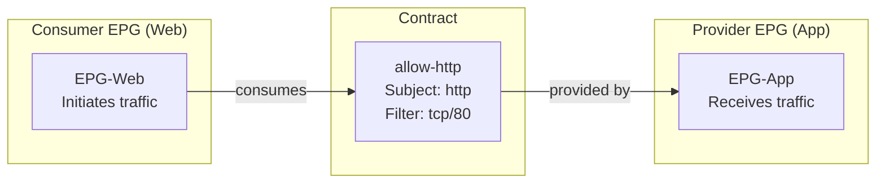
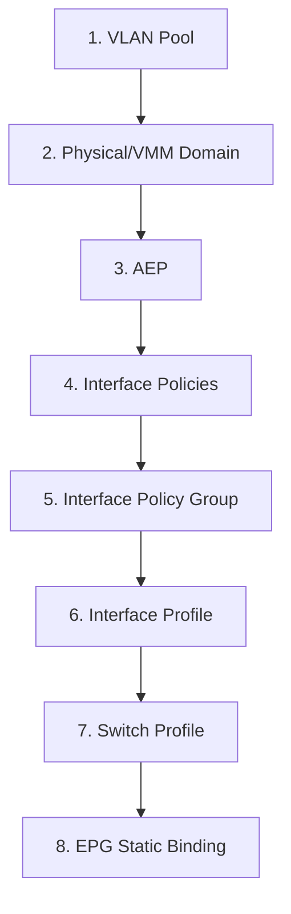

## ACI Policy Model - CCIE DC v3.1 Deep Dive

> Reference: https://github.com/vikiev/aci-ccie-dc (Chapters 5-9)
> This document goes DEEPER on exam-critical policy model topics.

---

### Tenant Model

#### Tenant: The Isolation Boundary

A tenant is the top-level container in the ACI policy model. It provides administrative and policy isolation.

**Built-in Tenants:**
- `common`: shared objects usable by all tenants (shared services, L3Out templates)
- `infra`: infrastructure policies (fabric access, VLAN pools, AEPs, interface policies)
- `mgmt`: out-of-band and in-band management access policies
- `RBAC` (internal): role-based access control definitions

**Tenant Properties:**
- Each tenant has its own VRFs, BDs, APs, EPGs, contracts
- Objects in one tenant are invisible to another (unless explicitly shared via `common`)
- Tenant name is part of the DN (Distinguished Name): `uni/tn-{tenantName}`
- Maximum tenants: 3000 per fabric (hardware dependent)

> **CCIE Exam Tip:** The exam loves to test tenant isolation. If a question asks "can EPG-A in Tenant-1 communicate with EPG-B in Tenant-2?", the answer is NO unless there is an L3Out connecting them or objects are placed in the `common` tenant with appropriate scope.

#### VRF (Virtual Routing and Forwarding)

The VRF is the L3 routing domain within a tenant. It is analogous to a VRF in traditional networking.

**VRF Properties:**
- Contains routing table (L3 forwarding information)
- One or more Bridge Domains associate to a VRF
- One or more L3Outs associate to a VRF (for external routing)
- VRF name in DN: `uni/tn-{tenant}/ctx-{vrfName}`

**VRF Policy Control (EXAM CRITICAL):**

| Mode | Behavior |
|------|----------|
| Enforced (default) | ALL inter-EPG traffic requires a contract. Default deny. |
| Unenforced | ALL EPGs in this VRF can communicate freely. No contracts needed. |

**Preferred Group (at VRF level):**
- Enable: VRF > Policy > Preferred Group = Enabled
- EPGs added as members communicate WITHOUT contracts
- Non-member EPGs still require contracts to talk to members
- Preferred group members can talk to each other freely
- This is a middle ground between "enforced" and "unenforced"

> **CCIE Exam Tip:** VRF policy control "unenforced" is NOT the same as preferred group. Unenforced = ALL EPGs communicate freely. Preferred group = only MEMBER EPGs communicate freely, others still need contracts.

**Verification:**

```nxos
show vrf
show ip route vrf PROD_VRF
show ip route vrf PROD_VRF detail
```

On APIC:
```text
moquery -c fvCtx -f 'fv.Rn=="ctx-PROD_VRF"'
```

#### Bridge Domain (BD)

The Bridge Domain is the L2 broadcast domain. It defines the flooding and forwarding behavior for a group of endpoints.

**BD Properties:**
- Associates to exactly ONE VRF
- Can have one or more subnets (gateway IPs)
- One or more EPGs can map to the same BD
- BD name in DN: `uni/tn-{tenant}/BD-{bdName}`

**Critical BD Settings (EXAM CRITICAL - know defaults):**

| Setting | Default | Options | When to Change |
|---------|---------|---------|----------------|
| L2 Unknown Unicast | Proxy | Proxy / Flood | Flood for legacy devices that need unknown unicast flooding |
| ARP Flooding | Disabled | Enabled / Disabled | Enable for DHCP relay, legacy devices that use ARP for discovery |
| Unicast Routing | Enabled | Enabled / Disabled | Disable for pure L2 BDs (no gateway needed) |
| Multi-Destination Flooding | Flood in BD | Flood in BD / Flood in Encap | Flood in Encap for PIM underlay (large scale) |
| Limit IP Learning to Subnet | Disabled | Enabled / Disabled | Enable for security (prevent IP spoofing) |
| Virtual MAC Address | Disabled | Enabled / Disabled | Enable for shared services / active-standby BDs |

**L2 Unknown Unicast: Proxy vs Flood**

- **Proxy (default):** When a leaf receives a frame with unknown destination MAC, it queries COOP (spine). If COOP has the endpoint, traffic is unicast-forwarded. If COOP does NOT have it, the frame is dropped.
- **Flood:** Unknown unicast is flooded to all ports in the BD (traditional behavior). Required for: some legacy protocols, certain clustering solutions.

> **Lab Exam Warning:** If your endpoints can't communicate and you've verified contracts are correct, check L2 Unknown Unicast setting. If set to "Proxy" and the destination endpoint hasn't been learned yet (first packet), it will be dropped. For initial connectivity testing, "Flood" is safer but less efficient.

**ARP Flooding:**

- **Disabled (default):** Leaf responds to ARP requests on behalf of known endpoints (proxy ARP). ARP requests are NOT broadcast.
- **Enabled:** ARP requests are flooded to all ports in the BD. Required when:
  - DHCP relay needs to see ARP
  - Legacy applications use ARP for neighbor discovery
  - First-hop redundancy protocols need ARP visibility

**Unicast Routing:**

- **Enabled (default):** BD acts as an L3 gateway. Subnet configured on BD becomes the default gateway for endpoints.
- **Disabled:** Pure L2 segment. No gateway IP. Endpoints must have external gateway (via L3Out or another BD).

**Multi-Destination Flooding:**

- **Flood in BD (default):** BUM traffic is replicated to all EPGs within the same BD. Head-end replication.
- **Flood in Encap:** BUM traffic uses VXLAN multicast group in underlay. Requires PIM configuration. Used for very large BDs (100+ leafs).

**Limit IP Learning to Subnet:**

- **Disabled (default):** Leaf learns ANY source IP it sees, regardless of whether it matches a BD subnet.
- **Enabled:** Leaf ONLY learns source IPs that fall within configured BD subnets. Any other source IP is treated as rogue (not learned, traffic dropped).

> **CCIE Exam Tip:** "Limit IP Learning to Subnet" is a SECURITY feature. If enabled and an endpoint uses an IP outside the BD subnet, it will NOT be learned. This is a common exam troubleshooting scenario: "endpoint has IP 10.0.0.5 but BD subnet is 192.168.1.0/24 - why can't it communicate?"

#### Subnet Configuration

**Subnet Properties:**
- Gateway IP: the default gateway address for endpoints in this BD
- Scope: controls how the subnet is used and advertised

**Subnet Scope (EXAM CRITICAL):**

| Scope Flag | Meaning |
|-----------|---------|
| Public | Subnet is visible outside the tenant (can be advertised via L3Out) |
| Private | Subnet is only visible within the tenant (NOT advertised) |
| Shared | Subnet is shared between VRFs (inter-VRF communication via L3Out) |
| Advertised Externally | Subnet is included in L3Out route advertisements (BGP/OSPF) |

**Scope Combinations:**
- `Public + Advertised Externally`: subnet advertised to external routers via L3Out
- `Private`: subnet stays internal, never advertised
- `Shared + Public`: subnet visible across VRFs AND externally
- `Private + Shared`: visible across VRFs but NOT externally

> **CCIE Exam Tip:** If the exam says "advertise the BD subnet to the external router via BGP", you need BOTH "Public" AND "Advertised Externally" checked on the subnet. Missing either one = subnet not advertised.

**Primary vs Secondary Subnet:**
- Primary: the main gateway IP (e.g., 192.168.1.1/24)
- Secondary: additional gateway IPs on the same BD (e.g., 192.168.1.254/24)
- Multiple subnets per BD are allowed
- Only ONE subnet can be primary per BD

**Virtual IP (VIP):**
- Used for shared services across multiple BDs
- Multiple BDs reference the same VIP
- Enables: active-standby gateway failover between BDs
- GUI: BD > Subnets > check "Virtual" flag

**Verification:**

```nxos
show ip interface brief vrf PROD_VRF
show ip route vrf PROD_VRF
show ip arp vrf PROD_VRF
```

---

### Application Profile and EPG

#### Application Profile (AP)

The Application Profile is a **logical grouping container** for EPGs. It has NO technical function in forwarding.

**AP Properties:**
- Organizational only (groups related EPGs together)
- Example: AP "Web-Tier" contains EPGs: Frontend, Backend, Database
- AP name in DN: `uni/tn-{tenant}/ap-{apName}`
- One tenant can have multiple APs
- Contract scope "application-profile" uses AP boundaries

> **CCIE Exam Tip:** Application Profile has ZERO impact on traffic forwarding. It exists purely for organizational purposes and for contract scope "application-profile". If the exam asks "what does changing the AP do to traffic?", the answer is: nothing (unless contract scope is set to application-profile).

#### EPG (Endpoint Group)

The EPG is the **policy enforcement boundary** in ACI. All contracts are applied between EPGs.

**EPG Properties:**
- Maps to exactly ONE Bridge Domain
- Multiple EPGs can share the same BD (same L2 segment, different policies)
- EPG name in DN: `uni/tn-{tenant}/ap-{ap}/epg-{epgName}`
- EPG gets a unique pcTag (Policy Group Tag) for TCAM matching
- EPG is where you bind: static ports, dynamic VMM associations, ESG selectors

**EPG to BD Mapping:**
- Many EPGs -> One BD (allowed)
- One EPG -> Many BDs (NOT allowed)
- EPG inherits BD's VRF, subnets, flooding behavior
- EPGs in same BD share L2 connectivity (if intra-EPG isolation is unenforced)

**Intra-EPG Isolation (EXAM CRITICAL):**

| Mode | Behavior |
|------|----------|
| Unenforced (default) | Endpoints within the SAME EPG can communicate freely |
| Enforced | Endpoints within the SAME EPG CANNOT communicate without a contract |

> **CCIE Exam Tip:** Intra-EPG isolation "enforced" means endpoints in the same EPG need a contract to talk to each other. This is used for microsegmentation within a single EPG. Default is "unenforced" (free communication within EPG).

**Preferred Group Membership:**
- EPG can be added as a "preferred group member" (if VRF has preferred group enabled)
- Member EPGs communicate with each other WITHOUT contracts
- Non-member EPGs still need contracts to reach members
- GUI: EPG > Policies > Preferred Group Member = Yes

**Deployment Immediacy:**

| Setting | Behavior |
|---------|----------|
| Immediate (default) | Policy pushed to leaf as soon as EPG is configured |
| Lazy | Policy pushed to leaf ONLY when first endpoint is learned on that port |

> **CCIE Exam Tip:** "Lazy" deployment is useful for large fabrics with thousands of EPGs. It reduces TCAM usage by only programming rules on leafs that actually have endpoints. The exam may ask: "Why are contracts not taking effect on a leaf?" Answer: check deployment immediacy - if "lazy", no endpoint has been learned yet.

**Resolution Immediacy:**

| Setting | Behavior |
|---------|----------|
| Immediate | VLAN/port programmed on leaf immediately |
| Lazy | VLAN/port programmed only when VMM controller reports a VM on that port |
| Pre-Provision | VLAN/port programmed immediately AND persists after VMM disconnect |

**Use cases:**
- Immediate: physical servers (always connected)
- Lazy: VMM (VMware) - only program ports with active VMs
- Pre-Provision: VMM but want ports ready before VM boots

#### Static Binding (Physical Servers)

Static binding assigns a specific physical port + VLAN to an EPG.

**Components of Static Binding:**
- **Path:** leaf ID + port (e.g., leaf 101, Eth1/5)
- **Encap:** VLAN ID (e.g., vlan-101)
- **Primary Encap:** for microsegmentation (optional second VLAN)
- **Mode:** regular / untagged / native

**Configuration:**
```text
GUI: Tenant > Application Profile > EPG > Static Ports
  - Path: topology/pod-1/paths-101/pathep-[eth1/5]
  - Encap: vlan-101
  - Mode: regular (tagged)
```

**Path Selection Options:**
- Single port: `topology/pod-1/paths-101/pathep-[eth1/5]`
- Port-channel: `topology/pod-1/paths-101/pathep-[PC1]`
- VPC: `topology/pod-1/protpaths-101-102/pathep-[VPC1]`

**Encap Types:**
- VLAN: `vlan-101` (most common)
- VXLAN: `vxlan-15001` (rare, for specific integrations)

**Primary vs Secondary Encap (Microsegmentation):**
- Primary encap: the "transport" VLAN (how traffic arrives at the leaf)
- Secondary encap: the "policy" VLAN (which EPG policy applies)
- Use case: multiple EPGs share the same physical VLAN but have different policies

> **Lab Exam Warning:** The #1 mistake in static binding: using the wrong encap VLAN. If the endpoint sends untagged frames, use mode "native" or "untagged". If the endpoint sends tagged frames, the VLAN must match. Mismatch = endpoint NOT learned.

#### Dynamic Binding (VMM Integration)

**VMware VDS Integration:**
- APIC connects to vCenter as a VMM domain
- EPGs automatically become port-groups in vCenter
- EPG name = port-group name (exact match)
- When a VM is attached to a port-group, ACI programs the physical port

**VMM Domain Configuration:**
```text
GUI: VM Networking > VMM Domains > VMware > Create
  - Name: vcenter-domain
  - vCenter IP: 172.16.1.100
  - Credentials: admin/password
  - Associated EPGs: select from tenants
```

**How it works:**
1. Admin creates EPG "Web-Servers" in ACI
2. APIC creates port-group "Web-Servers" in vCenter VDS
3. Admin attaches VM NIC to "Web-Servers" port-group in vCenter
4. vCenter notifies APIC (via VMM controller)
5. APIC programs the physical leaf port where the ESXi host connects
6. Endpoint (VM) is learned on that port

> **CCIE Exam Tip:** In VMM integration, you do NOT configure static bindings. The binding is dynamic based on which ESXi host the VM runs on. If a VM migrates (vMotion), ACI automatically updates the endpoint location.

---

### Contracts Deep Dive

#### Contract: The Whitelist Model

ACI uses a **default-deny, whitelist** model. No traffic flows between EPGs unless explicitly permitted by a contract.

**Contract Properties:**
- Name in DN: `uni/tn-{tenant}/brc-{contractName}`
- Contains one or more Subjects
- Each Subject contains one or more Filters
- Applied between Provider EPG and Consumer EPG
- Directional: consumer -> provider (initiated by consumer)

**Provider/Consumer Model:**



- **Provider:** the EPG that RECEIVES traffic (destination)
- **Consumer:** the EPG that INITIATES traffic (source)
- Traffic flows: Consumer -> Provider (matching filter)
- Return traffic: automatically allowed (stateful)

> **CCIE Exam Tip:** Provider = destination, Consumer = source. If EPG-Web needs to access EPG-App on TCP/80, then EPG-App is the PROVIDER and EPG-Web is the CONSUMER. Getting this backwards is the #1 contract mistake in the lab exam.

#### Contract Scope (EXAM CRITICAL)

Contract scope determines WHERE the contract can be applied.

| Scope | Meaning | When to Use |
|-------|---------|-------------|
| Context (VRF) | Contract usable by any EPG in the same VRF | Default. Most common. EPGs in same VRF, different APs. |
| Tenant | Contract usable by any EPG in the same tenant (across VRFs) | EPGs in different VRFs within same tenant |
| Application Profile | Contract usable only by EPGs in the SAME AP | Strict isolation between APs |
| Global | Contract usable by EPGs in ANY tenant | Shared services in `common` tenant |

**Scope Decision Tree:**

```text
Are the EPGs in the same VRF?
  YES -> Scope = Context (VRF)
  NO  -> Are they in the same tenant?
    YES -> Scope = Tenant
    NO  -> Scope = Global

Are the EPGs in the same Application Profile AND you want to restrict?
  YES -> Scope = Application Profile
```

> **CCIE Exam Tip:** If the exam has two EPGs in the SAME VRF but DIFFERENT Application Profiles, and the contract scope is set to "Application Profile", the contract will NOT work. This is a classic exam trap. Default scope is "Context (VRF)" which works across APs within the same VRF.

> **Lab Exam Warning:** If your contract is configured but traffic still doesn't flow, CHECK THE SCOPE FIRST. Wrong scope is the most common contract failure in the lab.

#### Subject

A Subject groups filters within a contract. One contract can have multiple subjects.

**Subject Properties:**
- Name: descriptive (e.g., "web-traffic", "database-access")
- Contains: one or more Filters
- Reverse Filter Ports: enabled by default (stateful)
- Priority: Level 1 (highest) to Level 4 (lowest)
- Directives: log, enable policy compression

**Reverse Filter Ports (Stateful):**
- Default: ENABLED
- Meaning: if filter allows TCP/80 (consumer -> provider), return traffic (provider -> consumer) is AUTOMATICALLY allowed
- You do NOT need a separate filter for return traffic
- If disabled: you must explicitly define both directions

**Priority (Level 1-4):**
- Used when multiple subjects have overlapping rules
- Level 1 = highest priority (evaluated first)
- Level 4 = lowest priority
- If a Level 1 subject denies and Level 4 permits: DENY wins
- Default: all subjects are Level 3

**Directives:**
- `log`: log matching packets to syslog (for debugging)
- `enable policy compression`: reduce TCAM usage by combining rules

> **CCIE Exam Tip:** "Reverse filter ports" is what makes ACI contracts STATEFUL. Without it, you'd need two filters (one for each direction). The exam may ask: "Why can the server respond to the client without a separate contract?" Answer: Reverse filter ports (stateful inspection).

#### Filter

A Filter defines the actual protocol/port matching criteria.

**Filter Properties:**
- Name in DN: `uni/tn-{tenant}/flt-{filterName}`
- Contains one or more Filter Entries
- Filters are REUSABLE across multiple contracts

**Filter Entry Fields:**

| Field | Options | Notes |
|-------|---------|-------|
| EtherType | ip, arp, fcoe, mpls_ucast, unspecified | Default: ip |
| IP Protocol | tcp, udp, icmp, igmp, eigrp, ospfigp, pim, l2tp, unspecified | Default: unspecified (all) |
| Source Port | 0-65535, or range (e.g., 1024-65535) | Default: unspecified (all) |
| Destination Port | 0-65535, or range | Default: unspecified (all) |
| TCP Flags | syn, ack, fin, rst, established, unspecified | For advanced matching |
| Stateful | yes / no | Default: yes |
| ICMP Type | echo, echo-reply, unreachable, ttl-exceeded, unspecified | Only when protocol = icmp |

**Common Filter Examples:**

```text
HTTP:   EtherType=ip, Protocol=tcp, Dst Port=80
HTTPS:  EtherType=ip, Protocol=tcp, Dst Port=443
DNS:    EtherType=ip, Protocol=udp, Dst Port=53
ICMP:   EtherType=ip, Protocol=icmp, ICMP Type=echo
SSH:    EtherType=ip, Protocol=tcp, Dst Port=22
ALL:    EtherType=unspecified (matches everything)
```

**Stateful (default: yes):**
- TCP return traffic automatically permitted
- Tracks connection state (SYN -> SYN-ACK -> ACK -> data -> FIN)
- Only NEW connections from consumer -> provider are evaluated
- Established connections bypass contract check (hardware fast-path)

**TCP Flags Matching:**
- `syn`: match only SYN packets (new connection initiation)
- `ack`: match only ACK packets
- `established`: match ACK or RST (existing connections)
- Use case: allow only established return traffic (rare, since stateful handles this)

> **CCIE Exam Tip:** If the exam asks you to create a filter that allows "only new HTTP connections from consumer to provider", use: Protocol=tcp, Dst Port=80, TCP Flags=syn. But in practice, you rarely need TCP flags because stateful filtering handles return traffic automatically.

#### Actions: Permit, Deny, Log

- **Permit:** allow matching traffic (default action for filter in contract)
- **Deny:** explicitly block matching traffic (used in Taboo contracts)
- **Log:** record matching packets in syslog (additive, not standalone)

#### Taboo Contract (Explicit Deny)

A Taboo contract is an explicit DENY that OVERRIDES any permit contracts.

**Taboo Properties:**
- Applied at EPG level (not provider/consumer model)
- Overrides ALL permit contracts (highest priority)
- Use case: block specific traffic even if a permit contract exists
- GUI: Tenant > Contracts > Taboo Contracts

**Example Scenario:**
```text
Contract "allow-all" permits ALL traffic from EPG-Web to EPG-App
Taboo "block-telnet" denies TCP/23 on EPG-App

Result: All traffic allowed EXCEPT telnet (TCP/23 is blocked)
```

**Taboo Application:**
- Taboo is applied TO an EPG (as a "taboo target")
- It affects ALL traffic destined TO that EPG
- It does NOT use provider/consumer binding

> **CCIE Exam Tip:** Taboo = explicit deny that wins over permits. If the exam says "block SSH to the database EPG even though a permit-all contract exists", use a Taboo contract on the database EPG with filter tcp/22.

#### vzAny (Apply Contract to ALL EPGs in VRF)

vzAny applies a contract to ALL EPGs in a VRF without individual binding.

**Provider vzAny:**
- ALL EPGs in the VRF automatically PROVIDE the contract
- No need to add each EPG as a provider individually

**Consumer vzAny:**
- ALL EPGs in the VRF automatically CONSUME the contract
- No need to add each EPG as a consumer individually

**Most Common Use Case:**
```text
Scenario: All EPGs need internet access via L3Out

Configuration:
1. Create contract "allow-internet" (permit all or specific ports)
2. L3Out PROVIDES the contract
3. VRF vzAny CONSUMES the contract

Result: Every EPG in the VRF can reach the internet via L3Out
        without individually binding each EPG as consumer
```

**GUI Path:**
```text
Tenant > Networking > VRF > Policies > vzAny
  - Provided Contracts: add contracts this VRF provides to all
  - Consumed Contracts: add contracts all EPGs consume
```

> **CCIE Exam Tip:** vzAny is the FASTEST way to give all EPGs access to an L3Out. In the lab exam, if you need "all EPGs can reach external network", use vzAny consumer on the VRF + L3Out as provider. Do NOT waste time binding each EPG individually.

> **Time Trap:** Binding 10 EPGs individually as consumers takes 10x longer than one vzAny configuration. In a timed lab, always prefer vzAny for "all EPGs" scenarios.

#### Preferred Group

Preferred Group allows EPGs to communicate WITHOUT contracts.

**Configuration:**
1. Enable at VRF level: VRF > Policy > Preferred Group = Enabled
2. Add EPGs as members: EPG > Policies > Preferred Group Member = Yes
3. Member EPGs communicate freely with each other
4. Non-member EPGs still need contracts to reach members

**Behavior Matrix:**

| Source | Destination | Contract Needed? |
|--------|-------------|-----------------|
| Member EPG | Member EPG | NO (free communication) |
| Member EPG | Non-member EPG | YES (contract required) |
| Non-member EPG | Member EPG | YES (contract required) |
| Non-member EPG | Non-member EPG | YES (contract required) |

> **CCIE Exam Tip:** Preferred Group is NOT the same as VRF "unenforced" mode. Preferred group is SELECTIVE (only members get free access). VRF unenforced is GLOBAL (all EPGs get free access). The exam will test this distinction.

#### Contract TCAM Capacity

**TCAM (Ternary Content-Addressable Memory):**
- Each leaf has finite TCAM for zoning rules (contracts)
- Typical capacity: 8000-16000 entries per leaf (platform dependent)
- Each contract + filter combination consumes TCAM entries
- TCAM is shared across ALL tenants on a leaf

**Monitoring TCAM:**

```nxos
show hardware internal access-listmgr info
show hardware internal access-listmgr usage
show zoning-rule
```

Example output:
```text
leaf101# show hardware internal access-listmgr info

Slot 1:
  TCAM Region: IFACL
    Used: 245 / 8192 (3%)
  TCAM Region: RACL
    Used: 12 / 4096 (<1%)
  TCAM Region: EGR_ACL
    Used: 0 / 2048 (0%)
```

**Policy Compression (Zoning Rules):**
- APIC optimizes contracts before pushing to leafs
- Multiple EPGs with same contract -> single TCAM entry (using pcTag ranges)
- "Enable policy compression" directive on subject helps
- Reduces TCAM consumption by 60-80% in typical deployments

**TCAM Overflow Behavior:**
- If TCAM is full: NEW rules are NOT programmed
- Existing rules continue to work
- APIC raises fault: "TCAM allocation failure"
- Traffic matching un-programmed rules: DROPPED (default deny)
- Resolution: reduce contracts, enable compression, or upgrade hardware

> **Lab Exam Warning:** In the lab, you will NOT hit TCAM limits (small fabric). But the exam may ask theoretical questions about TCAM overflow. Answer: new rules fail to program, existing traffic unaffected, new unmatched traffic dropped.

**Verification:**

```nxos
show zoning-rule
show zoning-rule summary
show contract
show contract summary
```

---

### ESG (Endpoint Security Groups)

#### ESG vs EPG

| Feature | EPG | ESG |
|---------|-----|-----|
| Grouping method | Port/VLAN-based (group) | Attribute-based (tag) |
| Membership | Static binding or VMM | IP, MAC, tag, VMM attribute selectors |
| Use case | Physical servers, VMs | Microsegmentation, zero-trust |
| Re-cabling needed? | Yes (move port to change EPG) | No (change attribute, policy follows) |
| Contract support | Yes | Yes (identical to EPG) |
| BD association | Required | Not required (inherits from EPG or VRF) |

#### ESG Selectors

ESG membership is determined by endpoint ATTRIBUTES, not physical location.

**Selector Types:**

| Selector | Example | Use Case |
|----------|---------|----------|
| IP address | 192.168.1.0/24 | Group by subnet |
| MAC address | 00:11:22:33:44:55 | Specific device |
| Tag | "tier=web" | Custom classification |
| VMM attribute | VM name pattern, OS type | VMware/Hyper-V VMs |

**Configuration:**
```text
GUI: Tenant > Application Profile > ESG > Selectors
  - Selector Type: IP
  - Value: 192.168.1.0/24
  - Match: All (AND) or Any (OR)
```

#### ESG and Contracts

ESGs use contracts IDENTICALLY to EPGs:
- ESG can be provider or consumer
- Same scope rules apply
- Same filter/subject structure
- Taboo contracts work with ESGs

**Mixed EPG + ESG environment:**
- EPG can consume contract from ESG (and vice versa)
- Policy is evaluated the same way regardless of group type

#### ESG Use Case: Microsegmentation

**Traditional (EPG-based):**
- Move server to different VLAN/port to change policy
- Requires physical re-cabling or VLAN change
- Disruptive to operations

**ESG-based:**
- Tag endpoint with attribute (e.g., "pci-scope=yes")
- ESG selector matches tag
- Policy applies immediately without any physical change
- Endpoint can move freely; policy follows the attribute

> **CCIE Exam Tip:** ESG is the ACI answer to "zero-trust microsegmentation". The exam may present a scenario where servers share the same VLAN but need different policies. Answer: use ESG with IP or tag selectors instead of creating separate EPGs/VLANs.

#### ESG Configuration via REST API

```json
{
  "fvESg": {
    "attributes": {
      "name": "PCI-Servers",
      "dn": "uni/tn-PROD/ap-Security/esg-PCI-Servers"
    },
    "children": [
      {
        "fvEPSelector": {
          "attributes": {
            "name": "ip-selector",
            "matchExpression": "ip=='192.168.1.0/24'"
          }
        }
      },
      {
        "fvRsProv": {
          "attributes": {
            "tnVzBrCPName": "allow-https"
          }
        }
      }
    ]
  }
}
```

---

### Access Policies (Complete Chain)

Access policies define HOW physical ports are configured. This is the most commonly tested configuration chain in the lab exam.

#### Overview: The 8-Step Chain



> **Lab Exam Warning:** You MUST configure these in order. Skipping a step or doing them out of order will result in the port not coming up or the EPG not being bound. The exam WILL test whether you know the correct order.

#### Step 1: VLAN Pool

**Purpose:** Defines the range of VLANs available for use on access ports.

**Types:**
- **Static:** VLANs manually assigned to EPGs (most common)
- **Dynamic:** VLANs auto-assigned by APIC (used with VMM)

**Configuration:**
```text
GUI: Fabric > Access Policies > VLAN Pools > Create
  Name: prod-vlan-pool
  Encap Block: vlan-100 to vlan-200
  Allocation Mode: static
```

**DN:** `uni/infra/vlanns-[prod-vlan-pool]-static`

> **CCIE Exam Tip:** The VLAN pool encap block must INCLUDE the VLAN used in the EPG static binding. If pool is vlan-100-200 and you try to bind EPG with vlan-300, it will FAIL.

#### Step 2: Physical Domain / VMM Domain / L3 Domain

**Purpose:** Associates a VLAN pool with a domain type.

**Domain Types:**
- **Physical Domain:** for bare-metal servers, physical appliances
- **VMM Domain:** for VMware/Hyper-V/OpenStack integration
- **L3 Domain:** for L3Out external router connections
- **FC Domain:** for Fibre Channel (storage)

**Configuration (Physical Domain):**
```text
GUI: Fabric > Access Policies > Physical Domains > Create
  Name: prod-phys-dom
  VLAN Pool: prod-vlan-pool (static)
```

**DN:** `uni/phys-prod-phys-dom`

**Critical:** The domain MUST be associated with the VLAN pool. Without this, the VLAN pool is unusable.

#### Step 3: AEP (Attachable Access Entity Profile)

**Purpose:** Links the domain to the interface. AEP is the "glue" between domain and port.

**Configuration:**
```text
GUI: Fabric > Access Policies > Attachable Access Entity Profiles > Create
  Name: prod-aep
  Associated Domains: prod-phys-dom (Physical)
```

**DN:** `uni/infra/attentp-prod-aep`

> **Lab Exam Warning:** Forgetting to associate the domain with the AEP is the #1 access policy mistake. The AEP exists, the domain exists, but they're not linked. Result: port comes up but EPG binding fails silently.

#### Step 4: Interface Policies

Individual policies that control port behavior:

| Policy | Purpose | Common Settings |
|--------|---------|-----------------|
| CDP | Cisco Discovery Protocol | Enabled (default) |
| LLDP | Link Layer Discovery Protocol | Enabled (default) |
| STP | Spanning Tree Protocol | Disabled (ACI has no STP) |
| LACP | Link Aggregation | Active/Passive/Off |
| Port Security | MAC limit | Disabled (default) |
| Link Level | Speed/Duplex/MTU | auto/auto/inherit |
| Spanning Tree Interface | BPDU guard/filter | Disabled |
| Storm Control | Broadcast/multicast rate | Disabled (default) |
| MACsec | Encryption | Disabled |

**Configuration example:**
```text
GUI: Fabric > Access Policies > Policies > Interface > CDP > Create
  Name: enable-cdp
  Admin State: enabled
```

> **CCIE Exam Tip:** STP should be DISABLED on ACI access ports. ACI does not run STP internally. If you enable STP and connect to a switch running STP, it may block ports unnecessarily. The exam may include STP as a distractor.

#### Step 5: Interface Policy Group

**Purpose:** Bundles all interface policies + AEP into a single reusable group.

**Types:**
- **Access Port Group:** single physical port (no port-channel)
- **PC Policy Group:** port-channel (LACP or static)
- **VPC Policy Group:** virtual port-channel (across VPC pair)

**Configuration (Access Port Group):**
```text
GUI: Fabric > Access Policies > Interfaces > Leaf Interfaces > Policy Groups > Create
  Type: Access Port
  Name: prod-access-pg
  AEP: prod-aep
  CDP Policy: enable-cdp
  LLDP Policy: enable-lldp
  Link Level Policy: 10G-auto
```

**DN:** `uni/infra/funcprof/accportgrp-prod-access-pg`

**Configuration (VPC Policy Group):**
```text
GUI: Fabric > Access Policies > Interfaces > Leaf Interfaces > Policy Groups > Create
  Type: VPC
  Name: prod-vpc-pg
  AEP: prod-aep
  LACP Policy: active
  Link Level Policy: 10G-auto
```

#### Step 6: Interface Profile (Access Port Selector)

**Purpose:** Selects which physical ports use the policy group.

**Configuration:**
```text
GUI: Fabric > Access Policies > Interfaces > Leaf Interfaces > Profiles > Create
  Name: leaf101-ports
  Interface Selector:
    - Name: port5
    - Policy Group: prod-access-pg
    - Ports: 1/5
```

**DN:** `uni/infra/accportprof-leaf101-ports`

#### Step 7: Switch Profile

**Purpose:** Assigns the interface profile to a specific switch (leaf).

**Configuration:**
```text
GUI: Fabric > Access Policies > Switches > Leaf Switches > Profiles > Create
  Name: leaf101-profile
  Selector:
    - Name: leaf101
    - Switch: 101
    - Interface Profile: leaf101-ports
```

**DN:** `uni/infra/nprof-leaf101-profile`

> **CCIE Exam Tip:** The switch profile is what makes the configuration "stick" to a specific leaf. Without it, the interface profile exists but is not applied to any switch. If ports aren't coming up, verify the switch profile selector includes the correct node ID.

#### Step 8: EPG Static Binding

**Purpose:** Assigns the EPG to a specific port with a specific VLAN.

**Configuration:**
```text
GUI: Tenant > Application Profile > EPG > Static Ports > +
  Path: topology/pod-1/paths-101/pathep-[eth1/5]
  Encap: vlan-101
  Mode: regular
```

**This step references:**
- The leaf/port (from switch profile + interface profile)
- The VLAN (must be in the VLAN pool)
- The EPG (must be associated with a BD)

#### Complete Configuration Order Summary

```text
1. VLAN Pool          -> defines available VLANs
2. Physical Domain    -> associates VLAN pool with domain type
3. AEP               -> associates domain with interface framework
4. Interface Policies -> CDP, LLDP, speed, etc.
5. Policy Group      -> bundles AEP + interface policies
6. Interface Profile -> selects physical ports, applies policy group
7. Switch Profile    -> assigns interface profile to specific leaf
8. EPG Static Binding -> maps EPG + VLAN to the port
```

> **Time Trap:** In the lab exam, access policy configuration takes 10-15 minutes if done manually via GUI. Know the exact GUI paths cold. Alternatively, use REST API to script the entire chain in 2 minutes.

#### Access Policy Verification

```nxos
show interface ethernet 1/5
show interface ethernet 1/5 switchport
show vlan id 101
show endpoint
show lldp neighbors ethernet 1/5
show cdp neighbors ethernet 1/5
show port-channel summary
show lacp neighbor
```

On APIC:
```text
moquery -c infraAccPortGrp
moquery -c infraRsAccBaseGrp
moquery -c fvRsPathAtt
```

---

### REST API for Policy Model

#### Authentication

All API calls require a token obtained via login:

```json
POST https://apic-ip/api/aaaLogin.json

{
  "aaaUser": {
    "attributes": {
      "name": "admin",
      "pwd": "YourPassword123"
    }
  }
}
```

Response:
```json
{
  "imdata": [
    {
      "aaaLogin": {
        "attributes": {
          "token": "gAAAAABk...",
          "refreshTimeoutSeconds": "600"
        }
      }
    }
  ]
}
```

Use token in subsequent requests:
```text
Cookie: APIC-cookie=gAAAAABk...
```

#### Object Model: DN and RN

**DN (Distinguished Name):** Full path to an object in the policy tree.
**RN (Relative Name):** Single component of the DN.

```text
DN: uni/tn-PROD/ctx-PROD_VRF
RN breakdown:
  uni          = universe (root)
  tn-PROD      = tenant "PROD"
  ctx-PROD_VRF = VRF "PROD_VRF"

DN: uni/tn-PROD/ap-WebApp/epg-Frontend
RN breakdown:
  uni            = universe
  tn-PROD        = tenant "PROD"
  ap-WebApp      = application profile "WebApp"
  epg-Frontend   = EPG "Frontend"
```

**Common RN prefixes:**

| Prefix | Object Type |
|--------|-------------|
| tn- | Tenant |
| ctx- | VRF (Context) |
| BD- | Bridge Domain |
| subnet- | Subnet |
| ap- | Application Profile |
| epg- | Endpoint Group |
| brc- | Contract (Bridge Contract) |
| flt- | Filter |
| subj- | Subject |
| rsPathAtt- | Static Path Binding |
| rsDomAtt- | Domain Association |

#### CRUD Operations

| Operation | HTTP Method | URL Pattern |
|-----------|-------------|-------------|
| Create | POST | /api/mo/{dn}.json |
| Read | GET | /api/mo/{dn}.json |
| Update | POST | /api/mo/{dn}.json (same as create, merges) |
| Delete | DELETE | /api/mo/{dn}.json |

**Query Parameters:**
- `?rsp-subtree=full` - include child objects
- `?rsp-subtree-class=fvRsProv,fvRsCons` - include specific children
- `?query-target=subtree` - search all descendants
- `?rsp-prop-include=config-only` - exclude operational state

#### Common API Calls

**Create Tenant:**
```json
POST /api/mo/uni/tn-PROD.json

{
  "fvTenant": {
    "attributes": {
      "name": "PROD",
      "descr": "Production Tenant"
    }
  }
}
```

**Create VRF:**
```json
POST /api/mo/uni/tn-PROD/ctx-PROD_VRF.json

{
  "fvCtx": {
    "attributes": {
      "name": "PROD_VRF",
      "pcEnfPref": "enforced"
    }
  }
}
```

**Create Bridge Domain with Subnet:**
```json
POST /api/mo/uni/tn-PROD/BD-Web_BD.json

{
  "fvBD": {
    "attributes": {
      "name": "Web_BD",
      "arpFlood": "no",
      "unkMacUcastAct": "proxy",
      "unicastRoute": "yes",
      "limitIpLearnToSubnets": "yes"
    },
    "children": [
      {
        "fvSubnet": {
          "attributes": {
            "ip": "192.168.1.1/24",
            "scope": "public",
            "preferred": "yes"
          }
        }
      },
      {
        "fvRsCtx": {
          "attributes": {
            "tnFvCtxName": "PROD_VRF"
          }
        }
      }
    ]
  }
}
```

**Create Application Profile and EPG:**
```json
POST /api/mo/uni/tn-PROD/ap-WebApp.json

{
  "fvAp": {
    "attributes": {
      "name": "WebApp"
    },
    "children": [
      {
        "fvAEPg": {
          "attributes": {
            "name": "Frontend",
            "pcEnfPref": "unenforced"
          },
          "children": [
            {
              "fvRsBd": {
                "attributes": {
                  "tnFvBDName": "Web_BD"
                }
              }
            }
          ]
        }
      },
      {
        "fvAEPg": {
          "attributes": {
            "name": "Backend",
            "pcEnfPref": "unenforced"
          },
          "children": [
            {
              "fvRsBd": {
                "attributes": {
                  "tnFvBDName": "Web_BD"
                }
              }
            }
          ]
        }
      }
    ]
  }
}
```

**Create Contract with Filter:**
```json
POST /api/mo/uni/tn-PROD/brc-allow-web.json

{
  "vzBrCP": {
    "attributes": {
      "name": "allow-web",
      "scope": "context"
    },
    "children": [
      {
        "vzSubj": {
          "attributes": {
            "name": "http-https",
            "revFltPorts": "yes"
          },
          "children": [
            {
              "vzRsSubjFiltAtt": {
                "attributes": {
                  "tnVzFilterName": "web-filter"
                }
              }
            }
          ]
        }
      }
    ]
  }
}
```

**Create Filter (separate object):**
```json
POST /api/mo/uni/tn-PROD/flt-web-filter.json

{
  "vzFilter": {
    "attributes": {
      "name": "web-filter"
    },
    "children": [
      {
        "vzEntry": {
          "attributes": {
            "name": "http",
            "etherT": "ip",
            "prot": "tcp",
            "dFromPort": "80",
            "dToPort": "80",
            "stateful": "yes"
          }
        }
      },
      {
        "vzEntry": {
          "attributes": {
            "name": "https",
            "etherT": "ip",
            "prot": "tcp",
            "dFromPort": "443",
            "dToPort": "443",
            "stateful": "yes"
          }
        }
      }
    ]
  }
}
```

**Bind EPG as Provider/Consumer:**
```json
POST /api/mo/uni/tn-PROD/ap-WebApp/epg-Backend.json

{
  "fvAEPg": {
    "attributes": {
      "name": "Backend"
    },
    "children": [
      {
        "fvRsProv": {
          "attributes": {
            "tnVzBrCPName": "allow-web"
          }
        }
      }
    ]
  }
}
```

```json
POST /api/mo/uni/tn-PROD/ap-WebApp/epg-Frontend.json

{
  "fvAEPg": {
    "attributes": {
      "name": "Frontend"
    },
    "children": [
      {
        "fvRsCons": {
          "attributes": {
            "tnVzBrCPName": "allow-web"
          }
        }
      }
    ]
  }
}
```

**Static Binding (EPG to Port):**
```json
POST /api/mo/uni/tn-PROD/ap-WebApp/epg-Frontend.json

{
  "fvAEPg": {
    "attributes": {
      "name": "Frontend"
    },
    "children": [
      {
        "fvRsPathAtt": {
          "attributes": {
            "tDn": "topology/pod-1/paths-101/pathep-[eth1/5]",
            "encap": "vlan-101",
            "mode": "regular"
          }
        }
      }
    ]
  }
}
```

#### moquery: CLI Equivalent on APIC

`moquery` is the APIC CLI tool for querying the managed object tree.

```text
apic1# moquery -c fvTenant
apic1# moquery -c fvCtx -f 'fv.Rn=="ctx-PROD_VRF"'
apic1# moquery -c fvBD -f 'fv.Rn=="BD-Web_BD"' -x rsp-subtree=full
apic1# moquery -c fvAEPg -f 'fv.Rn=="epg-Frontend"'
apic1# moquery -c vzBrCP
apic1# moquery -c fvRsPathAtt -f 'fvRsPathAtt.encap=="vlan-101"'
apic1# moquery -c fvRsProv
apic1# moquery -c fvRsCons
apic1# moquery -d uni/tn-PROD -x rsp-subtree=full
```

**Useful moquery flags:**
- `-c`: class name
- `-f`: filter expression
- `-d`: DN (direct lookup)
- `-x`: extra options (rsp-subtree, query-target)
- `-o`: output format (json, xml)

> **CCIE Exam Tip:** In the lab exam, moquery is faster than GUI for verification. Know these patterns:
> - Find all EPGs: `moquery -c fvAEPg`
> - Find all contracts: `moquery -c vzBrCP`
> - Find static bindings: `moquery -c fvRsPathAtt`
> - Find provider bindings: `moquery -c fvRsProv`
> - Find consumer bindings: `moquery -c fvRsCons`

---

### Lab 1: Complete Tenant Build (Step-by-Step)

#### Objective
Build a complete tenant with VRF, BD, AP, 2 EPGs, static bindings, and a contract. Verify end-to-end connectivity.

#### Step 1: Create Tenant

**GUI:**
```text
Tenants > + Add Tenant
  Name: LAB_TENANT
  Submit
```

**REST API:**
```json
POST /api/mo/uni/tn-LAB_TENANT.json

{
  "fvTenant": {
    "attributes": {
      "name": "LAB_TENANT"
    }
  }
}
```

#### Step 2: Create VRF

**GUI:**
```text
Tenants > LAB_TENANT > Networking > VRFs > + Create VRF
  Name: LAB_VRF
  Policy Control Preference: Enforced
  Submit
```

**REST API:**
```json
POST /api/mo/uni/tn-LAB_TENANT/ctx-LAB_VRF.json

{
  "fvCtx": {
    "attributes": {
      "name": "LAB_VRF",
      "pcEnfPref": "enforced"
    }
  }
}
```

#### Step 3: Create Bridge Domain with Subnet

**GUI:**
```text
Tenants > LAB_TENANT > Networking > Bridge Domains > + Create BD
  Name: WEB_BD
  VRF: LAB_VRF
  Subnets > + Add Subnet:
    Gateway IP: 10.10.1.1/24
    Scope: Public, Advertised Externally
  L2 Configuration:
    ARP Flooding: No
    L2 Unknown Unicast: Proxy
  L3 Configuration:
    Unicast Routing: Yes
    Limit IP Learning to Subnet: Yes
  Submit
```

**REST API:**
```json
POST /api/mo/uni/tn-LAB_TENANT/BD-WEB_BD.json

{
  "fvBD": {
    "attributes": {
      "name": "WEB_BD",
      "arpFlood": "no",
      "unkMacUcastAct": "proxy",
      "unicastRoute": "yes",
      "limitIpLearnToSubnets": "yes"
    },
    "children": [
      {
        "fvSubnet": {
          "attributes": {
            "ip": "10.10.1.1/24",
            "scope": "public,shared",
            "preferred": "yes"
          }
        }
      },
      {
        "fvRsCtx": {
          "attributes": {
            "tnFvCtxName": "LAB_VRF"
          }
        }
      }
    ]
  }
}
```

#### Step 4: Create Application Profile with 2 EPGs

**GUI:**
```text
Tenants > LAB_TENANT > Application Profiles > + Create
  Name: WEB_APP
  EPGs > + Create EPG:
    Name: EPG_WEB
    Bridge Domain: WEB_BD
    Intra-EPG Isolation: Unenforced
  EPGs > + Create EPG:
    Name: EPG_APP
    Bridge Domain: WEB_BD
    Intra-EPG Isolation: Unenforced
  Submit
```

**REST API:**
```json
POST /api/mo/uni/tn-LAB_TENANT/ap-WEB_APP.json

{
  "fvAp": {
    "attributes": {
      "name": "WEB_APP"
    },
    "children": [
      {
        "fvAEPg": {
          "attributes": {
            "name": "EPG_WEB"
          },
          "children": [
            {
              "fvRsBd": {
                "attributes": {
                  "tnFvBDName": "WEB_BD"
                }
              }
            }
          ]
        }
      },
      {
        "fvAEPg": {
          "attributes": {
            "name": "EPG_APP"
          },
          "children": [
            {
              "fvRsBd": {
                "attributes": {
                  "tnFvBDName": "WEB_BD"
                }
              }
            }
          ]
        }
      }
    ]
  }
}
```

#### Step 5: Static Binding (2 Ports)

**GUI:**
```text
Tenants > LAB_TENANT > Application Profiles > WEB_APP > EPG_WEB > Static Ports > +
  Path: topology/pod-1/paths-101/pathep-[eth1/5]
  Encap: vlan-101
  Mode: regular

Tenants > LAB_TENANT > Application Profiles > WEB_APP > EPG_APP > Static Ports > +
  Path: topology/pod-1/paths-101/pathep-[eth1/6]
  Encap: vlan-102
  Mode: regular
```

**REST API:**
```json
POST /api/mo/uni/tn-LAB_TENANT/ap-WEB_APP/epg-EPG_WEB.json

{
  "fvAEPg": {
    "attributes": { "name": "EPG_WEB" },
    "children": [
      {
        "fvRsPathAtt": {
          "attributes": {
            "tDn": "topology/pod-1/paths-101/pathep-[eth1/5]",
            "encap": "vlan-101",
            "mode": "regular"
          }
        }
      }
    ]
  }
}
```

```json
POST /api/mo/uni/tn-LAB_TENANT/ap-WEB_APP/epg-EPG_APP.json

{
  "fvAEPg": {
    "attributes": { "name": "EPG_APP" },
    "children": [
      {
        "fvRsPathAtt": {
          "attributes": {
            "tDn": "topology/pod-1/paths-101/pathep-[eth1/6]",
            "encap": "vlan-102",
            "mode": "regular"
          }
        }
      }
    ]
  }
}
```

#### Step 6: Create Contract (HTTP + HTTPS)

**GUI:**
```text
Tenants > LAB_TENANT > Contracts > Standard > + Create Contract
  Name: allow-web
  Scope: Context (VRF)
  Subjects > + Create Subject:
    Name: web-traffic
    Filters > + Add:
      Create Filter "web-filter":
        Entry 1: etherType=ip, protocol=tcp, dstPort=80
        Entry 2: etherType=ip, protocol=tcp, dstPort=443
    Reverse Filter Ports: Yes
  Submit
```

**REST API (Filter):**
```json
POST /api/mo/uni/tn-LAB_TENANT/flt-web-filter.json

{
  "vzFilter": {
    "attributes": { "name": "web-filter" },
    "children": [
      {
        "vzEntry": {
          "attributes": {
            "name": "http",
            "etherT": "ip",
            "prot": "tcp",
            "dFromPort": "80",
            "dToPort": "80",
            "stateful": "yes"
          }
        }
      },
      {
        "vzEntry": {
          "attributes": {
            "name": "https",
            "etherT": "ip",
            "prot": "tcp",
            "dFromPort": "443",
            "dToPort": "443",
            "stateful": "yes"
          }
        }
      }
    ]
  }
}
```

**REST API (Contract):**
```json
POST /api/mo/uni/tn-LAB_TENANT/brc-allow-web.json

{
  "vzBrCP": {
    "attributes": {
      "name": "allow-web",
      "scope": "context"
    },
    "children": [
      {
        "vzSubj": {
          "attributes": {
            "name": "web-traffic",
            "revFltPorts": "yes"
          },
          "children": [
            {
              "vzRsSubjFiltAtt": {
                "attributes": {
                  "tnVzFilterName": "web-filter"
                }
              }
            }
          ]
        }
      }
    ]
  }
}
```

#### Step 7: Apply Contract (Provider/Consumer)

**GUI:**
```text
EPG_APP (Provider):
  Tenants > LAB_TENANT > Application Profiles > WEB_APP > EPG_APP
  > Contracts > Provided Contracts > + > allow-web

EPG_WEB (Consumer):
  Tenants > LAB_TENANT > Application Profiles > WEB_APP > EPG_WEB
  > Contracts > Consumed Contracts > + > allow-web
```

**REST API:**
```json
POST /api/mo/uni/tn-LAB_TENANT/ap-WEB_APP/epg-EPG_APP.json

{
  "fvAEPg": {
    "attributes": { "name": "EPG_APP" },
    "children": [
      {
        "fvRsProv": {
          "attributes": { "tnVzBrCPName": "allow-web" }
        }
      }
    ]
  }
}
```

```json
POST /api/mo/uni/tn-LAB_TENANT/ap-WEB_APP/epg-EPG_WEB.json

{
  "fvAEPg": {
    "attributes": { "name": "EPG_WEB" },
    "children": [
      {
        "fvRsCons": {
          "attributes": { "tnVzBrCPName": "allow-web" }
        }
      }
    ]
  }
}
```

#### Step 8: Verification

**Check endpoints learned:**
```nxos
leaf101# show endpoint vni 15001
leaf101# show endpoint ip 10.10.1.10
leaf101# show endpoint ip 10.10.1.20
```

**Check contract programming:**
```nxos
leaf101# show zoning-rule
leaf101# show zoning-rule summary
```

**Test connectivity:**
```text
From host on Eth1/5 (EPG_WEB, 10.10.1.10):
  ping 10.10.1.20        -> should succeed (same BD, intra-EPG unenforced)
  curl http://10.10.1.20 -> should succeed (contract allows TCP/80)
  telnet 10.10.1.20      -> should FAIL (no TCP/23 in contract)
```

**Check contract hit counters:**
```nxos
leaf101# show zoning-rule | include permit
leaf101# show system internal aclqos platform-stats
```

On APIC:
```text
apic1# moquery -c vzRsProv
apic1# moquery -c vzRsCons
apic1# moquery -c fvRsPathAtt
```

---

### Lab 2: Contract Troubleshooting (3 Scenarios)

#### Objective
Diagnose and fix three common contract failures that appear in the lab exam.

#### Scenario A: Wrong Scope

**Symptom:** EPG_WEB and EPG_APP are in different Application Profiles (AP_1 and AP_2) within the same VRF. Contract "allow-web" exists but traffic is blocked.

**Diagnosis:**
```text
apic1# moquery -c vzBrCP -f 'vz.Rn=="brc-allow-web"' -x rsp-subtree=full
```

Check the `scope` attribute:
```json
{
  "vzBrCP": {
    "attributes": {
      "name": "allow-web",
      "scope": "application-profile"
    }
  }
}
```

**Problem:** Scope is "application-profile" but EPGs are in DIFFERENT APs. Contract only works within the same AP.

**Fix:**
```text
GUI: Tenants > LAB_TENANT > Contracts > allow-web > Policy > Scope
  Change: application-profile -> context (VRF)
  Submit
```

**REST API Fix:**
```json
POST /api/mo/uni/tn-LAB_TENANT/brc-allow-web.json

{
  "vzBrCP": {
    "attributes": {
      "name": "allow-web",
      "scope": "context"
    }
  }
}
```

**Verification after fix:**
```nxos
leaf101# show zoning-rule | include 10.10.1
```

> **CCIE Exam Tip:** Always check contract scope FIRST when traffic is blocked between EPGs. The scope must match the relationship between the EPGs. Same VRF = "context". Same AP = "application-profile". Different tenants = "global".

#### Scenario B: Filter Mismatch

**Symptom:** Contract "allow-web" is correctly scoped and bound (provider/consumer). But application on TCP/8080 is blocked.

**Diagnosis:**
```text
apic1# moquery -c vzFilter -f 'vz.Rn=="flt-web-filter"' -x rsp-subtree=full
```

Check filter entries:
```json
{
  "vzFilter": {
    "attributes": { "name": "web-filter" },
    "children": [
      {
        "vzEntry": {
          "attributes": {
            "name": "http",
            "prot": "tcp",
            "dFromPort": "80",
            "dToPort": "80"
          }
        }
      }
    ]
  }
}
```

**Problem:** Filter only allows TCP/80. Application uses TCP/8080.

**Fix - Add new filter entry:**
```text
GUI: Tenants > LAB_TENANT > Contracts > Filters > web-filter > Entries > +
  Name: http-alt
  EtherType: ip
  Protocol: tcp
  Destination Port: 8080
  Submit
```

**REST API Fix:**
```json
POST /api/mo/uni/tn-LAB_TENANT/flt-web-filter.json

{
  "vzFilter": {
    "attributes": { "name": "web-filter" },
    "children": [
      {
        "vzEntry": {
          "attributes": {
            "name": "http-alt",
            "etherT": "ip",
            "prot": "tcp",
            "dFromPort": "8080",
            "dToPort": "8080",
            "stateful": "yes"
          }
        }
      }
    ]
  }
}
```

**Verification:**
```nxos
leaf101# show zoning-rule detail
```

Look for the new entry with port 8080 in the TCAM rules.

> **Time Trap:** Don't waste time creating a NEW filter and NEW contract. Just add an entry to the existing filter. The contract subject already references the filter, so new entries are automatically included.

#### Scenario C: Missing Consumer Binding

**Symptom:** EPG_APP provides contract "allow-web". EPG_WEB should consume it. Traffic from EPG_WEB to EPG_APP is blocked.

**Diagnosis:**
```text
apic1# moquery -c fvRsProv
apic1# moquery -c fvRsCons
```

Output shows:
```text
fvRsProv: tnVzBrCPName="allow-web", tDn=".../epg-EPG_APP"  (EXISTS)
fvRsCons: (EMPTY - no consumer binding found!)
```

**Problem:** Provider binding exists but consumer binding is MISSING.

**Fix:**
```text
GUI: Tenants > LAB_TENANT > Application Profiles > WEB_APP > EPG_WEB
  > Contracts > Consumed Contracts > + > allow-web
  Submit
```

**REST API Fix:**
```json
POST /api/mo/uni/tn-LAB_TENANT/ap-WEB_APP/epg-EPG_WEB.json

{
  "fvAEPg": {
    "attributes": { "name": "EPG_WEB" },
    "children": [
      {
        "fvRsCons": {
          "attributes": { "tnVzBrCPName": "allow-web" }
        }
      }
    ]
  }
}
```

**Verification:**
```text
apic1# moquery -c fvRsCons
```

Should now show:
```text
fvRsCons: tnVzBrCPName="allow-web", tDn=".../epg-EPG_WEB"
```

Then verify on leaf:
```nxos
leaf101# show zoning-rule
```

> **Lab Exam Warning:** ALWAYS verify BOTH provider AND consumer bindings. A contract with only one side configured is the most common lab mistake. Run `moquery -c fvRsProv` AND `moquery -c fvRsCons` every time.

#### General Contract Troubleshooting Flow

```text
1. Is the contract created?          -> moquery -c vzBrCP
2. Is the filter correct?            -> moquery -c vzFilter -x rsp-subtree=full
3. Is the subject linked to filter?  -> moquery -c vzRsSubjFiltAtt
4. Is scope correct?                 -> check vzBrCP.scope attribute
5. Is provider bound?               -> moquery -c fvRsProv
6. Is consumer bound?               -> moquery -c fvRsCons
7. Is it programmed in hardware?    -> show zoning-rule (on leaf)
8. Are endpoints learned?           -> show endpoint (on leaf)
```

---

### Lab 3: Access Policy Build from Scratch

#### Objective
Build the complete access policy chain and bind an EPG to a physical port. Verify endpoint learning.

#### Step 1: Create VLAN Pool

```text
GUI: Fabric > Access Policies > VLAN Pools > + Create VLAN Pool
  Name: LAB_POOL
  Encap Blocks:
    From: vlan-100
    To: vlan-200
  Allocation Mode: Static
  Submit
```

**REST API:**
```json
POST /api/mo/uni/infra/vlanns-[LAB_POOL]-static.json

{
  "fvnsVlanInstP": {
    "attributes": {
      "name": "LAB_POOL",
      "allocMode": "static"
    },
    "children": [
      {
        "fvnsEncapBlk": {
          "attributes": {
            "from": "vlan-100",
            "to": "vlan-200"
          }
        }
      }
    ]
  }
}
```

#### Step 2: Create Physical Domain

```text
GUI: Fabric > Access Policies > Physical Domains > + Create Physical Domain
  Name: LAB_PHYS_DOM
  VLAN Pool:
    Name: LAB_POOL
    Allocation Mode: Static
  Submit
```

**REST API:**
```json
POST /api/mo/uni/phys-LAB_PHYS_DOM.json

{
  "physDomP": {
    "attributes": {
      "name": "LAB_PHYS_DOM"
    },
    "children": [
      {
        "infraRsVlanNs": {
          "attributes": {
            "tDn": "uni/infra/vlanns-[LAB_POOL]-static"
          }
        }
      }
    ]
  }
}
```

#### Step 3: Create AEP

```text
GUI: Fabric > Access Policies > Attachable Access Entity Profiles > + Create
  Name: LAB_AEP
  Associated Domains:
    Domain Type: Physical
    Domain: LAB_PHYS_DOM
  Submit
```

**REST API:**
```json
POST /api/mo/uni/infra/attentp-LAB_AEP.json

{
  "infraAttEntityP": {
    "attributes": {
      "name": "LAB_AEP"
    },
    "children": [
      {
        "infraRsDomP": {
          "attributes": {
            "tDn": "uni/phys-LAB_PHYS_DOM"
          }
        }
      }
    ]
  }
}
```

#### Step 4: Create Interface Policies

**CDP Policy:**
```text
GUI: Fabric > Access Policies > Policies > Interface > CDP > + Create
  Name: LAB_CDP
  Admin State: Enabled
```

**LLDP Policy:**
```text
GUI: Fabric > Access Policies > Policies > Interface > LLDP > + Create
  Name: LAB_LLDP
  Receive: Enabled
  Transmit: Enabled
```

**Link Level Policy:**
```text
GUI: Fabric > Access Policies > Policies > Interface > Link Level > + Create
  Name: LAB_10G_AUTO
  Speed: 10G
  Auto Negotiation: On
  MTU: Inherit (9000)
```

#### Step 5: Create Interface Policy Group

```text
GUI: Fabric > Access Policies > Interfaces > Leaf Interfaces > Policy Groups > + Create
  Policy Group Type: Access Port
  Name: LAB_ACCESS_PG
  AEP: LAB_AEP
  CDP Policy: LAB_CDP
  LLDP Policy: LAB_LLDP
  Link Level Policy: LAB_10G_AUTO
  Submit
```

**REST API:**
```json
POST /api/mo/uni/infra/funcprof/accportgrp-LAB_ACCESS_PG.json

{
  "infraAccPortGrp": {
    "attributes": {
      "name": "LAB_ACCESS_PG"
    },
    "children": [
      {
        "infraRsAttEntP": {
          "attributes": {
            "tDn": "uni/infra/attentp-LAB_AEP"
          }
        }
      },
      {
        "infraRsCdpIfPol": {
          "attributes": {
            "tnCdpIfPolName": "LAB_CDP"
          }
        }
      },
      {
        "infraRsLldpIfPol": {
          "attributes": {
            "tnLldpIfPolName": "LAB_LLDP"
          }
        }
      },
      {
        "infraRsHIfPol": {
          "attributes": {
            "tnFabricHIfPolName": "LAB_10G_AUTO"
          }
        }
      }
    ]
  }
}
```

#### Step 6: Create Interface Profile

```text
GUI: Fabric > Access Policies > Interfaces > Leaf Interfaces > Profiles > + Create
  Name: LEAF101_PORTS
  Interface Selectors > + Create:
    Name: PORT5
    Policy Group: LAB_ACCESS_PG
    Port Block:
      From Port: 5
      To Port: 5
  Submit
```

**REST API:**
```json
POST /api/mo/uni/infra/accportprof-LEAF101_PORTS.json

{
  "infraAccPortP": {
    "attributes": {
      "name": "LEAF101_PORTS"
    },
    "children": [
      {
        "infraHPortS": {
          "attributes": {
            "name": "PORT5",
            "type": "range"
          },
          "children": [
            {
              "infraRsAccBaseGrp": {
                "attributes": {
                  "tDn": "uni/infra/funcprof/accportgrp-LAB_ACCESS_PG"
                }
              }
            },
            {
              "infraPortBlk": {
                "attributes": {
                  "fromPort": "5",
                  "toPort": "5"
                }
              }
            }
          ]
        }
      }
    ]
  }
}
```

#### Step 7: Create Switch Profile

```text
GUI: Fabric > Access Policies > Switches > Leaf Switches > Profiles > + Create
  Name: LEAF101_PROFILE
  Switch Selectors > + Create:
    Name: LEAF101
    Node: 101
  Interface Profile: LEAF101_PORTS
  Submit
```

**REST API:**
```json
POST /api/mo/uni/infra/nprof-LEAF101_PROFILE.json

{
  "infraNodeP": {
    "attributes": {
      "name": "LEAF101_PROFILE"
    },
    "children": [
      {
        "infraLeafS": {
          "attributes": {
            "name": "LEAF101",
            "type": "range"
          },
          "children": [
            {
              "infraNodeBlk": {
                "attributes": {
                  "from_": "101",
                  "to_": "101"
                }
              }
            }
          ]
        }
      },
      {
        "infraRsAccPortP": {
          "attributes": {
            "tDn": "uni/infra/accportprof-LEAF101_PORTS"
          }
        }
      }
    ]
  }
}
```

#### Step 8: Bind EPG to Port

```text
GUI: Tenants > LAB_TENANT > Application Profiles > WEB_APP > EPG_WEB
  > Static Ports > +
  Path: topology/pod-1/paths-101/pathep-[eth1/5]
  Encap: vlan-101
  Mode: regular
  Submit
```

#### Step 9: Verify Endpoint Learning

**Wait 10-30 seconds after connecting a host, then:**

```nxos
leaf101# show interface ethernet 1/5 brief
leaf101# show vlan id 101
leaf101# show endpoint
leaf101# show endpoint vlan 101
leaf101# show lldp neighbors ethernet 1/5
leaf101# show cdp neighbors ethernet 1/5
```

Expected output:
```text
leaf101# show endpoint vlan 101

VLAN  Domain  MAC               IP            IfIdx   Flags
101   LAB     00:50:56:AA:BB:CC  10.10.1.10   Eth1/5  L
```

If endpoint NOT learned:
```text
1. Check interface is UP:        show interface ethernet 1/5 brief
2. Check VLAN is active:         show vlan id 101
3. Check EPG binding exists:     moquery -c fvRsPathAtt (on APIC)
4. Check AEP-domain binding:     moquery -c infraRsDomP (on APIC)
5. Check for faults:             show fault (on leaf)
6. Check encap matches:          show running-config interface ethernet 1/5
```

#### Common Mistakes in Access Policy

| Mistake | Symptom | Fix |
|---------|---------|-----|
| Forgot AEP-domain binding | Port up, no EP learned | Add infraRsDomP to AEP |
| VLAN not in pool | EPG binding rejected | Add VLAN to pool encap block |
| Wrong switch in profile | Port not configured | Verify node ID in switch profile |
| Policy group not in interface profile | Port uses default config | Add infraRsAccBaseGrp |
| Interface profile not in switch profile | Config not applied to leaf | Add infraRsAccPortP |
| Wrong encap in EPG binding | EP not learned (VLAN mismatch) | Match VLAN to what host sends |

> **Lab Exam Warning:** The access policy chain has 8 steps. If you miss ONE association (e.g., AEP to domain, or policy group to AEP), the port will appear UP but endpoints will NOT be learned. There is no error message - it fails silently. Always verify with `show endpoint` after binding.

> **Time Trap:** Building access policies from scratch via GUI takes 10-15 minutes. If the exam provides pre-built access policies, USE THEM. Only build from scratch if explicitly required. Check existing policies first: `moquery -c infraAttEntityP` (lists all AEPs).

---

### Key Takeaways: Policy Model

1. **Default deny.** No traffic flows between EPGs without an explicit contract. This is the single most important concept in ACI.

2. **Provider = destination, Consumer = source.** The EPG receiving traffic provides the contract. The EPG initiating traffic consumes it. Getting this backwards is the #1 lab mistake.

3. **Contract scope must match topology.** Same VRF = "context". Same AP only = "application-profile". Cross-tenant = "global". Wrong scope = silent failure.

4. **Access policy chain is ORDERED.** VLAN Pool -> Domain -> AEP -> Policies -> Policy Group -> Interface Profile -> Switch Profile -> EPG Binding. Skip a step = silent failure.

5. **BD settings matter.** L2 Unknown Unicast "Proxy" (default) drops unknown destinations. ARP Flooding disabled means proxy ARP. "Limit IP Learning to Subnet" blocks out-of-subnet IPs.

6. **Subnet scope controls advertisement.** Need "Public" + "Advertised Externally" for L3Out to advertise the subnet. Missing either = not advertised.

7. **vzAny saves time.** For "all EPGs need internet access", use VRF vzAny consumer + L3Out provider. Do NOT bind each EPG individually.

8. **Preferred Group != VRF Unenforced.** Preferred group is selective (members only). VRF unenforced is global (all EPGs).

9. **REST API is faster than GUI.** In a timed lab, knowing the JSON payloads for tenant/VRF/BD/EPG/contract creation saves 10+ minutes per object.

10. **moquery is your verification friend.** `moquery -c fvRsProv`, `moquery -c fvRsCons`, `moquery -c fvRsPathAtt` - these three commands diagnose 90% of contract and binding issues.

---

### Complete Verification Command Reference

**Leaf NX-OS CLI:**
```nxos
show endpoint
show endpoint vni 15001
show endpoint ip 10.10.1.10
show endpoint mac 00:50:56:AA:BB:CC
show vlan
show vlan id 101
show interface ethernet 1/5 brief
show interface ethernet 1/5 switchport
show zoning-rule
show zoning-rule summary
show hardware internal access-listmgr info
show vrf
show ip route vrf LAB_VRF
show ip arp vrf LAB_VRF
show port-channel summary
show lacp neighbor
show lldp neighbors
show cdp neighbors
show fault
```

**APIC CLI (moquery):**
```text
moquery -c fvTenant
moquery -c fvCtx
moquery -c fvBD -x rsp-subtree=full
moquery -c fvAEPg
moquery -c vzBrCP -x rsp-subtree=full
moquery -c vzFilter -x rsp-subtree=full
moquery -c fvRsProv
moquery -c fvRsCons
moquery -c fvRsPathAtt
moquery -c infraAttEntityP
moquery -c infraRsDomP
moquery -c infraAccPortGrp
moquery -c infraNodeP -x rsp-subtree=full
moquery -c fvESg -x rsp-subtree=full
moquery -d uni/tn-LAB_TENANT -x rsp-subtree=full
```

**GUI Quick Paths:**
```text
Tenant:        Tenants > + Add Tenant
VRF:           Tenants > {tenant} > Networking > VRFs
BD:            Tenants > {tenant} > Networking > Bridge Domains
AP/EPG:        Tenants > {tenant} > Application Profiles
Contract:      Tenants > {tenant} > Contracts > Standard
Filter:        Tenants > {tenant} > Contracts > Filters
Taboo:         Tenants > {tenant} > Contracts > Taboo
vzAny:         Tenants > {tenant} > Networking > VRFs > {vrf} > Policies
VLAN Pool:     Fabric > Access Policies > VLAN Pools
Domain:        Fabric > Access Policies > Physical Domains
AEP:           Fabric > Access Policies > Attachable Access Entity Profiles
Policy Group:  Fabric > Access Policies > Interfaces > Leaf Interfaces > Policy Groups
Int Profile:   Fabric > Access Policies > Interfaces > Leaf Interfaces > Profiles
Switch Prof:   Fabric > Access Policies > Switches > Leaf Switches > Profiles
ESG:           Tenants > {tenant} > Application Profiles > ESGs
```
