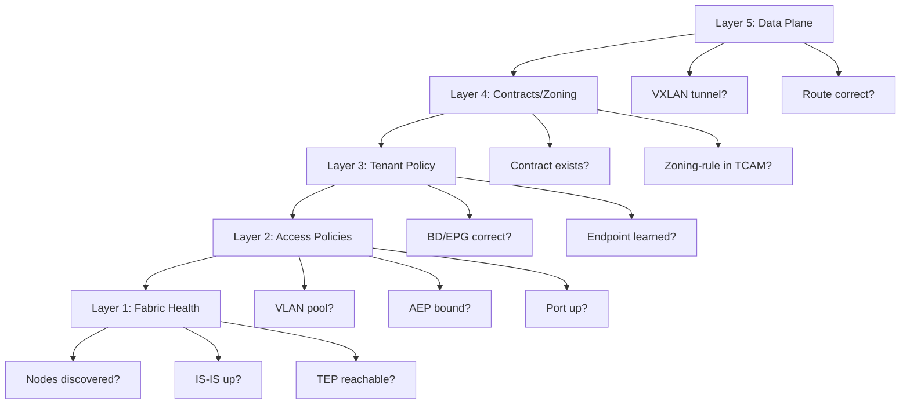

## ACI Troubleshooting and Mega Labs - CCIE DC v3.1 Deep Dive

> Reference: https://github.com/vikiev/aci-ccie-dc (Chapters 16-18)
> This material goes DEEPER than the repo on exam-critical troubleshooting and lab execution strategy.

---

### ACI Troubleshooting Methodology

#### Systematic Approach

When troubleshooting ACI, ALWAYS follow this layered approach. Do NOT jump randomly between layers. Each layer depends on the one below it:



> **CCIE Exam Tip:** In the lab exam, 80% of issues are in Layer 3 (Tenant Policy) or Layer 4 (Contracts). Students waste time checking fabric health when the issue is simply a missing contract binding or wrong EPG-to-BD association. Start at Layer 3 unless you have evidence of a lower-layer problem.

#### Layer 1: Fabric Health

Verify the physical fabric is operational before investigating policy issues.

```nxos
apic1# show fabric
  - All expected nodes listed?
  - All nodes in "active" state?
  - Pod ID correct?

apic1# show fabric node
  - Node IDs: spines (1-2 typically), leaves (101+)
  - Role: spine/leaf
  - State: active/inactive

leaf101# show isis neighbors
  - All spine neighbors in "UP" state?
  - Circuit IDs present?
  - If missing: physical link issue or IS-IS misconfiguration

leaf101# ping 10.0.0.2 (spine1 loopback0)
  - TEP reachability between nodes
  - If fails: IS-IS not advertising loopbacks

apic1# show firmware
  - All nodes on same firmware version?
  - Mixed firmware can cause VXLAN incompatibility
```

Expected healthy output:

```text
apic1# show fabric node

  Node ID  Role     State    Model          Serial
  1        spine    active   N9K-C9364C     FDO1234
  2        spine    active   N9K-C9364C     FDO1235
  101      leaf     active   N9K-C93180YC   FDO2345
  102      leaf     active   N9K-C93180YC   FDO2346
  103      leaf     active   N9K-C93180YC   FDO2347
  104      leaf     active   N9K-C93180YC   FDO2348
```

> **Time Trap:** Do NOT spend more than 2 minutes on Layer 1 in the exam. If the fabric was pre-built (as it always is in CCIE DC lab), it is almost certainly healthy. Only check Layer 1 if you see interface-level issues (port down, no LLDP neighbor).

#### Layer 2: Access Policies

Verify the physical-to-logical mapping is correct.

```nxos
leaf101# show vlan internal
  - Is the EPG's VLAN allocated?
  - Is it in "active" state?
  - VLAN ID matches what you configured?

leaf101# show running-config interface ethernet1/1
  - Interface policy group applied?
  - Mode: trunk/access?
  - Allowed VLANs include EPG VLAN?

leaf101# show interface ethernet1/1
  - Status: up/up?
  - If admin down: interface policy or manual shutdown
  - If down/down: cable issue or remote device off

leaf101# show lldp neighbors
  - Is the expected device (server, switch) visible?
  - If missing: cable, port, or LLDP issue
```

Common access policy issues:

```text
Issue: VLAN not in "show vlan internal"
  Cause: VLAN pool does not contain the VLAN, or EPG not associated with domain
  Fix: Check VLAN pool range, check domain-to-EPG association

Issue: Port is up but VLAN not allowed
  Cause: AEP not bound to interface policy group, or wrong policy group
  Fix: Verify AEP -> Interface Policy Group -> Physical Port chain

Issue: Port admin down
  Cause: Interface policy has admin state "down", or port was manually disabled
  Fix: Check interface policy, check for manual shutdown
```

#### Layer 3: Tenant Policy

Verify the logical policy objects are correctly configured.

```text
apic1# show bd CORP/BD-Web
  - BD exists?
  - Subnet: 10.1.10.1/24?
  - VRF: PROD-VRF?
  - Unicast Routing: enabled? (if disabled, no gateway!)
  - ARP Flooding: enabled? (if disabled, proxy ARP must work)

apic1# show epg CORP/APP1/EPG-Web
  - EPG exists?
  - BD: BD-Web? (correct BD association?)
  - Domain: PHYS-DOM or VMWARE-DOM?
  - Static binding: correct leaf/port/VLAN?

apic1# show endpoint ip 10.1.10.10
  - Endpoint learned?
  - Correct VLAN?
  - Correct interface?
  - If not learned: check static binding, check VLAN, check port
```

```nxos
leaf101# show endpoint vlan 100
  - Lists all endpoints in VLAN 100
  - Verify expected MACs are present

leaf101# show ip arp vrf CORP:PROD-VRF
  - ARP entries for endpoints?
  - Gateway ARP (10.1.10.1) present?
  - If missing: BD unicast routing disabled, or ARP flooding issue
```

#### Layer 4: Contracts and Zoning

Verify policy enforcement is correctly programmed.

```text
apic1# show contract CORP/WEB-TO-APP
  - Contract exists?
  - Subject: correct filter?
  - Scope: correct? (context, tenant, application-profile, global)

apic1# show contract usage CORP/WEB-TO-APP
  - Providers: EPG-App (correct?)
  - Consumers: EPG-Web (correct?)
  - If missing: contract not bound to EPG
```

```nxos
leaf101# show zoning-rule vrf CORP:PROD-VRF
  - Rules present for EPG-Web -> EPG-App?
  - Filter: correct ports (80, 443)?
  - Action: permit?
  - If NO rule: contract not programmed (check scope, check binding)

leaf101# show hardware internal access-listmgr info
  - TCAM utilization?
  - If > 90%: TCAM overflow risk
  - Contracts may not be programmed if TCAM full
```

> **CCIE Exam Tip:** The `show zoning-rule` command is the SINGLE MOST IMPORTANT troubleshooting command for contract issues. If the zoning-rule is not in the output, traffic WILL be dropped. No amount of correct routing or endpoint learning will help if the zoning-rule is missing.

#### Layer 5: Data Plane

Verify actual packet forwarding.

```nxos
leaf101# show nve peers
  - VXLAN peers to spines?
  - State: Up?
  - If missing: IS-IS issue or NVE not configured

leaf101# show endpoint ip 10.1.10.10
  - Local or remote?
  - If remote: remote TEP correct?

leaf101# show ip route vrf CORP:PROD-VRF
  - Connected routes for BD subnets?
  - Default route via L3Out?
  - BGP/OSPF routes from external?

leaf101# show ip arp vrf CORP:PROD-VRF 10.1.10.10
  - ARP resolved?
  - MAC address correct?
  - If incomplete: ARP flooding disabled + endpoint not learned
```

---

### Common ACI Failure Scenarios (Top 15)

#### Scenario 1: Endpoint Not Learned on Leaf

```text
Symptom: VM connected to port but "show endpoint" shows nothing

Root Cause (most common):
  - Static binding has wrong VLAN
  - VLAN not in VLAN pool
  - AEP not bound to interface policy group
  - Deployment immediacy = lazy (binding not pushed yet)

Diagnostic Commands:
  leaf101# show endpoint vlan 100
  leaf101# show vlan internal
  leaf101# show interface ethernet1/1
  leaf101# show running-config interface ethernet1/1
  apic1# show epg CORP/APP1/EPG-Web detail

Fix:
  1. Verify VLAN pool contains the VLAN: show vlan pool PHYS-POOL
  2. Verify AEP binding: check domain -> AEP -> interface policy group
  3. Verify static binding: correct leaf, port, VLAN encap
  4. Change deployment immediacy to "immediate"
  5. Bounce the port: shut/no shut on interface policy
```

#### Scenario 2: Contract Not Permitting Traffic (Zoning-Rule Missing)

```text
Symptom: Ping between EPGs fails, routing is correct, endpoints learned

Root Cause:
  - Contract scope too narrow (e.g., "application-profile" but EPGs in different APs)
  - Contract not bound to both provider and consumer EPG
  - Filter doesn't match traffic (wrong protocol/port)

Diagnostic Commands:
  leaf101# show zoning-rule vrf CORP:PROD-VRF
  apic1# show contract CORP/WEB-TO-APP
  apic1# show contract usage CORP/WEB-TO-APP

Fix:
  1. Check contract scope: must be "context" (VRF-wide) for cross-AP
  2. Verify provider EPG has contract in "Provided" list
  3. Verify consumer EPG has contract in "Consumed" list
  4. Verify filter matches: protocol (tcp/udp/icmp), port (80, 443)
  5. Wait 30 seconds for zoning-rule to program after fix
```

#### Scenario 3: L3Out BGP Peer Not Established

```text
Symptom: show bgp summary shows peer in Idle/Active/Connect state

Root Cause:
  - Wrong remote ASN configured
  - Wrong peer IP address
  - MD5 password mismatch
  - Interface MTU mismatch (TCP SYN fails)
  - Interface is down

Diagnostic Commands:
  leaf101# show bgp neighbors 10.255.1.2 vrf CORP:PROD-VRF
  leaf101# show interface ethernet1/48
  leaf101# ping 10.255.1.2 vrf CORP:PROD-VRF
  leaf101# show ip arp vrf CORP:PROD-VRF 10.255.1.2

Fix:
  1. Verify peer IP matches external router config
  2. Verify ASN: local (ACI) and remote (router) match expectations
  3. Verify MD5 password is identical (case-sensitive)
  4. Verify MTU matches on both sides
  5. Verify interface is up/up and ARP resolves
```

#### Scenario 4: External Traffic Dropped (Missing External EPG Contract)

```text
Symptom: External router can ping ACI interface IP but cannot reach EPG endpoints

Root Cause:
  - External EPG missing contract binding (provide AND/OR consume)
  - External EPG subnet missing "import-security" flag

Diagnostic Commands:
  leaf101# show zoning-rule vrf CORP:PROD-VRF
  apic1# show l3out CORP/WAN-BGP extepg
  apic1# moquery -c l3extSubnet

Fix:
  1. Add contract to External EPG: both provide AND consume
  2. Verify subnet scope includes "import-security"
  3. Verify internal EPG also provides the same contract
  4. Wait 30 seconds, verify zoning-rule appears
```

#### Scenario 5: VMM DVS Not Created in vCenter

```text
Symptom: VMM domain configured but no DVS visible in vCenter

Root Cause:
  - VMM controller cannot reach vCenter (management EPG wrong)
  - Credentials incorrect
  - vCenter API not accessible (firewall blocking 443)

Diagnostic Commands:
  apic1# show vmm ctrlr VMWARE-DOM/VCENTER-CTRL
  apic1# ping 192.168.1.100
  apic1# show fault | grep vmm

Fix:
  1. Verify management EPG provides path to vCenter
  2. Re-enter credentials (check for typos, expired password)
  3. Verify vCenter is reachable on port 443
  4. Check vCenter SSO domain (administrator@vsphere.local)
  5. Wait 60 seconds for inventory refresh
```

#### Scenario 6: BD Subnet Not Advertised via L3Out

```text
Symptom: External router does not receive BD subnet via BGP/OSPF

Root Cause:
  - BD subnet "Advertise Externally" not checked
  - External EPG subnet missing "export-rtctrl" flag
  - BD subnet scope set to "private" instead of "public"

Diagnostic Commands:
  leaf101# show bgp neighbors 10.255.1.2 vrf CORP:PROD-VRF advertised-routes
  leaf101# show ip route vrf CORP:PROD-VRF connected
  apic1# show bd CORP/BD-Web detail

Fix:
  1. BD subnet: check "Advertise Externally" and scope "Public"
  2. External EPG subnet: add "export-rtctrl" to scope
  3. Verify L3Out routing protocol is active
  4. Check BGP advertised-routes after fix
```

#### Scenario 7: Inter-EPG Traffic Blocked (Scope Too Narrow)

```text
Symptom: Two EPGs in different Application Profiles cannot communicate despite contract

Root Cause:
  - Contract scope set to "application-profile" (only works within same AP)
  - Should be "context" (VRF-wide) for cross-AP communication

Diagnostic Commands:
  apic1# show contract CORP/WEB-TO-APP
  - Check "scope" attribute
  leaf101# show zoning-rule vrf CORP:PROD-VRF
  - Rule missing = scope issue

Fix:
  1. Change contract scope from "application-profile" to "context"
  2. Or: move both EPGs to same Application Profile
  3. Wait 30 seconds for zoning-rule reprogramming
```

#### Scenario 8: Static Binding Not Taking Effect (Deployment Immediacy = Lazy)

```text
Symptom: Static binding configured but endpoint not learned, port shows no VLAN

Root Cause:
  - Deployment immediacy set to "lazy"
  - Binding not pushed to leaf until traffic arrives (chicken-and-egg)

Diagnostic Commands:
  leaf101# show vlan internal
  - VLAN not present = binding not deployed
  apic1# show epg CORP/APP1/EPG-Web detail
  - Check deployment immediacy setting

Fix:
  1. Change deployment immediacy from "lazy" to "immediate"
  2. Or: generate traffic from the endpoint (triggers deployment)
  3. Verify VLAN appears in "show vlan internal" after change
```

#### Scenario 9: VLAN Not Allowed on Port (VLAN Pool Mismatch)

```text
Symptom: Port is up, device connected, but no traffic passes. VLAN not on port.

Root Cause:
  - EPG uses VLAN 300 but VLAN pool only has range 100-200
  - Domain associated with wrong VLAN pool
  - AEP not bound to correct interface policy group

Diagnostic Commands:
  leaf101# show vlan internal
  leaf101# show running-config interface ethernet1/1
  apic1# show vlan pool PHYS-POOL
  apic1# show domain PHYS-DOM

Fix:
  1. Expand VLAN pool to include required VLAN
  2. Or: change EPG encap to a VLAN within pool range
  3. Verify domain -> VLAN pool association
  4. Verify AEP -> interface policy group -> port chain
```

#### Scenario 10: Fabric Node Not Discovered (LLDP, TEP Pool)

```text
Symptom: New leaf switch connected but not appearing in fabric inventory

Root Cause:
  - LLDP not reaching APIC (wrong port, cable issue)
  - TEP pool exhausted (no IP available for new node)
  - Firmware mismatch (new node on different version)
  - Node not commissioned (serial not in APIC)

Diagnostic Commands:
  apic1# show fabric node (node missing?)
  apic1# show fabric discovery
  spine1# show lldp neighbors (new leaf visible?)
  apic1# show fabric setup (TEP pool range)

Fix:
  1. Verify physical connection to spine (LLDP must reach)
  2. Verify TEP pool has available addresses
  3. Commission node: Fabric > Inventory > Discovered > Commission
  4. Match firmware to existing fabric version
```

#### Scenario 11: Firmware Upgrade Stuck (Maintenance Policy)

```text
Symptom: Firmware upgrade initiated but node stuck in "upgrading" state

Root Cause:
  - Maintenance policy set to "pause" (waiting for manual confirmation)
  - Disk space insufficient on node
  - Image download failed (APIC to node connectivity)

Diagnostic Commands:
  apic1# show firmware
  apic1# show maintenance policy
  apic1# show fault | grep firmware

Fix:
  1. Check maintenance policy: if "pause", manually confirm continuation
  2. Verify image is downloaded to node
  3. Check disk space: show system resources
  4. If stuck > 30 min: cancel and retry
```

#### Scenario 12: ARP Not Resolving (ARP Flooding Disabled + Proxy Issue)

```text
Symptom: Endpoint learned but ARP shows "incomplete" for specific IPs

Root Cause:
  - BD has ARP flooding disabled
  - Endpoint not in COOP database (not learned yet)
  - Proxy ARP cannot respond for unknown endpoints

Diagnostic Commands:
  leaf101# show ip arp vrf CORP:PROD-VRF
  leaf101# show endpoint ip 10.1.10.10
  apic1# show bd CORP/BD-Web detail (ARP flooding setting)

Fix:
  1. Enable ARP flooding on BD (if acceptable for design)
  2. Or: ensure endpoint is learned before traffic flows
  3. Or: configure static ARP entry (rare, not recommended)
  4. Verify COOP has the endpoint: show coop internal ip-mac-vni
```

#### Scenario 13: Service Graph PBR Not Redirecting

```text
Symptom: Traffic flows directly between EPGs, bypassing service device

Root Cause:
  - Service graph not applied to contract subject
  - PBR health check failing (device marked down)
  - Service graph deployment failed

Diagnostic Commands:
  leaf101# show pbr session
  leaf101# show pbr statistics
  apic1# show service-graph CORP/FW-GRAPH deployment
  leaf101# ping 192.168.50.1 vrf CORP:PROD-VRF (PBR target)

Fix:
  1. Verify service graph applied to contract subject
  2. Check deployment status (must be "deployed")
  3. Verify PBR target IP reachable (ping from leaf)
  4. Check health check status (ICMP to device management)
  5. Verify device interfaces are up and ARP resolves
```

#### Scenario 14: Multi-Site Endpoint Flapping

```text
Symptom: Endpoint alternates between sites in COOP database, traffic intermittent

Root Cause:
  - Duplicate MAC/IP (misconfiguration)
  - L2 loop in stretched domain (L2Out creating loop)
  - vMotion storm or misconfigured DRS

Diagnostic Commands:
  leaf101# show endpoint mac 00:50:56:aa:bb:cc history
  apic1# show fault | grep endpoint
  leaf101# show coop internal ip-mac-vni

Fix:
  1. Identify source of duplicate MAC
  2. Check for L2 loops (especially L2Out in stretched BD)
  3. Enable endpoint loop protection on BD
  4. Disable L2Out on stretched BD if causing loops
  5. Check vCenter DRS settings (disable aggressive migration)
```

#### Scenario 15: TCAM Overflow (Too Many Contracts)

```text
Symptom: New contracts not taking effect, zoning-rules missing for some EPG pairs

Root Cause:
  - Too many contracts/filters consuming TCAM space
  - TCAM partition exhausted on leaf ASIC

Diagnostic Commands:
  leaf101# show hardware internal access-listmgr info
  - Check TCAM utilization percentage
  - If > 85%: approaching limit
  - If > 95%: new rules will fail to program

  leaf101# show zoning-rule vrf CORP:PROD-VRF | count
  - Count total rules programmed

Fix:
  1. Reduce number of contracts (consolidate filters)
  2. Use contract scope "context" instead of per-EPG rules
  3. Remove unused contracts and filters
  4. Consider TCAM carving (if platform supports)
  5. Redesign: fewer, broader contracts instead of many narrow ones
```

---

### APIC CLI and Leaf CLI Debug Commands

#### APIC CLI Commands

The APIC CLI runs a Linux-based OS with ACI-specific commands. Access via SSH to APIC IP.

```text
moquery - Query Managed Objects:
  apic1# moquery -c fvTenant
  apic1# moquery -c fvBD -f 'eq(fvBD.name,"BD-Web")'
  apic1# moquery -c fvAEPg -f 'eq(fvAEPg.name,"EPG-Web")'
  apic1# moquery -c fvRsProv -f 'eq(fvRsProv.tDn,"uni/tn-CORP/brc-WEB-ACCESS")'
  apic1# moquery -c l3extOut -f 'eq(l3extOut.name,"WAN-BGP")'
  apic1# moquery -c l3extSubnet
  apic1# moquery -c vzBrCP -f 'eq(vzBrCP.scope,"context")'
  apic1# moquery -c fvRsBd -f 'eq(fvRsBd.tnFvBDName,"BD-Web")'

icurl - REST API from CLI:
  apic1# icurl -k https://localhost/api/mo/uni/tn-CORP.json?query-target=subtree
  apic1# icurl -k https://localhost/api/class/fvAEPg.json
  apic1# icurl -k "https://localhost/api/mo/uni/tn-CORP/ap-APP1/epg-EPG-Web.json?rsp-subtree=full"
  apic1# icurl -k -X POST https://localhost/api/mo/uni/tn-CORP.json -d @payload.json

show fault - View Faults:
  apic1# show fault
  apic1# show fault severity critical
  apic1# show fault | grep -i "epg\|contract\|l3out\|vmm"
  apic1# show fault inst CE1 -f 'eq(faultInst.severity,"critical")'

show health - Health Scores:
  apic1# show health
  apic1# show health tenant CORP
  apic1# show health node 101

show deployment - Deployment Status:
  apic1# show deployment tenant CORP
  apic1# show deployment epg CORP/APP1/EPG-Web
  apic1# show deployment l3out CORP/WAN-BGP
```

#### Leaf/Spine CLI (NX-OS under ACI)

Access: SSH to leaf IP, then enter `vsh` for NX-OS CLI.

```nxos
Endpoint and VLAN:
  leaf101# show endpoint
  leaf101# show endpoint ip 10.1.10.10
  leaf101# show endpoint mac 00:50:56:aa:bb:cc
  leaf101# show endpoint vlan 100
  leaf101# show vlan internal
  leaf101# show vlan internal | grep 100

VXLAN and NVE:
  leaf101# show vxlan vni
  leaf101# show nve peers
  leaf101# show nve vni 15001
  leaf101# show nve vni 15001 peer

Routing and ARP:
  leaf101# show ip route vrf CORP:PROD-VRF
  leaf101# show ip route vrf CORP:PROD-VRF 10.1.10.0/24
  leaf101# show ip route vrf CORP:PROD-VRF bgp
  leaf101# show ip route vrf CORP:PROD-VRF ospf
  leaf101# show ip arp vrf CORP:PROD-VRF
  leaf101# show ip arp vrf CORP:PROD-VRF 10.1.10.10

Contracts and Zoning:
  leaf101# show zoning-rule
  leaf101# show zoning-rule vrf CORP:PROD-VRF
  leaf101# show contract
  leaf101# show contract vrf CORP:PROD-VRF

TCAM and Hardware:
  leaf101# show hardware internal access-listmgr info
  leaf101# show hardware internal access-listmgr tcam detail
  leaf101# show platform software fed switch active punt packet-capture display-capture-buffer all clear brief

Interface:
  leaf101# show interface ethernet1/1
  leaf101# show interface ethernet1/48
  leaf101# show interface status
  leaf101# show interface counters errors

ISIS and Fabric:
  leaf101# show isis neighbors
  leaf101# show isis adjacency
  leaf101# show ip interface brief vrf overlay-1

BGP (on leaf for L3Out):
  leaf101# show bgp summary vrf CORP:PROD-VRF
  leaf101# show bgp neighbors 10.255.1.2 vrf CORP:PROD-VRF
  leaf101# show bgp neighbors 10.255.1.2 vrf CORP:PROD-VRF received-routes
  leaf101# show bgp neighbors 10.255.1.2 vrf CORP:PROD-VRF advertised-routes
  leaf101# show bgp ipv4 unicast vrf CORP:PROD-VRF

OSPF (on leaf for L3Out):
  leaf101# show ip ospf neighbors vrf CORP:PROD-VRF
  leaf101# show ip ospf interface vrf CORP:PROD-VRF
  leaf101# show ip ospf database vrf CORP:PROD-VRF

COOP (on spine):
  spine1# show coop internal ip-mac-vni
  spine1# show coop internal ip-mac-vni vrf-name CORP:PROD-VRF
  spine1# show coop internal ip-mac-vni ip 10.1.10.10

PBR (for service graphs):
  leaf101# show pbr session
  leaf101# show pbr statistics
  leaf101# show pbr policy
```

> **CCIE Exam Tip:** Memorize these command categories. In the exam, you will need to quickly jump between APIC CLI (for policy verification) and Leaf CLI (for data-plane verification). The most time-efficient pattern:
> 1. APIC: `show epg` / `show contract` (policy correct?)
> 2. Leaf: `show zoning-rule` (programmed?)
> 3. Leaf: `show endpoint` (learned?)
> 4. Leaf: `show ip route vrf` (routing correct?)

---

### Mega Lab 1: Full ACI Tenant Build (90 minutes)

#### Scenario

```text
Given: 2-spine, 4-leaf fabric (pre-discovered, healthy)
  Spines: 1, 2
  Leaves: 101, 102, 103, 104
  External router: CSR1000v connected to Leaf101 Eth1/48

Task: Build complete 3-tier application from scratch

Requirements:
  Tenant: CORP
  VRF: PROD-VRF
  BD-Web: 10.1.10.0/24 (gateway 10.1.10.1, public, advertised)
  BD-App: 10.1.20.0/24 (gateway 10.1.20.1, public, advertised)
  BD-DB: 10.1.30.0/24 (gateway 10.1.30.1, private, NOT advertised)
  AP: WEB-APP
  EPG-Web: BD-Web, Leaf101 Eth1/1, VLAN 100
  EPG-App: BD-App, Leaf101 Eth1/2, VLAN 200
  EPG-DB: BD-DB, Leaf102 Eth1/1, VLAN 300
  Contract Web-to-App: HTTP (tcp/80), HTTPS (tcp/443)
  Contract App-to-DB: MySQL (tcp/3306)
  Taboo: block SSH (tcp/22) from EPG-Web to EPG-DB
  L3Out: BGP to CSR1000v (ASN 65000 <-> 65001)
    Advertise: BD-Web, BD-App (NOT BD-DB)
  External EPG: 0.0.0.0/0, consume Web-to-App contract
```

#### Time Budget

```text
Phase 1: Access Policies (10 min)
  - VLAN pool, AEP, domain, interface policies
  - Static bindings for EPGs

Phase 2: Tenant Core (15 min)
  - Tenant, VRF, BDs, subnets
  - Application Profile, EPGs

Phase 3: Contracts (10 min)
  - Filters, contracts, subjects
  - Taboo contract
  - EPG bindings

Phase 4: L3Out (15 min)
  - L3Out with BGP
  - External EPG
  - Contract binding on ExtEPG

Phase 5: Verification (15 min)
  - Endpoint learning
  - Zoning rules
  - BGP session
  - Route table
  - Ping tests

Buffer: 25 min (troubleshooting, re-checks)
```

#### Phase 1: Access Policies (GUI)

```text
Step 1: VLAN Pool
  Admin > Access Policies > Pools > VLAN > + Create
  Name: CORP-VLAN-POOL
  Allocation: Static
  Encap Blocks:
    vlan-100 to vlan-300
  [Submit]

Step 2: AEP
  Admin > Access Policies > Global Policies > AEP > + Create
  Name: CORP-AEP
  Domain Association:
    + Add: CORP-PHYS-DOM (created next)
  [Submit]

Step 3: Physical Domain
  Admin > Access Policies > Pools > Domain > + Create
  Name: CORP-PHYS-DOM
  VLAN Pool: CORP-VLAN-POOL
  [Submit]

Step 4: Interface Policy Group
  Admin > Access Policies > Interfaces > Leaf Interfaces > Policy Groups
  + Create (Access Port):
    Name: CORP-ACC-PG
    AEP: CORP-AEP
    Interface Policy: default (auto-negotiate, no flow control)
  [Submit]

Step 5: Interface Selector
  Admin > Access Policies > Interfaces > Leaf Interfaces > Profiles
  + Create Interface Profile:
    Name: LEAF101-IFACES
    + Add Selector:
      Name: ETH1-2
      Ports: 1/1 - 1/2
      Policy Group: CORP-ACC-PG
  [Submit]

  + Create Interface Profile:
    Name: LEAF102-IFACES
    + Add Selector:
      Name: ETH1
      Ports: 1/1
      Policy Group: CORP-ACC-PG
  [Submit]

Step 6: Switch Profile Association
  Admin > Access Policies > Switches > Leaf Switches > Profiles
  LEAF101-PROFILE: associate LEAF101-IFACES
  LEAF102-PROFILE: associate LEAF102-IFACES
```

#### Phase 2: Tenant Core (GUI)

```text
Step 1: Create Tenant
  Tenants > + Add Tenant
  Name: CORP
  [Submit]

Step 2: Create VRF
  Tenant CORP > Networking > VRFs > + Create
  Name: PROD-VRF
  Policy Control Enforcement: Enforced
  [Submit]

Step 3: Create Bridge Domains
  Tenant CORP > Networking > Bridge Domains > + Create

  BD-Web:
    Name: BD-Web
    VRF: PROD-VRF
    Unicast Routing: Enabled
    ARP Flooding: Enabled
    Subnet:
      IP: 10.1.10.1/24
      Scope: Public, Shared
      Advertise Externally: YES
    [Submit]

  BD-App:
    Name: BD-App
    VRF: PROD-VRF
    Unicast Routing: Enabled
    ARP Flooding: Enabled
    Subnet:
      IP: 10.1.20.1/24
      Scope: Public, Shared
      Advertise Externally: YES
    [Submit]

  BD-DB:
    Name: BD-DB
    VRF: PROD-VRF
    Unicast Routing: Enabled
    ARP Flooding: Enabled
    Subnet:
      IP: 10.1.30.1/24
      Scope: Private
      Advertise Externally: NO (private DB, not advertised)
    [Submit]

Step 4: Create Application Profile
  Tenant CORP > Application Profiles > + Create
  Name: WEB-APP
  [Submit]

Step 5: Create EPGs with Static Bindings
  Tenant CORP > Application Profiles > WEB-APP > EPGs > + Create

  EPG-Web:
    Name: EPG-Web
    BD: BD-Web
    Domain: CORP-PHYS-DOM
    Deployment Immediacy: Immediate
    Static Binding:
      Leaf: 101
      Port: Eth1/1
      Encap: vlan-100
      Deployment Immediacy: Immediate
    [Submit]

  EPG-App:
    Name: EPG-App
    BD: BD-App
    Domain: CORP-PHYS-DOM
    Static Binding:
      Leaf: 101
      Port: Eth1/2
      Encap: vlan-200
      Deployment Immediacy: Immediate
    [Submit]

  EPG-DB:
    Name: EPG-DB
    BD: BD-DB
    Domain: CORP-PHYS-DOM
    Static Binding:
      Leaf: 102
      Port: Eth1/1
      Encap: vlan-300
      Deployment Immediacy: Immediate
    [Submit]
```

#### Phase 3: Contracts (GUI)

```text
Step 1: Create Filters
  Tenant CORP > Policies > Protocol > Filters > + Create

  Filter: HTTP-HTTPS
    Entry 1: Name HTTP, EtherType IP, Protocol TCP, Dst Port 80
    Entry 2: Name HTTPS, EtherType IP, Protocol TCP, Dst Port 443
    Entry 3: Name ICMP, EtherType IP, Protocol ICMP
    [Submit]

  Filter: MYSQL
    Entry 1: Name MySQL, EtherType IP, Protocol TCP, Dst Port 3306
    Entry 2: Name ICMP, EtherType IP, Protocol ICMP
    [Submit]

  Filter: SSH
    Entry 1: Name SSH, EtherType IP, Protocol TCP, Dst Port 22
    [Submit]

Step 2: Create Contracts
  Tenant CORP > Contracts > Standard > + Create

  Contract: WEB-TO-APP
    Scope: Context (VRF-wide)
    Subject: WEB-TRAFFIC
      Filter: HTTP-HTTPS
      Action: Permit
    [Submit]

  Contract: APP-TO-DB
    Scope: Context
    Subject: DB-TRAFFIC
      Filter: MYSQL
      Action: Permit
    [Submit]

Step 3: Create Taboo Contract
  Tenant CORP > Contracts > Taboo > + Create
  Name: NO-SSH-TO-DB
  Scope: Context
  Filter: SSH
  Action: Deny
  [Submit]

Step 4: Bind Contracts to EPGs
  EPG-Web:
    Consumes: WEB-TO-APP
    Consumes: NO-SSH-TO-DB (taboo)

  EPG-App:
    Provides: WEB-TO-APP
    Consumes: APP-TO-DB

  EPG-DB:
    Provides: APP-TO-DB
    Provides: NO-SSH-TO-DB (taboo target)
```

> **CCIE Exam Tip:** Taboo contracts DENY traffic. They take precedence over permit contracts. The taboo "NO-SSH-TO-DB" with EPG-Web as consumer and EPG-DB as provider will block SSH from Web to DB even if another contract permits it. Taboo scope must match the permit contract scope for proper precedence.

#### Phase 4: L3Out (GUI)

```text
Step 1: Create L3Out
  Tenant CORP > Networking > L3Outs > + Create
  Name: WAN-BGP
  VRF: PROD-VRF
  Protocol: BGP
  [Next]

Step 2: BGP Parameters
  Local ASN: 65000
  Graceful Restart: Enabled
  [Next]

Step 3: Node Profile
  Name: WAN-NODES
  Node: 101
  Router ID: 10.1.1.101
  [Next]

Step 4: Interface
  Interface: eth1/48
  Type: Routed (L3 Port)
  IP: 10.255.1.1/30
  MTU: 1500
  BGP Peer:
    Address: 10.255.1.2
    Remote ASN: 65001
    Password: BgpS3cret!
    Address Family: IPv4 Unicast
    Max Prefixes: 10000
  [Next]

Step 5: External EPG
  Name: EXT-WAN
  Subnet: 0.0.0.0/0
    Import Security: YES
    Import Route Control: YES
    Export Route Control: YES
  Contracts:
    Provides: WEB-TO-APP
    Consumes: WEB-TO-APP
  [Finish]
```

#### Phase 5: Verification Checklist (20 Items)

```text
 1. [ ] All leaves show "active" in fabric inventory
 2. [ ] VLAN 100, 200, 300 in "show vlan internal" on respective leaves
 3. [ ] Interface Eth1/1 on Leaf101 is up/up
 4. [ ] Interface Eth1/2 on Leaf101 is up/up
 5. [ ] Interface Eth1/1 on Leaf102 is up/up
 6. [ ] BD-Web subnet 10.1.10.1/24 exists with "Advertise Externally"
 7. [ ] BD-App subnet 10.1.20.1/24 exists with "Advertise Externally"
 8. [ ] BD-DB subnet 10.1.30.1/24 exists WITHOUT "Advertise Externally"
 9. [ ] EPG-Web bound to BD-Web with VLAN 100
10. [ ] EPG-App bound to BD-App with VLAN 200
11. [ ] EPG-DB bound to BD-DB with VLAN 300
12. [ ] Zoning rule exists: EPG-Web -> EPG-App (tcp 80, 443)
13. [ ] Zoning rule exists: EPG-App -> EPG-DB (tcp 3306)
14. [ ] Taboo rule exists: EPG-Web -> EPG-DB (tcp 22) DENY
15. [ ] BGP peer 10.255.1.2 in Established state
16. [ ] CSR receives 10.1.10.0/24 and 10.1.20.0/24 via BGP
17. [ ] CSR does NOT receive 10.1.30.0/24
18. [ ] ACI VRF has external routes from CSR
19. [ ] Ping from CSR to 10.1.10.1 succeeds
20. [ ] Ping from EPG-Web to EPG-App on port 80 succeeds
```

#### REST API Full Build (Single POST)

```json
{
  "fvTenant": {
    "attributes": { "name": "CORP" },
    "children": [
      {
        "fvCtx": {
          "attributes": { "name": "PROD-VRF", "pcEnfPref": "enforced" }
        }
      },
      {
        "fvBD": {
          "attributes": { "name": "BD-Web", "unicastRoute": "yes", "arpFlood": "yes" },
          "children": [
            { "fvRsCtx": { "attributes": { "tnFvCtxName": "PROD-VRF" } } },
            {
              "fvSubnet": {
                "attributes": {
                  "ip": "10.1.10.1/24",
                  "scope": "public,shared",
                  "ctrl": "nd"
                }
              }
            }
          ]
        }
      },
      {
        "fvBD": {
          "attributes": { "name": "BD-App", "unicastRoute": "yes", "arpFlood": "yes" },
          "children": [
            { "fvRsCtx": { "attributes": { "tnFvCtxName": "PROD-VRF" } } },
            {
              "fvSubnet": {
                "attributes": {
                  "ip": "10.1.20.1/24",
                  "scope": "public,shared",
                  "ctrl": "nd"
                }
              }
            }
          ]
        }
      },
      {
        "fvBD": {
          "attributes": { "name": "BD-DB", "unicastRoute": "yes", "arpFlood": "yes" },
          "children": [
            { "fvRsCtx": { "attributes": { "tnFvCtxName": "PROD-VRF" } } },
            {
              "fvSubnet": {
                "attributes": { "ip": "10.1.30.1/24", "scope": "private" }
              }
            }
          ]
        }
      },
      {
        "fvAp": {
          "attributes": { "name": "WEB-APP" },
          "children": [
            {
              "fvAEPg": {
                "attributes": { "name": "EPG-Web" },
                "children": [
                  { "fvRsBd": { "attributes": { "tnFvBDName": "BD-Web" } } },
                  { "fvRsCons": { "attributes": { "tnVzBrCPName": "WEB-TO-APP" } } },
                  {
                    "fvRsPathAtt": {
                      "attributes": {
                        "tDn": "topology/pod-1/paths-101/pathep-[eth1/1]",
                        "encap": "vlan-100",
                        "instrImedcy": "immediate"
                      }
                    }
                  }
                ]
              }
            },
            {
              "fvAEPg": {
                "attributes": { "name": "EPG-App" },
                "children": [
                  { "fvRsBd": { "attributes": { "tnFvBDName": "BD-App" } } },
                  { "fvRsProv": { "attributes": { "tnVzBrCPName": "WEB-TO-APP" } } },
                  { "fvRsCons": { "attributes": { "tnVzBrCPName": "APP-TO-DB" } } },
                  {
                    "fvRsPathAtt": {
                      "attributes": {
                        "tDn": "topology/pod-1/paths-101/pathep-[eth1/2]",
                        "encap": "vlan-200",
                        "instrImedcy": "immediate"
                      }
                    }
                  }
                ]
              }
            },
            {
              "fvAEPg": {
                "attributes": { "name": "EPG-DB" },
                "children": [
                  { "fvRsBd": { "attributes": { "tnFvBDName": "BD-DB" } } },
                  { "fvRsProv": { "attributes": { "tnVzBrCPName": "APP-TO-DB" } } },
                  {
                    "fvRsPathAtt": {
                      "attributes": {
                        "tDn": "topology/pod-1/paths-102/pathep-[eth1/1]",
                        "encap": "vlan-300",
                        "instrImedcy": "immediate"
                      }
                    }
                  }
                ]
              }
            }
          ]
        }
      },
      {
        "vzFilter": {
          "attributes": { "name": "HTTP-HTTPS" },
          "children": [
            {
              "vzEntry": {
                "attributes": { "name": "http", "etherT": "ip", "prot": "tcp", "dFromPort": "http", "dToPort": "http" }
              }
            },
            {
              "vzEntry": {
                "attributes": { "name": "https", "etherT": "ip", "prot": "tcp", "dFromPort": "https", "dToPort": "https" }
              }
            },
            {
              "vzEntry": {
                "attributes": { "name": "icmp", "etherT": "ip", "prot": "icmp" }
              }
            }
          ]
        }
      },
      {
        "vzFilter": {
          "attributes": { "name": "MYSQL" },
          "children": [
            {
              "vzEntry": {
                "attributes": { "name": "mysql", "etherT": "ip", "prot": "tcp", "dFromPort": "3306", "dToPort": "3306" }
              }
            },
            {
              "vzEntry": {
                "attributes": { "name": "icmp", "etherT": "ip", "prot": "icmp" }
              }
            }
          ]
        }
      },
      {
        "vzBrCP": {
          "attributes": { "name": "WEB-TO-APP", "scope": "context" },
          "children": [
            {
              "vzSubj": {
                "attributes": { "name": "WEB-TRAFFIC" },
                "children": [
                  { "vzRsSubjFiltAtt": { "attributes": { "tnVzFilterName": "HTTP-HTTPS" } } }
                ]
              }
            }
          ]
        }
      },
      {
        "vzBrCP": {
          "attributes": { "name": "APP-TO-DB", "scope": "context" },
          "children": [
            {
              "vzSubj": {
                "attributes": { "name": "DB-TRAFFIC" },
                "children": [
                  { "vzRsSubjFiltAtt": { "attributes": { "tnVzFilterName": "MYSQL" } } }
                ]
              }
            }
          ]
        }
      }
    ]
  }
}
```

POST to: `https://<APIC>/api/mo/uni.json`

---

### Mega Lab 2: ACI Troubleshooting Challenge (60 minutes)

#### Scenario

```text
Pre-broken fabric with 5 injected faults.
Student must find and fix ALL 5 within 60 minutes.

Environment:
  Tenant: CORP (pre-built)
  VRF: PROD-VRF
  BD-Web: 10.1.10.0/24, BD-App: 10.1.20.0/24, BD-DB: 10.1.30.0/24
  AP: WEB-APP
  EPG-Web: Leaf101 Eth1/1, VLAN 100
  EPG-App: Leaf101 Eth1/2, VLAN 200
  EPG-DB: Leaf102 Eth1/1, VLAN 300
  L3Out: WAN-BGP (BGP to CSR1000v)
  External EPG: EXT-WAN

Symptoms reported:
  1. EPG-DB endpoint not learning
  2. EPG-Web cannot reach EPG-App
  3. BGP peer not established
  4. No gateway for BD-DB
  5. External traffic cannot reach EPG-Web
```

#### Diagnostic Methodology Walkthrough

```text
MINUTE 0-5: Initial Assessment
  - Read all symptoms
  - Prioritize: which faults block others?
  - Plan: check each layer systematically
  - Start with Layer 2 (access) since endpoint not learning

MINUTE 5-15: Fault 1 - VLAN Pool Issue
  Symptom: EPG-DB endpoint not learning on Leaf102

  leaf102# show vlan internal
  - VLAN 300 NOT in list! (other VLANs present)

  leaf102# show endpoint vlan 300
  - Empty (no endpoints)

  apic1# show vlan pool CORP-VLAN-POOL
  - Range: vlan-100 to vlan-200 (MISSING 300!)

  ROOT CAUSE: VLAN pool only has 100-200, EPG-DB needs VLAN 300

  FIX:
  Admin > Access Policies > Pools > VLAN > CORP-VLAN-POOL
    Add Encap Block: vlan-300 to vlan-300
    [Submit]

  VERIFY:
  leaf102# show vlan internal
  - VLAN 300 now present and active

MINUTE 15-25: Fault 2 - Contract Scope Issue
  Symptom: EPG-Web cannot reach EPG-App (ping fails)

  leaf101# show zoning-rule vrf CORP:PROD-VRF
  - NO rule for EPG-Web -> EPG-App!

  apic1# show contract CORP/WEB-TO-APP
  - Scope: application-profile (WRONG!)
  - EPG-Web is in AP "WEB-APP"
  - EPG-App is in AP "WEB-APP"
  - Wait... same AP? Let me check again...
  - Actually: EPG-Web in AP "FRONTEND", EPG-App in AP "BACKEND"
  - Scope "application-profile" only works within SAME AP!

  ROOT CAUSE: Contract scope = "application-profile" but EPGs in different APs

  FIX:
  Tenant CORP > Contracts > WEB-TO-APP
    Scope: Change from "Application Profile" to "Context (VRF)"
    [Submit]

  VERIFY (wait 30 seconds):
  leaf101# show zoning-rule vrf CORP:PROD-VRF
  - Rule now present: src=EPG-Web-pcTag, dst=EPG-App-pcTag, permit

MINUTE 25-35: Fault 3 - BGP Wrong ASN
  Symptom: BGP peer not established

  leaf101# show bgp summary vrf CORP:PROD-VRF
  - Peer 10.255.1.2: State = Idle

  leaf101# show bgp neighbors 10.255.1.2 vrf CORP:PROD-VRF
  - Local AS: 65000
  - Remote AS: 65099 (WRONG! Should be 65001)

  leaf101# ping 10.255.1.2 vrf CORP:PROD-VRF
  - Success (L3 connectivity is fine)

  ROOT CAUSE: Remote ASN configured as 65099 instead of 65001

  FIX:
  Tenant CORP > Networking > L3Outs > WAN-BGP > Node Profile > Interface
    BGP Peer: 10.255.1.2
    Remote ASN: Change from 65099 to 65001
    [Submit]

  VERIFY (wait 30 seconds for BGP):
  leaf101# show bgp summary vrf CORP:PROD-VRF
  - Peer 10.255.1.2: State = Established, PfxRcd = 3

MINUTE 35-45: Fault 4 - BD Unicast Routing Disabled
  Symptom: No gateway for BD-DB (hosts cannot route)

  leaf102# show ip route vrf CORP:PROD-VRF
  - 10.1.10.0/24 connected (BD-Web OK)
  - 10.1.20.0/24 connected (BD-App OK)
  - 10.1.30.0/24 NOT present! (BD-DB missing!)

  leaf102# show ip arp vrf CORP:PROD-VRF
  - No entry for 10.1.30.1 (gateway not responding)

  apic1# show bd CORP/BD-DB
  - Unicast Routing: DISABLED (WRONG!)

  ROOT CAUSE: BD-DB has "Unicast Routing" disabled, so no SVI/gateway created

  FIX:
  Tenant CORP > Networking > Bridge Domains > BD-DB
    Unicast Routing: Enable
    [Submit]

  VERIFY:
  leaf102# show ip route vrf CORP:PROD-VRF
  - 10.1.30.0/24 now shows as connected
  leaf102# ping 10.1.30.1 vrf CORP:PROD-VRF
  - Success (gateway responding)

MINUTE 45-55: Fault 5 - External EPG Missing Consumer
  Symptom: External traffic cannot reach EPG-Web

  leaf101# show zoning-rule vrf CORP:PROD-VRF
  - Rule: EPG-Web -> EXT-WAN (permit) EXISTS
  - Rule: EXT-WAN -> EPG-Web (permit) MISSING!

  apic1# show l3out CORP/WAN-BGP extepg EXT-WAN
  - Provides: WEB-TO-APP (YES)
  - Consumes: (EMPTY!) (WRONG!)

  ROOT CAUSE: External EPG only provides contract, missing consumer binding
  - External can receive traffic FROM EPG-Web
  - External CANNOT initiate traffic TO EPG-Web

  FIX:
  Tenant CORP > Networking > L3Outs > WAN-BGP > External EPGs > EXT-WAN
    Contracts tab:
      + Add Consumed Contract: WEB-TO-APP
    [Submit]

  VERIFY (wait 30 seconds):
  leaf101# show zoning-rule vrf CORP:PROD-VRF
  - Rule: EXT-WAN -> EPG-Web now present

  CSR# ping 10.1.10.10 source 192.168.100.1
  - Success!

MINUTE 55-60: Final Verification
  - All 5 faults fixed
  - Run full verification checklist
  - Confirm end-to-end connectivity
```

#### Resolution Summary Table

| Fault | Symptom | Root Cause | Fix | Time |
|-------|---------|------------|-----|------|
| 1 | EPG-DB no endpoint | VLAN pool missing 300 | Add vlan-300 to pool | 5 min |
| 2 | Web-App no ping | Contract scope = AP | Change to Context | 5 min |
| 3 | BGP Idle | Wrong remote ASN (65099) | Change to 65001 | 5 min |
| 4 | No BD-DB gateway | Unicast Routing disabled | Enable unicast routing | 5 min |
| 5 | External can't reach Web | ExtEPG missing consumer | Add consumed contract | 5 min |

> **CCIE Exam Tip:** In the troubleshooting section, ALWAYS verify your fix before moving to the next fault. A common mistake: fix fault 1, immediately jump to fault 2 without confirming fault 1 is resolved. If your fix didn't take effect (deployment delay, wrong object), you'll waste time later wondering why the symptom persists.

> **Time Trap:** Do NOT spend more than 10 minutes on any single fault. If you're stuck, move to the next fault and come back. Some faults are independent and fixing others may give you clues.

---

### Mega Lab 3: Service Graph + VMM Integration (45 minutes)

#### Scenario

```text
Requirements:
  1. Insert firewall between EPG-Web and EPG-App (inline, GoThrough)
  2. Configure VMM domain for EPG-App (VMware)
  3. Verify traffic flows through firewall
  4. Verify VM endpoint learning via VMM
  5. Troubleshoot: PBR not hitting, VMM endpoint not learned

Environment:
  - Firewall: Cisco ASA at 192.168.50.1 (inside), 192.168.51.1 (outside)
  - vCenter: 192.168.1.100
  - ESXi hosts: Leaf101 Eth1/3-4 (vPC)
  - EPG-Web: static binding (Leaf101 Eth1/1, VLAN 100)
  - EPG-App: VMM dynamic binding (VMware)
```

#### Step 1: Insert Firewall (15 min)

```text
1a. Register L4-L7 Device:
  Tenant CORP > Services > L4-L7 > Devices > + Create
  Name: ASA-FW
  Type: Physical
  Vendor: Cisco
  Model: ASA
  Management IP: 192.168.100.10
  Management EPG: MGMT-EPG
  Consumer Interface: inside (192.168.50.1/24, VLAN 50)
  Provider Interface: outside (192.168.51.1/24, VLAN 51)

1b. Create Service Graph:
  Tenant CORP > Services > L4-L7 > Service Graph Templates > + Create
  Name: FW-INLINE
  Type: FW_ROUTED (GoThrough)
  Function Node: FW-NODE
    Device: ASA-FW
    Consumer IF: inside
    Provider IF: outside

1c. Apply to Contract:
  Tenant CORP > Contracts > WEB-TO-APP > Subject: WEB-TRAFFIC
    Service Graph: FW-INLINE
    [Submit]

1d. Verify PBR:
  leaf101# show pbr session
  leaf101# show pbr statistics
```

#### Step 2: VMM Domain for EPG-App (10 min)

```text
2a. Create VMM Domain (if not exists):
  Admin > External Connections > VMM > VMware > + Create Domain
  Name: VMWARE-DOM
  Controller: VCENTER-CTRL (192.168.1.100)
  VLAN Pool: VMM-POOL (dynamic, 100-500)
  AEP: ESXI-AEP

2b. Associate EPG-App with VMM Domain:
  Tenant CORP > Application Profiles > WEB-APP > EPGs > EPG-App
  Domains tab:
    + Add VMM Domain: VMWARE-DOM
    Deployment Immediacy: immediate
    Resolution Immediacy: immediate
  [Submit]

2c. Verify in vCenter:
  - DVS "ACI-DVS-01" exists
  - Port-group "CORP|WEB-APP|EPG-App" exists
  - VLAN assigned correctly

2d. Attach VM to port-group:
  - In vCenter: VM > Edit Settings > Network > CORP|WEB-APP|EPG-App
  - Power on VM

2e. Verify endpoint learning:
  leaf101# show endpoint vmm
  leaf101# show endpoint mac <VM-MAC>
```

#### Step 3: Traffic Flow Verification (10 min)

```text
3a. Generate traffic:
  web-vm$ curl http://10.1.20.10 (EPG-App VM)

3b. Verify PBR hit:
  leaf101# show pbr statistics
  - Matched: increasing
  - Redirected: increasing

3c. Verify on firewall:
  ASA# show conn
  - TCP 10.1.10.10:xxxxx 10.1.20.10:80

3d. Verify endpoint:
  leaf101# show endpoint ip 10.1.20.10
  - Type: DV (dynamic, VMM)
  - Interface: Eth1/3 (ESXi host port)
```

#### Step 4: Troubleshooting Scenarios (10 min)

Problem A: PBR not hitting

```text
Diagnostic:
  leaf101# show pbr session
  - If empty: service graph not deployed
  leaf101# show zoning-rule vrf CORP:PROD-VRF
  - Check for redirect action in rule

Fix:
  - Verify service graph applied to contract subject
  - Verify deployment status: apic1# show service-graph CORP/FW-INLINE
  - Verify firewall interfaces are up and reachable
  - Check PBR health check: leaf101# ping 192.168.50.1 vrf CORP:PROD-VRF
```

Problem B: VMM endpoint not learned

```text
Diagnostic:
  leaf101# show endpoint vmm
  - Empty? Check VMM controller status
  apic1# show vmm ctrlr VMWARE-DOM/VCENTER-CTRL
  - State: connected?
  leaf101# show vlan internal
  - EPG-App VLAN present?

Fix:
  - Verify VMM controller connected to vCenter
  - Verify AEP bound to ESXi interface policy group
  - Verify VLAN pool has available VLANs
  - Verify deployment immediacy = immediate
  - Check VM is powered on and attached to correct port-group
```

---

### Exam Day Strategy for ACI Section

#### Time Allocation

```text
Total exam: 8 hours
ACI section: approximately 2.5-3.5 hours (varies by exam version)

Recommended allocation:
  Access Policies: 15-20 min
  Tenant/BD/EPG: 20-25 min
  Contracts: 15-20 min
  L3Out: 20-30 min
  VMM/Service Graph: 15-20 min (if required)
  Verification: 20-30 min
  Troubleshooting: 30-45 min
  Buffer: 15-20 min
```

#### Build Order (Critical)

```text
ALWAYS build in this order (dependencies flow downward):

1. Access Policies (foundation)
   VLAN Pool -> AEP -> Domain -> Interface Policy Group -> Port Binding

2. Tenant Core
   Tenant -> VRF -> Bridge Domain -> Subnet

3. Application
   Application Profile -> EPG -> BD Association -> Static Binding

4. Contracts
   Filter -> Contract -> Subject -> EPG Binding (provide/consume)

5. L3Out
   L3Out -> Node Profile -> Interface -> Routing Protocol -> External EPG

6. Verify
   Endpoint -> Zoning Rule -> Route Table -> BGP/OSPF -> Ping
```

> **CCIE Exam Tip:** NEVER build contracts before EPGs exist. NEVER build L3Out before VRF exists. NEVER bind EPG to BD before BD exists. The dependency order is strict. Building out of order causes errors that are confusing to debug.

#### Speed Tips

```text
Use GUI for:
  - Complex objects (L3Out wizard, Service Graph)
  - First-time configuration (less error-prone)
  - Objects with many nested children

Use REST API for:
  - Repetitive tasks (multiple EPGs with same pattern)
  - Bulk operations (add same contract to 5 EPGs)
  - Quick fixes (change one attribute)
  - Verification (moquery is faster than GUI navigation)

Keyboard shortcuts:
  - Browser: Ctrl+T (new tab for parallel GUI work)
  - Copy/paste DNs between APIC CLI and REST calls
  - Use icurl for quick object queries without leaving CLI
```

#### Common Time Wasters

```text
1. Navigating GUI menus repeatedly
   Fix: Open multiple tabs, bookmark frequently used pages

2. Waiting for deployment without verifying
   Fix: Use "show deployment" to check status, don't just wait

3. Troubleshooting in wrong layer
   Fix: Follow the 5-layer methodology, start at most likely layer

4. Re-reading the question multiple times
   Fix: Read once, write down key parameters (IPs, VLANs, names)

5. Building objects that aren't required
   Fix: Only build what the question asks. Extra objects waste time.

6. Forgetting to verify after each phase
   Fix: Quick verify after each phase (30 seconds), full verify at end
```

#### What to Check FIRST When Something Doesn't Work

```text
Priority order for troubleshooting:

1. Is the object deployed? (show deployment)
2. Is the zoning-rule programmed? (show zoning-rule)
3. Is the endpoint learned? (show endpoint)
4. Is the route correct? (show ip route vrf)
5. Is the interface up? (show interface)

80% of exam issues are #1 or #2. Check these FIRST.
```

#### Partial Credit Strategy

```text
If running out of time:

1. Build what you CAN, verify what you CAN
   - A working EPG with correct binding = partial credit
   - Even without contracts, the build shows understanding

2. Never leave a section completely empty
   - Create the tenant/VRF/BD even if you can't finish EPG
   - Create the L3Out even if BGP doesn't establish
   - Partial objects still demonstrate knowledge

3. Document your approach (if exam allows notes)
   - Show you understand the architecture
   - Indicate what you would do with more time

4. Prioritize high-value items:
   - L3Out with BGP: high value (complex, many points)
   - Contract between EPGs: medium value
   - Static binding: low value (simple, few points)
   - Do complex items first if time is uncertain

5. If troubleshooting: fix the easiest faults first
   - VLAN pool fix: 2 minutes
   - Contract scope fix: 2 minutes
   - BGP ASN fix: 2 minutes
   - These quick wins add up
```

> **Lab Exam Warning:** The ACI section of CCIE DC v3.1 is time-pressured. Students who practice with a timer do significantly better than those who practice without time pressure. Use these mega labs with a strict timer. If you can't complete Mega Lab 1 in 90 minutes during practice, you will not complete it in the exam.

> **CCIE Exam Tip:** The exam environment uses a specific APIC version. Familiarize yourself with the GUI layout of APIC 5.x/6.x. Menu locations change between versions. If you've only practiced on APIC 4.x, the L3Out wizard location will be different and you'll waste 2-3 minutes finding it.

---

### Key Takeaways

1. Troubleshooting methodology: Fabric -> Access -> Tenant -> Policy -> Data Plane (always in order)
2. `show zoning-rule` is the single most important command for contract issues
3. Top 5 exam faults: VLAN pool, contract scope, BGP ASN, unicast routing, External EPG contract
4. Build order: Access -> Tenant -> EPG -> Contract -> L3Out -> Verify
5. Time management: 2-3 min per object, 30 sec verify after each phase
6. Partial credit: build what you can, never leave sections empty
7. REST API for speed on repetitive tasks, GUI for complex wizards
8. Always verify at leaf CLI level (GUI can show "deployed" but TCAM may disagree)
9. Practice with timer: exam pressure reduces speed by 30-40%
10. When stuck: check deployment status and zoning-rules FIRST (80% of issues)

---

> Reference: https://github.com/vikiev/aci-ccie-dc - Chapters 16 (Troubleshooting), 17 (Labs), 18 (Exam Strategy)
> This document extends the repo material with full diagnostic methodology, timed mega labs, and exam-day execution strategy.
