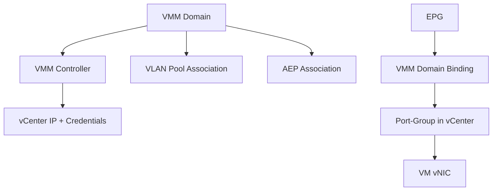
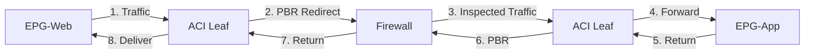
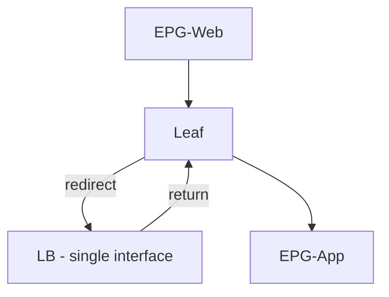
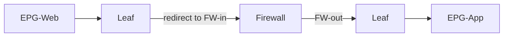
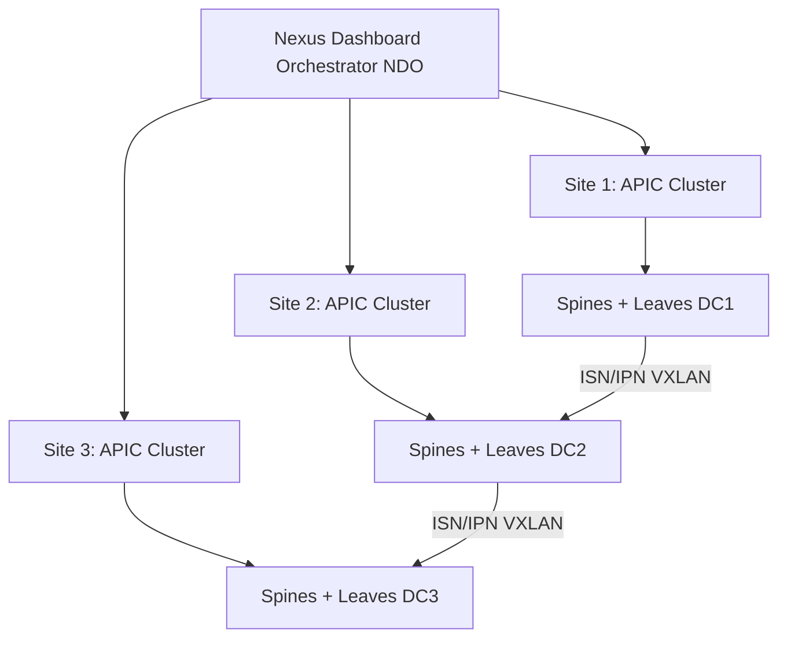

## ACI VMM, Service Graphs, and Multi-Site - CCIE DC v3.1 Deep Dive

> Reference: https://github.com/vikiev/aci-ccie-dc (Chapters 12-15)
> This material goes DEEPER than the repo on exam-critical VMM, L4-L7, and Multi-Site topics.

---

### VMM Integration (VMware)

#### VMM Domain Overview

A VMM (Virtual Machine Manager) Domain connects ACI to a hypervisor management platform. The most commonly tested integration is VMware vCenter. The VMM domain allows ACI to:

- Automatically create DVS (Distributed Virtual Switch) port-groups
- Push network policy (VLAN, teaming, NetFlow) to the hypervisor
- Learn VM endpoints without manual static bindings
- Enable dynamic EPG assignment (VMs get policy on attach)

The VMM domain is NOT a physical domain. It is a logical construct that:
- Associates a VLAN pool with a hypervisor cluster
- Defines how EPGs map to port-groups
- Controls endpoint learning behavior
- Manages the lifecycle of virtual network objects

#### VMM Object Hierarchy



```text
VMM Domain (vmmDomP)
  VMM Controller (vmmCtrlrP)
    vCenter IP: 192.168.1.100
    DVS Name: ACI-DVS-01
    Management EPG: MGMT-EPG (in-band or out-of-band)
  VLAN Pool: VMM-VLAN-POOL (static or dynamic)
  AEP: VMM-AEP
  EPG Association:
    EPG-Web -> Port-Group "CORP|APP1|EPG-Web"
    EPG-App -> Port-Group "CORP|APP1|EPG-App"
```

#### VMM Controller Configuration

The VMM Controller defines how APIC connects to vCenter:

```text
VMM Controller Parameters:
  Name: VCENTER-CTRL
  Vendor: VMware
  vCenter IP/FQDN: 192.168.1.100
  DVS Name: ACI-DVS-01
  Management EPG: (in-band) uni/tn-mgmt/mgmtp-default/inb-default
  Credential: VCENTER-CRED (username/password stored in APIC)
  Stats Collection: enabled
  Inventory Refresh Interval: 60 seconds
```

> **CCIE Exam Tip:** The VMM Controller uses a Management EPG for connectivity to vCenter. If vCenter is on an in-band management network, you must select the in-band management EPG. If vCenter is reachable via a tenant network, you can use a regular EPG. Getting this wrong means APIC cannot reach vCenter and the DVS will never be created.

#### VMM Credential

```text
VMM Credential (vmmUsrAccP):
  Name: VCENTER-CRED
  Username: administrator@vsphere.local
  Password: VMware123!
  Stored: encrypted in APIC database
  Used by: VMM Controller to authenticate to vCenter API
```

The credential is a separate object that can be shared across multiple VMM controllers.

#### VMM Domain Association

The VMM domain must be associated with:

1. VLAN Pool:
   - Static pool: specific VLANs pre-allocated
   - Dynamic pool: VLANs allocated on-demand from range
   - For VMM, dynamic is preferred (scalability)

2. AEP (Attachable Access Entity Profile):
   - Connects the VMM domain to physical interfaces
   - The AEP must be bound to the interface policy group where ESXi hosts connect
   - Without AEP binding, ACI cannot push VLAN configuration to the physical port

```text
VMM Domain: VMWARE-DOM
  VLAN Pool: VMM-POOL (dynamic, range 100-500)
  AEP: ESXI-AEP
  AEP Binding:
    Interface Policy Group: ESXI-VPC-PG (vPC to ESXi hosts)
    This ensures VLANs are allowed on the physical trunk to ESXi
```

> **Lab Exam Warning:** If you forget to bind the AEP to the interface policy group where ESXi hosts connect, the DVS will be created in vCenter but VMs will have NO connectivity. The physical port won't carry the required VLANs. Always verify: AEP -> Interface Policy Group -> Physical Port chain.

#### EPG to VMM: Dynamic Binding

When an EPG is associated with a VMM domain, ACI creates a port-group in vCenter:

```text
EPG Association:
  EPG: CORP/APP1/EPG-Web
  VMM Domain: VMWARE-DOM
  Deployment Immediacy: immediate
  Resolution Immediacy: immediate

Result in vCenter:
  DVS: ACI-DVS-01
    Port-Group: CORP|APP1|EPG-Web
      VLAN: (assigned by ACI from VLAN pool)
      Teaming: (per EPG interface policy)
      Security: promiscuous mode OFF, MAC changes OFF
```

Port-group naming convention: `Tenant|ApplicationProfile|EPGname`

#### Deployment Immediacy

Controls WHEN the port-group is created in vCenter:

| Setting | Behavior | Use Case |
|---------|----------|----------|
| immediate | Port-group created as soon as EPG is associated | Production EPGs, always-on workloads |
| lazy | Port-group created only when first VM is attached | Dev/test, many EPGs but few active VMs |

> **CCIE Exam Tip:** If you set deployment immediacy to "lazy" and then look in vCenter for the port-group, it will NOT exist until a VM is actually connected. This is a common troubleshooting confusion. If the port-group is missing, check deployment immediacy FIRST before assuming a VMM controller issue.

#### Resolution Immediacy

Controls WHEN ACI resolves the VMM domain binding:

| Setting | Behavior | Use Case |
|---------|----------|----------|
| immediate | ACI pushes config to vCenter immediately | Standard production |
| lazy | ACI waits until VM needs the network | Large environments, reduce vCenter load |
| pre-provision | Port-group created before VM exists | Templates, automated deployments |

#### DVS Configuration Pushed by ACI

When ACI creates/manages the DVS, it pushes:

```text
DVS Settings (managed by ACI):
  Uplink Count: 2 (uplink1, uplink2)
  Teaming Policy: 
    Active/Standby (default)
    or LACP (if interface policy specifies)
  VLAN Binding:
    Trunk mode with specific VLANs per port-group
  NetFlow: (if configured in EPG monitoring policy)
  ERSPAN: (if configured for traffic mirroring)
  MTU: 9000 (jumbo frames, matches ACI fabric)
  Security Policy:
    Promiscuous Mode: Reject
    MAC Address Changes: Reject
    Forged Transmits: Reject
```

> **Lab Exam Warning:** Do NOT manually modify the DVS or port-groups in vCenter that are managed by ACI. ACI will detect the drift and overwrite your changes on the next reconciliation cycle (default 60 seconds). If you need to change settings, modify the EPG/policy in APIC.

#### Endpoint Learning via VMM

ACI learns VM endpoints through multiple mechanisms:

1. VMware Tools (preferred):
   - ACI queries vCenter for VM power state, IP addresses
   - Requires VMware Tools installed in guest OS
   - Provides IP-to-MAC mapping without traffic inspection
   - Most reliable method

2. LLDP/CDP:
   - ESXi host sends LLDP to ACI leaf
   - ACI learns which VM MACs are behind which host/port
   - Works without VMware Tools
   - Provides MAC learning but NOT IP learning

3. MAC Learning from DVS:
   - ACI monitors DVS port events (VM attach/detach)
   - Learns MAC addresses from DVS notifications
   - Combined with data-plane learning for IP

```text
Endpoint Learning Flow:
  VM powers on -> DVS port-group attach event
    -> vCenter notifies APIC (via VMM controller)
    -> APIC programs leaf with MAC/VLAN binding
    -> VM sends traffic -> leaf learns source MAC
    -> ARP/DHCP -> leaf learns IP-to-MAC
    -> Endpoint appears in COOP database
```

#### VMM Troubleshooting

Problem 1: DVS not created in vCenter

```text
Diagnostic Steps:
  1. Check VMM controller status:
     apic1# show vmm ctrlr VMWARE-DOM/VCENTER-CTRL
     - State should be "connected"
     - If "disconnected": check IP reachability, credentials

  2. Check APIC to vCenter connectivity:
     apic1# ping 192.168.1.100
     - Must be reachable via management EPG

  3. Check credentials:
     apic1# show vmm cred VCENTER-CRED
     - Verify username/password are correct
     - Test by re-entering credentials

  4. Check faults:
     apic1# show fault | grep -i vmm
     - Look for: "unable to connect", "authentication failed"

  5. Check management EPG:
     - Is the correct management EPG selected?
     - Is vCenter VLAN reachable from that EPG?
```

Problem 2: Port-group missing in vCenter

```text
Diagnostic Steps:
  1. Check deployment immediacy:
     - If "lazy": port-group won't exist until VM attaches
     - Fix: change to "immediate" or attach a VM

  2. Check EPG to VMM domain association:
     apic1# moquery -c fvRsDomAtt -f 'eq(fvRsDomAtt.tDn,"uni/vmmp-VMware/dom-VMWARE-DOM")'
     - Verify EPG is associated with VMM domain

  3. Check VLAN pool:
     - Is there an available VLAN in the pool?
     - If pool is exhausted: no VLAN can be assigned

  4. Check DVS exists:
     - If DVS itself is missing: VMM controller issue (see Problem 1)
```

Problem 3: VM not learning (endpoint not in ACI)

```text
Diagnostic Steps:
  1. Check physical connectivity:
     leaf101# show interface ethernet1/1
     - Is the port up? (ESXi host connected)
     - Is the VLAN allowed on the trunk?

  2. Check VLAN pool binding:
     leaf101# show vlan internal
     - Is the EPG's VLAN allocated and active?

  3. Check AEP binding:
     - Is the AEP bound to the interface policy group?
     - Without AEP: VLAN not pushed to physical port

  4. Check endpoint table:
     leaf101# show endpoint mac 00:50:56:XX:XX:XX
     - Is the MAC learned?
     - If not: check VLAN, check port, check VM is powered on

  5. Check VMM domain binding on EPG:
     apic1# show epg CORP/APP1/EPG-Web detail
     - Verify VMM domain is listed under "Domains"
```

Verification commands:

```nxos
leaf101# show endpoint vmm
leaf101# show endpoint mac 00:50:56:aa:bb:cc
leaf101# show vlan internal
```

```text
apic1# show vmm ctrlr
apic1# show vmm dom VMWARE-DOM
apic1# show vmm dom VMWARE-DOM epg
apic1# show fault | grep vmm
```

---

### VMM with Other Hypervisors

#### Microsoft SCVMM

```text
SCVMM Integration:
  VMM Domain Vendor: Microsoft
  Controller: SCVMM server IP
  Logical Switch: created by ACI in SCVMM
  Port Profile: maps to EPG
  Endpoint learning: via SCVMM agent on Hyper-V hosts

Differences from VMware:
  - Uses Logical Switch instead of DVS
  - Port Profiles instead of Port-Groups
  - SCVMM agent handles endpoint reporting
  - Less commonly tested in CCIE DC
```

#### Red Hat OpenStack

```text
OpenStack Integration:
  Mechanism: ML2 plugin with ACI driver
  Controller: OpenStack Neutron API
  Network mapping: Neutron network -> BD, Neutron subnet -> BD subnet
  Port mapping: Neutron port -> EPG static binding
  Endpoint learning: via OpenStack Nova compute events

ACI Driver for ML2:
  - Installed on OpenStack controller nodes
  - Translates Neutron API calls to ACI REST API
  - Creates BD/EPG/Contract automatically
  - Less commonly tested (exam awareness only)
```

#### Kubernetes (ACI CNI Plugin)

```text
Kubernetes Integration:
  CNI Plugin: ACI Container Plugin (aci-containers)
  Network Model:
    Namespace -> maps to EPG (or EPG annotation)
    Pod -> endpoint in EPG
    Service -> contract (or EPG)
  Deployment:
    DaemonSet on all worker nodes
    Connects to APIC via REST API
    Programs OVS on each node
  Endpoint learning:
    Kubelet notifies CNI on pod create/delete
    CNI programs ACI leaf via APIC

Exam relevance: Awareness level. Know that:
  - ACI supports Kubernetes natively
  - EPG = namespace or label selector
  - Contracts = network policies
  - Not typically configured in CCIE DC lab
```

---

### Service Graphs (L4-L7 Service Insertion)

#### Service Graph Concept

A Service Graph inserts a Layer 4-7 device (firewall, load balancer, ADC) into the traffic path between two EPGs. Instead of traffic flowing directly from consumer to provider, it is redirected through the service device using PBR (Policy-Based Redirect).



Without service graph: EPG-Web -> EPG-App (direct, contract permits)
With service graph: EPG-Web -> Firewall -> EPG-App (inspected)

#### PBR (Policy-Based Redirect)

PBR is the mechanism that steers traffic to the service device:

```text
PBR Policy:
  Match: traffic matching contract subject (with service graph applied)
  Action: redirect to service device IP (next-hop)
  Mechanism: 
    - Leaf rewrites destination MAC to service device MAC
    - Packet sent to service device interface
    - Service device processes and returns packet
    - Leaf forwards to final destination

PBR vs Traditional Routing:
  - Traditional: route lookup -> forward to next-hop
  - PBR: policy match -> override next-hop -> redirect to service
  - PBR is applied BEFORE routing decision
  - PBR only affects matched traffic (contract subject)
```

#### Service Graph Components

```text
1. L4-L7 Device (vnsLDevVip):
   - Physical or virtual appliance
   - Registered in APIC with management IP
   - Device type: firewall, load-balancer, ADC
   - Management EPG: how APIC reaches the device

2. Device Package (vnsVDev):
   - Vendor-specific package (Cisco ASA, F5 BIG-IP, Palo Alto)
   - Defines device capabilities and configuration model
   - Uploaded to APIC as a package file
   - Contains: interface model, health check, config template

3. Service Graph Template (vnsAbsGraph):
   - Defines the traffic flow through service nodes
   - Contains Function Nodes (positions in the chain)
   - Defines connectivity: which EPG connects to which device interface

4. Function Node (vnsAbsFuncNode):
   - Position in the service graph
   - Type: GoTo (one-arm) or GoThrough (two-arm/inline)
   - Device: which L4-L7 device fills this role
   - Interface mapping: consumer-side, provider-side

5. Policy-Based Redirect Policy (vnsSvcRedirectPol):
   - Defines redirect destinations (service device IPs)
   - Health check: monitor service device availability
   - Fallback: what to do if device is down (bypass or drop)
```

#### Service Graph Types

##### One-Arm (GoTo)

```text
Use case: Load Balancer, one-arm firewall
Traffic flow:
  Client -> Leaf -> LB (single interface) -> Leaf -> Server
  Server -> Leaf -> LB -> Leaf -> Client

Characteristics:
  - Single interface on service device
  - Device receives traffic and sends it back out same interface
  - Source NAT often required (device changes source IP)
  - Simpler configuration
  - Function Node type: GoTo
```



##### Two-Arm / Inline (GoThrough)

```text
Use case: Inline firewall, IPS
Traffic flow:
  Client -> Leaf -> FW ingress interface -> FW egress interface -> Leaf -> Server
  Server -> Leaf -> FW egress -> FW ingress -> Leaf -> Client

Characteristics:
  - Two interfaces on service device (ingress + egress)
  - Traffic physically passes through device
  - No NAT required (routing mode)
  - Device can drop/permit per-packet
  - Function Node type: GoThrough
```



##### Multi-Node Chain

```text
Use case: FW -> LB -> ADC (full service chain)
Traffic flow:
  Client -> Leaf -> FW -> Leaf -> LB -> Leaf -> ADC -> Leaf -> Server

Characteristics:
  - Multiple Function Nodes in sequence
  - Each node can be GoTo or GoThrough
  - PBR policy per node (different redirect IPs)
  - Complex but powerful
  - Order matters: traffic hits nodes in sequence
```

#### GoTo vs GoThrough (Exam Critical)

| Property | GoTo | GoThrough |
|----------|------|-----------|
| Interfaces | 1 (consumer-side only) | 2 (consumer + provider) |
| Traffic path | In and out same interface | In one, out another |
| Use case | LB, one-arm FW | Inline FW, IPS |
| NAT required | Often yes | No (routed) |
| PBR entries | 1 redirect | 2 redirects (in + out) |
| Failure mode | Bypass (skip device) | Drop or bypass |
| Exam frequency | Medium | High |

> **CCIE Exam Tip:** The exam frequently tests GoThrough (inline firewall) because it requires understanding of BOTH consumer-side and provider-side redirect. If you only configure one side, traffic goes to the firewall but never comes back. Always verify both PBR entries exist.

#### Service Graph Configuration Steps

```text
Step 1: Create L4-L7 Device
  Tenant > Services > L4-L7 > Devices > Create Device
  Name: FW-DEVICE
  Device Type: Virtual / Physical
  Vendor: Cisco
  Model: ASA
  Management IP: 192.168.100.10
  Management EPG: MGMT-EPG
  Credentials: admin / Cisco123!
  Interface Mapping:
    Consumer Interface: inside (Gig0/1)
    Provider Interface: outside (Gig0/2)

Step 2: Create Service Graph Template
  Tenant > Services > L4-L7 > Service Graph Templates > Create
  Name: FW-GRAPH
  Type: FW_ROUTED (GoThrough)
  Function Node:
    Name: FW-NODE
    Device: FW-DEVICE
    Consumer Interface: inside
    Provider Interface: outside

Step 3: Apply Service Graph to Contract
  Tenant > Contracts > WEB-TO-APP > Subject: HTTP
    Service Graph: FW-GRAPH
    (This redirects HTTP traffic through the firewall)

Step 4: Configure PBR Policy (automatic)
  - ACI automatically creates PBR when service graph is applied
  - PBR redirect target: FW inside IP (consumer side)
  - PBR redirect target: FW outside IP (provider side)
  - Health check: ICMP to FW management IP

Step 5: Deploy and Verify
  - Service graph deployment pushes config to device (if managed)
  - PBR entries programmed on relevant leaves
  - Traffic matching contract subject is redirected
```

#### Service Graph Verification

```text
apic1# show service-graph CORP/FW-GRAPH
apic1# show service-graph CORP/FW-GRAPH deployment
apic1# show pbr policy
```

```nxos
leaf101# show pbr session
leaf101# show pbr statistics
leaf101# show access-list | include pbr
leaf101# show platform software fed switch active punt packet-capture display-capture-buffer all clear brief
```

Traffic flow test:

```text
1. Generate traffic from EPG-Web VM to EPG-App VM (HTTP)
2. On leaf: show pbr statistics (packets redirected count increases)
3. On firewall: show conn (connection table shows the flow)
4. On leaf: verify return traffic also hits PBR
5. End-to-end: curl from web VM to app VM succeeds
```

#### Service Graph Troubleshooting

Problem: PBR not hitting (packets not redirected)

```text
Diagnostic Steps:
  1. Verify service graph is applied to contract:
     apic1# show contract CORP/WEB-TO-APP detail
     - Subject should reference service graph

  2. Verify PBR policy exists on leaf:
     leaf101# show pbr session
     - Should show redirect entries

  3. Verify contract is actually matching traffic:
     leaf101# show zoning-rule vrf CORP:PROD-VRF
     - Rule should exist with service graph reference

  4. Verify service device is reachable:
     leaf101# ping 192.168.100.10 vrf CORP:PROD-VRF
     - PBR health check uses this

  5. Check PBR statistics:
     leaf101# show pbr statistics
     - If "matched" = 0: traffic not matching contract
     - If "matched" > 0 but "redirected" = 0: PBR target unreachable

  6. Common causes:
     - Service graph not deployed (deployment status = failed)
     - Device management IP unreachable
     - PBR health check failing (device marked down)
     - Contract subject filter doesn't match traffic
```

Problem: Device not receiving traffic

```text
Diagnostic Steps:
  1. Check device interface is up:
     - SSH to device, verify interface status
     - Verify VLAN is correct on device interface

  2. Check PBR redirect IP:
     - Must match device interface IP
     - Must be in same subnet as leaf VLAN

  3. Check ARP:
     leaf101# show ip arp vrf CORP:PROD-VRF 192.168.50.1
     - Leaf must have ARP entry for device interface
     - If missing: L2 issue between leaf and device

  4. Check device routing:
     - Device must have route back to source subnet
     - Default route or specific routes to EPG subnets
```

---

### Multi-Site ACI

#### Multi-Site Architecture

Multi-Site ACI extends a single ACI policy domain across geographically separate data centers. Each site is an independent ACI fabric (its own APIC cluster, spines, leaves) managed by a central orchestrator.



Key components:
- NDO (Nexus Dashboard Orchestrator): formerly MSO (Multi-Site Orchestrator)
- 3-node NDO cluster (minimum for production)
- Each site: independent APIC cluster (3 APICs minimum)
- ISN/IPN: Inter-Site Network / Inter-Pod Network connecting spines

#### NDO vs APIC Responsibilities

| Function | NDO | APIC (per site) |
|----------|-----|-----------------|
| Tenant policy (stretched) | YES | Receives from NDO |
| VRF/BD/EPG (stretched) | YES | Receives from NDO |
| Contracts (stretched) | YES | Receives from NDO |
| L3Out (site-local) | NO | YES |
| Access policies | NO | YES |
| Interface configuration | NO | YES |
| Static bindings | NO | YES |
| Firmware management | NO | YES |
| Fabric discovery | NO | YES |

> **CCIE Exam Tip:** The exam tests your understanding of what is STRETCHED (managed by NDO) vs what is SITE-LOCAL (managed by APIC). L3Out is ALWAYS site-local. Access policies are ALWAYS site-local. If a question asks "where do I configure the L3Out for Site 2?" the answer is: on Site 2's APIC (or via NDO with site-specific template).

#### Stretched Objects

Objects that span multiple sites (configured in NDO):

```text
Stretched (NDO manages):
  Tenant: CORP (exists in all sites)
  VRF: PROD-VRF (same VRF across sites)
  BD: BD-Web (same subnet in all sites)
  EPG: EPG-Web (endpoints in any site)
  Contract: WEB-ACCESS (enforced in all sites)
  Application Profile: APP1

Site-Local (APIC manages):
  L3Out: WAN-L3OUT-SITE1 (Site 1 only)
  L3Out: WAN-L3OUT-SITE2 (Site 2 only)
  Static Binding: Leaf101 Eth1/1 VLAN 100 (Site 1)
  Static Binding: Leaf201 Eth1/1 VLAN 100 (Site 2)
  Access Policies: interface policies, VLAN pools (per site)
```

#### Inter-Site Network (ISN) / Inter-Pod Network (IPN)

The ISN/IPN is the network that connects site spines together:

```text
ISN Requirements:
  - Connects spine interfaces between sites
  - Must carry VXLAN traffic (UDP 4789) between sites
  - Typically: dedicated dark fiber or MPLS/VPLS circuit
  - MTU: minimum 9150 (VXLAN overhead + jumbo frames)
  - Latency: < 10ms RTT recommended (< 50ms maximum)
  - Bandwidth: sized for inter-site BUM + unicast traffic

ISN Configuration (on external routers):
  - BGP underlay between site spines
  - Each spine advertises its TEP (loopback0) via BGP
  - Spines learn remote site TEPs via BGP
  - VXLAN tunnels established between spines (site-to-site)

ISN must NOT:
  - Filter UDP 4789 (VXLAN)
  - Modify VXLAN headers
  - Introduce asymmetric routing (same path both directions)
  - Have MTU < 9150 (will fragment VXLAN packets)
```

> **Lab Exam Warning:** If multi-site connectivity fails, check ISN MTU first. VXLAN adds 50 bytes of overhead. If the ISN path has MTU 1500, VXLAN packets (which carry 9000-byte inner frames) will be dropped silently. The ISN must support jumbo frames end-to-end.

#### Stretched Bridge Domain

A stretched BD extends the same Layer 2 domain across sites:

```text
Stretched BD: BD-Web
  Subnet: 10.1.10.1/24 (same gateway in all sites)
  Sites: Site1, Site2, Site3
  L2 Stretch: Enabled
  BUM Replication: Ingress Replication (across sites)
  ARP Flooding: Enabled (for cross-site ARP)
  Unknown Unicast: Flood (across sites)
```

Key behaviors:

1. Same subnet across sites:
   - 10.1.10.0/24 exists in Site1 AND Site2
   - Default gateway: 10.1.10.1 (anycast, both sites)
   - VM in Site1 and VM in Site2 are in same broadcast domain

2. BUM replication across sites:
   - Broadcast, Unknown-unicast, Multicast replicated to all sites
   - Uses ingress replication (head-end replication by source leaf)
   - Source leaf sends BUM to all remote site spines via VXLAN

3. Endpoint move between sites:
   - VM migrates (vMotion) from Site1 to Site2
   - New leaf in Site2 learns the MAC
   - COOP database updated: MAC now at Site2 leaf TEP
   - Old site stops responding for that MAC
   - ARP cache updated across all sites

4. ARP flooding across sites:
   - If ARP flooding enabled: ARP broadcast goes to all sites
   - If disabled: COOP proxy responds (but only for known endpoints)
   - For stretched BD: ARP flooding is often required for cross-site resolution

> **CCIE Exam Tip:** Stretched BD with ARP flooding disabled can cause issues when a VM moves between sites. The remote site may have a stale ARP entry pointing to the old location. If inter-site traffic fails after a VM migration, check ARP entries and COOP database. Enabling ARP flooding (or reducing ARP timeout) resolves this.

#### Multi-Site L3Out

Each site has its own L3Out for external connectivity:

```text
Site 1:
  L3Out: WAN-SITE1
    BGP ASN: 65001
    Peer: ISP-Router-1 (10.255.1.2)
    Advertises: 10.1.10.0/24 (BD-Web)

Site 2:
  L3Out: WAN-SITE2
    BGP ASN: 65002
    Peer: ISP-Router-2 (10.255.2.2)
    Advertises: 10.1.10.0/24 (BD-Web)

External view:
  ISP sees 10.1.10.0/24 from BOTH sites
  Load-balances or uses primary/backup based on BGP attributes
  If Site1 link fails: traffic flows to Site2 (convergence)
```

Inter-site traffic options:
- Via stretched BD: L2 forwarding across ISN (same subnet)
- Via L3Out: route out of Site1, back into Site2 (different subnets)
- Stretched BD is preferred for same-subnet workloads

#### Multi-Site Configuration Steps

```text
Step 1: Deploy NDO (3-node cluster)
  - Install Nexus Dashboard (VM or appliance)
  - Enable Orchestrator service
  - Form 3-node cluster
  - Configure cluster VIP

Step 2: Add Sites to NDO
  NDO > Sites > Add Site
    Site Name: SITE1
    APIC Cluster: 192.168.1.10 (VIP)
    Username: admin
    Password: Cisco123!
  Repeat for SITE2, SITE3

Step 3: Create Schema (Tenant Template)
  NDO > Schemas > Create Schema
    Name: CORP-SCHEMA
    Template: CORP-TEMPLATE
      Tenant: CORP
      VRF: PROD-VRF
      BD: BD-Web (10.1.10.1/24, L2 Stretch: ON)
      AP: APP1
      EPG: EPG-Web (BD: BD-Web)
      Contract: WEB-ACCESS

Step 4: Assign Templates to Sites
  NDO > Schemas > CORP-SCHEMA > Sites
    Assign CORP-TEMPLATE to: SITE1, SITE2, SITE3
    (All sites get the same stretched policy)

Step 5: Site-Local Configuration (per site APIC)
  Site1 APIC:
    L3Out: WAN-SITE1 (BGP, ASN 65001)
    Static bindings: Leaf101 Eth1/1 VLAN 100
  Site2 APIC:
    L3Out: WAN-SITE2 (BGP, ASN 65002)
    Static bindings: Leaf201 Eth1/1 VLAN 100

Step 6: Deploy
  NDO > Schemas > CORP-SCHEMA > Deploy
  - Pushes stretched objects to all sites
  - Each APIC receives and programs its leaves
```

#### Multi-Site Verification

```text
NDO Dashboard:
  NDO > Dashboard
  - Site health: all sites green
  - Schema deployment: successful
  - Endpoint count per site

Per-Site Verification:
  Site1 APIC:
    apic1# show tenant CORP
    apic1# show bd CORP/BD-Web
    apic1# show endpoint ip 10.1.10.10
    - Endpoint location: local (if VM is in Site1)
    - Or: remote, site SITE2 (if VM is in Site2)

  Site1 Leaf:
    leaf101# show nve peers
    - Should show VXLAN peers to Site2 spines
    leaf101# show endpoint ip 10.1.10.10
    - If remote: shows remote TEP (Site2 spine)
```

#### Multi-Site Troubleshooting

Problem: Site connectivity lost

```text
Diagnostic Steps:
  1. Check ISN connectivity:
     spine1# ping 10.10.10.2 (remote site spine TEP)
     - If fails: ISN routing issue

  2. Check BGP underlay:
     spine1# show bgp summary
     - Are remote site spines BGP neighbors?

  3. Check VXLAN peers:
     spine1# show nve peers
     - Are remote spines in the peer list?
     - State should be "Up"

  4. Check NDO site status:
     NDO > Sites > SITE2
     - Status: Connected / Disconnected
     - If disconnected: check APIC cluster health
```

Problem: Stretched BD endpoint flapping

```text
Symptoms:
  - Endpoint MAC appears on both sites alternately
  - COOP database shows rapid updates
  - Traffic to endpoint is intermittent

Causes:
  1. Duplicate IP/MAC (misconfiguration)
  2. VM with multiple interfaces in same BD
  3. Loop in stretched L2 domain
  4. vMotion storm (multiple VMs moving rapidly)

Diagnostic:
  leaf101# show endpoint mac 00:50:56:aa:bb:cc history
  - Shows endpoint move history
  - If flapping: rapid alternation between local/remote

Fix:
  - Identify source of duplicate MAC
  - Check for L2 loops (especially L2Out in stretched BD)
  - Enable endpoint loop protection (per BD)
  - Reduce ARP timeout for faster convergence
```

---

### ACI Programmability

#### REST API Fundamentals

ACI's entire configuration is accessible via REST API. Every object in the MIT (Management Information Tree) can be:
- Created: POST with JSON/XML payload
- Read: GET on object DN
- Updated: POST with modified attributes
- Deleted: DELETE on object DN

```text
API Base URL: https://<APIC-IP>/api/
Authentication: 
  POST /api/aaaLogin.json (username/password)
  Returns: token (valid 600 seconds default)
  Subsequent requests: Cookie: APIC-cookie=<token>

Object DN format:
  uni/tn-CORP/out-WAN-BGP/instP-EXT-WAN
  uni/tn-CORP/ap-APP1/epg-EPG-Web
  uni/tn-CORP/ctx-PROD-VRF
```

#### Python SDK Options

```text
1. acitoolkit (open-source, community):
   from acitoolkit import Session, Tenant, AppProfile, EPG
   session = Session("https://apic1", "admin", "Cisco123!")
   session.login()
   tenant = Tenant("CORP")
   ap = AppProfile("APP1", tenant)
   epg = EPG("EPG-Web", ap)
   epg.push_to_apic(session)

2. cobra (Cisco official SDK):
   import cobra.mit.access
   import cobra.mit.session
   ls = cobra.mit.session.LoginSession("https://apic1", "admin", "Cisco123!")
   md = cobra.mit.access.MoDirectory(ls)
   md.login()
   tenant = md.lookupByDn("uni/tn-CORP")

3. acipython (newer, REST wrapper):
   from acipython import APIC
   apic = APIC("apic1", "admin", "Cisco123!")
   tenants = apic.get("uni/tn-CORP")
```

#### Ansible ACI Modules

```text
Common modules:
  cisco.aci.aci_tenant: manage tenants
  cisco.aci.aci_vrf: manage VRFs
  cisco.aci.aci_bd: manage bridge domains
  cisco.aci.aci_bd_subnet: manage BD subnets
  cisco.aci.aci_epg: manage EPGs
  cisco.aci.aci_contract: manage contracts
  cisco.aci.aci_filter: manage filters
  cisco.aci.aci_l3out: manage L3Outs
  cisco.aci.aci_rest: raw REST API calls

Example playbook:
```

```text
- name: Create Tenant
  cisco.aci.aci_tenant:
    host: "{{ apic_host }}"
    username: "{{ apic_user }}"
    password: "{{ apic_pass }}"
    tenant: CORP
    state: present

- name: Create VRF
  cisco.aci.aci_vrf:
    host: "{{ apic_host }}"
    username: "{{ apic_user }}"
    password: "{{ apic_pass }}"
    tenant: CORP
    vrf: PROD-VRF
    state: present

- name: Create BD
  cisco.aci.aci_bd:
    host: "{{ apic_host }}"
    username: "{{ apic_user }}"
    password: "{{ apic_pass }}"
    tenant: CORP
    bd: BD-Web
    vrf: PROD-VRF
    state: present
```

#### Terraform ACI Provider

```text
provider "aci" {
  username = "admin"
  password = "Cisco123!"
  url      = "https://apic1"
  insecure = true
}

resource "aci_tenant" "corp" {
  name = "CORP"
}

resource "aci_vrf" "prod" {
  tenant_dn = aci_tenant.corp.id
  name      = "PROD-VRF"
}

resource "aci_bridge_domain" "web" {
  tenant_dn          = aci_tenant.corp.id
  name               = "BD-Web"
  relation_fv_rs_ctx = aci_vrf.prod.id
}

resource "aci_subnet" "web_gw" {
  bridge_domain_dn = aci_bridge_domain.web.id
  ip               = "10.1.10.1/24"
  scope            = ["public", "shared"]
}
```

#### NDO API (Multi-Site)

```text
NDO REST API:
  Base URL: https://<NDO-IP>/api/v1/
  Authentication: same as APIC (aaaLogin)

  Schemas:
    GET /api/v1/schemas (list all schemas)
    POST /api/v1/schemas (create schema)
    PUT /api/v1/schemas/<id> (update schema)

  Sites:
    GET /api/v1/sites (list sites)
    POST /api/v1/sites (add site)

  Deploy:
    POST /api/v1/schemas/<id>/deploy
```

#### WebSocket Subscriptions

Real-time event streaming from APIC:

```text
1. Open WebSocket: wss://<APIC>/socket<token>
2. Subscribe to class:
   {"subscription": {"class": "fvEPg", "dn": "uni/tn-CORP/ap-APP1/epg-EPG-Web"}}
3. Receive events:
   {"subscriptionId": ["123"], "imdata": [{"fvEPg": {"attributes": {...}}}]}

Use cases:
  - Real-time endpoint learning notifications
  - Fault monitoring
  - Configuration change auditing
  - Dashboard updates
```

#### Common Automation Tasks

```text
Day-0 (Initial Provisioning):
  - Create tenant, VRF, BDs, EPGs, contracts
  - Configure L3Outs
  - Set up VMM domains
  - Best tool: Ansible or Terraform (idempotent, declarative)

Day-2 (Operational Changes):
  - Add/remove static bindings
  - Modify contract filters
  - Add new EPGs to existing AP
  - Best tool: Python (cobra/acitoolkit) for complex logic

Compliance Checking:
  - Query all EPGs, verify contract bindings
  - Check all BDs have correct subnet configuration
  - Verify L3Out BGP peers are established
  - Best tool: Python + REST API (GET all objects, validate)

Backup/Restore:
  - APIC built-in: Admin > Configuration Export
  - API: GET /api/mo/uni.json?rsp-subtree=full (full config dump)
  - Restore: POST the JSON back
  - Best tool: Scheduled Python script + git for versioning
```

---

### Labs

### Lab 1: VMM Domain with VMware (Conceptual + Verification)

#### Scenario

```text
Environment:
  - ACI fabric: 2 spines, 4 leaves
  - vCenter: 192.168.1.100 (reachable via in-band management)
  - ESXi hosts: connected to Leaf101 Eth1/1-2 (vPC)
  - VLAN pool for VMM: 100-500 (dynamic)
  - Tenant: CORP, AP: APP1
  - EPG-Web: needs dynamic binding to VMM domain

Goal:
  - VMM controller connected to vCenter
  - DVS "ACI-DVS-01" created in vCenter
  - EPG-Web port-group visible in vCenter
  - VM attached to port-group gets endpoint learned in ACI
```

#### VMM Controller Creation (GUI Steps)

```text
Step 1: Create VMM Credential
  Admin > External Connections > VMM > Credentials > + Create
  Name: VCENTER-CRED
  Vendor: VMware
  Username: administrator@vsphere.local
  Password: VMware123!
  [Submit]

Step 2: Create VMM Domain
  Admin > External Connections > VMM > VMware > Domains > + Create
  Name: VMWARE-DOM
  Access Mode: Read-Write
  VLAN Pool: VMM-POOL (dynamic, 100-500)
  [Next]

Step 3: Add VMM Controller
  Controller Name: VCENTER-CTRL
  vCenter IP: 192.168.1.100
  DVS Name: ACI-DVS-01
  Management EPG: uni/tn-mgmt/mgmtp-default/inb-default
  Credential: VCENTER-CRED
  Stats Collection: Enabled
  [Next]

Step 4: AEP Association
  AEP: ESXI-AEP
  (This AEP must be bound to the interface policy group for ESXi hosts)
  [Finish]

Step 5: Associate EPG with VMM Domain
  Tenant CORP > Application Profiles > APP1 > EPGs > EPG-Web
  Domains tab:
    + Add VMM Domain:
      Domain: VMWARE-DOM
      Deployment Immediacy: immediate
      Resolution Immediacy: immediate
      Port Binding: dynamicBinding
      Num Ports: 0 (auto)
  [Submit]
```

#### DVS Verification in vCenter

```text
In vCenter Web Client:
  Networking > Distributed Switches
  - DVS "ACI-DVS-01" should appear
  - Created by: APIC (do not modify manually)

  DVS > Port Groups:
  - "CORP|APP1|EPG-Web" should appear
  - VLAN: (assigned by ACI, e.g., 105)
  - Teaming: Active/Standby (uplink1 active, uplink2 standby)
  - Security: Promiscuous=Reject, MAC Changes=Reject, Forged=Reject

If DVS is NOT visible:
  1. Wait 60 seconds (inventory refresh interval)
  2. Check VMM controller status in APIC
  3. Check APIC can reach vCenter (ping from APIC)
  4. Check credentials are correct
```

#### EPG Dynamic Binding Verification

```text
In vCenter:
  VM > Edit Settings > Network Adapter
  - Port Group: CORP|APP1|EPG-Web
  - When VM powers on: ACI learns endpoint automatically

In APIC:
  Tenant CORP > Application Profiles > APP1 > EPGs > EPG-Web
  Operational tab:
    Endpoints: shows VM MAC and IP
    VMM Domain: VMWARE-DOM (associated)
```

#### Endpoint Learning Verification

```nxos
leaf101# show endpoint mac 00:50:56:aa:bb:cc

  Legend:
    S - static, D - dynamic, L - local, R - remote
    V - vxlan, H - vtep

  VLAN  MAC Address   Type  Interface/Remote TEP
  105   00:50:56:aa:bb:cc  DV   Eth1/1

leaf101# show endpoint ip 10.1.10.10

  VLAN  IP Address    MAC Address   Type  Interface
  105   10.1.10.10    00:50:56:aa:bb:cc  DV   Eth1/1
```

```text
apic1# show endpoint vmm
apic1# show vmm ctrlr VMWARE-DOM/VCENTER-CTRL
  Status: connected
  DVS: ACI-DVS-01
  Hosts: 2
  VMs: 5
```

#### Troubleshooting: DVS Not Appearing

```text
Step 1: Check VMM controller connectivity
  apic1# show vmm ctrlr VMWARE-DOM/VCENTER-CTRL
  - If state = "disconnected": connectivity issue
  - If state = "connected" but no DVS: check DVS name

Step 2: Verify network path
  apic1# ping 192.168.1.100
  - Must succeed via management EPG
  - If fails: check management EPG VLAN, check routing

Step 3: Verify credentials
  - Re-enter credentials in VMM controller
  - Check vCenter SSO: administrator@vsphere.local must exist
  - Check password has not expired

Step 4: Check faults
  apic1# show fault | grep -i "vmm\|dvs\|vcenter"
  - F1180: unable to connect to vCenter
  - F1181: authentication failed
  - F1182: DVS creation failed

Step 5: Check VLAN pool
  apic1# show vlan pool VMM-POOL
  - Must have available VLANs
  - If exhausted: expand range or free VLANs

Step 6: Check AEP binding
  - AEP must be bound to interface policy group
  - Interface policy group must be on the port where ESXi connects
  - Without this: DVS created but no physical connectivity
```

---

### Lab 2: Service Graph with Firewall

#### Scenario

```text
Topology:
  EPG-Web (10.1.10.0/24) -> [Firewall] -> EPG-App (10.1.20.0/24)
  Firewall: Cisco ASA, managed by APIC
    Inside: 192.168.50.1/24 (consumer side)
    Outside: 192.168.51.1/24 (provider side)
    Management: 192.168.100.10

Requirements:
  - HTTP/HTTPS traffic from EPG-Web to EPG-App must traverse firewall
  - Firewall is inline (GoThrough, two-arm)
  - PBR redirects traffic to firewall
  - Return traffic also traverses firewall
```

#### L4-L7 Device Registration

```text
Step 1: Upload Device Package (if not already present)
  Admin > External Connections > L4-L7 > Packages
  - Upload Cisco ASA device package (.aci file)
  - Wait for package to be active

Step 2: Register L4-L7 Device
  Tenant CORP > Services > L4-L7 > Devices > + Create
  Name: ASA-FW
  Device Type: Physical
  Vendor: Cisco
  Model: ASA
  Management IP: 192.168.100.10
  Management EPG: MGMT-EPG
  Username: admin
  Password: Cisco123!

  Interfaces:
    Consumer Interface:
      Name: inside
      IP: 192.168.50.1/24
      VLAN: 50
      Leaf: 101, Port: Eth1/10
    Provider Interface:
      Name: outside
      IP: 192.168.51.1/24
      VLAN: 51
      Leaf: 101, Port: Eth1/11
  [Submit]
```

#### Service Graph Template (GoThrough, Inline Firewall)

```text
Step 1: Create Service Graph Template
  Tenant CORP > Services > L4-L7 > Service Graph Templates > + Create
  Name: FW-INLINE-GRAPH
  Type: FW_ROUTED (two-arm, GoThrough)

  Function Node:
    Name: FW-NODE
    Device: ASA-FW
    Consumer Interface: inside (192.168.50.1)
    Provider Interface: outside (192.168.51.1)

  Graph Layout:
    [Consumer EPG] --> [FW-NODE: inside | outside] --> [Provider EPG]
  [Submit]
```

#### Apply to Contract

```text
Step 1: Edit Contract Subject
  Tenant CORP > Contracts > WEB-TO-APP > Subject: HTTP-HTTPS
    Service Graph: FW-INLINE-GRAPH
    (Select the service graph template)
  [Submit]

Effect:
  - All traffic matching WEB-TO-APP contract (HTTP/HTTPS)
  - Between EPG-Web (consumer) and EPG-App (provider)
  - Will be redirected through ASA-FW
```

#### PBR Verification

```nxos
leaf101# show pbr session

  PBR Policy: FW-INLINE-GRAPH
  VRF: CORP:PROD-VRF
  
  Redirect Entry 1 (Consumer Side):
    Match: src=EPG-Web, dst=EPG-App, proto=tcp, port=80,443
    Action: redirect to 192.168.50.1 (FW inside)
    Status: active
    Health Check: ICMP to 192.168.100.10 - UP

  Redirect Entry 2 (Provider Side):
    Match: src=EPG-App, dst=EPG-Web, proto=tcp, port=80,443
    Action: redirect to 192.168.51.1 (FW outside)
    Status: active

leaf101# show pbr statistics

  Policy: FW-INLINE-GRAPH
    Matched packets: 15234
    Redirected packets: 15234
    Dropped packets: 0
    Health check failures: 0
```

#### Traffic Flow Test

```text
Test 1: HTTP from EPG-Web VM to EPG-App VM
  web-vm$ curl http://10.1.20.10
  - Should succeed (traffic traverses firewall)

Test 2: Verify on firewall
  ASA# show conn
  - Should show: TCP 10.1.10.10:54321 -> 10.1.20.10:80

Test 3: Verify PBR hit
  leaf101# show pbr statistics
  - "Matched packets" should increase

Test 4: Negative test (non-HTTP)
  web-vm$ ssh 10.1.20.10
  - Should be BLOCKED (contract only permits HTTP/HTTPS)
  - PBR does not match SSH traffic
```

#### Troubleshooting: PBR Not Redirecting

```text
Step 1: Verify service graph deployment
  apic1# show service-graph CORP/FW-INLINE-GRAPH deployment
  - Status should be "deployed"
  - If "failed": check device connectivity

Step 2: Verify contract has service graph
  apic1# show contract CORP/WEB-TO-APP detail
  - Subject should reference FW-INLINE-GRAPH

Step 3: Verify zoning rules include PBR
  leaf101# show zoning-rule vrf CORP:PROD-VRF
  - Look for rule with "redirect" action
  - If missing: service graph not applied correctly

Step 4: Verify firewall is reachable
  leaf101# ping 192.168.50.1 vrf CORP:PROD-VRF
  leaf101# ping 192.168.51.1 vrf CORP:PROD-VRF
  - Both must succeed (PBR targets)

Step 5: Check ARP for PBR targets
  leaf101# show ip arp vrf CORP:PROD-VRF 192.168.50.1
  - Must have MAC address resolved
  - If missing: L2 issue to firewall interface

Step 6: Check firewall routing
  ASA# show route
  - Must have routes to 10.1.10.0/24 and 10.1.20.0/24
  - Next-hop: leaf SVI IPs (192.168.50.254, 192.168.51.254)

Step 7: Check health check
  leaf101# show pbr session | include health
  - If health check DOWN: PBR disabled (bypass mode)
  - Fix: ensure management IP reachable, ICMP allowed
```

---

### Lab 3: Multi-Site Stretched BD (Conceptual)

#### Scenario

```text
Environment:
  - NDO: 3-node cluster (192.168.200.10)
  - Site 1: APIC cluster (192.168.1.10), 2 spines, 4 leaves
  - Site 2: APIC cluster (192.168.2.10), 2 spines, 4 leaves
  - ISN: BGP underlay between site spines (10.100.0.0/24)
  - Stretched BD: 10.1.10.0/24 (BD-Web)
  - VM in Site1: 10.1.10.10
  - VM in Site2: 10.1.10.20

Goal:
  - Both VMs in same broadcast domain
  - Ping between sites succeeds
  - VM migration (vMotion) updates endpoint location
```

#### NDO Setup Steps

```text
Step 1: Access NDO
  https://192.168.200.10
  Login: admin / NdoAdmin123!

Step 2: Verify Sites Added
  NDO > Sites
  - SITE1: Connected (APIC 192.168.1.10)
  - SITE2: Connected (APIC 192.168.2.10)

Step 3: Create Schema
  NDO > Schemas > + Create Schema
  Name: CORP-MULTISITE
  
  Template: CORP-TMPL
    Tenant: CORP
    VRF: PROD-VRF
      L3 Stretch: Enabled
    BD: BD-Web
      Subnet: 10.1.10.1/24
      L2 Stretch: Enabled
      L3 Multicast: Enabled
      BUM: Ingress Replication
      ARP Flooding: Enabled
    AP: APP1
    EPG: EPG-Web
      BD: BD-Web
    Contract: WEB-ACCESS
      Filter: HTTP (tcp/80), HTTPS (tcp/443), ICMP

Step 4: Assign to Sites
  NDO > Schemas > CORP-MULTISITE > Sites
    SITE1: Assign CORP-TMPL
    SITE2: Assign CORP-TMPL

Step 5: Deploy
  NDO > Schemas > CORP-MULTISITE > Deploy
  - Wait for deployment status: Success
  - Both sites receive stretched objects
```

#### Stretched BD Deployment Verification

```text
On Site 1 APIC:
  apic1# show tenant CORP
  apic1# show bd CORP/BD-Web
    - L2 Stretch: enabled
    - Sites: SITE1, SITE2

On Site 1 Leaf:
  leaf101# show nve peers
  - Should show VXLAN peers to Site2 spines
  - Peer TEP: 10.100.0.3 (Site2 spine1)
  - Peer TEP: 10.100.0.4 (Site2 spine2)
  - State: Up

  leaf101# show vxlan vni
  - VNI for BD-Web: e.g., 15001
  - Type: L2
  - Mode: fabric-wide (stretched)
```

#### Endpoint Move Verification

```text
Before vMotion:
  Site1 leaf101# show endpoint ip 10.1.10.10
    VLAN  IP          MAC              Type  Interface
    100   10.1.10.10  00:50:56:aa:bb:cc  DV   Eth1/1 (local)

  Site2 leaf201# show endpoint ip 10.1.10.10
    VLAN  IP          MAC              Type  Remote TEP
    100   10.1.10.10  00:50:56:aa:bb:cc  DR   10.100.0.1 (Site1 spine)

After vMotion to Site2:
  Site2 leaf201# show endpoint ip 10.1.10.10
    VLAN  IP          MAC              Type  Interface
    100   10.1.10.10  00:50:56:aa:bb:cc  DV   Eth1/1 (local, NOW)

  Site1 leaf101# show endpoint ip 10.1.10.10
    VLAN  IP          MAC              Type  Remote TEP
    100   10.1.10.10  00:50:56:aa:bb:cc  DR   10.100.0.3 (Site2 spine)

  COOP database updated within seconds
  ARP tables updated across all sites
```

#### Inter-Site Connectivity Test

```text
From Site1 VM (10.1.10.10):
  C:\> ping 10.1.20.10
  - If 10.1.20.10 is in Site2: traffic crosses ISN via VXLAN
  - Path: Leaf101 -> Spine1(Site1) -> ISN -> Spine1(Site2) -> Leaf201

From Site2 VM (10.1.10.20):
  C:\> ping 10.1.10.10
  - Reverse path via ISN

Verification on spines:
  spine1-site1# show nve peers
  spine1-site1# show nve vni 15001 peer
  - Shows remote VTEPs for the stretched VNI
```

---

### Key Takeaways

1. VMM Domain: connects ACI to vCenter, creates DVS/port-groups automatically
2. Deployment immediacy "lazy" = port-group not created until VM attaches
3. AEP binding is required for VMM physical connectivity (often forgotten)
4. Service Graph uses PBR to redirect traffic through L4-L7 devices
5. GoThrough = two-arm inline (firewall), GoTo = one-arm (load balancer)
6. Service graph is applied to contract SUBJECT, not EPG directly
7. Multi-site: NDO manages stretched objects, APIC manages site-local
8. L3Out is ALWAYS site-local in multi-site
9. ISN must carry VXLAN (UDP 4789) with MTU >= 9150
10. Stretched BD: same subnet across sites, BUM via ingress replication
11. REST API is the foundation of all ACI automation
12. Ansible/Terraform for declarative, Python for imperative automation

---

> Reference: https://github.com/vikiev/aci-ccie-dc - Chapters 12 (VMM), 13 (Service Graphs), 14 (Multi-Site), 15 (Programmability)
> This document extends the repo material with full troubleshooting methodology, PBR verification, and multi-site operational details.
