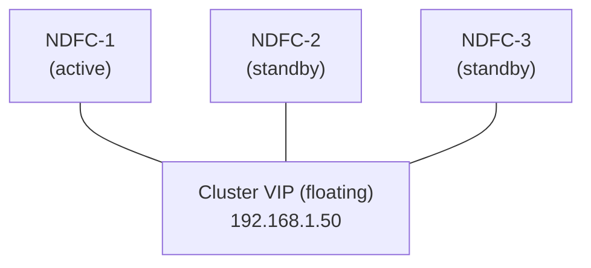
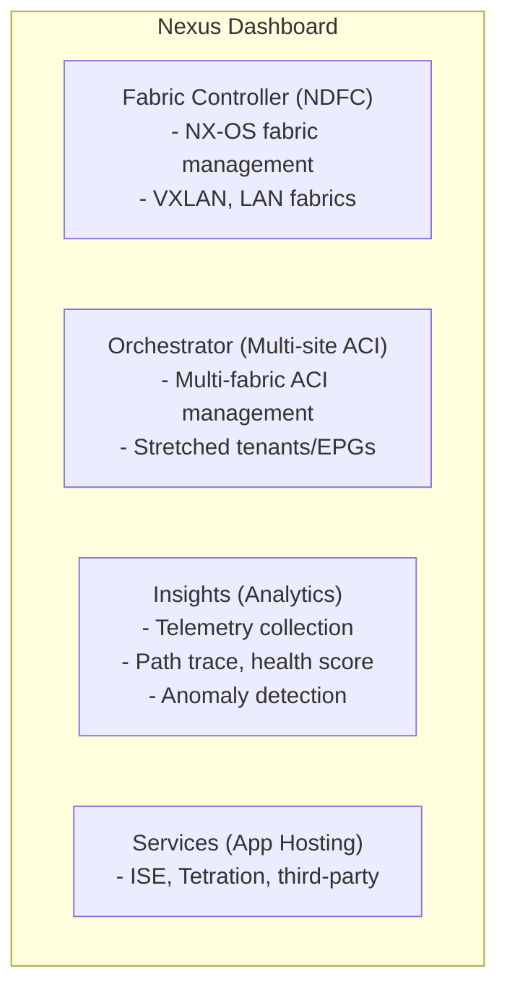

# NDFC and Fabric Management Deep Dive for CCIE DC v3.1

## Prerequisite Knowledge

- NX-OS VXLAN EVPN fabric fundamentals (underlay, overlay, BGP EVPN)
- Understanding of spine/leaf architecture
- Basic REST API concepts (HTTP methods, JSON, authentication)
- Familiarity with NX-OS configuration (VLAN, VRF, BGP, NVE)
- Understanding of ACI multi-site concepts (for Nexus Dashboard Orchestrator)
- Basic Linux/VM administration (for NDFC deployment)

---

## NDFC Deployment

### VM Requirements

```text
NDFC (Nexus Dashboard Fabric Controller) deployment:
  - Runs as VM on VMware ESXi / KVM / Cisco UCS
  - Cluster: 3 nodes (production) or 1 node (lab)
  - Each node requirements:

  +-------------------+-------------------+
  | Resource          | Requirement       |
  +-------------------+-------------------+
  | vCPU              | 16 cores          |
  | RAM               | 64 GB             |
  | Disk (OS)         | 300 GB SSD        |
  | Disk (data)       | 500 GB SSD        |
  | Network           | 2x 10G (mgmt + data) |
  | OS                | CentOS 7/8 (bundled) |
  +-------------------+-------------------+

Network requirements:
  - Management network: NDFC <-> switch mgmt (SSH, HTTPS)
  - Data network: NDFC <-> switch (telemetry, API)
  - NDFC nodes: inter-node communication (cluster)
  - DNS: NDFC hostname resolvable
  - NTP: time sync (critical for cluster)
  - Outbound: Cisco Smart Licensing (or offline)
```

### Cluster Setup



```text
Cluster operation:
  - Active node: handles all requests
  - Standby nodes: replicate state, ready for failover
  - Failover: automatic (30-60 seconds)
  - Data replication: synchronous (state), async (logs)
  - Quorum: 2 of 3 nodes required for operation

Installation steps:
  1. Deploy OVA/OVF on ESXi (3 VMs)
  2. Configure network (mgmt IP, gateway, DNS)
  3. Bootstrap first node (admin password, cluster name)
  4. Join nodes 2 and 3 to cluster
  5. Verify cluster health
  6. Configure NTP, SMTP, SNMP
  7. Upload licenses (Smart Licensing)
```

### NDFC Access

```text
Access methods:
  - GUI: https://<ndfc-vip> (port 443)
  - REST API: https://<ndfc-vip>/restcontrol
  - SSH: ssh admin@<ndfc-vip> (limited CLI)

Default credentials:
  - GUI: admin / password set during install
  - API: token-based (authenticate first)

NDFC GUI sections:
  - Dashboard: fabric overview, health, alarms
  - Fabric: managed fabrics (VXLAN, LAN, ACI)
  - Devices: individual switch management
  - Policies: configuration templates
  - Administration: users, RBAC, system settings
  - Reports: compliance, inventory, utilization
```

---

## Fabric Types

### VXLAN EVPN Fabric

```text
VXLAN EVPN fabric (most common for CCIE DC):
  - Spine/leaf topology
  - IS-IS or OSPF underlay
  - BGP EVPN overlay
  - NVE (VXLAN VTEP) on leafs
  - Anycast gateway on leafs
  - Border leafs for L3Out

NDFC manages:
  - Full fabric configuration (underlay + overlay)
  - VRF and network (VLAN + VNI) provisioning
  - BGP peer configuration
  - Anycast gateway
  - Border leaf L3Out
  - Compliance and drift detection
```

### VXLAN EVPN Multi-Site Fabric

```text
Multi-site:
  - Multiple VXLAN fabrics connected
  - Border leafs peer between sites
  - EVPN routes exchanged between sites
  - NDFC manages inter-site peering
  - Stretched VNIs across sites (optional)

NDFC multi-site config:
  - Create fabric per site
  - Designate border leafs
  - Configure inter-site BGP peering
  - Route-target import/export between sites
```

### LAN (Traditional) Fabric

```text
LAN fabric (legacy):
  - Traditional L2/L3 (no VXLAN)
  - STP-based L2, OSPF/EIGRP L3
  - NDFC manages: VLANs, trunks, routing
  - Use case: migration from legacy to VXLAN
  - Less relevant for CCIE DC (know it exists)
```

---

## NDFC VXLAN Fabric Configuration

### Fabric Settings

```text
Creating VXLAN EVPN fabric in NDFC:

Step 1: Create Fabric
  NDFC GUI: Fabric > Create
    Fabric Name: DC1_VXLAN
    Fabric Type: VXLAN EVPN
    Deployment Mode: Centralized (NDFC manages all)

Step 2: Fabric Settings
  +-------------------+-------------------+
  | Setting           | Value             |
  +-------------------+-------------------+
  | ASN               | 65001             |
  | RP Address        | 10.255.255.1      |
  | RP Loopback ID    | 254               |
  | Anycast GW MAC    | 20:20:00:00:00:AA |
  | Underlay Protocol | IS-IS             |
  | Overlay Protocol  | BGP EVPN          |
  | NVE LB ID         | 1 (loopback1)    |
  | BGP LB ID         | 0 (loopback0)    |
  | Netflow Enable    | Yes               |
  | AAA Remote        | RADIUS/TACACS+    |
  +-------------------+-------------------+

Step 3: Add Switches
  - Discovery: seed IP + credentials
  - Or manual: add each switch IP
  - NDFC SSH to switch, collects info
  - Assign roles: spine, leaf, border, super-spine

Step 4: Role Assignment
  - Spine: underlay transit, route reflector
  - Leaf: access, VTEP, SVI, anycast GW
  - Border: L3Out to external, inter-site
  - Super-spine: multi-fabric interconnect (rare)
```

### Switch Discovery and Role Assignment

```text
Discovery process:
  1. NDFC connects to seed switch (SSH)
  2. Reads CDP/LLDP neighbors
  3. SSH to each neighbor
  4. Collects: hostname, model, NX-OS version, interfaces
  5. Builds topology graph
  6. Admin assigns roles (or NDFC suggests)

Role assignment rules:
  - Spine: connects to all leafs, no server ports
  - Leaf: connects to spines + servers
  - Border: leaf with external L3 connections
  - A switch can be: leaf + border (combined)

Verification after discovery:
  NDFC GUI: Fabric > DC1_VXLAN > Switches
    spine201: Role=Spine, Status=Managed, Health=Green
    spine202: Role=Spine, Status=Managed, Health=Green
    leaf101:  Role=Leaf,  Status=Managed, Health=Green
    leaf102:  Role=Leaf,  Status=Managed, Health=Green
    leaf103:  Role=Border, Status=Managed, Health=Green
```

### VRF and Network Creation via NDFC

```text
VRF creation:
  NDFC GUI: Fabric > DC1_VXLAN > VRFs > Create
    VRF Name: PROD_VRF
    VRF ID (VNI): 50001
    VLAN ID: (auto or manual)
    VRF Description: "Production VRF"
    Route Target: auto (derived from ASN:VNI)
    Max BGP Paths: 2
    Static Route: (optional)

  What NDFC generates on leafs:
    vrf context PROD_VRF
      vni 50001
      rd auto
      address-family ipv4 unicast
        route-target both auto
        route-target both auto evpn

Network (VLAN + VNI) creation:
  NDFC GUI: Fabric > DC1_VXLAN > Networks > Create
    Network Name: WEB_NET
    VLAN ID: 100
    VNI: 10100
    VRF: PROD_VRF
    Gateway IP: 10.1.1.1/24
    Anycast Gateway: Yes
    VLAN Name: WEB_TIER
    Intf Description: "Web servers"

  What NDFC generates on leafs:
    vlan 100
      name WEB_TIER
      vn-segment 10100

    interface Vlan100
      no shutdown
      vrf member PROD_VRF
      ip address 10.1.1.1/24
      ip router ospf UNDERLAY area 0.0.0.0
      fabric forwarding mode anycast-gateway

    interface nve1
      member vni 10100
        ingress-replication protocol bgp

  What NDFC generates on spines:
    (BGP EVPN route reflector config, no VLAN/VNI)
```

### Policy-Based Configuration

```text
NDFC policy model:
  - Fabric-level policies: apply to all switches in fabric
  - Switch-level policies: apply to specific switch
  - Interface-level policies: apply to specific interface
  - VRF/Network policies: overlay configuration

Policy types:
  - switch_freeform: raw CLI commands
  - int_vpc: vPC configuration
  - int_trunk: trunk interface
  - int_access: access interface
  - int_ethernet: L3 interface
  - ospf: OSPF configuration
  - bgp: BGP configuration
  - ntp: NTP servers
  - snmp: SNMP configuration
  - syslog: logging servers
  - aaa: authentication

Example - Add NTP to all switches:
  NDFC GUI: Fabric > DC1_VXLAN > Policies > Create
    Policy Type: ntp
    Scope: Fabric (all switches)
    NTP Server 1: 192.168.1.10
    NTP Server 2: 192.168.1.11
    Deploy

Example - Add interface policy:
  NDFC GUI: Fabric > DC1_VXLAN > Policies > Create
    Policy Type: int_trunk
    Switch: leaf101
    Interface: Ethernet1/49
    Description: TO_SPINE201
    Trunk VLANs: 100,200,300
    MTU: 9216
    Deploy
```

---

## NDFC Operations

### Compliance Checks and Config Drift

```text
Compliance:
  - NDFC stores "intended" configuration (what it deployed)
  - Periodically compares to "running" configuration on switch
  - Difference = "drift" (someone changed config via CLI)

Compliance check:
  NDFC GUI: Fabric > DC1_VXLAN > Compliance
    Last Check: 2024-01-15 10:00:00
    Status: OUT_OF_COMPLIANCE
    Drifted Switches: 1
      leaf101: 3 lines changed
        + "vlan 999" (added via CLI, not in NDFC)
        - "ntp server 192.168.1.10" (removed via CLI)

Remediation:
  Option 1: Push intended config (overwrite drift)
    NDFC GUI: Compliance > Remediate > Push Intended
  Option 2: Accept drift (update intended to match running)
    NDFC GUI: Compliance > Accept > Update Intended
  Option 3: Manual fix (SSH to switch, revert change)

Best practice:
  - ALL changes through NDFC (no CLI changes)
  - Compliance check: hourly (automated)
  - Alert on drift (SNMP trap, email)
  - Remediate within 24 hours
```

### Firmware Management

```text
NDFC firmware orchestration:
  1. Upload firmware image to NDFC
  2. Create upgrade policy (target version, order)
  3. Pre-checks: compatibility, disk space, HA status
  4. Upgrade order: spines first, then leafs (or reverse)
  5. Per-switch: ISSU (In-Service Software Upgrade) if supported
  6. Post-checks: version, health, protocol status
  7. Rollback: automatic if health check fails

Upgrade process:
  NDFC GUI: Fabric > DC1_VXLAN > Firmware > Upgrade
    Target Image: n9000-dk9.10.3.4a.bin
    Upgrade Mode: ISSU (non-disruptive)
    Order: Spines -> Leafs -> Borders
    Maintenance Window: Saturday 02:00-06:00
    Pre-check: Run
    Upgrade: Start

ISSU requirements:
  - Dual supervisor (or vPC peer)
  - Compatible upgrade path (check release notes)
  - No config changes during upgrade
  - Sufficient disk space (2x image size)
```

### Backup and Restore

```text
NDFC backup:
  - Configuration backup (fabric policies, settings)
  - Database backup (PostgreSQL, internal state)
  - Scheduled: daily/weekly automatic
  - Manual: on-demand before changes

Backup configuration:
  NDFC GUI: Administration > Backup > Schedule
    Frequency: Daily at 01:00
    Retention: 30 days
    Location: /backup (local) or NFS/S3 (remote)
    Encryption: AES-256

Restore:
  NDFC GUI: Administration > Restore
    Select backup: 2024-01-14_01-00-00
    Scope: Full / Configuration only
    Restore: Start (requires maintenance window)

Switch config backup (via NDFC):
  NDFC GUI: Fabric > Switches > leaf101 > Actions > Backup Config
  Or: scheduled per-fabric backup
  Stored: NDFC database + optional export
```

### Alarms and Events

```text
NDFC alarm system:
  - Sources: switch health, protocol, interface, compliance
  - Severity: Critical, Major, Minor, Warning
  - Lifecycle: Active -> Acknowledged -> Cleared
  - Notification: email, SNMP trap, syslog, webhook

Alarm configuration:
  NDFC GUI: Administration > Alarms > Rules
    Rule: BGP_PEER_DOWN
      Condition: BGP neighbor state != Established
      Severity: Critical
      Action: Email + SNMP trap
      Recipients: noc@company.com

  Rule: INTERFACE_DOWN
    Condition: Admin up, Oper down
    Severity: Major
    Action: SNMP trap
    Suppression: 5 minutes (avoid flapping alerts)

Viewing alarms:
  NDFC GUI: Dashboard > Alarms
    Active: 3
      [Critical] leaf101: BGP peer 10.255.2.1 Down (5 min ago)
      [Major] leaf102: Eth1/33 oper down (2 min ago)
      [Minor] spine201: CPU > 80% (10 min ago)
```

---

## NDFC REST API

### Authentication (Token-Based)

```text
NDFC API authentication:
  1. POST /login (get token)
  2. Use token in subsequent requests (Authorization header)
  3. Token expires (default: 1 hour)
  4. Refresh or re-authenticate

API base URL: https://<ndfc-vip>/restcontrol

Authentication example (Python):
```

```python
import requests
import urllib3
urllib3.disable_warnings()

NDFC = "https://192.168.1.50"
AUTH_URL = f"{NDFC}/login"
API_URL = f"{NDFC}/restcontrol"

session = requests.Session()
session.verify = False

auth_payload = {
    "domain": "local",
    "userName": "admin",
    "userPasswd": "NdfcP@ss123!",
    "preserve": True
}

response = session.post(AUTH_URL, json=auth_payload)
token = response.json()["token"]
session.headers.update({"Authorization": f"Bearer {token}"})

print(f"Authenticated. Token: {token[:20]}...")
```

### Fabric CRUD Operations

```python
def list_fabrics():
    response = session.get(f"{API_URL}/v2/fabrics")
    fabrics = response.json()
    for fabric in fabrics:
        print(f"Fabric: {fabric['name']}, Type: {fabric['type']}, "
              f"Status: {fabric['status']}")
    return fabrics

def get_fabric_details(fabric_name):
    response = session.get(f"{API_URL}/v2/fabrics/{fabric_name}")
    return response.json()

def get_fabric_switches(fabric_name):
    response = session.get(f"{API_URL}/v2/fabrics/{fabric_name}/switches")
    switches = response.json()
    for sw in switches:
        print(f"  {sw['hostname']}: Role={sw['role']}, "
              f"IP={sw['ip']}, Status={sw['status']}")
    return switches

def create_vrf(fabric_name, vrf_name, vrf_id, description=""):
    payload = {
        "fabricName": fabric_name,
        "vrfName": vrf_name,
        "vrfId": vrf_id,
        "description": description,
        "maxBgpPaths": 2,
        "staticRoute": False
    }
    response = session.post(f"{API_URL}/v2/fabrics/{fabric_name}/vrfs",
                           json=payload)
    return response.json()

def create_network(fabric_name, network_name, vlan_id, vni,
                   vrf_name, gateway_ip):
    payload = {
        "fabricName": fabric_name,
        "networkName": network_name,
        "vlanId": vlan_id,
        "vniId": vni,
        "vrfName": vrf_name,
        "gatewayIp": gateway_ip,
        "anycastGateway": True,
        "vlanName": network_name
    }
    response = session.post(f"{API_URL}/v2/fabrics/{fabric_name}/networks",
                           json=payload)
    return response.json()

fabrics = list_fabrics()
switches = get_fabric_switches("DC1_VXLAN")
create_vrf("DC1_VXLAN", "DEV_VRF", 50002, "Development VRF")
create_network("DC1_VXLAN", "DEV_NET", 400, 10400, "DEV_VRF", "10.4.1.1/24")
```

### Policy Deployment via API

```python
def deploy_policy(fabric_name, policy_payload):
    response = session.post(
        f"{API_URL}/v2/fabrics/{fabric_name}/policies",
        json=policy_payload
    )
    return response.json()

def deploy_all_pending(fabric_name):
    response = session.post(
        f"{API_URL}/v2/fabrics/{fabric_name}/deploy"
    )
    return response.json()

def check_compliance(fabric_name):
    response = session.get(
        f"{API_URL}/v2/fabrics/{fabric_name}/compliance"
    )
    compliance = response.json()
    for switch in compliance.get("switches", []):
        status = switch["status"]
        drift = switch.get("driftCount", 0)
        print(f"  {switch['hostname']}: {status} (drift: {drift})")
    return compliance

ntp_policy = {
    "policyType": "ntp",
    "scope": "fabric",
    "servers": ["192.168.1.10", "192.168.1.11"]
}

deploy_policy("DC1_VXLAN", ntp_policy)
deploy_all_pending("DC1_VXLAN")
check_compliance("DC1_VXLAN")
```

### Full Automation Script

```python
import requests
import urllib3
import time
import json
urllib3.disable_warnings()

class NDFCClient:
    def __init__(self, ndfc_ip, username, password):
        self.base = f"https://{ndfc_ip}"
        self.session = requests.Session()
        self.session.verify = False
        self._authenticate(username, password)

    def _authenticate(self, username, password):
        resp = self.session.post(f"{self.base}/login", json={
            "domain": "local",
            "userName": username,
            "userPasswd": password,
            "preserve": True
        })
        resp.raise_for_status()
        token = resp.json()["token"]
        self.session.headers["Authorization"] = f"Bearer {token}"

    def get_fabrics(self):
        resp = self.session.get(f"{self.base}/restcontrol/v2/fabrics")
        return resp.json()

    def create_fabric(self, name, fabric_type="VXLAN_EVPN", asn=65001):
        payload = {
            "name": name,
            "type": fabric_type,
            "asn": asn,
            "underlayProtocol": "ISIS",
            "overlayProtocol": "BGP_EVPN"
        }
        resp = self.session.post(
            f"{self.base}/restcontrol/v2/fabrics", json=payload)
        return resp.json()

    def add_switch(self, fabric, ip, username, password, role):
        payload = {
            "ip": ip,
            "username": username,
            "password": password,
            "role": role
        }
        resp = self.session.post(
            f"{self.base}/restcontrol/v2/fabrics/{fabric}/switches",
            json=payload)
        return resp.json()

    def deploy(self, fabric):
        resp = self.session.post(
            f"{self.base}/restcontrol/v2/fabrics/{fabric}/deploy")
        return resp.json()

    def wait_for_deploy(self, fabric, timeout=300):
        start = time.time()
        while time.time() - start < timeout:
            resp = self.session.get(
                f"{self.base}/restcontrol/v2/fabrics/{fabric}/status")
            status = resp.json().get("deployStatus")
            if status == "COMPLETED":
                return True
            elif status == "FAILED":
                return False
            time.sleep(10)
        return False

ndfc = NDFCClient("192.168.1.50", "admin", "NdfcP@ss123!")

print("Creating fabric...")
ndfc.create_fabric("DC2_VXLAN", asn=65002)

print("Adding switches...")
ndfc.add_switch("DC2_VXLAN", "192.168.2.201", "admin", "Cisco123!", "spine")
ndfc.add_switch("DC2_VXLAN", "192.168.2.202", "admin", "Cisco123!", "spine")
ndfc.add_switch("DC2_VXLAN", "192.168.2.101", "admin", "Cisco123!", "leaf")
ndfc.add_switch("DC2_VXLAN", "192.168.2.102", "admin", "Cisco123!", "leaf")

print("Deploying fabric...")
ndfc.deploy("DC2_VXLAN")

if ndfc.wait_for_deploy("DC2_VXLAN"):
    print("Fabric deployed successfully!")
else:
    print("Fabric deployment failed!")
```

---

## Nexus Dashboard

### Nexus Dashboard Platform



```text
Deployment:
  - Nexus Dashboard is a 3-node cluster (VMs)
  - Services deployed as containers on the platform
  - Each service has its own UI (accessible via Dashboard)
  - Single sign-on across services
```

### Orchestrator (Multi-Site ACI)

```text
Nexus Dashboard Orchestrator:
  - Manages multiple ACI fabrics (sites)
  - Replaces standalone MSO/NDO
  - Centralized policy for multi-site

Key functions:
  - Site management: add APIC clusters
  - Template management: reusable policy templates
  - Stretched objects: BD, EPG, VRF across sites
  - Inter-site L3Out: routing between sites
  - Deployment: push policy to specific sites

Configuration flow:
  1. Add sites (APIC clusters) to Orchestrator
  2. Create template (tenant, VRF, BD, EPG)
  3. Assign template to sites
  4. Deploy (Orchestrator pushes to APICs)
  5. Verify (endpoint learning across sites)

Stretched BD example:
  Orchestrator: Template > PROD_TEMPLATE
    Tenant: PROD
    VRF: PROD_VRF (stretched: Site1 + Site2)
    BD: WEB_BD (stretched: Site1 + Site2)
      Subnet: 10.1.1.1/24 (Site1)
      Subnet: 10.1.1.1/24 (Site2) [same = anycast]
    EPG: WEB_EPG (stretched: Site1 + Site2)

  Result: VMs in Site1 and Site2 share same L2 domain
```

### Fabric Controller (NDFC)

```text
NDFC within Nexus Dashboard:
  - Same functionality as standalone NDFC
  - Managed via Nexus Dashboard UI
  - Shared authentication (SSO)
  - Integrated with Insights (telemetry)

Access:
  Nexus Dashboard GUI > Services > Fabric Controller
  Or: https://<nd-ip>/fabric-controller
```

### Insights (Analytics)

```text
Nexus Dashboard Insights:
  - Collects telemetry from NX-OS and ACI fabrics
  - Provides:
    - Path trace (end-to-end packet path visualization)
    - Health score (per fabric, per device)
    - Anomaly detection (ML-based)
    - Change tracking (who changed what, when)
    - Resource utilization (TCAM, buffer, CPU trends)
    - Compliance reporting

Path Trace:
  - Input: source IP, dest IP, VRF
  - Output: exact path through fabric (every hop)
  - Shows: interfaces, VLANs, VNIs, contracts
  - Identifies: where traffic is dropped (if any)
  - Use case: "why can't VM-A reach VM-B?"

Health Score:
  - 0-100 per fabric
  - Factors: alarms, protocol health, utilization, compliance
  - Drill-down: fabric -> switch -> interface -> issue
  - Trending: historical health (identify degradation)
```

### Services (App Hosting)

```text
Nexus Dashboard Services:
  - Host third-party or Cisco apps as containers
  - Examples:
    - Cisco ISE (identity)
    - Cisco Secure Workload (Tetration)
    - Cisco Cloud Center
    - Custom apps (Docker containers)
  - Managed via Nexus Dashboard
  - Shared infrastructure (compute, network, storage)

Deployment:
  Nexus Dashboard GUI > Services > Deploy
    Select app from catalog (or upload image)
    Configure: resources, network, storage
    Deploy: starts container on cluster
```

---

## Verification Commands

```text
NDFC (SSH to NDFC node):
  show cluster status
  show fabric list
  show switch inventory
  show compliance status
  show alarm active
  show backup history
  show system resources

NX-OS (switches managed by NDFC):
  show running-config (verify NDFC-deployed config)
  show ip bgp summary
  show nve peers
  show nve vni
  show vlan
  show vrf
  show interface brief
  show isis neighbors
  show hardware

NDFC REST API:
  GET /restcontrol/v2/fabrics
  GET /restcontrol/v2/fabrics/{name}/switches
  GET /restcontrol/v2/fabrics/{name}/vrfs
  GET /restcontrol/v2/fabrics/{name}/networks
  GET /restcontrol/v2/fabrics/{name}/compliance
  GET /restcontrol/v2/fabrics/{name}/policies
  POST /restcontrol/v2/fabrics/{name}/deploy
```

---

## Lab 1: NDFC Fabric Creation and VRF/Network Deployment

### Objective
Create a VXLAN EVPN fabric in NDFC, add switches, create VRF and networks, deploy.

### Step 1: Create Fabric

```text
NDFC GUI:
  Fabric > Create Fabric
    Fabric Name: LAB_VXLAN
    Fabric Type: VXLAN EVPN
    Deployment Mode: Centralized

  Fabric Settings:
    ASN: 65001
    RP Address: 10.255.255.1
    RP Loopback ID: 254
    Anycast GW MAC: 20:20:00:00:00:AA
    Underlay: IS-IS
    Overlay: BGP EVPN
    NVE Loopback: 1
    BGP Loopback: 0
```

### Step 2: Add Switches

```text
NDFC GUI: Fabric > LAB_VXLAN > Switches > Add
  Switch 1:
    IP: 192.168.1.201
    Credentials: admin / Cisco123!
    Role: Spine
    Hostname: spine201

  Switch 2:
    IP: 192.168.1.202
    Credentials: admin / Cisco123!
    Role: Spine
    Hostname: spine202

  Switch 3:
    IP: 192.168.1.101
    Credentials: admin / Cisco123!
    Role: Leaf
    Hostname: leaf101

  Switch 4:
    IP: 192.168.1.102
    Credentials: admin / Cisco123!
    Role: Leaf
    Hostname: leaf102

  Switch 5:
    IP: 192.168.1.103
    Credentials: admin / Cisco123!
    Role: Border
    Hostname: leaf103
```

### Step 3: Create VRF

```text
NDFC GUI: Fabric > LAB_VXLAN > VRFs > Create
  VRF Name: PROD_VRF
  VRF ID: 50001
  Description: Production VRF
  Max BGP Paths: 2
  Route Target: Auto
  Deploy: Yes
```

### Step 4: Create Networks

```text
NDFC GUI: Fabric > LAB_VXLAN > Networks > Create

  Network 1:
    Name: WEB_NET
    VLAN: 100
    VNI: 10100
    VRF: PROD_VRF
    Gateway: 10.1.1.1/24
    Anycast GW: Yes

  Network 2:
    Name: APP_NET
    VLAN: 200
    VNI: 10200
    VRF: PROD_VRF
    Gateway: 10.1.2.1/24
    Anycast GW: Yes

  Network 3:
    Name: DB_NET
    VLAN: 300
    VNI: 10300
    VRF: PROD_VRF
    Gateway: 10.1.3.1/24
    Anycast GW: Yes
```

### Step 5: Deploy and Verify

```text
NDFC GUI: Fabric > LAB_VXLAN > Deploy
  Status: Deploying...
  Progress: 100%
  Result: Success

Verify on leaf101:
  leaf101# show vrf PROD_VRF
    VRF: PROD_VRF, VNI: 50001, State: Up

  leaf101# show vlan
    VLAN  Name      Status  VNI
    100   WEB_NET   active  10100
    200   APP_NET   active  10200
    300   DB_NET    active  10300

  leaf101# show nve vni
    VNI     VRF     State   Peers
    10100   -       Up      2
    10200   -       Up      2
    10300   -       Up      2

  leaf101# show ip bgp l2vpn evpn summary
    Neighbor    AS    State    PfxRcd
    10.255.2.1  65001 Estab    25
    10.255.2.2  65001 Estab    25

  leaf101# show interface Vlan100
    Vlan100 is up
      IP: 10.1.1.1/24
      VRF: PROD_VRF
      Anycast GW: 20:20:00:00:00:AA

Verify on spine201:
  spine201# show ip bgp l2vpn evpn summary
    Neighbor    AS    State    PfxRcd
    10.255.1.1  65001 Estab    12
    10.255.1.2  65001 Estab    12
    10.255.1.3  65001 Estab    8
```

---

## Lab 2: Compliance Check and API Automation

### Objective
Verify compliance, detect drift, and use REST API for automated operations.

### Step 1: Introduce Drift

```text
SSH to leaf101 directly (bypass NDFC):
  leaf101# configure terminal
  leaf101(config)# vlan 999
  leaf101(config-vlan)# name UNAUTHORIZED_VLAN
  leaf101(config-vlan)# exit
  leaf101(config)# exit
  leaf101# copy running-config startup-config
```

### Step 2: Run Compliance Check

```text
NDFC GUI: Fabric > LAB_VXLAN > Compliance > Run Check
  Result: OUT_OF_COMPLIANCE
  Drifted: leaf101
    Added: vlan 999, name UNAUTHORIZED_VLAN
    (Not in NDFC intended config)

NDFC GUI: Compliance > leaf101 > Details
  Diff:
    + vlan 999
    +   name UNAUTHORIZED_VLAN
  Action: Remediate (push intended) or Accept (update intended)
```

### Step 3: Remediate via API

```python
import requests
import urllib3
urllib3.disable_warnings()

NDFC = "https://192.168.1.50"
session = requests.Session()
session.verify = False

resp = session.post(f"{NDFC}/login", json={
    "domain": "local",
    "userName": "admin",
    "userPasswd": "NdfcP@ss123!",
    "preserve": True
})
token = resp.json()["token"]
session.headers["Authorization"] = f"Bearer {token}"

compliance = session.get(
    f"{NDFC}/restcontrol/v2/fabrics/LAB_VXLAN/compliance"
).json()

print("Compliance Status:")
for sw in compliance.get("switches", []):
    print(f"  {sw['hostname']}: {sw['status']} (drift: {sw.get('driftCount', 0)})")

drifted = [sw for sw in compliance["switches"] if sw["status"] != "IN_COMPLIANCE"]
if drifted:
    print(f"\nRemediating {len(drifted)} drifted switch(es)...")
    remediate = session.post(
        f"{NDFC}/restcontrol/v2/fabrics/LAB_VXLAN/compliance/remediate",
        json={"switches": [sw["hostname"] for sw in drifted]}
    )
    print(f"Remediation: {remediate.status_code} - {remediate.json()}")

    import time
    time.sleep(30)

    recheck = session.get(
        f"{NDFC}/restcontrol/v2/fabrics/LAB_VXLAN/compliance"
    ).json()
    for sw in recheck["switches"]:
        print(f"  {sw['hostname']}: {sw['status']}")
```

### Step 4: Verify Remediation

```text
leaf101# show vlan
  VLAN  Name      Status  VNI
  100   WEB_NET   active  10100
  200   APP_NET   active  10200
  300   DB_NET    active  10300
  (VLAN 999 removed - remediated)

NDFC GUI: Compliance > Status: IN_COMPLIANCE (all switches)
```

> **CCIE Exam Tip:** NDFC/Nexus Dashboard questions in the exam focus on: (1) fabric creation workflow, (2) VRF/network provisioning, (3) compliance/drift concepts, (4) REST API authentication pattern. You won't configure NDFC in the lab, but you may need to interpret NDFC output or use its API in the automation section.

> **Lab Exam Warning:** If the exam provides NDFC-managed switches, do NOT make CLI changes directly — they will cause compliance drift. All changes should go through NDFC (GUI or API). If you must make a CLI change for troubleshooting, remember to remediate afterward.

---

## NDFC Fabric Health Score

### Health Score Calculation

```text
NDFC Fabric Health Score (0-100):
  - Composite metric per fabric and per device
  - Calculated from multiple factors:

  Factors:
    1. Alarm severity (Critical: -30, Major: -15, Minor: -5, Warning: -2)
    2. Protocol health (BGP down: -20, OSPF down: -15, NVE peer down: -10)
    3. Interface health (oper down on admin-up: -10 per interface)
    4. Compliance status (out of compliance: -10)
    5. Resource utilization (CPU >90%: -10, Memory >90%: -10, TCAM >90%: -15)
    6. Hardware health (PSU/FAN failure: -20, temperature: -10)

  Score interpretation:
    90-100: Healthy (green)
    70-89:  Warnings (yellow)
    50-69:  Degraded (orange)
    0-49:   Critical (red)

  Drill-down:
    Fabric score -> Switch score -> Component score
    Click any score to see contributing factors

Verification:
  NDFC GUI: Dashboard > Fabric Health
  NDFC GUI: Fabric > DC1_VXLAN > Health Score: 85 (yellow)
    Contributing: leaf101 BGP peer down (-15)

  NDFC REST API:
  GET /restcontrol/v2/fabrics/DC1_VXLAN/health
  Response:
  {
    "fabricName": "DC1_VXLAN",
    "healthScore": 85,
    "status": "WARNING",
    "switches": [
      {"hostname": "leaf101", "score": 70, "issues": ["BGP_PEER_DOWN"]},
      {"hostname": "leaf102", "score": 100, "issues": []},
      {"hostname": "spine201", "score": 100, "issues": []}
    ]
  }
```

> **CCIE Exam Tip:** The exam may show a NDFC dashboard screenshot and ask you to interpret health scores. Know: (1) Score is 0-100, (2) Below 70 = action needed, (3) Drill down from fabric to switch to component, (4) Common deductions: BGP down (-20), interface down (-10), compliance drift (-10).

---

## Common Exam Scenarios

### Scenario 1: NDFC Deployment Fails to Discover Switches

```text
Ticket: "NDFC fabric creation stuck at 'Discovering switches'"

Diagnosis:
  NDFC GUI: Fabric > LAB_VXLAN > Switches > Discovery Status
  -> spine201: "SSH connection failed"
  -> spine202: "SSH connection failed"

  From NDFC node:
  ssh admin@192.168.1.201
  -> Connection refused

Root cause: SSH not enabled on switches, or wrong credentials

Fix:
  1. On switches: feature ssh; ssh key rsa 2048
  2. Verify credentials match NDFC discovery input
  3. Check management VRF routing (NDFC -> switch mgmt IP)
  4. Re-run discovery in NDFC

Verification:
  NDFC GUI: Fabric > Switches
  -> spine201: Status: Managed, Role: Spine
  -> spine202: Status: Managed, Role: Spine
```

### Scenario 2: NDFC Deploy Overwrites Manual Config

```text
Ticket: "After NDFC deploy, custom ACLs removed from leaf101"

Diagnosis:
  NDFC compliance check shows leaf101 was IN_COMPLIANCE before deploy
  Custom ACLs were added via CLI (not through NDFC)
  NDFC deploy pushed "intended" config (without ACLs)

Root cause: Manual CLI changes not captured in NDFC intended config

Fix options:
  1. Add ACLs via NDFC policy (switch_freeform type)
  2. Or: Accept drift (update intended to include ACLs)
  3. Re-deploy after adding to NDFC

Prevention:
  - ALL changes through NDFC (GUI or API)
  - Use switch_freeform policy for custom CLI
  - Run compliance check before any deploy

Key lesson: NDFC is authoritative. CLI changes will be overwritten.
```

### Scenario 3: NDFC API Token Expiry

```text
Ticket: "Automation script fails after 1 hour with 401 error"

Diagnosis:
  Python script authenticates once at start:
    token = authenticate()
    # ... long-running operations ...
    # 1 hour later:
    response = session.get(f"{API}/v2/fabrics")
    -> 401 Unauthorized

Root cause: NDFC token expires after 1 hour (default)

Fix:
  1. Re-authenticate before each operation:
     def api_call(method, url, **kwargs):
         try:
             resp = session.request(method, url, **kwargs)
             if resp.status_code == 401:
                 self._authenticate()
                 resp = session.request(method, url, **kwargs)
             return resp
         except Exception:
             self._authenticate()
             return session.request(method, url, **kwargs)

  2. Or: set preserve=True in auth (extends token life)
  3. Or: configure longer token TTL in NDFC admin settings

Verification:
  Script runs for >1 hour without 401 errors
```

---

## Cross-References

- For telemetry sensor paths streamed to NDFC/Insights, see `06-assurance/telemetry-monitoring.md`
- For ACI multi-site (Orchestrator), see `05-aci/aci-complete.md`
- For VXLAN fabric configuration managed by NDFC, see `01-network/vxlan-evpn.md`

---

## Key Takeaways

1. **NDFC deployment**: 3-node VM cluster, 16 vCPU/64GB RAM each, management + data networks
2. **Fabric types**: VXLAN EVPN (primary), Multi-Site, LAN (legacy)
3. **Fabric creation**: Settings (ASN, RP, anycast) -> Add switches -> Assign roles -> Deploy
4. **VRF/Network**: NDFC generates full config (VRF, VLAN, VNI, SVI, NVE, BGP)
5. **Policy-based**: Fabric/switch/interface level policies; deploy pushes to switches
6. **Compliance**: Intended vs running comparison; drift detection; remediation
7. **REST API**: Token auth, CRUD for fabrics/VRFs/networks, deploy, compliance
8. **Nexus Dashboard**: Unified platform (NDFC + Orchestrator + Insights + Services)
9. **Orchestrator**: Multi-site ACI; stretched BD/EPG; template-based deployment
10. **Insights**: Path trace, health score, anomaly detection, change tracking
11. **Health score**: 0-100 composite; alarms + protocol + compliance + resources; drill-down per device
12. **NDFC replaced DCNM**: Different product, different API, different architecture (not an upgrade)
